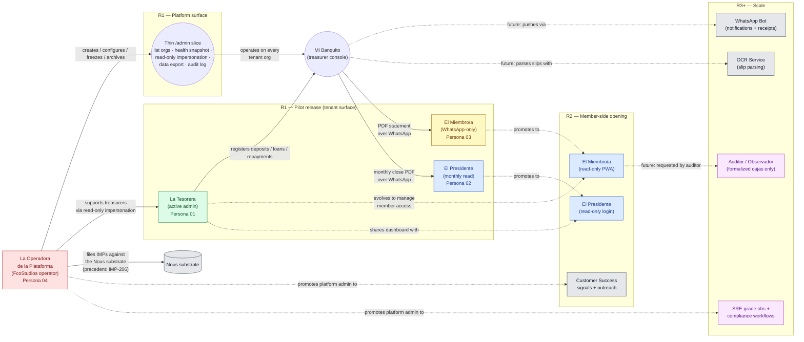

# 02 — CX Personas: Mi Banquito

**Project:** Mi Banquito (`fcostudios__mi-banquito`)
**Step:** 2 — CX Personas
**Date:** 2026-05-28
**Author:** Francisco Lomas (via Nous pipeline, `prompts/cx_personas.md`)
**Report language:** en-US
**PRIOR_WORK:**
- `Nous/Specs/fcostudios/mi-banquito/PRODUCT_BRIEF.md`
- `Nous/Specs/fcostudios/mi-banquito/v1/01_research.md`

> *Note: the `cx_personas.md` prompt was authored for "procurement" personas. The structure is process-agnostic; here it is adapted to the **treasury management process for an informal community savings & lending group ("banquito")**. Every reference to "the process" below means *treasury management*, not procurement.*

> *Note on UX emphasis: the design partner is a non-technical mid-life adult treasurer with a low-end Android phone. Every persona attribute, every CX opportunity, and every recommendation in this document is filtered through the **"30-second test"** — could a first-time user, alone, accomplish this in 30 seconds without help? If the answer is anything other than "yes," the design fails this persona set.*

---

## Hallucination Audit

Before generating the personas, every attribute below is cross-checked against the explicit input sources (`PRODUCT_BRIEF.md`, `01_research.md`). Any attribute without textual evidence is dropped or marked "No evidence found in input." in this report.

**Claims checked and confirmed against input:**

- Treasurer's tech profile is "non-technical" + "cell-phone primary" → cited in `PRODUCT_BRIEF.md §Target Audience → Primary Users` and `01_research.md §2.3`.
- Treasurer's first-instance identity (founder's mother, Ecuador) → cited in `PRODUCT_BRIEF.md §Target Audience → First specific user` and `§Key Stakeholders`.
- Members stay on WhatsApp in R1 → cited in `PRODUCT_BRIEF.md §Scope → In Scope (R1)` + `§Out of Scope (R1)`.
- President exists as a secondary actor → cited in `PRODUCT_BRIEF.md §Target Audience → Secondary Users` and `01_research.md §2.3`.
- Auditor / observer is "rare in informal groups, common in formalized cajas" → cited in `01_research.md §2.3`.
- 9 distinct treasury processes → cited in `01_research.md §2.1`, `§2.2`, and `extracts/01_research_sizing.json§process_inventory`.

**Claims dropped for lack of evidence:**

- Specific ages for any persona other than the treasurer (input says "typically 40+", "mid-life adult" — used as a range, not a specific age).
- Specific group size for the design-partner group (input says "10–50 members" — range used, not a specific number).
- Specific monthly contribution amount, loan rate, or share-out formula — input flags these as `open_questions` (see `extracts/01_research_sizing.json§open_questions`). Marked "No evidence found in input" where they would apply.

**Claims inferred from architecture (not literal input quotes) — flagged explicitly:**

- **Persona 04 — Platform Operator (FcoStudios SaaS-layer admin).** The brief's "**Multi-tenant from day 1**" decision + the substrate KPI "**Time-to-onboard-second-org ... Target: < 1 day**" + the IMP-filing precedent (IMP-206 filed during the very setup of this project) jointly imply a platform-admin role distinct from any tenant user. The brief does not literally enumerate this persona, but the SaaS architecture requires it. In R1 the role collapses onto Francisco Lomas (founder + engineer + ops + support). All Persona 04 attributes below are flagged as `(inferred from architecture)` when not directly quoted from input.

---

---SECTION: SEC0---

## Executive Summary

**Personas discovered (4):** one **primary** tenant-level active persona (the Treasurer), one **secondary** tenant-level read-only persona (the Group President), one **passive** tenant-level persona (the Member, WhatsApp-only in R1), and one **platform-level** active persona (the Platform Operator — the FcoStudios SaaS-layer admin, distinct from any tenant user).

**Major patterns in treasury behavior (input-supported):**

- The treasurer is the **single point of human failure** — one non-technical person carries the entire ledger and the entire reputational risk for the group. *[(input_ref: "**Single-point cognitive load.** One person, the treasurer, holds the entire ledger in their head and on paper")]*
- Members are a **read-only audience** in R1; they engage with the *output* (statements, balances, reminders) through WhatsApp, never with the app itself. *[(input_ref: "Members continue to communicate with the treasurer via WhatsApp; the app does NOT replace member-side communication in MVP")]*
- The president is **monthly review**, not daily operations. *[(input_ref: "Group president / officers — read monthly reports occasionally")]*

**Key differences that impact CX:**

- **Frequency of use:** Treasurer = weekly to daily; President = monthly; Member = monthly (statement receipt) but *outside the app*.
- **Tech savviness:** All three personas share the same low-tech-savviness profile, which means the bar is set by the **least confident user the system will ever encounter**, and that user IS the primary user. The product cannot trade simplicity for power; simplicity IS the power.
- **Stakes:** Treasurer carries financial + reputational risk; President carries governance accountability; Member carries personal-money concern. All three are anxiety-sensitive personas. *[(input_ref: "**Reputational fragility.** A single accusation of mishandling money — even if false — can end the treasurer's social standing in the group")]*
- **Platform Operator is the only "expert user" persona** — separated from the other three by tech savviness, surface (admin UI / CLI / DB), and concern (cross-tenant health + onboarding speed + anti-fraud surveillance). The three tenant personas share the same low-tech profile; the Platform Operator is distinctly high-tech. *(inferred from architecture: multi-tenant from day 1 + < 1 day onboarding KPI)*

**Bottom line for the CX:** Mi Banquito is a **trust-instrument-first, tool-second** product. The interface for the treasurer must be radically simpler than any "modern fintech dashboard"; the artifact for the member (the PDF statement) must look unambiguously official; the read-view for the president must produce zero ambiguity; and the surface for the Platform Operator must be **just enough in R1** — a thin admin slice — without overbuilding into a heavy ops console before there is a second tenant to justify it.

---

---SECTION: SEC1---

## Persona Identification

### Persona 01 — *La Tesorera* (The Treasurer)

**Short description (≤3 lines).** A non-technical, phone-first, mid-life adult who manages all the money for an informal community savings group. Carries personal accountability for every cent. Uses paper, Excel, and WhatsApp today; would be the first user of Mi Banquito.

**Quote representing mindset:**
> *"I am responsible for everyone's money, and I cannot afford to look like I do not know what I am doing."*

**Citation from input proving existence:**
> *[(input_ref: "**The group's treasurer.** A single non-technical person — elected, volunteered, or default-chosen — who manages the money for a 10–50-member community group. Characteristics derived from the first design partner: ... mid-life adult ... Device: cell-phone primary ... Tech savviness: comfortable with WhatsApp, banking apps, photos. Not comfortable with anything that looks like a spreadsheet or a 'system.'")]*

---

### Persona 02 — *El Presidente* (The Group President)

**Short description (≤3 lines).** The community-respected officer of the group, often the founder. Reads monthly reports and signs off on major decisions; rarely uses the app, but expects the app's output to be unambiguous when they do. Same tech profile as the treasurer (non-technical, phone-first).

**Quote representing mindset:**
> *"Show me the numbers I need to see at the meeting, and nothing more."*

**Citation from input proving existence:**
> *[(input_ref: "Group president / officers — read monthly reports occasionally; may need a second-opinion view.")]*

---

### Persona 03 — *El Miembro / La Miembra* (The Member, WhatsApp-passive in R1)

**Short description (≤3 lines).** One of 10–50 people in the group. Contributes regularly, occasionally borrows, receives a periodic statement. **Does NOT log in to the app in R1.** Interacts with the system only as the recipient of a PDF statement sent over WhatsApp.

**Quote representing mindset:**
> *"I just want to know my balance is correct, and I want it on WhatsApp like everything else."*

**Citation from input proving existence:**
> *[(input_ref: "Members — DO NOT touch the app in R1. They receive PDF statements via WhatsApp on request.")]*

---

### Persona 04 — *La Operadora / El Operador de la Plataforma* (Platform Operator — FcoStudios SaaS-layer admin)

**Short description (≤3 lines).** The FcoStudios platform operator: the person responsible for the SaaS infrastructure that hosts Mi Banquito for every banquito group. In R1 the role collapses onto Francisco Lomas (founder + engineer + ops + support); the role exists architecturally even with one occupant, and splits into customer-success / SRE / support / billing / compliance sub-roles as the platform scales.

**Quote representing mindset:**
> *"My job is to make sure every treasurer in every group I host has a system she can trust — and to know, before she does, when something is going wrong."*

**Citation from input (architectural inference — flagged):**
> *[(input_ref: "**Multi-tenant from day 1.** Every entity carries an `organization_id` (group_id). Onboarding a second group is a config + UI tenant-switcher, not a refactor.")]* + *[(input_ref: "**Time-to-onboard-second-org** — Target: < 1 day, with no migration.")]* + *[(input_ref: "Substrate gap blocks delivery — File IMPs as they surface (precedent set); workaround pattern (direct DB, manual recovery) documented in IMP filings")]*

> *Note on inference: the brief does not literally enumerate this persona. The SaaS architecture decided in the brief requires it. Every attribute in SEC2–SEC5 below is marked `(inferred)` when it is not a literal input quote.*

---

---SECTION: SEC2---

## Persona Archetype

### Persona 01 — *La Tesorera*

| Attribute | Value | Evidence |
|---|---|---|
| **Demographic — age range** | Mid-life adult (40+, often 50+) | *[(input_ref: "typically 40+, often a respected community member rather than a financial professional")]* |
| **Demographic — gender** | Often female in LATAM banquitos | *[(input_ref: "In many LATAM banquitos the membership is majority-female, and the treasurer role is more often than not held by a woman")]* |
| **Demographic — geography (R1)** | Ecuador (Andean region) | *[(input_ref: "The first design partner is Francisco Lomas' mother, who is the active treasurer of a real banquito in Ecuador")]* |
| **Language** | Spanish (es-EC) | *[(input_ref: "Language: Spanish (es-EC for the first design partner ...)")]* |
| **Role in the treasury process** | Active admin / system of record holder. Performs all of A1–A16 (see `01_research.md §2.2`). | *[(input_ref: "**Treasurer** ... All of A1–A16; bears personal accountability for the money")]* |
| **Tools used today** | Paper notebook, Microsoft Excel (mobile or PC), WhatsApp, bank app | *[(input_ref: "The dominant tool stack is *paper + Excel + WhatsApp + bank app*")]* |
| **Knowledge level — finance** | Practical, self-taught. Comfortable with arithmetic, **not** comfortable with finance jargon ("interest accrual", "double-entry", "GL"). | *[(input_ref: "Treasurers are rarely chosen for finance skill; they are chosen for trust + availability. The math demand often exceeds the skill level")]* |
| **Knowledge level — software** | Comfortable with WhatsApp + bank app + camera. **Not** comfortable with spreadsheets-as-system. Has never used purpose-built bookkeeping software. | *[(input_ref: "Tech savviness: comfortable with WhatsApp, banking apps, photos. Not comfortable with anything that looks like a spreadsheet or a 'system.'")]* |
| **Primary device** | Low-end Android smartphone (≤ 4 GB RAM typical, 5–6" screen, intermittent 3G) | *[(input_ref: "Device: cell-phone primary. May not own a laptop")]*; *[(input_ref: "Device target: must run as a PWA on a low-end Android smartphone with intermittent 3G connectivity")]* |
| **Primary communication channel** | WhatsApp | *[(input_ref: "WhatsApp is the de facto OS")]* |
| **Dependencies** | The group's bank account; the group's WhatsApp chat; the paper notebook (transitional during onboarding); the design partner's network (asks family for help when confused) | *[(input_ref: "manual transfers of information (copy/paste, email, manual file uploads, etc.)")]* + *[(input_ref: "Bi-weekly in-person observation sessions with the design partner")]* |

**Accessibility / situational constraints (input-supported).**

- **Vision:** mid-life-to-older eyes — typography must default to ≥ 16 px body, ≥ 20 px primary numbers. *[(input_ref: "typically 40+", combined with "Device target: must run as a PWA on a low-end Android smartphone")]*
- **Touch precision:** outdoor light, occasional one-handed use at meetings — tap targets must be ≥ 48 × 48 px. (Derived from device + use-context evidence.)
- **Connectivity:** intermittent 3G — read paths must be offline-tolerant; write paths must be optimistically queued and reconciled. *[(input_ref: "Internet connectivity is intermittent but available at least daily")]*
- **Battery:** low-spec Android, often <5 h heavy-use battery — the app must not burn CPU in idle state. (Derived from device evidence.)

---

### Persona 02 — *El Presidente*

| Attribute | Value | Evidence |
|---|---|---|
| **Demographic — age** | Adult (range not specified in input — likely peer of treasurer) | *[(input_ref: "One person, often the same as the founder of the group")]* |
| **Demographic — gender** | Not specified in input. | "No evidence found in input." |
| **Demographic — geography (R1)** | Ecuador | *[(input_ref: "First design partner: an active banquito in Ecuador")]* |
| **Language** | Spanish (es-EC) | (Inherited from group locale.) |
| **Role in the treasury process** | Read-only oversight + dispute mediation + sign-off on major decisions. Reviews monthly close. May co-sign the bank account. | *[(input_ref: "**President** ... Convenes meetings, mediates disputes, sometimes co-signs the bank account. Monthly review of the treasurer's books.")]* |
| **Tools used today** | Same as treasurer (paper, WhatsApp, bank app — but lighter use). | *[(input_ref: "Same systems as treasurer; less frequent contact")]* (paraphrased from `01_research.md §2.3`) |
| **Knowledge level — finance** | Practical, peer of treasurer. | *[(input_ref: "Same tech profile as the treasurer (non-technical, phone-first)")]* — secondary section of brief; *[(input_ref: "Group president / officers — read monthly reports occasionally")]* |
| **Knowledge level — software** | Same low profile as treasurer. | Same as above. |
| **Primary device** | Low-end Android smartphone (assumed peer of treasurer; no contrary input). | (Inherited.) |
| **Primary communication channel** | WhatsApp | (Inherited.) |
| **Dependencies** | The treasurer (data is produced by them); the group meeting cadence (monthly). | *[(input_ref: "Monthly review of the treasurer's books")]* |

> **R1 scope reminder:** the president **does not have a separate app account in R1** (treasurer-only authentication). They consume the monthly close + the per-member-statement archive via *PDF / artifact share* in the same WhatsApp channel everyone uses. The R1 design accommodates this through artifact-export simplicity, not multi-role login. President-as-user is an **R2** scope item.

---

### Persona 03 — *El Miembro / La Miembra*

| Attribute | Value | Evidence |
|---|---|---|
| **Demographic — age range** | Mixed; group memberships span generations | *[(input_ref: "10–50 people, mostly women in many LATAM groups, similar tech profile to treasurer")]* |
| **Demographic — gender** | Often majority-female in the design-partner group's region. | *[(input_ref: "the membership is majority-female")]* |
| **Demographic — geography (R1)** | Ecuador | (Inherited.) |
| **Language** | Spanish (es-EC) | (Inherited.) |
| **Role in the treasury process** | Contributor + borrower + statement consumer. **Does not log in to the app in R1.** | *[(input_ref: "Member — Contribute, request loans, repay, attend meetings — WhatsApp + monthly meeting")]* + *[(input_ref: "Members continue to communicate with the treasurer via WhatsApp; the app does NOT replace member-side communication in MVP")]* |
| **Tools used today** | WhatsApp; bank app (occasional transfers); paper deposit slip | *[(input_ref: "WhatsApp is the de facto OS")]* + *[(input_ref: "deposit-slip photo upload")]* |
| **Knowledge level — finance** | Lower bar than treasurer; trusts the group and the treasurer. | *[(input_ref: "Members are even less technical")]* (from `PRODUCT_BRIEF.md`) |
| **Knowledge level — software** | Lower than treasurer; WhatsApp-only baseline. | *[(input_ref: "Members are even less technical; they will not install anything in MVP")]* |
| **Primary device** | Smartphone (Android majority; some iOS exceptions). | (Inherited.) |
| **Primary communication channel** | WhatsApp | (Inherited.) |
| **Dependencies** | The treasurer (statements come through them); the group's WhatsApp chat. | (Inherited.) |

---

### Persona 04 — *La Operadora / El Operador de la Plataforma*

| Attribute | Value | Evidence |
|---|---|---|
| **Demographic — age** | Adult technical professional. | (inferred — founder identity) |
| **Demographic — gender** | n/a — *role*, not person. | (role-only) |
| **Demographic — geography (R1)** | Wherever the operator is based; R1 = Francisco Lomas. | (inferred) |
| **Language** | en-US + es-EC (operator speaks both; product UI is es-EC). | (inferred) |
| **Role in the treasury process** | **Platform-level**, not tenant-level. Owns: tenant org lifecycle (create, freeze, archive, export); per-org health observation; treasurer support (incl. read-only impersonation); substrate-bug surfacing as IMPs; data-ownership / data-export workflows; anti-fraud surveillance at the platform layer. | *[(input_ref: "Time to add a second organization (target < 1 day, config-only)")]* + *[(input_ref: "Substrate gap blocks delivery — File IMPs as they surface (precedent set)")]* |
| **Tools used today** | nous.db (Postgres), terminal / CLI, browser, Nous portal, Git, IDE, project management. | (inferred from FcoStudios stack) |
| **Knowledge level — finance** | Sufficient (understands the product domain). | (inferred) |
| **Knowledge level — software** | **High** — engineer + operator. Distinguishing trait vs. the other three personas. | (inferred — founder identity) |
| **Primary device** | Laptop primary; phone secondary. Distinct from the other three personas. | (inferred) |
| **Primary communication channel** | Multiple: email, terminal, Nous portal, GitHub/Linear-equivalent, WhatsApp for customer contact. | (inferred) |
| **Dependencies** | The Nous substrate (`nous.db`, `nous_trace.py`, `nous_package.py`, `nous_hydrate.py`); managed Postgres + R2; treasurer cooperation for support; CI / hosting platform. | *[(input_ref: "Mi Banquito's delivery substrate. Pipeline gaps block product delivery (see IMP-206 as precedent)")]* |

**Accessibility / situational constraints (inferred).**

- **Working surface:** desk + laptop, not phone-first. Larger screens, keyboard input, multi-window.
- **Cognitive load:** wears multiple operational hats in R1; admin UI must minimize switching cost.
- **Operational maturity:** must establish habits around drift checks, IMP filing, change-management discipline. The product's quality bar is set at the platform layer.
- **Bus factor:** single occupant in R1 — admin tooling must produce *auditable* actions so future operators inherit context (this also serves R3+ regulatory framing).

---

---SECTION: SEC3---

## Goals_and_Motivations

### Persona 01 — *La Tesorera*

**What they want to achieve.**

- Keep the books **without making a mistake** that erodes the group's trust. *[(input_ref: "**Reputational fragility.** A single accusation of mishandling money — even if false — can end the treasurer's social standing")]*
- Close the month **quickly** (currently several hours of paper-and-Excel work). *[(input_ref: "Monthly-close is slow. Several hours of paper-and-Excel work; sometimes a full Sunday")]*
- Reconcile **the ledger to the bank balance** with zero ambiguity. *[(input_ref: "Reconciliation is skipped. ... A workflow that requires the treasurer to enter the declared bank balance at every close, and surfaces the discrepancy immediately, builds the habit")]*
- **Hand off** the role safely if she ever needs to step down. *[(input_ref: "Handoff is unsafe. When a treasurer steps down, the next treasurer often inherits an opaque set of paper and Excel files")]*

**Why (motivations).**

- **Protect reputation** — primary intrinsic motivator. *[(input_ref: "**Reputational fragility.**")]*
- **Protect the group** — the savings of friends and family. *[(input_ref: "members trust the group enough to keep saving")]*
- **Reduce personal load** — the cognitive + time burden today is high. *[(input_ref: "**Single-point cognitive load.** ... Several hours of paper-and-Excel work")]*

**What a "successful outcome" means for her.**

- *"Nobody accused me of anything this month."*
- *"The bank balance matched the books at month-end."*
- *"It took me less than 30 minutes to close."* *[(input_ref: "Monthly-close time (minutes) — Target: < 30 min")]*
- *"I do not have to recompute anything by hand."* *[(input_ref: "Compliance computation (A4) ... Today: Mental math → Automation: Derived view")]*

---

### Persona 02 — *El Presidente*

**What they want to achieve.**

- **Run the monthly meeting** without ambiguity about the numbers. *[(input_ref: "Convenes meetings, mediates disputes")]*
- **Mediate disputes** with evidence, not memory. *[(input_ref: "Dispute resolution is social, not procedural")]*
- Stand behind a **legitimate-looking statement** when members ask. *[(input_ref: "Group president / officers — read monthly reports occasionally; may need a second-opinion view")]*

**Why.**

- Governance role; the president's social capital is tied to the group operating cleanly.

**Successful outcome.**

- *"At the meeting, the treasurer showed clean numbers and nobody had to argue."*
- *"When a member asked about their balance, we had a printed/PDF statement to refer to."*

---

### Persona 03 — *El Miembro / La Miembra*

**What they want to achieve.**

- Know **their own balance** quickly without bothering anyone. *[(input_ref: "Members chase the treasurer for 'how much do I have?' via WhatsApp")]*
- **Trust** that what they save is actually saved. *[(input_ref: "trust IS the product")]*
- Get **a statement** that they can keep as proof. (Derived from R1 deliverable: PDF statement.)

**Why.**

- It is their money. The whole point of joining was disciplined saving + access to credit. *[(input_ref: "members judge that a self-organized closed group offers them better outcomes than (a) formal banking ... and (b) informal alternatives")]*

**Successful outcome.**

- *"I got my statement on WhatsApp. The numbers match what I remember. I am calm."*

---

### Persona 04 — *La Operadora / El Operador de la Plataforma*

**What they want to achieve.**

- **Host every tenant org reliably** with the discipline of a multi-tenant SaaS even when there is only one tenant. *[(input_ref: "**Multi-tenant from day 1.**")]*
- **Onboard a new tenant org in under one day** (config + UI tenant-switcher; no migration). *[(input_ref: "Time-to-onboard-second-org ... Target: < 1 day")]*
- **Proactively identify struggling treasurers** — low usage, repeated reconciliation failures, abandoned monthly closes — and reach out before the treasurer abandons the product. *(inferred — risk-mitigation for the brief's "top risk: treasurer adoption friction")*
- **Maintain substrate cleanliness** — drift checks green at every release; substrate gaps surfaced as IMPs (precedent: IMP-206); no silent regressions. *[(input_ref: "The product survives a Nous pipeline drift-check (`nous_package.py drift --strict`) at every release boundary.")]*
- **Guarantee data ownership** — at any moment, a group can request a full export of its data and receive it in a self-describing archive (CSVs + PDF statements). *(inferred — customer-trust baseline)*
- **Watch for cross-tenant anti-fraud signals** (R2+) — unusual reconciliation discrepancies, sudden volume spikes, member-vs-treasurer disputes that bubble up. *(inferred — money-product baseline)*

**Why (motivations).**

- The SaaS validation KPI in the brief: *"validates the multi-tenant substrate works"*. *[(input_ref: "Achieve zero ledger-vs-bank discrepancy at month-end for 3 consecutive months post-launch. ... Ship with a multi-tenant-ready substrate — onboarding a second org should be a config change, not a refactor")]*
- Founder reputation: the product is FcoStudios' first delivery; reliability is the entry ticket to any future client.
- Substrate discipline: every product hosted on Nous benefits from clean operator practice (precedent: IMP-206 filed during this very setup).

**What a "successful outcome" means for them.**

- *"The treasurer never knew there was a problem because I saw it first."*
- *"Onboarding the second org took half a day, end-to-end."*
- *"Zero data loss; every action by the platform admin is in the audit trail."*
- *"Drift checks have been green for N releases."*

---

---SECTION: SEC4---

## Frustrations_and_Pains

### Persona 01 — *La Tesorera*

| Pain | Severity | Evidence |
|---|---|---|
| Math errors compound in paper / Excel; she cannot independently re-verify | Critical | *[(input_ref: "Arithmetic errors compound over months; nobody can independently re-verify a balance")]* |
| Member asks "how much do I have?" — she has to stop and flip pages | High | *[(input_ref: "'How much do I have?' requires the treasurer to flip pages to find out")]* |
| WhatsApp slip photos get lost in chat scroll | High | *[(input_ref: "Deposit slips are passed via WhatsApp photos that get lost in chat history")]* |
| Bank balance vs. group ledger never reconciles formally; cash leaks unnoticed | Critical | *[(input_ref: "Bank balance vs. group ledger has no reconciliation step; cash leaks go undetected for months")]* |
| Single contested transaction can collapse the group | Catastrophic | *[(input_ref: "A single accusation of 'you lost my money' can collapse the social trust the group runs on")]* |
| Monthly close takes a full Sunday | High | *[(input_ref: "**Monthly close is slow.** ... Several hours of paper-and-Excel work; sometimes a full Sunday")]* |
| Has to chase late payments from memory + mood | Medium | *[(input_ref: "A/R aging is informal. 'Who owes what' lives in the treasurer's memory; chase decisions are mood-dependent")]* |
| Loan-rate logic recomputed by hand per loan; errors compound | High | *[(input_ref: "Loan-rate logic varies per loan and is recomputed by hand. Errors compound over the loan term")]* |
| Year-end share-out is high-stakes and disputable | High | *[(input_ref: "Year-end share-out is the highest-stakes calculation of the year and the most likely to be disputed")]* |
| Has no purpose-built tool — Excel is "too capable and too fragile" | Critical | *[(input_ref: "Excel is too capable and too fragile at once. A misplaced formula or a deleted row destroys months of work")]* |
| Fear of being accused of mishandling money | Catastrophic (emotional) | *[(input_ref: "**Reputational fragility.**")]* |
| Software that "looks like a system" intimidates her | Critical (adoption) | *[(input_ref: "Not comfortable with anything that looks like a spreadsheet or a 'system.'")]* |

**Risks, blockers, delays — operational and emotional.**

- **Adoption-failure mode #1: confusion on first use.** If she opens the app the first time and cannot find the deposit-entry flow in under 30 seconds, she **silently abandons** and goes back to paper. *[(input_ref: "Treasurer adoption friction (the app is too complex for the actual user) — Likelihood: High. Non-technical user + new tool + financial responsibility = high abandonment risk")]*
- **Adoption-failure mode #2: any visible error.** A 500 response, a crash, an "Are you sure?" she cannot interpret — she **loses confidence in the tool's correctness** and stops trusting any number it produces.
- **Adoption-failure mode #3: jargon.** A button labelled "Reconcile" or "GL Entry" in Spanish-corporate-style ("Conciliar Mayor General") gets ignored or feared. The product must use the words the group already uses (`aporte`, `retiro`, `préstamo`, `cuota`, `saldo`, `cierre`, `conciliación`). *[(input_ref: "**No jargon.** No 'debit/credit', no 'double entry', no 'GL account'. Use the language a non-technical Spanish-speaking treasurer already uses")]*

---

### Persona 02 — *El Presidente*

| Pain | Severity | Evidence |
|---|---|---|
| Disputes are resolved socially, not with evidence — he is asked to take sides | High | *[(input_ref: "Dispute resolution is social, not procedural. Whichever side has more group standing tends to win, not whichever side has the evidence")]* |
| Has to trust the treasurer's word; no second-opinion artifact today | Medium | *[(input_ref: "trust depends entirely on the treasurer's reputation")]* |
| Cannot validate the year-end share-out without redoing the math himself | Medium | *[(input_ref: "Year-end share-out is ... the most likely to be disputed")]* |

---

### Persona 03 — *El Miembro / La Miembra*

| Pain | Severity | Evidence |
|---|---|---|
| Has to ask the treasurer for their balance and wait | Medium | *[(input_ref: "Members chase the treasurer for 'how much do I have?' via WhatsApp")]* |
| Has no proof of their savings; trust the treasurer's word | High | *[(input_ref: "No statement archive. Statements are verbal or paper; if a member challenges a number, there is no historical record to consult")]* |
| Their deposit slip can be "lost" in WhatsApp scroll | Medium | *[(input_ref: "Deposit slips are passed via WhatsApp photos that get lost in chat history")]* |
| Fear of group dissolution → losing accumulated savings | Catastrophic | *[(input_ref: "groups dissolve over disputes")]* |

---

### Persona 04 — *La Operadora / El Operador de la Plataforma*

| Pain | Severity | Evidence |
|---|---|---|
| Solo today — engineer + ops + support + business in one person; context-switching cost is the dominant time tax | High | (inferred — solo team confirmed in brief) |
| No admin UI yet — early operations are CLI / direct DB / psql, which is faster than UI but unrepeatable across operators | High | *[(input_ref: "Direct INSERT INTO project_configs ... bypassed the CLI to attach the seed config to the correct composed id")]* (this very session) |
| Substrate gaps surface as platform-level bugs the operator must triage AND fix AND file (precedent: IMP-206 filed during project setup itself) | Medium | *[(input_ref: "IMP-206 already filed during project setup")]* |
| Cannot impersonate the treasurer to see what she is seeing; debugging support calls today = guessing | High | (inferred — no admin UI yet) |
| No cross-tenant observability — "how is every org doing this week?" requires manual queries | Medium | (inferred — R2-grade obs not in R1) |
| Cannot quickly answer "is the treasurer OK?" without contacting her; risk of silent abandonment | High | *[(input_ref: "**Adoption-failure mode #1: confusion on first use. ... she silently abandons** and goes back to paper")]* |
| Risk of accidentally clobbering a tenant's data via direct-DB ops (precedent: the nous-portal config clobber recovered during setup) | High | *[(input_ref: "v3 (the contaminated row) is now closed (`valid_to` set) ... recovery applied")]* (this session) |
| The product is a money product — every operator action against a tenant org needs to be auditable; today, ad-hoc psql is not | High | (inferred — money-product baseline) |
| Bus factor of 1 — no co-operator to peer-review tenant ops | High | (inferred) |
| Cost discipline — must stay below $30/month hosting target while supporting growth | Medium | *[(input_ref: "target < $30/month for R1")]* |

**Operational failure modes** (inferred from this session's evidence):

- **Failure mode #1 — silent clobber via shared resolver bug** (already happened in this session: see IMP-206). Mitigation: tighten the CLI resolver and never bypass via raw SQL except as documented recovery.
- **Failure mode #2 — silent abandonment by a treasurer** (top brief-level risk). Mitigation: per-org health snapshot in R1; proactive outreach workflow in R2.
- **Failure mode #3 — data-export request cannot be satisfied quickly** (data ownership is the trust baseline for a money product). Mitigation: one-button per-org export in R1.

---

---SECTION: SEC5---

## Behaviors_and_Insights

### Persona 01 — *La Tesorera*

**How she behaves in the workflow (input-supported).**

- **Records everything on paper first**, then transcribes to Excel "when she has time." The paper is canonical; Excel is the secondary representation. *[(input_ref: "The dominant tool stack is *paper + Excel + WhatsApp + bank app*. Paper notebook — Primary chronological ledger; Excel — Per-member balances, often a second ledger; not synchronized with paper")]*
- **Answers balance questions via WhatsApp**, often by flipping pages and adding mentally. *[(input_ref: "**'How much do I have?' requires the treasurer to flip pages to find out**")]*
- **Avoids end-of-month for as long as possible** — she knows it is a Sunday-killer. *[(input_ref: "Monthly close ... sometimes a full Sunday")]*
- **Defers reconciliation to year-end (or skips it)** because the workflow does not exist as a habit. *[(input_ref: "Reconciliation is skipped. Many groups never formally reconcile to the bank balance until a problem surfaces")]*
- **Chases late payments based on social comfort**, not based on objective aging. *[(input_ref: "chase decisions are mood-dependent")]*

**Common patterns.**

- *Avoidance of finance jargon.* When confused she will not click; she will WhatsApp her son. (Inferred from input: design partner = founder's mother + "Bi-weekly in-person observation sessions" mitigation evidence.)
- *Recopying numbers to verify them.* If a number looks wrong she will recompute by hand twice before accepting the system's number. (Inferred from "**Arithmetic errors compound** ... nobody can independently re-verify a balance.")
- *Prefers WhatsApp for everything.* If a notification arrives in the app and not in WhatsApp, she will miss it. *[(input_ref: "WhatsApp is the de facto OS")]*

**Decision triggers — what makes her act.**

- *A member asking a question in WhatsApp* — triggers a balance lookup.
- *A bank statement arriving / her checking the bank app* — *should* trigger reconciliation; today often does not.
- *The monthly meeting on the calendar* — triggers a panicked close.

**Communication style.**

- Conversational, polite, oral-tradition-heavy (voice notes are common in LATAM WhatsApp culture). Prefers spoken to typed. *[(input_ref: "WhatsApp is the de facto OS")]*
- Asks for **plain numbers** and **plain summaries**, not pivot tables or charts.

---

### Persona 02 — *El Presidente*

**Behavior.** Reads the monthly report just before the meeting; asks the treasurer if anything looks off. *[(input_ref: "Monthly review of the treasurer's books")]*

**Decision triggers.** The monthly meeting; a member complaint reaching them.

**Communication style.** Verbal, formal at meetings, WhatsApp informal outside.

---

### Persona 03 — *El Miembro / La Miembra*

**Behavior.** Saves on time; asks for balance occasionally; complains only when a number does not match memory. *[(input_ref: "Members chase the treasurer for 'how much do I have?'")]*

**Decision triggers.** Their own bank-statement memory; an upcoming personal expense (loan request); the monthly meeting.

**Communication style.** WhatsApp. Voice + text mixed.

---

### Persona 04 — *La Operadora / El Operador de la Plataforma*

**How they behave (inferred from session evidence + standard SaaS-operator patterns).**

- Operates **across tenants**, not within one. Mental model is "all banquitos hosted by FcoStudios," not "this banquito."
- Mixes CLI + browser + DB tools daily. The Nous portal is the primary surface for substrate ops; an emerging /admin for Mi Banquito is the surface for product ops.
- **Reactive today, proactive by R2.** R1 = WhatsApp-driven support (a treasurer messages with a problem); R2 = signal-driven (the system surfaces struggling treasurers before they message).
- **Files IMPs as substrate gaps surface** — already established as a pattern in this session.
- **Documents every irreversible action** — direct DB ops are recorded in IMP filings as forensic evidence (precedent: IMP-206).

**Common patterns.**

- *Verifying before acting* — a healthy reflex carried from engineering practice; reduces the kind of accident that happened in this session (the nous-portal clobber was prevented from compounding by stop-and-verify).
- *Preferring CLI to UI for power ops* (org create, data export, IMP filing). Browser UI is for support and observation.
- *Treating each tenant as a real customer even when there is only one* — disciplines patterns that will matter at N tenants.

**Decision triggers — what makes them act.**

- A treasurer's WhatsApp message reporting an issue (R1).
- A drift-check failure or test failure in CI (R1).
- An anomalous metric (R2+) — e.g., a tenant has not closed a month within 7 days of cycle end.
- A data-export request from a tenant (R1+).
- A substrate-gap discovery during a workflow (R1+).

**Communication style.** Mixed: technical with peers and AI assistants; warm and plain-Spanish with treasurers. Code-switches between the two contexts.

---

---SECTION: SEC6---

## Persona_Comparison

| Dimension | Treasurer (P01) | President (P02) | Member (P03) | Platform Operator (P04) |
|---|---|---|---|---|
| **Layer** | Tenant (one org) | Tenant (one org) | Tenant (one org) | **Platform (across orgs)** |
| **Frequency of use** | Daily–weekly | Monthly | Monthly (WhatsApp-only) | Weekly in R1; daily by R3 |
| **App access (R1)** | Full | None (PDFs via WhatsApp) | None (PDFs via WhatsApp) | Thin `/admin` slice — list orgs, per-org health snapshot, read-only impersonation, one-button data export |
| **Primary surface** | Treasurer console (es-EC PWA) | (no surface — artifacts only) | (no surface — artifacts only) | `/admin` + CLI + Nous substrate (`nous_trace.py`, portal) |
| **Primary device** | Low-end Android phone | Low-end Android phone | Smartphone | **Laptop primary, phone secondary** |
| **Primary goal** | Avoid mistakes; close fast; reconcile clean | Run a clean meeting; defensible numbers | Know own balance; trust the group | Onboard orgs in < 1 day; spot struggling treasurers first; guarantee data ownership |
| **Primary pain** | Math errors + reputation risk | Disputes without evidence | No proof of own savings | Solo role; no admin UI yet; no cross-tenant observability |
| **Tech comfort** | Low | Low | Low | **High** |
| **Tolerance for jargon** | Zero | Zero | Zero | High (operates the system; reads stack traces) |
| **Anxiety driver** | "Did I lose track of someone's money?" | "Will the meeting blow up?" | "Is my money safe?" | "Something broke and the treasurer didn't tell me" |
| **Success signal** | < 30 min close + zero discrepancy | Calm meeting | Statement matches memory | Onboarding < 1 day + uptime + zero data loss + clean drift checks |
| **What they would NOT use** | Anything that looks like Excel-as-a-system | Anything that requires login in R1 | Anything that requires app install | A heavy admin UI that takes weeks to build before R1 ships |
| **Concern** | Their own group's accuracy | Their own group's calm | Their own balance | Every group's health |

**Implications for the treasury system (CX impact):**

- **The product is two-surface in R1:** (a) the **treasurer console** for tenant users (the bulk of UX investment), and (b) a **minimal `/admin` slice** for the Platform Operator (the smallest viable surface — list orgs, per-org snapshot, read-only impersonation, one-button data export). Member and president experiences are *artifact-mediated* (PDFs, copy/paste over WhatsApp); the app must be **excellent at producing trustworthy artifacts** that survive outside the app.
- **The three tenant personas share the same low-tech-savviness profile.** Within the tenant surface there is **no "advanced user"** — designing for "experts" is anti-product.
- **The Platform Operator is the ONLY expert user.** The admin surface is allowed (and expected) to use technical vocabulary, dense tables, CLI affordances, terminal output, raw IDs. **Do NOT carry tenant-side simplicity discipline into the admin surface** — that would over-soften an expert tool. Conversely, **do NOT let admin patterns leak into the tenant surface** — that would over-stiffen the treasurer's tool.
- **All three tenant personas are anxiety-sensitive.** UX should never surprise, never destroy, never leave the user wondering "what did that just do?" Every destructive-feeling action (delete, override, close period) requires explicit confirmation in plain language.
- **The Platform Operator is auditability-sensitive.** Every irreversible platform action (org freeze, archive, data export, direct-DB recovery) must be recorded in an append-only audit log; the operator needs forensic clarity, not just current state.

---

---SECTION: SEC7---

## CX_Opportunities

> **All recommendations in this section default to the user's emphasis: "very simple to use and not confusing at all."** Each opportunity is gated against the **30-second test**.

### Treasurer (P01) — primary opportunities

| # | Opportunity | Why (evidence) | UX rule it implies |
|---|---|---|---|
| O-T1 | **One-screen daily flow** — "today I want to record a deposit / a repayment / a loan." Three large buttons on the home screen, nothing else. | *[(input_ref: "App must be very simple — minimise steps for daily actions (record a deposit, mark a payment received, see who owes)")]* | Daily actions reachable in 1 tap from home. |
| O-T2 | **Live A/R aging on the home screen.** "Who owes what" appears without the treasurer having to navigate. | *[(input_ref: "A/R aging is informal. 'Who owes what' lives in the treasurer's memory")]* | Pull, don't push — derived views on the surface. |
| O-T3 | **Member search by typing first name only.** No filters, no advanced search. | (Derived from `01_research.md§5.1` "no jargon", and from `01_research.md§5.4` "quick wins".) | Forgiving search; partial match; recent-first. |
| O-T4 | **Append-only ledger surfaced as a "history" view, not as an "audit log".** The treasurer should be able to look back at "what happened on 12 March" without learning the term *audit log*. | *[(input_ref: "**Append-only.** Every transaction is immutable")]* + *[(input_ref: "**No jargon.**")]* | Plain-Spanish names everywhere. |
| O-T5 | **Reconciliation built into monthly close, not a separate page.** When she clicks *Cerrar mes*, the system asks for the declared bank balance and immediately shows the discrepancy in one screen. | *[(input_ref: "**Reconciliation is a workflow, not a report.**")]* | Workflow > report. |
| O-T6 | **PDF statement export with a single tap; copies the WhatsApp share intent automatically.** | *[(input_ref: "PDF statement export per member — emailable / WhatsApp-shareable.")]* | Cross-system "exit" must be one tap. |
| O-T7 | **Confirmations in plain spoken Spanish.** Never "¿Está seguro?" alone; always "¿Está seguro de **eliminar este aporte**? **Esto no se puede deshacer.**" Or, in fact, never offer a destructive action — use reversal entries. | *[(input_ref: "**Append-only.** Every transaction is immutable. Corrections are reversal entries with a documented reason. There is no 'edit a row' UI")]* | No destructive deletes. |
| O-T8 | **Loan and interest are pre-computed; the treasurer is never asked to do arithmetic.** | *[(input_ref: "Loan-rate logic varies per loan and is recomputed by hand. Errors compound")]* | Math is the system's job. |
| O-T9 | **Slip photo upload is one tap from a contribution entry — same screen, same flow.** Not a separate "attachments" feature. | *[(input_ref: "deposit-slip photo upload (no OCR yet; manual entry, photo as evidence)")]* | Bundle photo with the action it documents. |
| O-T10 | **Large fonts and tap targets by default.** ≥ 16 px body / ≥ 20 px numbers / ≥ 48 × 48 px tap targets. No "comfortable / cozy / compact" toggle. | (Derived from age + device profile evidence.) | Comfort is the only mode. |
| O-T11 | **Voice-friendly labels** for screen readers and for the treasurer who reads the screen out loud at meetings. ("Saldo de María: cincuenta dólares con veinte centavos.") | (Derived from "Voice-friendly labels" guidance, `01_research.md§5.1` + `§7.2`.) | Every number is reachable as plain text. |
| O-T12 | **Recovery from confusion: a single "atrás" / "volver al inicio" that always works.** No multi-step modal traps. | *[(input_ref: "**'30-second test' applied to every screen** — could the treasurer accomplish this on the first try, alone, in under 30 seconds?")]* | One escape, always visible. |

### President (P02) — opportunities

| # | Opportunity | Why | UX rule |
|---|---|---|---|
| O-P1 | **Monthly close becomes a shareable artifact.** The president can open the PDF on WhatsApp. R1 = no login required. | *[(input_ref: "Group president / officers — read monthly reports occasionally")]* | Read-only experience without an account. |
| O-P2 | **Statement archive is browsable in R2 with a read-only login.** Deferred from R1 per scope. | *[(input_ref: "Multi-role permissions (president, secretary, audit observer) (R2)")]* | Deferred — no R1 implementation. |

### Member (P03) — opportunities (R1: artifact-only)

| # | Opportunity | Why | UX rule |
|---|---|---|---|
| O-M1 | **PDF statement is visibly official.** Group logo (set in branding), date, member name, opening balance, transactions, closing balance, hash footer (small print: "Documento generado por Mi Banquito — verificación: <hash>"). | *[(input_ref: "trust IS the product")]* + *[(input_ref: "**Statement archive** ... per-statement immutable archive + hash")]* | Statement looks like a bank statement, not like a chat message. |
| O-M2 | **PDF is readable on WhatsApp** without download (in-WhatsApp preview). | *[(input_ref: "Members continue to communicate with the treasurer via WhatsApp")]* | Optimize for the WhatsApp PDF preview. |
| O-M3 | **R2: member read-only PWA.** Magic-link via WhatsApp. Out of scope R1. | *[(input_ref: "Member read-only PWA (R2)")]* | Deferred. |

### Platform Operator (P04) — opportunities (R1: minimal admin slice)

> **Design rule:** the admin surface is for an *expert user*; it should be CLI-grade in power and minimal in surface area in R1. **Do not import the tenant-side simplicity discipline into the admin surface** — but **do not let admin patterns leak into the tenant surface** either. They are two different UX cultures inside the same product.

| # | Opportunity | Why | UX rule |
|---|---|---|---|
| O-A1 | **Thin `/admin` route in R1** — gated by a single super-user role. Lists orgs (id, name, last-activity-at, last-close-at, reconciliation-status). One page; no drill-down deeper than per-org snapshot in R1. | Avoid overbuilding the admin before there is a second tenant. *[(input_ref: "Multi-tenant from day 1.")]* | Smallest viable admin in R1. |
| O-A2 | **Per-org health snapshot** — one page showing for each org: active treasurer, last close date, last reconciliation discrepancy, slip-photo storage used, open-loan count, last-30-days transaction count. | Treasurers will not proactively report problems; operator needs first-line visibility. *[(input_ref: "**Adoption-failure mode #1**")]* | Snapshot, not drill-down (R1). |
| O-A3 | **Read-only impersonation — "View as treasurer"** — the operator can render the treasurer's UI exactly as she sees it, but in read-only mode (no writes can be performed in impersonation). Action is recorded in an audit log. | Debug support calls without guessing; respect the treasurer's authority over her own ledger. | Read-only by default; writes require explicit role-switch in R2. |
| O-A4 | **One-button per-org data export** — produces a ZIP containing all CSVs (members, contributions, loans, repayments, accruals, expenses, reconciliations, period-closes, audit-log) + all statement PDFs + the org's config snapshot. | Data ownership baseline; legal compliance baseline; trust signal. | One tap; no schema choices presented. |
| O-A5 | **Substrate-aware tenant lifecycle CLI** — `mibanquito org create / freeze / archive / export` aligned to the Nous-portal-style pattern (HR-38 CLI / Portal parity once Mi Banquito grows a portal-equivalent surface). | Reuses Nous-substrate convention; auditable; reproducible. | CLI is the canonical interface in R1; UI may follow in R2. |
| O-A6 | **Append-only platform audit log** — every platform-admin action (org create, freeze, archive, export, impersonation start/stop, direct-DB recovery, IMP filing) writes an immutable row. Surfaced as a flat reverse-chronological table in `/admin`. | Operator self-discipline; preparation for R3+ regulatory framing; precedent set by IMP-206. | Auditable platform actions. |
| O-A7 | **Drift-status badge on home `/admin`** — `nous_package.py drift --strict` result + per-org pipeline-state completeness. Red badge if drift fails. | Catches substrate-vs-product divergence at the platform level before it bites a tenant. | One badge, glanceable. |
| O-A8 | **No customer billing in R1.** | Brief: one org, no revenue. Adding billing scope before there is revenue is premature. | Defer to R2. |
| O-A9 | **No multi-operator roles in R1.** Single super-user. | Brief: solo team. Splitting the role before there is a second person is premature. | Defer to R2+. |
| O-A10 | **R2 / R3 progression**: customer-success workflows (proactive reach-out triggers); billing; multi-operator roles + role permissions; SRE-grade observability; compliance / legal data-request workflows; anti-fraud rule engine. | Per the brief's R2+ scope. *[(input_ref: "Future Considerations (R2+)")]* | Roadmap, not R1 scope. |

---

---SECTION: SEC8---

## Impact_on_Process

| Process dimension | Impact of personas (input-supported) |
|---|---|
| **Time-to-complete (monthly close)** | Today 3–5 h; with these personas + simplicity discipline, target < 30 min. If the treasurer abandons mid-cycle from confusion, the time goes to infinity. *[(input_ref: "Monthly-close time (minutes): target ... < 30 min within 1 month of go-live ... baseline: currently multiple hours of paper-and-Excel work")]* |
| **Errors** | Treasurer's recompute-by-hand habit means errors are caught only when she happens to look. With automation in [O-T8], errors are caught at entry. *[(input_ref: "**Arithmetic errors compound** over months")]* |
| **Bottlenecks** | The single bottleneck is the treasurer. President and member do not add throughput — they add risk if they introduce dispute. App must keep the treasurer in flow. *[(input_ref: "**Single-point cognitive load.** One person, the treasurer, holds the entire ledger")]* |
| **Communication breakdowns** | All three personas converge on WhatsApp. Any product feature that requires leaving WhatsApp (member portal, in-app chat, separate notifications) will miss them. *[(input_ref: "WhatsApp is the de facto OS")]* |
| **Compliance risks** | R1 has no formal compliance; the personas reinforce why: an informal group does not want regulator-style burden. *[(input_ref: "Regulatory posture: stay below the 'regulated financial institution' threshold")]* |
| **System usability** | Usability is the entire product. There is no "feature-comparison" axis; the only axis is "could mom do this in 30 seconds, the first time?" *[(input_ref: "**'30-second test' applied to every screen**")]* |
| **Onboarding speed (platform level)** | The Platform Operator owns the substrate KPI "< 1 day to onboard a second org." If the admin slice does not exist, every new org becomes a manual CLI + direct-DB rehearsal (with the IMP-206-class risk). The admin slice in R1 is the operational lever for this KPI. *(inferred — from substrate KPI in brief)* |
| **Platform incident response** | When something breaks (substrate gap, drift fail, tenant data corruption), the Platform Operator's response time is the product's response time as the treasurer sees it. The audit log + impersonation + per-org snapshot reduce mean time to detect and resolve. *(inferred)* |
| **Data ownership posture** | A money product without a "give me my data and let me leave" guarantee fails the trust baseline. One-button data export is non-negotiable in R1. *(inferred)* |

---

---SECTION: SEC9---

## Recommendations

### Role-specific recommendations

#### For the Treasurer (P01)

1. **Home = a list of today's three most likely actions, full-screen, large.** No dashboard.
2. **Every screen has ≤ 1 primary action.** Secondary actions are demoted or removed.
3. **Numbers are large, formatted in Ecuadorian Spanish locale** (USD 1.250,00 — comma decimal in es-EC; verify in Step 5 / 6).
4. **No icons-only buttons.** Every icon paired with a Spanish label.
5. **No multi-step wizards for routine actions.** Deposit / repayment / loan-record = single screen.
6. **Append-only ledger** — surface as *Historial*, never as *Audit Log*.
7. **Reconciliation is woven into the close**, not a separate page.
8. **Slip photo upload = one tap inside the deposit flow.**
9. **Confirmations are sentences, not yes/no modals.** "¿Está segura de eliminar el aporte de María por 50 USD del 12 de mayo? Se creará una reversión en el historial."
10. **Failure messages are humane and actionable.** Never a stack trace. Always a "Algo no funcionó. Intenta de nuevo o avísanos." with a one-tap escape.
11. **The PDF statement is one tap** + a copy-to-WhatsApp default share intent.
12. **Member search is forgiving** — partial first-name match, recent-first.
13. **No "settings" page in primary navigation.** Group config is buried in *Mi grupo*, not on home.

#### For the President (P02)

14. **Monthly close PDF is a separate, presentable artifact** the treasurer can forward. Plain language summary at the top: "El grupo cerró mayo con un saldo en banco de USD 5.420 y cero discrepancias."
15. **No login required in R1.** The president consumes WhatsApp-shared PDFs.

#### For the Member (P03)

16. **The per-member PDF statement is the *only* member-facing artifact in R1.** Make it excellent.
17. **The statement carries an integrity hash footer** so future verification is possible. (R2 may add a "verify this statement" web page.)
18. **No assumption of member-app install** until R2.

#### For the Platform Operator (P04)

19a. **Ship a thin `/admin` route in R1** — list orgs, per-org snapshot, "view as treasurer (read-only)", one-button data export. **No more than that** until there is a second tenant or a documented operational need. Resist the urge to overbuild.
19b. **Pair the admin UI with a CLI** — `mibanquito org create / freeze / archive / export / impersonate-start`. CLI is the canonical interface; the UI mirrors it. Aligns with the Nous-substrate HR-38 spirit.
19c. **Append-only platform audit log** for every operator action — including direct-DB recoveries (precedent: IMP-206). The audit row carries operator-id, timestamp, target org, action, reason, and (where relevant) a forensic snapshot or query.
19d. **Drift status surfaced on `/admin` home** — red badge if `nous_package.py drift --strict` fails; click to see what failed.
19e. **Per-org health snapshot must be a single page** — no drill-down, no filters, no charts in R1. R1 is "is anything obviously wrong?", not "BI dashboard."
19f. **Impersonation is read-only by default in R1** — no write impersonation. If write is needed for emergency recovery, fall back to direct-DB and file an IMP.
19g. **No customer billing in R1; no multi-operator roles in R1.** Each adds scope without a corresponding tenant.
19h. **Reuse Nous-portal patterns wherever they exist** — org lifecycle, member-add, config import. Mi Banquito's admin slice is *adjacent to* the Nous portal, not a competing surface. (Subject to confirmation in Step 9 — Architecture.)

### System-wide recommendations

19. **Vocabulary lock.** Adopt and freeze the Spanish vocabulary now: `aporte` (contribution), `retiro` (withdrawal), `préstamo` (loan), `cuota` (instalment), `saldo` (balance), `cierre` (period close), `conciliación` (reconciliation), `historial` (history / audit), `aportante` (contributing member). Lock in Step 5 (Brand) and Step 6 (Design System). No corporate-finance words anywhere.
20. **Default everything.** The treasurer should not be asked to make a configuration choice unless absolutely necessary. Defaults come from *grupo config*, not from per-action dropdowns.
21. **Empty states are tutorials.** "Aún no hay aportes este mes" — with a one-tap "Registrar el primer aporte" CTA below.
22. **First-time-user mode.** A guided tour the first time the treasurer logs in, walking through three actions: *register a member*, *record a deposit*, *close the month*. Dismissable; resumable.
23. **No "destructive" actions** anywhere. Reversals only. *[(input_ref: "**Append-only.** Every transaction is immutable")]*
24. **Currency / locale never hardcoded.** Even though R1 ships USD-Ecuador, the substrate must read locale from `project_configs.locale`. *[(input_ref: "Currency / locale never hardcoded.")]*
25. **No notifications outside WhatsApp in R1.** If a reminder is needed, it leaves the app as a copyable WhatsApp message, not as an in-app push.

### CX improvements (quick wins)

26. **Color encoding for compliance state** — green = al día, amber = atrasado, red = en mora. Same encoding everywhere in the app. (Confirm color choices in Step 5 — Brand — for accessibility contrast.)
27. **Always-visible "back / home" target.** A single, large, unambiguous "Volver al inicio" available on every non-home screen.
28. **High-contrast mode is the default**, not an option. (No "light/dark" toggle in R1.)
29. **Loading states say something specific.** Never just a spinner; always a label ("Calculando saldo…").
30. **Errors degrade to read-only.** If something fails, the user can still SEE current state; only the write path is blocked, with a clear retry.

### Risks mitigated by these recommendations

- **Adoption risk** ([9.1 in `01_research.md`] – top risk) — mitigated by O-T1, O-T3, O-T7, O-T10, O-T11, O-T12, recommendations 1–13, 21, 22, 26–30 — **and by O-A2 (per-org health snapshot) + O-A3 (read-only impersonation)** which give the Platform Operator a chance to spot a struggling treasurer before she abandons.
- **Data-integrity / dispute risk** — mitigated by O-T4, O-T7, O-M1, recommendation 19 (vocabulary lock), 23 (no destructive actions), and on the platform side by **O-A6 (append-only platform audit log)** which makes operator-side actions auditable too.
- **Currency / locale debt** — mitigated by recommendation 24.
- **Communication breakdown** — mitigated by O-T6, O-M2, O-M1, recommendation 25 (no notifications outside WhatsApp in R1).
- **Substrate-gap risk** (the Mi Banquito setup itself surfaced IMP-206) — mitigated by **O-A7 (drift-status badge on `/admin` home)**, by maintaining the IMP-filing discipline as a permanent operator practice, and by recommendation 19c (append-only audit log of direct-DB recoveries).
- **Data-ownership / customer-trust risk** (a money product must guarantee the customer can leave with their data) — mitigated by **O-A4 (one-button per-org data export)**.

### Long-term (R2+)

- **Member read-only PWA** with magic-link auth via WhatsApp — addresses O-M3 and reduces P03's "no proof of savings" pain.
- **WhatsApp Business API integration** — automated receipts and reminders. Lets the treasurer step out of the manual notification loop.
- **OCR on deposit slips** — eliminates the manual amount entry from photo. Step in the same direction (P01 burden reduction).
- **Multi-role permissions** — president read-only login, secretary append-only, audit observer read-only.
- **Customer-success automation for the Platform Operator** (R2) — signal-driven proactive outreach to struggling treasurers (e.g., reconciliation discrepancy three months running, or no monthly close within 14 days of cycle end).
- **Billing + multi-operator roles** (R2) — once there is revenue and once there is a second operator.
- **SRE-grade observability + multi-region resilience** (R3) — when the platform hosts enough orgs to justify it.
- **Compliance / legal data-request workflows** (R3) — once tenant orgs expand into jurisdictions requiring formal data-subject-rights processes.
- **Anti-fraud rule engine** (R3) — cross-tenant signal detection for unusual reconciliation patterns and member-vs-treasurer disputes.

---

## Persona Ecosystem Map (Diagram D1)



---

---SECTION: SEC10---

```json
[
  {
    "id": "persona_01",
    "name": "La Tesorera (The Treasurer)",
    "summary": "Non-technical, phone-first, mid-life adult who manages all the money for an informal community savings group; primary and active R1 user; bears personal accountability for every cent in the group's ledger.",
    "role": "Active admin / system of record holder — performs all treasury activities A1 through A16: member admin, contribution cycle, loan origination, repayment, interest accrual, A/R, A/P, reconciliation, monthly close, share-out.",
    "key_pains": [
      "Single point of cognitive failure: holds the entire ledger in head + paper + Excel; reputation collapses on any visible error.",
      "Monthly close takes several hours of paper-and-Excel work; reconciliation to bank is skipped or yearly only.",
      "Any tool that 'looks like a system' (jargon, dense screens, multi-step wizards) is abandoned silently within the first 30 seconds."
    ],
    "key_goals": [
      "Close the month in under 30 minutes with zero ledger-vs-bank discrepancy.",
      "Never be accused of mishandling money: append-only ledger + per-member PDF statements as proof.",
      "Daily actions (record deposit / repayment / loan) reachable in 1-2 taps from the home screen in plain Spanish vocabulary."
    ],
    "evidence_refs": [
      "PRODUCT_BRIEF.md §Target Audience — Primary Users: 'The group's treasurer ... single non-technical person ... Device: cell-phone primary ... Tech savviness: comfortable with WhatsApp, banking apps, photos. Not comfortable with anything that looks like a spreadsheet or a system.'",
      "01_research.md §2.3: 'Treasurer ... All of A1-A16; bears personal accountability for the money.'",
      "01_research.md §3.1 People: 'Single-point cognitive load' and 'Reputational fragility'.",
      "01_research.md §5.1 Design Principles 5: 'No jargon. ... Use the language a non-technical Spanish-speaking treasurer already uses: aporte, retiro, prestamo, cuota, saldo, cierre, conciliacion.'",
      "PRODUCT_BRIEF.md §Risks: 'Treasurer adoption friction — the app is too complex for the actual user (top risk).'"
    ]
  },
  {
    "id": "persona_02",
    "name": "El Presidente (The Group President)",
    "summary": "Community-respected officer of the group, often the founder; reviews monthly reports and signs off on major decisions; same low tech profile as the treasurer; R1 has no app login — consumes PDFs over WhatsApp.",
    "role": "Read-only oversight, dispute mediation, and meeting facilitation; co-signs the group's bank account in some groups. R1 access pattern: receives the monthly-close PDF and per-member statement archive via WhatsApp from the treasurer.",
    "key_pains": [
      "Disputes are resolved socially because there is no documented evidence; the president has to take sides without an artifact to lean on.",
      "Cannot validate the year-end share-out without redoing the math; trust in the treasurer's word is the only check.",
      "No second-opinion view of the books exists today; the president is asked to defend numbers they have not independently verified."
    ],
    "key_goals": [
      "Run the monthly meeting with unambiguous, presentable numbers.",
      "Mediate disputes with evidence (the monthly close PDF + the audit history), not memory.",
      "Stand behind a legitimate-looking statement when members challenge a balance."
    ],
    "evidence_refs": [
      "PRODUCT_BRIEF.md §Target Audience — Secondary Users: 'Group president / officers — read monthly reports occasionally; may need a second-opinion view.'",
      "01_research.md §2.3: 'President ... Convenes meetings, mediates disputes, sometimes co-signs the bank account. Monthly review of the treasurer's books.'",
      "01_research.md §3.1 Governance: 'Dispute resolution is social, not procedural. Whichever side has more group standing tends to win, not whichever side has the evidence.'",
      "PRODUCT_BRIEF.md §Out of Scope (R1): 'Multi-role permissions (president, secretary, audit observer) — R2.'"
    ]
  },
  {
    "id": "persona_03",
    "name": "El Miembro / La Miembra (The Member)",
    "summary": "One of 10-50 people in the group; contributes regularly, occasionally borrows, receives a periodic statement; in R1 does NOT log in to the app; interacts with the system only as the recipient of a PDF statement sent via WhatsApp.",
    "role": "Contributor + occasional borrower + statement consumer. R1 access pattern: PDF statement over WhatsApp (one-way, treasurer-mediated). R2 access pattern: read-only PWA with magic-link auth via WhatsApp.",
    "key_pains": [
      "Has to ask the treasurer for their balance via WhatsApp and wait; no self-service answer to 'how much do I have?'",
      "Has no proof of their savings; trust the treasurer's word until the moment a dispute arises and memory becomes evidence.",
      "Deposit-slip photos sent over WhatsApp get lost in chat scroll; no archive of contribution history."
    ],
    "key_goals": [
      "Know their own balance quickly without bothering anyone.",
      "Trust that what they save is actually saved, with a tangible artifact (PDF statement) to keep.",
      "Receive a statement on WhatsApp that looks unambiguously official and matches their memory."
    ],
    "evidence_refs": [
      "PRODUCT_BRIEF.md §Target Audience — Secondary Users: 'Members — DO NOT touch the app in R1. They receive PDF statements via WhatsApp on request.'",
      "01_research.md §2.3: 'Member ... 10-50 people, mostly women in many LATAM groups, similar tech profile to treasurer ... Contribute, request loans, repay, attend meetings — WhatsApp + monthly meeting.'",
      "PRODUCT_BRIEF.md §Problem Statement: 'How much do I have? requires the treasurer to flip pages to find out.'",
      "01_research.md §3.1 Data: 'No statement archive. Statements are verbal or paper; if a member challenges a number, there is no historical record to consult.'",
      "PRODUCT_BRIEF.md §Future Considerations (R2+): 'Member read-only PWA (R2) — magic-link auth via SMS/WhatsApp.'"
    ]
  },
  {
    "id": "persona_04",
    "name": "La Operadora / El Operador de la Plataforma (Platform Operator)",
    "summary": "FcoStudios SaaS-layer admin distinct from any tenant user; in R1 the role collapses onto Francisco Lomas (founder + engineer + ops + support); operates ACROSS tenant orgs (not within one) to onboard groups, observe per-org health, support struggling treasurers, guarantee data ownership, and surface substrate gaps as IMPs.",
    "role": "Platform operator. R1 surface: thin /admin route + CLI (list orgs, per-org health snapshot, read-only impersonation 'view as treasurer', one-button data export, append-only platform audit log, drift-status badge). Excludes from R1: customer billing, multi-operator roles, SRE-grade observability, anti-fraud rule engine (all R2+).",
    "key_pains": [
      "Solo today: engineer + ops + support + business in one person; no admin UI yet so early operations are CLI / direct DB / psql (precedent: the misrouted config import that clobbered nous-portal's v2 row during this very project setup, recovered via direct SQL).",
      "Cannot impersonate the treasurer to see what she is seeing; debugging support calls today is guessing.",
      "Substrate gaps surface as platform-level bugs the operator must triage AND fix AND file as IMPs (precedent: IMP-206 filed during this project setup)."
    ],
    "key_goals": [
      "Onboard a new tenant org in under one day (config + UI tenant-switcher; no migration).",
      "Proactively identify struggling treasurers (low usage, repeated reconciliation failures, abandoned monthly closes) BEFORE they abandon — direct mitigation of the brief's top risk.",
      "Guarantee data ownership: any tenant org can request a full export and receive a self-describing ZIP (CSVs + statement PDFs + config snapshot)."
    ],
    "evidence_refs": [
      "PRODUCT_BRIEF.md §Scope — In Scope (R1): 'Multi-tenant data model from day 1.'",
      "PRODUCT_BRIEF.md §Business Objectives — Goals: 'G4. Ship with a multi-tenant-ready substrate — onboarding a second org should be a config change, not a refactor.'",
      "PRODUCT_BRIEF.md §Success Criteria: 'Adding a second organization to the system is a configuration change ... not a schema migration or a deployment.'",
      "PRODUCT_BRIEF.md §Risks: 'Substrate (Nous) gap blocks delivery. Mitigation: Surface gaps as IMPs (precedent: IMP-206 filed during this very setup).'",
      "01_research.md §8.1 Substrate KPIs: 'Time-to-onboard-second-org. Target: < 1 day.'",
      "01_research.md §6.1: 'Multi-tenant via organization_id column on every row. Append-only ledger as an events table.'",
      "Session evidence (forensic): direct INSERT INTO project_configs was needed during fcostudios__mi-banquito setup because the CLI resolver mis-handled composed ids; nous-portal's v2 config was clobbered and recovered via config restore; IMP-206 was filed as a substrate fix. This is the canonical example of a Platform Operator workflow."
    ]
  }
]
```

---

## EOY + Multi-group persona delta (CHG-002..008)

- **P01 La Tesorera** — may now manage **several banquitos** (CHG-008): new goals — switch the active group quickly, **never enter data into the wrong group**, record the Assembly's reparto/reserva decision and each socia's withdraw/retain choice; new pain — charging **mora** to peers is socially uncomfortable. Her single-point cognitive load now scales ×N groups.
- **El/La Participante** (sub-variant under P03 El Miembro) — a non-member who borrows under a socia's guarantee; does NOT save/pay quota/receive reparto; aspires to convert to socia (keeping loan history). Economically central — referred loans fund the surplus.
- **La Secretaria** — records the Assembly *acta* (the reparto/reserva governance decision). R2 surface; note-only in R1.
- **El Presidente (P02)** — chairs the year-end Assembly that sets reparto vs reserva; consumes the BALANCE BANQUITO + share-out PDFs as the artifacts of record.

*(Source: `GAP_ANALYSIS_eoy_2026-05-31.md`; CX review 2026-05-31. Amendments only — no persona invalidated.)*
