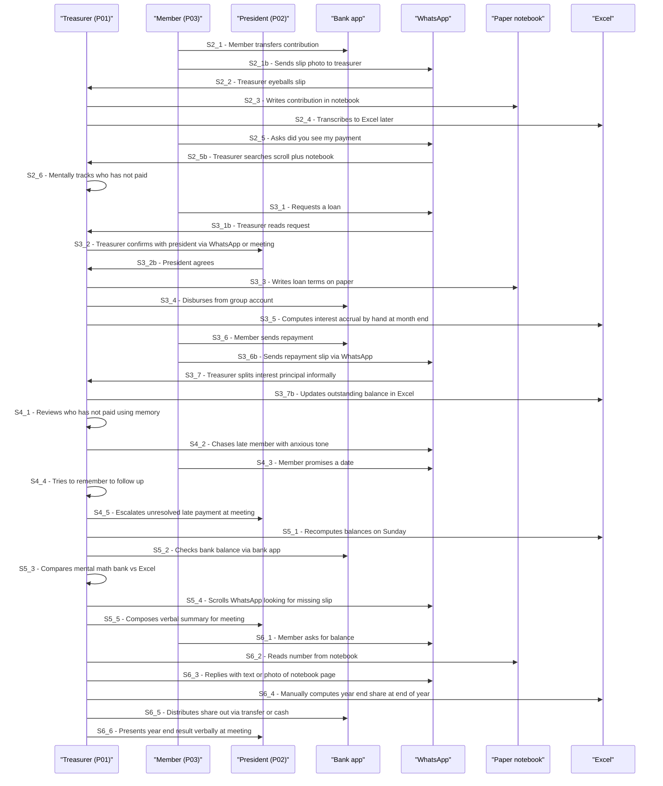
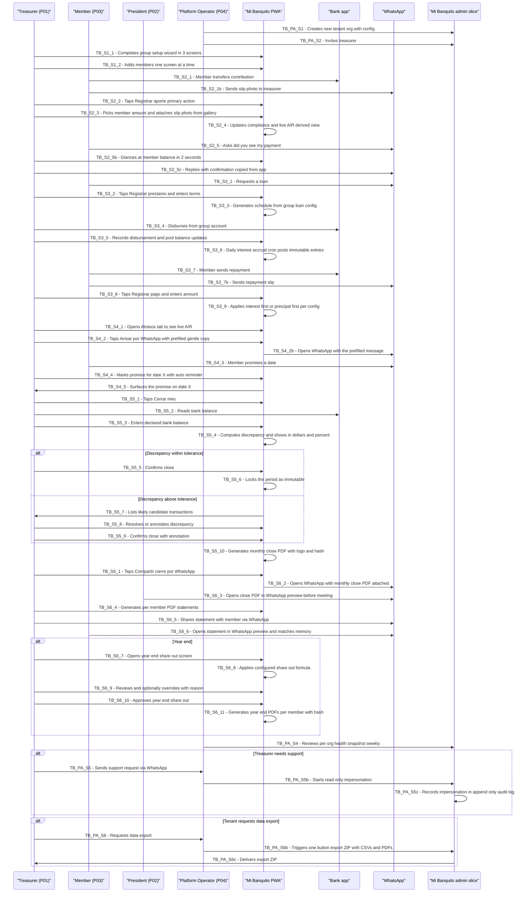

# 03 — CX Journeys (AS-IS + TO-BE): Mi Banquito

**Project:** Mi Banquito (`fcostudios__mi-banquito`)
**Step:** 3 — CX Journeys
**Date:** 2026-05-28
**Author:** Francisco Lomas (via Nous pipeline, `prompts/cx_customer_journey.md`)
**Report language:** en-US (spec convention; product UI is es-EC)
**PRIOR_WORK:**
- `Nous/Specs/fcostudios/mi-banquito/PRODUCT_BRIEF.md`
- `Nous/Specs/fcostudios/mi-banquito/v1/01_research.md`
- `Nous/Specs/fcostudios/mi-banquito/v1/02_cx_personas.md`

> *Note on prompt adaptation: the `cx_customer_journey.md` prompt is procurement-flavored. The structure (SEC0–SEC12, Mermaid AS-IS + TO-BE) is process-agnostic and is followed exactly here. "PROCESS_FOCUS" = the treasurer's monthly cycle of a banquito group; "PERSONA_FOCUS" = primary La Tesorera (P01), with secondary journeys for El Presidente (P02), El Miembro/La Miembra (P03), and La Operadora de la Plataforma (P04).*

> *Note on language: every CX recommendation in SEC4–SEC6 is filtered through the "30-second test" — could La Tesorera accomplish this step on the first try, alone, in under 30 seconds? Failing this test means failing the journey. The Platform Operator surface deliberately does NOT enforce the 30-second test (it is an expert-user surface; CLI-grade complexity is allowed).*

---

---SECTION: SEC0---

## Executive Summary

- **Primary persona & scenario.** *La Tesorera* (Persona 01) running the monthly treasury cycle of an Ecuadorian banquito of ~20 members from her phone. Secondary parallel journeys: *El Presidente* (monthly review via PDF over WhatsApp), *El Miembro/a* (PDF statement receipt over WhatsApp), *La Operadora de la Plataforma* (onboard-org + support-struggling-treasurer flows).
- **Current experience (AS-IS) — one-line narrative.** A non-technical mid-life adult juggles a paper notebook, an Excel sheet she does not fully trust, and an unstructured WhatsApp chat to track every contribution, loan, repayment, and bank movement of her group, racing the calendar to "close the month" before the next meeting without making a visible mistake.
- **Six stages of the journey.** **S1 — Onboard the group + manage members**, **S2 — Run the contribution cycle**, **S3 — Loan lifecycle (origination → schedule → repayment → interest)**, **S4 — Collections (A/R + chase late payments)**, **S5 — Reconciliation + monthly close**, **S6 — Statement distribution + (annual) year-end share-out**.
- **Top pain points (AS-IS).** Arithmetic errors compound silently *[input_ref: "Arithmetic errors compound over months; nobody can independently re-verify a balance"]*; bank reconciliation is skipped *[input_ref: "Reconciliation is skipped. Many groups never formally reconcile to the bank balance"]*; deposit-slip WhatsApp photos get lost in chat scroll *[input_ref: "Deposit slips are passed via WhatsApp photos that get lost in chat history"]*; "how much do I have?" requires page-flipping *[input_ref: "'How much do I have?' requires the treasurer to flip pages"]*; year-end share-out is the highest-stakes calculation and the most disputable *[input_ref: "Year-end share-out is the highest-stakes calculation of the year and the most likely to be disputed"]*; the treasurer carries personal reputational risk as a daily anxiety load *[input_ref: "**Reputational fragility.** A single accusation of mishandling money — even if false — can end the treasurer's social standing"]*.
- **Main CX improvement themes (TO-BE).** (i) **Single canonical electronic ledger** that replaces paper + Excel; (ii) **automatic computation of compliance, interest, A/R aging, and share-out**; (iii) **reconciliation woven into monthly close as a workflow, not a report**; (iv) **append-only history with no destructive edits**; (v) **PDF statements + monthly close report as official-looking artifacts** that survive outside the app over WhatsApp; (vi) **Spanish vocabulary locked** to non-jargon words (`aporte, retiro, préstamo, cuota, saldo, cierre, conciliación, historial, aportante`); (vii) **one-tap daily actions** with no multi-step wizards; (viii) **Platform Operator** sees per-org health, can read-only impersonate, and can export any org's data in one button.
- **Expected impact if implemented.** Monthly-close time drops from several hours to **< 30 minutes**; reconciliation discrepancies trend to **0** by month 3; year-end share-out becomes *defensible by export*, not arguable from memory; treasurer self-reports **"would not go back to paper"** within 2 months. Platform Operator can host every tenant org with predictable onboarding (**< 1 day**) and predictable support response. *(Impact targets from `01_research.md §8 KPIs` and `PRODUCT_BRIEF.md §Success Criteria`.)*

---

---SECTION: SEC1---

## Context & Scope

### Business / Process Context

Mi Banquito is a multi-tenant SaaS treasury system for informal community savings & lending groups in Ecuador (R1) and LATAM (R3+). The treasury process being mapped here is the **monthly cycle of an ASCA-style banquito**: contributions accumulate, loans are issued from the common pool with interest, repayments come back, and the group reconciles to a single bank account. The journey matters because **trust is the operating system** of these groups *[input_ref: "Trust is the product. A single arithmetic error ... can dissolve a group built over years"]* and the treasurer's monthly workflow is where trust is either preserved or broken.

Strategic / operational goals anchoring this journey:

- **Reduce monthly-close time to under 30 minutes** *[input_ref: "Monthly-close time (minutes): target < 30 min within 1 month of go-live"]*
- **Achieve zero ledger-vs-bank discrepancy at month-end for 3 consecutive months** *[input_ref: "Achieve zero ledger-vs-bank discrepancy at month-end for 3 consecutive months post-launch"]*
- **Multi-tenant readiness** — onboarding a second tenant must be a config change *[input_ref: "Onboarding a second group is a config + UI tenant-switcher, not a refactor"]*
- **Validate the product on a real first user** — Francisco's mother *[input_ref: "Francisco Lomas' mother, who is the active treasurer of a real banquito in Ecuador"]*

### Journey Focus

- **PERSONA_FOCUS — primary:** *La Tesorera* (Persona 01). The journey is hers: she is the active user across every stage.
- **PERSONA_FOCUS — secondary (parallel mini-journeys):**
  - *El Presidente* (Persona 02) — monthly review of the closed-month artifact over WhatsApp; no app login in R1.
  - *El Miembro/La Miembra* (Persona 03) — monthly receipt of a PDF statement over WhatsApp; no app login in R1.
  - *La Operadora de la Plataforma* (Persona 04) — onboard-tenant-org flow + support-struggling-treasurer flow (cross-tenant), distinct surface (`/admin` slice + CLI).
- **PROCESS_FOCUS:** *the monthly cycle of a banquito group* (contributions, loans, repayments, A/R, reconciliation, monthly close, plus the annual share-out as a special-case stage that branches from S5 once a year). Out of scope here: end-user onboarding ceremony with bank account opening (the group's bank account is assumed already to exist); social rules and meeting protocol (governance of the group, not of the system).

### Scope Boundaries

- **Journey starts when** the treasurer first opens Mi Banquito for her group (S1 — group setup) and **ends when** the monthly statements are sent over WhatsApp after the close (S6). Year-end share-out is treated as an annual variant of S5/S6.
- **Out of scope (ASSUMPTION when not literally supported):**
  - Account-opening at the bank (assumed already done).
  - WhatsApp Business API integration (deferred to R2 — see `PRODUCT_BRIEF.md §Future Considerations`).
  - OCR on slip photos (R2). Slip photo is uploaded as evidence; the amount is entered manually.
  - Member-side login (R2).
  - President-side login (R2).
  - SMS notifications (deferred — *[input_ref: "SMS notifications — WhatsApp covers communication"]*).

### Input Availability

- **CONTEXT_AND_TASK:** present (`PRODUCT_BRIEF.md`).
- **RAW_RESEARCH:** present (`01_research.md`, 11 sections including AS-IS process inventory in §2.2).
- **PERSONAS_MAP:** present (`02_cx_personas.md`, 4 personas, machine-friendly directory in SEC10).
- **Weak evidence / gaps:** monthly vs. weekly contribution cadence for the design-partner group is not literally confirmed in input (`01_research.md §9.3` flags it as an open question — *ASSUMPTION* used below).
- **Inferred constructs flagged:** `La Operadora de la Plataforma` was inferred from the multi-tenant decision (see `02_cx_personas.md` SEC1 inferred-claims block); journeys for her are also inferred and explicitly marked `ASSUMPTION` where appropriate.

---

---SECTION: SEC2---

## Persona Focus & Scenario

### Persona Summary Table

| Persona | Role in Journey | Key Goals | Main Frustrations | Key Behaviors | Evidence |
|---|---|---|---|---|---|
| **La Tesorera (P01)** | Active across every stage; sole writer to the ledger in R1 | Avoid mistakes; close < 30 min; reconcile clean; defensible per-member statements | Math errors compound; reconciliation skipped; WhatsApp photos lost; reputational risk | Records on paper → Excel; answers balance Qs via WhatsApp; defers close to last moment | `[input_ref: "The group's treasurer ... single non-technical person ... Device: cell-phone primary"]` + `[input_ref: "**Single-point cognitive load.**"]` |
| **El Presidente (P02)** | Read-only at S5/S6 (monthly review of close artifact) | Run clean meeting; mediate disputes with evidence | No second-opinion artifact today; takes sides on disputes blindly | Reviews monthly report on phone just before meeting | `[input_ref: "Group president / officers — read monthly reports occasionally"]` |
| **El Miembro/a (P03)** | Receives PDF statement at S6 (WhatsApp); contributes / borrows from outside the app | Know own balance; trust the group; receive proof | Has to ask treasurer; no archive; slip photos lost | Sends slip via WhatsApp; asks balance via WhatsApp | `[input_ref: "Members — DO NOT touch the app in R1. They receive PDF statements via WhatsApp on request."]` |
| **La Operadora de la Plataforma (P04)** | Active on a separate (`/admin`) surface; cross-tenant lifecycle + support + IMP filing | Onboard < 1 day; spot struggling treasurers first; guarantee data ownership | Solo today; no admin UI; substrate gaps surface as bugs | Mixes CLI + browser + DB; files IMPs when substrate gaps appear | `[input_ref: "Multi-tenant from day 1."]` + `[input_ref: "Time-to-onboard-second-org < 1 day"]` (`ASSUMPTION` on specific behaviors — inferred from architecture) |

### Persona Narratives (3–5 sentences each)

**La Tesorera.** She is 50-something, runs the books of a community group of ~20 women who pool a fixed monthly contribution and lend among themselves. She is comfortable with WhatsApp and her bank app; she is uncomfortable with anything that looks like "a system" *[input_ref: "Not comfortable with anything that looks like a spreadsheet or a 'system.'"]*. In this scenario she is trying to keep the group's books clean for the month, answer the occasional WhatsApp question from a member, and produce a defensible monthly close without losing a Sunday to it. Her emotional posture is *quietly anxious*: she carries personal reputational risk for every cent *[input_ref: "**Reputational fragility.**"]* and the cost of any visible error is far higher than the cost of slowness.

**El Presidente.** He convenes the monthly meeting and signs off on major decisions; in some groups he is also a bank-account co-signer. In R1 he is *not* an app user — he receives the monthly close PDF and (when relevant) per-member statements over WhatsApp from the treasurer. His scenario is: a few hours before the meeting, he reads the PDF on his phone, decides if anything is amiss, and walks into the meeting prepared. His emotional posture is *governance-confident when the artifact is clear, defensive when it is ambiguous.*

**El Miembro/a.** They are one of ~20 members who save monthly and occasionally borrow. They do not log in to anything *[input_ref: "Members — DO NOT touch the app in R1"]*. They receive their PDF statement on WhatsApp once a month and want it to match their memory. Their emotional posture is *trust-by-default until contradicted*; if a number is wrong, the relationship to the group, not just to the product, is at risk.

**La Operadora de la Plataforma.** In R1 this is Francisco Lomas himself (founder + engineer + ops + support). Operationally, she is the across-tenant administrator: creates orgs, watches per-org health, supports treasurers in trouble, exports data on request, files IMPs when the substrate fights back. Her emotional posture is *vigilant, multi-context*: switching between codebase, terminal, browser, WhatsApp customer-contact channel. She does NOT touch any one tenant's ledger except via read-only impersonation; writes against tenant data are reserved for the treasurer of that tenant.

### Scenario Definition

- **Triggering situation.** First-of-the-month (or weekly contribution day) — the treasurer needs to start receiving contributions for the cycle.
- **Main objective.** Maintain a clean, reconciled, append-only ledger across the month and deliver a defensible monthly close at month-end.
- **Success criteria (from each persona's point of view):**
  - *La Tesorera:* the close took less than 30 minutes; the bank reconciliation shows zero discrepancy; she has nothing to defend at the meeting.
  - *El Presidente:* the close PDF is clear; the meeting goes calmly.
  - *El Miembro/a:* the PDF statement on WhatsApp matches what they remember.
  - *La Operadora:* the tenant org was onboarded in < 1 day; the health snapshot shows green; no IMP-class bug surfaced during the month.

---

---SECTION: SEC3---

## End-to-End Journey Overview (Stages)

The journey flows as a **monthly cycle**: configuration is set up once (S1), then S2–S6 repeat every month, with S6's *year-end variant* once a year. The Platform Operator journey runs in parallel on a different surface and intersects at onboarding (preceding S1) and at support events (across S2–S6).

| Stage ID | Stage Name | Persona Main Goal at this Stage | Entry Trigger | Exit Condition / Outcome | Evidence |
|---|---|---|---|---|---|
| **S1** | Group setup + member admin | Configure the group's rules and roster so the system knows who contributes what and how loans are issued | First login (post-onboarding by Platform Operator); or new-member admission event | Group config + member roster captured; system is ready to receive transactions | `[input_ref: "Member registry (add/remove/freeze members, capture basics)"]` + `[input_ref: "Group rules (cycle amount, interest rate, grace, share-out formula) — usually unwritten"]` |
| **S2** | Contribution cycle (record deposits) | Record every member's contribution accurately, with slip evidence, and surface who is up-to-date vs behind | Cycle start (typically first of the month — *ASSUMPTION*; weekly possible per `09 open questions`) | All received contributions recorded; A/R aging is up-to-date | `[input_ref: "Per-member ledger (deposits, withdrawals, current balance, contribution compliance)"]` + `[input_ref: "**System computes compliance**"]` |
| **S3** | Loan lifecycle (originate + accrue interest) | Issue a loan with a clear schedule; let the system compute interest accrual; record disbursement against the pool balance | Member loan request (WhatsApp or in-person) | Loan record exists with schedule; A/P reflects disbursement; interest accrues daily | `[input_ref: "Loans: issue, schedule, repay, automatic interest accrual"]` + `[input_ref: "Receive a loan request (verbal at meeting, or via WhatsApp)"]` |
| **S4** | Collections (A/R + chase late payments) | See who owes what; chase with promises tracked; record incoming repayments | Live throughout the cycle; intensifies near month-end | A/R aging at or near zero by month-end; chase log archived | `[input_ref: "A/R aging is informal. 'Who owes what' lives in the treasurer's memory"]` + `[input_ref: "Collections workflow: chase-list, promise tracking, confirmation log"]` |
| **S5** | Reconciliation + monthly close | Enter declared bank balance; resolve any discrepancy; lock the period | Month-end (calendar trigger) | Period closed; reconciliation discrepancy = 0 (or annotated); audit log immutable from this point | `[input_ref: "Reconciliation pattern. Bank-statement vs. internal-ledger reconciliation"]` + `[input_ref: "Period-close lock pattern. Once a period is closed, prior-period entries are immutable"]` |
| **S6** | Statement distribution (+ year-end share-out) | Generate per-member PDFs; share them over WhatsApp; once a year, compute and distribute the share-out | Immediately after S5 close; year-end variant once per calendar year | All members received their statement; year-end: share-out computed + approved + distributed | `[input_ref: "PDF statement export per member — emailable / WhatsApp-shareable"]` + `[input_ref: "Year-end share-out is the highest-stakes calculation"]` |
| **S7** | Movimientos del fondo / Ajustes *(CHG-001)* | Record every non-contribution money movement — bank fees, supplies, shared expenses (desayunos), inter-account transfers, and the regularization of deposits that landed in a personal/non-group account — categorized, audited, and reconciled | Live throughout the cycle (like S4); intensifies at S5 close, which cannot lock while any movement is unregularized | All fund movements recorded + categorized; zero `pending` (unregularized) rows so the period can lock | real-treasurer recollection (CHG-001): comisiones bancarias, transferencias entre cuentas / depósito en cuenta personal, tintas + papel + insumos, desayunos; BR-12..16 |

---

---SECTION: SEC4---

## Detailed Journey by Stage (AS-IS vs TO-BE)

> Each stage below is per the canonical 30-second-test discipline. Anti-patterns to AVOID are surfaced at the end of each stage.

### Stage S1 — Group setup + member admin

**Stage Narrative (AS-IS).** Today there is no "setup." A new banquito starts on paper. The treasurer keeps a list of members in her notebook, writes down the agreed monthly contribution amount and the interest rule (often as a single sentence at the top of the page), and accepts new members or freezes departing ones by crossing names out. There is no canonical record of *the rules*; if someone asks "what does our group charge on a 200-dollar loan?", the answer comes from memory or from the meeting minutes, which themselves are paper *[input_ref: "Group rules (cycle amount, interest rate, grace, share-out formula) — usually unwritten"]*. Her emotional posture is *quietly tense at every membership change* — adding a new member means re-explaining the rules; freezing a member is a social event.

**Stage Table (AS-IS):**

| Step # | Step Description (AS-IS) | Channels / Touchpoints | Emotions (1–5 + label) | Pain Points (AS-IS) | Backstage Processes / Systems | Evidence |
|---|---|---|---|---|---|---|
| 1 | New member admitted; treasurer writes the name and contact in the notebook | Paper notebook | 3 – Neutral | No structured intake; phone number sometimes missing | None | `[input_ref: "Admit a new member ... Paper, sometimes WhatsApp ID card photo"]` |
| 2 | Treasurer mentions the contribution amount + rules verbally at next meeting | Verbal (in person) | 2 – Mildly anxious | Rules not written; new members re-ask later | None | `[input_ref: "Group rules ... usually unwritten"]` |
| 3 | Member departs; treasurer crosses out the name; tries to remember to refund accumulated savings | Paper, WhatsApp, bank app | 2 – Frustrated | Refund timing ad hoc; cross-out is destructive (no history) | None | `[input_ref: "Freeze / remove a member ... Refund of accumulated savings"]` |
| 4 | Member asks "what are the rules again?" via WhatsApp | WhatsApp | 2 – Slight irritation | Treasurer retypes the same rules every time | None | `[input_ref: "Members ... ask balance via WhatsApp"]` (proxy evidence) |

**Stage Table (TO-BE / Improvement Ideas):**

| Improvement # | TO-BE / Improvement Description | CX Benefit | Effort (Low/Med/High) | Owner / Area | Related Pain Points (from AS-IS) | Assumption? |
|---|---|---|---|---|---|---|
| 1 | First-run **group setup wizard** (3 screens max): group name + logo upload; monthly contribution amount + currency (currency comes from `project_configs.locale` — USD-EC default); loan rules (rate + grace + cap-as-multiple-of-savings) | Rules become canonical; new members no longer re-ask | Medium | Product (UX) | Rules unwritten; verbal repetition | No |
| 2 | **Member registry as primary navigation tab** with three columns max: name, status (`activo / en pausa / dado de baja`), current balance | Faster member lookup; status is explicit (not crossed-out) | Low | Product (UX) | Cross-out is destructive | No |
| 3 | **Member admission flow** = single screen: name, WhatsApp number, joined-on (default = today), initial savings balance (default = 0) | One-screen; defaults; ≥ 48×48 px tap targets; ≥ 16 px body, ≥ 20 px name | Low | Product (UX) | Phone number sometimes missing | No |
| 4 | **Member freeze and exit** as a two-step flow: status change → refund record (A/P entry) generated automatically | Refund is no longer ad-hoc; status history preserved (append-only) | Medium | Product + Domain | Refund timing ad-hoc; no history | No |
| 5 | **"Rules of the group" screen** = single read-only screen showing the configured contribution, interest, grace, cap; one tap "share rules over WhatsApp" copies a plain-Spanish summary | New members can be self-served; treasurer stops retyping | Low | Product (UX) | Treasurer retypes rules | No |
| 6 | **Group logo upload at setup** for use in PDF statement footers | Statements look unambiguously official to members | Low | Product (UX) | (Cross-cutting) | No |

**Anti-patterns to avoid at S1.**
- Multi-step wizards beyond 3 screens.
- Settings page on the home navigation.
- Asking the treasurer to choose between "Member" vs "Aportante" — pick one term in vocabulary lock (use `socia/socio` or `aportante` based on the design-partner's group's vocabulary).

---

### Stage S2 — Contribution cycle (record deposits)

**Stage Narrative (AS-IS).** On the contribution day (assumed monthly — *ASSUMPTION*; weekly possible per `01_research.md §9.3`), members transfer their contribution to the group's bank account and send the treasurer a screenshot of the bank-transfer slip via WhatsApp. The treasurer collects them across the day, mentally tracks who has paid and who has not, and writes each contribution in her notebook. Later (often the same evening or next day) she transcribes to her Excel sheet. She answers the predictable "I just paid, did you see it?" WhatsApp questions in real time. Her emotional posture across the day is *low-grade vigilance*: missing a deposit slip in the WhatsApp scroll is the most common error *[input_ref: "Deposit slips are passed via WhatsApp photos that get lost in chat history"]*.

**Stage Table (AS-IS):**

| Step # | Step Description (AS-IS) | Channels / Touchpoints | Emotions (1–5 + label) | Pain Points (AS-IS) | Backstage Processes / Systems | Evidence |
|---|---|---|---|---|---|---|
| 1 | Member transfers contribution at bank; sends slip photo via WhatsApp | Bank app, WhatsApp | 3 – Neutral | Slip photo can be lost in chat scroll | Member's bank, group's bank | `[input_ref: "Deposit slips are passed via WhatsApp photos that get lost in chat history"]` |
| 2 | Treasurer eyeballs the slip; mentally verifies the amount | WhatsApp | 3 – Neutral | No structured verification; copy-paste later | None | `[input_ref: "Manual transfers of information (copy/paste, email, manual file uploads, etc.)"]` |
| 3 | Treasurer writes the contribution in paper notebook | Paper | 3 – Neutral | Paper as canonical; Excel transcript will diverge | None | `[input_ref: "Paper notebook — Primary chronological ledger"]` |
| 4 | Treasurer transcribes to Excel (delayed) | Excel | 2 – Mild dread | Two sources of truth, drift inevitable | None | `[input_ref: "Excel — Per-member balances, often a second ledger; not synchronized with paper"]` |
| 5 | Member asks via WhatsApp: "I paid, did you see it?" | WhatsApp | 2 – Slight irritation (interrupts) | Treasurer searches WhatsApp + notebook to answer | None | `[input_ref: "Members chase the treasurer for 'how much do I have?'"]` |
| 6 | Treasurer mentally tracks "still not paid" list near month-end | Memory | 2 – Anxious | A/R aging is memory-based; mood-dependent | None | `[input_ref: "A/R aging is informal. 'Who owes what' lives in the treasurer's memory; chase decisions are mood-dependent"]` |

**Stage Table (TO-BE / Improvement Ideas):**

| Improvement # | TO-BE / Improvement Description | CX Benefit | Effort (Low/Med/High) | Owner / Area | Related Pain Points (from AS-IS) | Assumption? |
|---|---|---|---|---|---|---|
| 1 | **Home screen "Registrar aporte" button** as one of three primary CTAs (the others: "Registrar pago" and "Ver atrasos") | One-tap from home; no menu diving | Low | Product (UX) | Slip lost in scroll; treasurer interrupted | No |
| 2 | **Deposit-entry flow = single screen** — member dropdown (forgiving partial-name search), amount (large numeric keypad, currency from `project_configs.locale`), slip photo (one tap — opens camera or chooses from WhatsApp gallery), notes (optional) | Three taps to record a deposit | Medium | Product (UX) + R2 backend | Multi-step + copy-paste workflow | No |
| 3 | **Slip photo upload bundled with the deposit entry** (not a separate "attachments" feature) | Photo is attached to the contribution permanently; no scroll-loss | Low | Product (UX) | Slip photos lost in WhatsApp scroll | No |
| 4 | **Live compliance computation** — for the current cycle, a single screen lists every member with status `al día / atrasado / en mora` (green / amber / red) | "Did everyone pay?" becomes a glance instead of a memory exercise | Medium | Domain (read model) | Memory-based A/R aging | No |
| 5 | **"Quien debe esta semana?" view** updated in real time | Live A/R aging surfaced; treasurer can chase based on data not mood | Medium | Domain (read model) | Mood-dependent chasing | No |
| 6 | **"Buscar miembro" lookup** with partial first-name match, recent-first | "Did Maria pay?" becomes 2 seconds | Low | Product (UX) | Searching memory + notebook | No |
| 7 | **Append-only contribution records.** If a contribution is recorded wrong, the treasurer creates a reversal entry (not a destructive edit). | Trust-by-history baseline; auditable | Medium | Domain | (Cross-cutting) | No |

**Anti-patterns to avoid at S2.**
- A "save and add another" pattern — implies the treasurer is doing batch entry. Each deposit is its own discrete record.
- A "bulk import from spreadsheet" feature — would re-introduce Excel as canonical; not in R1 scope.
- Showing balance in cents subdivided by category (savings sub-ledger, etc.) — not in R1 vocabulary.

---

### Stage S3 — Loan lifecycle (origination + interest accrual)

**Stage Narrative (AS-IS).** A member asks for a loan via WhatsApp or at the meeting. The treasurer notes it down on paper, confirms with the president (or the group, depending on group rules), then disburses — either as cash or via bank transfer from the group's account to the member's account. She writes the loan terms on paper: principal, rate, term, payment dates. Interest accrues over the term, computed by hand or via Excel formula at month-end. Repayments are recorded as they come in. Her emotional posture during origination is *cautiously responsive* (a member's loan request is a moment of social trust); during accrual is *mildly stressed* (she dreads the period-end math).

**Stage Table (AS-IS):**

| Step # | Step Description (AS-IS) | Channels / Touchpoints | Emotions (1–5 + label) | Pain Points (AS-IS) | Backstage Processes / Systems | Evidence |
|---|---|---|---|---|---|---|
| 1 | Member requests loan (WhatsApp or meeting) | WhatsApp, in person | 3 – Neutral | Request log informal | None | `[input_ref: "Receive a loan request from a member (verbal at meeting, or via WhatsApp)"]` |
| 2 | Treasurer confirms with president (in some groups, with the whole group) | WhatsApp, meeting | 3 – Neutral | Approval social, not procedural | None | `[input_ref: "Approval threshold; rate set by group"]` |
| 3 | Treasurer writes loan terms on paper: principal, rate, term, dates | Paper | 3 – Neutral | Schedule by hand; error-prone | None | `[input_ref: "**Loan-rate logic** varies per loan and is recomputed by hand. Errors compound over the loan term"]` |
| 4 | Treasurer disburses cash or transfers from group bank account | Bank app, cash | 3 – Neutral | A/P entry implicit; pool balance not updated formally | None | `[input_ref: "Disburse a loan ... Bank app, cash, paper"]` |
| 5 | Treasurer computes interest accrual at month-end by hand or Excel formula | Excel, mental math | 2 – Stressed | Errors compound over the loan term | None | `[input_ref: "Compute interest accrual on a loan ... Excel formula, mental math"]` |
| 6 | Treasurer receives a repayment (cash or transfer); splits between interest and principal informally | Paper, bank app, WhatsApp | 2 – Mildly stressed | FIFO interest-first vs principal-first by group convention; rarely written | None | `[input_ref: "Receive a loan repayment ... FIFO interest-first vs. principal-first"]` |
| 7 | Treasurer tracks outstanding loan balance per member in Excel | Excel | 2 – Stressed | Math errors compound; cannot independently verify | None | `[input_ref: "Track outstanding A/R ... Excel"]` |

**Stage Table (TO-BE / Improvement Ideas):**

| Improvement # | TO-BE / Improvement Description | CX Benefit | Effort (Low/Med/High) | Owner / Area | Related Pain Points (from AS-IS) | Assumption? |
|---|---|---|---|---|---|---|
| 1 | **"Registrar préstamo" as a primary home action** — single-screen entry (member, principal amount, term in months, schedule type selected from group's preset, purpose note optional) | One-tap origination; schedule auto-generated | Medium | Product (UX) + Domain | Hand-written terms; error-prone | No |
| 2 | **System generates the loan schedule** from group's loan-type config (R1: fixed-payment + flat-rate + grace; balloon and interest-only deferred — *ASSUMPTION* on the design-partner's actual loan types) | Treasurer never does loan math; schedule visible immediately | High | Domain (loan-engine) | Math errors compound | No |
| 3 | **Daily interest accrual cron** — system computes accrual per loan, posts as immutable accrual entries; on period-close, accruals are summed | Treasurer never computes interest; trust-by-determinism | High | Backend (cron) + Domain | Errors at month-end | No |
| 4 | **"Registrar pago" flow** — single-screen repayment entry (member dropdown → automatically shows outstanding loans for that member → amount → date → optional note). System auto-applies interest-first or principal-first per the group's config. | Splitting becomes automatic; treasurer just enters the amount | Medium | Product (UX) + Domain | FIFO split by convention, rarely written | No |
| 5 | **"Préstamos activos" view** — per-member outstanding principal + days remaining + accrued interest, sorted by next-due-date | A/R aging is live, not memory | Medium | Domain (read model) | Memory-based tracking | No |
| 6 | **"Vista del préstamo" screen** — for each loan: original terms + schedule + every repayment + every accrual + remaining balance. Append-only history. | Treasurer (and later the president via PDF) can see the whole story of any loan | Low | Product (UX) | Cannot independently verify | No |
| 7 | **Loan-approval workflow stays in WhatsApp in R1** — system records "approved by" + "approved at" when treasurer originates, but no in-app voting/approval flow | Doesn't try to replace the social approval process | Low | Product (UX) | Approval is social | No |
| 8 | **Disbursement records an A/P fulfillment** automatically, reducing the group's pool balance | Pool balance is always live and trustworthy | Medium | Domain | Implicit A/P | No |

**Anti-patterns to avoid at S3.**
- An in-app loan-approval voting flow — out of scope R1 (group decides socially).
- Compound-interest configuration in R1 unless the design-partner's group uses it — *ASSUMPTION: most informal Andean banquitos use flat-rate per-period; needs validation*. Default to flat-rate; offer compound only if confirmed.
- Hiding the loan schedule behind an "advanced" toggle — the schedule is the loan's main artifact.

---

### Stage S4 — Collections (A/R + chase late payments)

**Stage Narrative (AS-IS).** From the cycle-start day onward, the treasurer tracks who has not yet contributed and who is late on a loan repayment. She "decides to chase" based on mood and social comfort — sometimes she avoids a member because of an unrelated tension. Chasing happens via WhatsApp message; promises are recorded mentally ("María said she'd pay Friday"). When Friday comes she may or may not remember to follow up. Her emotional posture is *socially uncomfortable*: chasing money from friends is the part of the job she dislikes most.

**Stage Table (AS-IS):**

| Step # | Step Description (AS-IS) | Channels / Touchpoints | Emotions (1–5 + label) | Pain Points (AS-IS) | Backstage Processes / Systems | Evidence |
|---|---|---|---|---|---|---|
| 1 | Treasurer reviews who has not paid (memory + Excel) | Memory, Excel | 2 – Reluctant | Memory-only; biased by social comfort | None | `[input_ref: "A/R aging is informal."]` |
| 2 | Treasurer chases via WhatsApp ("¿Cuándo me depositas?") | WhatsApp | 1 – Uncomfortable | Social cost; mood-driven | None | `[input_ref: "Chase late payments ... WhatsApp, in-person"]` |
| 3 | Member promises a date | WhatsApp | 2 – Tentative | Promise not recorded | None | `[input_ref: "Promise log"]` |
| 4 | Treasurer remembers (or not) to follow up on the promised date | WhatsApp, memory | 2 – Stressed | Promise-tracking by memory | None | (Inferred from `[input_ref: "Politeness norm; meeting-level escalation"]`) |
| 5 | Late payment escalates to meeting if unresolved | Meeting | 2 – Awkward | Group-level tension | None | `[input_ref: "Politeness norm; meeting-level escalation"]` |

**Stage Table (TO-BE / Improvement Ideas):**

| Improvement # | TO-BE / Improvement Description | CX Benefit | Effort (Low/Med/High) | Owner / Area | Related Pain Points (from AS-IS) | Assumption? |
|---|---|---|---|---|---|---|
| 1 | **"Atrasos" view as a primary navigation tab** — live A/R aging across contributions + loan repayments; sorted by days-late (longest first) | Treasurer decides by data, not by mood | Medium | Domain (read model) | Memory-only; biased | No |
| 2 | **One-tap "Avisar por WhatsApp"** per row — opens WhatsApp with a pre-filled, gentle, plain-Spanish message ("Hola María, te comparto que tu aporte de mayo aún está pendiente. ¿Cuándo crees poder hacerlo? — Mi Banquito.") | Reduces social cost; standardizes tone | Low | Product (UX) | Social cost of chasing | No |
| 3 | **Promise tracking** — when the treasurer marks "prometió pagar el X", the system surfaces it on that day | Treasurer no longer has to remember promises | Medium | Product (UX) + Domain | Promise-tracking by memory | No |
| 4 | **Confirmation log** — each promise records its outcome (paid, deferred, escalated to meeting) | Builds a defensible record if a member disputes "I said I would pay" later | Medium | Product (UX) + Domain | Promises forgotten | No |
| 5 | **No automated WhatsApp messages in R1** — every outbound message is treasurer-mediated; she taps "Avisar" and confirms before WhatsApp opens | Respects the personal-trust relationship; defers WhatsApp Bot to R2 | Low | Product (UX) | (Cross-cutting R2 boundary) | No |
| 6 | **Meeting-mode view** — at meeting time, a single screen lists "open issues to discuss" (collections in `en mora` state plus unresolved discrepancies) | Treasurer walks into the meeting with the issue list ready | Low | Product (UX) | Group-level tension | No |

**Anti-patterns to avoid at S4.**
- An auto-message scheduler (would feel impersonal; would also imply WhatsApp Business API which is R2).
- A "late fee" auto-charge — out of scope unless the design-partner's group applies one (`ASSUMPTION`: most informal banquitos do not).
- Sorting by member name alphabetically instead of by days-late — the days-late sort encodes urgency.

---

### Stage S5 — Reconciliation + monthly close

**Stage Narrative (AS-IS).** Once a month — often on a Sunday — the treasurer sits down to "close." She opens Excel, recomputes the per-member balances, recomputes the loan balances, and tries to add them up. She checks her bank app for the current balance. If the numbers do not agree, she stares at them and looks for the missing entry — sometimes finds it in the WhatsApp scroll, sometimes does not. Many groups skip reconciliation entirely *[input_ref: "Reconciliation is skipped. Many groups never formally reconcile to the bank balance until a problem surfaces"]*. Her emotional posture during this stage is *quietly exhausted*: this is the worst stage of the cycle.

**Stage Table (AS-IS):**

| Step # | Step Description (AS-IS) | Channels / Touchpoints | Emotions (1–5 + label) | Pain Points (AS-IS) | Backstage Processes / Systems | Evidence |
|---|---|---|---|---|---|---|
| 1 | Treasurer opens Excel; recomputes balances | Excel | 2 – Exhausted | Manual aggregation; Sunday-long | None | `[input_ref: "Several hours of paper-and-Excel work; sometimes a full Sunday"]` |
| 2 | Treasurer checks bank balance via bank app | Bank app | 3 – Neutral | Bank not linked to books | None | `[input_ref: "Bank balance vs. group ledger has no reconciliation step"]` |
| 3 | Treasurer compares: bank balance vs. computed pool balance | Mental math | 2 – Anxious | Discrepancy often present; cause hard to find | None | `[input_ref: "cash leaks go undetected for months"]` |
| 4 | If discrepancy: treasurer scrolls WhatsApp looking for the missing slip | WhatsApp | 1 – Frustrated | Slip in scroll = needle in haystack | None | `[input_ref: "Deposit slips are passed via WhatsApp photos that get lost in chat history"]` |
| 5 | Treasurer composes monthly summary verbally for the next meeting | Mental math | 2 – Tired | No archive; disputable from memory | None | `[input_ref: "No archive; disputable from memory"]` |
| 6 | (Often skipped) Treasurer writes the summary down | Paper, Excel | 2 – Reluctant | Time-consuming; not standard | None | (Inferred) |

**Stage Table (TO-BE / Improvement Ideas):**

| Improvement # | TO-BE / Improvement Description | CX Benefit | Effort (Low/Med/High) | Owner / Area | Related Pain Points (from AS-IS) | Assumption? |
|---|---|---|---|---|---|---|
| 1 | **"Cerrar mes" primary action on home at month-end** — single-screen flow: enter declared bank balance → system immediately shows computed pool balance + discrepancy (in dollars and percent) | Reconciliation as a workflow, not a report | Medium | Product (UX) + Domain | Skipped reconciliation | No |
| 2 | **Discrepancy resolution helper** — when discrepancy > 0, system lists transactions recorded near the close date + any contributions still flagged "esperando confirmación" | Treasurer doesn't scroll WhatsApp; system surfaces likely candidates | Medium | Domain (heuristics) | Slip-in-WhatsApp-scroll search | No |
| 3 | **Tolerance configuration** — if discrepancy is within configured tolerance (e.g., USD 1.00 default), the close proceeds with an annotation; outside tolerance, treasurer must resolve or explicitly annotate | Realism: rounding happens; treasurer is not blocked by USD 0.02 | Low | Product (UX) + Config | Discrepancy resolution stress | No |
| 4 | **Period-close lock** — after close, all entries with date ≤ close-date are immutable; any post-close adjustment becomes a "adjustment period" entry, visible in the next month's history | Trust-by-immutability; no destructive post-hoc edits | Medium | Domain | (Cross-cutting) | No |
| 5 | **Generated monthly close report (PDF)** — automatically produced at close, contains: opening bank balance, every cycle transaction summarized, closing bank balance, member balance table, outstanding loans table, A/R summary, discrepancy (if any) with annotation | Defensible artifact; replaces verbal-at-meeting summary | Medium | Domain (PDF service) | No archive; disputable | No |
| 6 | **"Compartir cierre" one-tap WhatsApp share** | Treasurer brings the report to the meeting in one tap | Low | Product (UX) | (Cross-cutting WhatsApp channel) | No |
| 7 | **Close history view** — every prior close is a row with a link to the PDF; the treasurer can look back at "May's close" months later | Easy retrieval; builds long-term trust | Low | Product (UX) | (Cross-cutting) | No |

**Anti-patterns to avoid at S5.**
- A "force close even if discrepant" button without annotation — the discrepancy MUST be either resolved or explicitly annotated with reason.
- A dashboard with N widgets at close time — the close screen is single-purpose; widgets are for daily home.
- An "edit a past entry" button — fatal trust violation; reversals only.

---

### Stage S6 — Statement distribution (+ year-end share-out)

**Stage Narrative (AS-IS).** Members occasionally ask for a statement. Today, the treasurer reads numbers out of her Excel or notebook and replies via WhatsApp text, or she sends a photo of the notebook page. There is no archive; if a member challenges a number months later, it is one person's memory against another's. Year-end is the highest-stakes calculation: the treasurer hand-computes a share-out (each member's accumulated savings × group's chosen formula), distributes the payouts, and hopes the math holds up to scrutiny at the meeting. Her emotional posture at year-end is *the most anxious of the year* *[input_ref: "Year-end share-out is the highest-stakes calculation of the year and the most likely to be disputed"]*.

**Stage Table (AS-IS):**

| Step # | Step Description (AS-IS) | Channels / Touchpoints | Emotions (1–5 + label) | Pain Points (AS-IS) | Backstage Processes / Systems | Evidence |
|---|---|---|---|---|---|---|
| 1 | Member asks "what's my balance?" | WhatsApp | 3 – Neutral | Each request is manual | None | `[input_ref: "**'How much do I have?'** requires the treasurer to flip pages"]` |
| 2 | Treasurer reads number from notebook or Excel | Paper, Excel | 2 – Effortful | Manual lookup | None | (Inferred) |
| 3 | Treasurer replies via WhatsApp text or photo of notebook page | WhatsApp | 3 – Neutral | No archive; not auditable | None | `[input_ref: "Statements are verbal or paper"]` |
| 4 | Year-end: treasurer manually computes per-member share | Excel, mental math | 1 – Highly anxious | Highest-stakes math; cannot self-verify | None | `[input_ref: "Year-end share-out is the highest-stakes calculation"]` |
| 5 | Year-end: treasurer distributes payouts (bank transfer / cash) | Bank app, cash | 2 – Stressed | A/P entries informal | None | `[input_ref: "share-out formula (proportional to savings, fixed per member, or hybrid)"]` |
| 6 | Year-end: result presented verbally at meeting | Meeting | 2 – Defensive | Dispute risk maximal | None | (Inferred) |

**Stage Table (TO-BE / Improvement Ideas):**

| Improvement # | TO-BE / Improvement Description | CX Benefit | Effort (Low/Med/High) | Owner / Area | Related Pain Points (from AS-IS) | Assumption? |
|---|---|---|---|---|---|---|
| 1 | **Per-member PDF statement** — generated on demand or at close; contains: header (group logo + name), member name + status, opening balance for the period, every transaction (contributions, repayments, withdrawals) with date + slip thumbnail, closing balance, footer with "Documento generado por Mi Banquito — verificación: <hash>" | Member receives an unambiguously official artifact | Medium | Domain (PDF service) | No archive; not auditable | No |
| 2 | **"Enviar estado a [member]" one-tap WhatsApp share** | Distribution is frictionless; statement looks like a bank statement | Low | Product (UX) | Manual reply over WhatsApp | No |
| 3 | **Statement archive** — every generated statement is stored immutably with its hash; treasurer can re-issue an exact copy months later | Future verification possible; disputes become artifact-vs-artifact, not memory-vs-memory | Medium | Domain (archive) | No archive | No |
| 4 | **Year-end share-out workflow** — system applies the configured share-out formula (the formula is a group-config decision recorded as `DEC-NNN`); treasurer reviews per-member share + can override individual amounts with a documented reason; approval logged | Trust-by-determinism + treasurer-controlled override | High | Domain (share-out engine) | Highest-stakes math | Yes — *ASSUMPTION* on formula variety; needs design-partner validation |
| 5 | **Year-end PDF** — same statement format but covering the full year; computed share-out highlighted; treasurer signs (digital signature stored as artifact); each member receives their year-end statement plus a PDF of the full share-out for transparency | Year-end becomes defensible-by-export | Medium | Domain (PDF service) | Dispute risk at year-end | No |
| 6 | **"Verificar" hash check** — R2 feature, deferred. Future: members can paste the statement hash into a public web page to verify integrity. | Statement is not just official-looking, it is cryptographically verifiable | Out of R1 | Product + Domain | (Long-term trust) | Yes — out of R1 scope |
| 7 | **Member balance lookup** — even when the member has no app login in R1, the treasurer can type a member name on home → see balance in one tap → optionally share the result over WhatsApp | "How much do I have?" answered in seconds, not minutes | Low | Product (UX) | Page-flipping | No |

**Anti-patterns to avoid at S6.**
- Year-end share-out without override capability — financial reality requires the treasurer to occasionally adjust (e.g., a member who pulled out mid-year); blocking the override is wrong.
- Statements without integrity hash — a money-product PDF without verifiability erodes the trust differentiator.
- An "Edit a past statement" button — fatal. Statements are immutable.

---

### Stage S7 — Movimientos del fondo / Ajustes *(CHG-001)*

**Stage Narrative (AS-IS).** The fund's money does not only move as contributions, loans, and repayments. The treasurer also **pays the bank's fees**, **buys supplies** (printer ink, paper), **pays for shared things** (breakfasts for the meeting), and **moves money between accounts** — and, critically, **sometimes a member deposits into the treasurer's personal account** (because it was the account they had on hand), so she then "does movements to regularize" it into the group account. Today all of this lives in her head, on the notebook margins, or in her personal bank app. The fund's real balance is therefore *not* what the notebook says — it is the notebook ± a tangle of personal-account movements she alone can reconstruct. This is precisely the opacity that ends treasurers' reputations: there is no way for anyone else to see that a deposit sitting in her personal account is actually group money in transit. Her emotional posture here is *the most exposed of all* — every personal-account movement is a future accusation waiting to be misread.

**Stage Table (AS-IS):**

| Step # | Step Description (AS-IS) | Channels / Touchpoints | Emotions (1–5 + label) | Pain Points (AS-IS) | Backstage Processes / Systems | Evidence |
|---|---|---|---|---|---|---|
| AS_S7_1 | Pays a bank fee / buys ink, paper / pays for the breakfast — notes it (or doesn't) on the notebook margin | Bank app, cash, paper | 2 — *distracted* | Uncategorized; often un-recorded; erodes the "where did the money go?" answer | Notebook margin / memory | real recollection (CHG-001) |
| AS_S7_2 | A member deposits into her **personal account**; she later transfers it to the group account "to regularize" | Personal bank app, WhatsApp slip | 2 — *exposed* | No independent record that this personal-account money is group money in transit; pure reputational risk | Personal bank app + memory | real recollection (CHG-001) |
| AS_S7_3 | Moves money between the group's own accounts (cash box ↔ bank) | Bank app, cash | 3 — *neutral* | Untracked; the two-account reality is invisible to the group | Memory | real recollection (CHG-001) |

**Stage Table (TO-BE / Improvement Ideas):**

| Improvement # | TO-BE / Improvement Description | CX Benefit | Effort (Low/Med/High) | Owner / Area | Related Pain Points (from AS-IS) | Assumption? |
|---|---|---|---|---|---|---|
| TB_S7_1 | **"Registrar movimiento"** one-tap action records any outflow with a **required category** (`comisión bancaria / insumos / gasto compartido / pago solidario / pago a tesorera / operativo`) + optional slip photo (BR-13) | Every dollar that leaves is named and evidenced | Low | Domain (ledger) | AS_S7_1 | No |
| TB_S7_2 | **Multi-account model:** the group's accounts (banco, caja, personal de tesorera) are first-class; every contribution/repayment/movement records **which account** it touched (BR-12) | The two-account reality becomes visible and auditable | Med | Domain (Account) | AS_S7_3 | No |
| TB_S7_3 | **Regularization workflow (crown jewel):** a deposit into a non-group account is flagged `pendiente`; a **transfer into a group account** clears it to `regularizado`; the period **cannot close** while anything is `pendiente` (BR-12 + period-lock) | The treasurer's biggest reputational risk becomes a tracked, self-clearing workflow visible to all | High | Domain (Transfer + close guard) | AS_S7_2 | No |
| TB_S7_4 | Every movement is **append-only + audited + on the statement & public-verify** (BR-16) | Nothing about the fund's money is off-ledger | Med | Domain (audit) | AS_S7_1, AS_S7_2 | No |
| TB_S7_5 | `SCR-monthly-close` shows a **reconciliation panel** listing the `pendiente` rows blocking the lock; one tap to record the regularizing transfer | Close becomes "clear the flags, then lock" | Med | Frontend | AS_S7_2 | No |

---

### Parallel mini-journey — *Solidaridad* (P03 + treasurer) — extraordinary collection for a member *(CHG-001)*

**Trigger.** A member suffers a *calamidad doméstica* (or the group decides to recognize the treasurer's gestión with a payout). The group agrees to raise an **extraordinary collection** outside the normal contribution cycle.

**AS-IS.** Someone passes a hat or starts a WhatsApp "todas pongan $10 para X". The treasurer collects the money (often into her personal account), tracks who gave in her head, hands the cash to the beneficiary, and hopes everyone remembers it was fair.

**TO-BE (R1).** Treasurer opens **"Colecta solidaria"** → names the purpose + beneficiary (BR-14, `open`) → members' contributions are recorded as `ExtraordinaryCollectionLine` rows as they come in, each tagged with the account it landed in (`collecting`; non-group accounts flagged `pendiente` per BR-12) → once collected, a single **payout** `Movement` (`category = solidarity_payout`, shown on screen as "pago solidario") disburses to the beneficiary, capped at the collected total (`paid_out`, BR-14 arithmetic invariant) → the collection `closed`. Every contributor sees the collection — and that it was fully paid out — on their statement and on public-verify (BR-16). The treasurer-recognition variant routes the payout through `category = treasurer_comp_payout` ("pago a tesorera"), gated by a recognized amount (BR-15). *(Enum keys are English — the canonical `Expense.category` contract in `04_er_model.md` / BR-13; Spanish is only the on-screen label.)*

**R2 evolution.** Members self-contribute to an open collection via magic-link; live "X de Y socias han aportado" progress.

---

### Parallel mini-journey — *El Presidente* (P02) — monthly review

**Trigger.** The treasurer completes S5 close and shares the generated monthly close PDF over WhatsApp.

**AS-IS (today).** The president reads the verbal summary at the meeting, or the treasurer's paper-page photo on WhatsApp. There is no standardized artifact.

**TO-BE (R1).** The president receives the system-generated monthly-close PDF directly on WhatsApp. He opens it in WhatsApp's PDF preview, reads the headline ("Cierre de mayo 2026: saldo en banco USD 5.420 — discrepancia cero"), and walks into the meeting prepared. No app login required. *(CHG-001)* The close PDF now also summarizes the month's **movimientos del fondo** (fees, supplies, shared expenses, transfers) and asserts **cero movimientos pendientes de regularizar** — so the president has independent confirmation that no group money is sitting in a personal account un-reconciled.

**R2 evolution.** Read-only login; statement archive browsable; per-loan view available.

---

### Parallel mini-journey — *El Miembro/a* (P03) — monthly statement

**Trigger.** Cycle close (S5/S6), or on request.

**AS-IS.** Member texts the treasurer "¿Cuánto tengo?". Treasurer responds with a number from memory or notebook.

**TO-BE (R1).** Treasurer taps "Estado de María" → "Compartir por WhatsApp" → member receives the PDF in seconds, with group logo, member name, every transaction, closing balance, integrity hash footer. Member reads it on WhatsApp's PDF preview. *(CHG-001)* If María contributed to a **colecta solidaria**, her statement shows that contribution and that the collection was fully paid out to the beneficiary; the group fund balance she sees is **net of fees and expenses**, so the number is the real, spendable fund — not a gross figure.

**R2 evolution.** Magic-link auth via WhatsApp; member self-serves the statement.

---

### Parallel mini-journey — *La Operadora de la Plataforma* (P04)

This journey runs on a separate surface (`/admin` slice) and has its OWN stages, distinct from the tenant journey above. Listed compactly since the tenant journey is the primary focus of this artifact.

| Stage ID | Stage Name | Goal | Trigger | Exit |
|---|---|---|---|---|
| **PA-S1** | Create a new tenant org | Onboard a banquito as a new org in < 1 day | Decision to onboard | Org row + project_configs row + treasurer invite ready |
| **PA-S2** | Configure tenant org | Locale, currency, contribution rules, share-out formula seeded from defaults | Right after PA-S1 | Group config saved (audit-logged) |
| **PA-S3** | Invite the treasurer | Treasurer gets an authentication invite; first-run wizard triggers on her side | Right after PA-S2 | Treasurer can log in |
| **PA-S4** | Observe per-org health | Spot struggling treasurers; reach out proactively | Continuous; daily check on /admin home | Issues flagged or resolved |
| **PA-S5** | Support — read-only impersonation | Debug what the treasurer is seeing in case of support call | Treasurer requests help (WhatsApp / phone) | Issue understood + resolution path identified |
| **PA-S6** | Data export for a tenant | Honor data-ownership commitment | Tenant requests it OR operator's discretion | Self-describing ZIP delivered to the tenant |
| **PA-S7** | Substrate-bug surface as IMP | When a workflow exposes a substrate gap, file it (precedent: IMP-206) | Substrate gap discovered | IMP filed in `Nous/WorkControl/IMP-NNN_TECH_SPEC.md` + registered in nous.db |

**Note on expert-user UX rule.** The Platform Operator's surface uses dense tables, technical vocabulary, raw IDs, terminal output — explicitly NOT subject to the 30-second test. Bringing tenant-side simplicity into this surface would soften an expert tool unnecessarily.

---

---SECTION: SEC5---

## Cross-Persona & Cross-Channel Comparison

### Persona Comparison

| Persona | Key Strengths in Journey | Key Vulnerabilities / Pain Points | Unique Needs | Evidence |
|---|---|---|---|---|
| La Tesorera (P01) | Daily user; deep familiarity with the group; trusted by members | Single point of failure; non-technical; carries reputational risk daily | Simplicity above all; vocabulary in her own words; one-tap daily actions | `[input_ref: "The group's treasurer ... single non-technical person"]` |
| El Presidente (P02) | Governance authority; community standing | No artifact today to lean on; takes sides without evidence | Defensible monthly close PDF; clear meeting view | `[input_ref: "Group president / officers — read monthly reports occasionally"]` |
| El Miembro/a (P03) | Trust-by-default; small individual stakes | No proof of own savings; statement-by-memory | An unambiguously official PDF statement on WhatsApp | `[input_ref: "Members chase the treasurer for 'how much do I have?'"]` |
| La Operadora (P04) | Technical capability; cross-tenant perspective; can file IMPs to fix substrate | Solo today; no admin UI; bus factor of 1; no proactive observability in R1 | Thin admin slice + CLI parity; read-only impersonation; append-only platform audit log | `[input_ref: "**Multi-tenant from day 1.**"]` + (architectural inference) |

### Channel Comparison

| Channel / Touchpoint | Role in Journey | Strengths (CX) | Weaknesses / Risks | Evidence |
|---|---|---|---|---|
| **Mi Banquito PWA (treasurer console)** | Primary surface for P01 across all stages | Phone-first; offline-tolerant read; PDF exporter; append-only ledger | Adoption-failure risk if any screen fails the 30-second test | `[input_ref: "PWA (installable on Android home screen)"]` |
| **WhatsApp** | Distribution channel for all artifacts to P02, P03; treasurer-mediated; chase mechanism in S4 | Universally adopted; member-trusted; zero install friction | Photos lost in chat scroll; not structured; integration deferred to R2 | `[input_ref: "WhatsApp is the de facto OS"]` |
| **Bank app (member's + group's)** | External payment rail | Already universal; treasurer can read balance | Not integrated in R1; reconciliation is manual entry | `[input_ref: "Bank app ... Disbursements, the group's pool balance"]` |
| **Paper notebook (transitional)** | Backup during onboarding; eventually decommissioned | Familiar; survives offline | Lossy; not synchronized with system; ideal that this disappears post-pilot | `[input_ref: "Paper notebook — Primary chronological ledger"]` |
| **/admin slice (Platform Operator)** | Cross-tenant ops surface | CLI-grade power; per-org snapshot; impersonation read-only | Single super-user role in R1; no multi-operator roles | (Architectural inference) |
| **In-person meetings** | Governance + escalation channel for P01/P02 | Highest-trust channel; conflict resolution | Outside the system; not auditable | `[input_ref: "Meeting-level escalation"]` |
| **PDF artifacts (statements, monthly close, year-end share-out)** | The "leave the app" trust artifacts | Unambiguously official; survives WhatsApp; cryptographically hashable | Quality of artifact = quality of product perception | `[input_ref: "**Statement archive** ... per-statement immutable archive + hash"]` |

### Key Cross-Cutting Insights

1. **The PDF artifact is part of the product**, not a side-effect — for P02 and P03 the PDF *is* the product. UX investment in PDF templates is as important as UX investment in the treasurer console.
2. **WhatsApp is universal across personas** but is the *channel*, not the *substrate*. In R1 the substrate is Mi Banquito; WhatsApp is treated as the conduit through which artifacts leave the app.
3. **All four personas share an anxiety axis but differ in surface culture.** Tenant personas (P01–P03) are anxiety-sensitive and require simplicity; the platform persona (P04) is auditability-sensitive and tolerates CLI-grade complexity. **Two cultures, one product** — never mix them.
4. **Reconciliation in S5 is the single most product-defining workflow**. Today, it is skipped; tomorrow, it is the proof-of-trust. The reconciliation flow must be the most polished, most reviewed, most validated screen in R1.
5. **Year-end share-out in S6 is the highest-stakes journey moment.** Treat it as a separate product release within R1 — extra UX care, extra QA, design-partner sign-off.

---

---SECTION: SEC6---

## Key CX Opportunities & Quick Wins

### Prioritized Opportunities List

- **O1 — Replace paper + Excel + WhatsApp scroll with one canonical electronic ledger (all stages)**
  Personas: P01 (primary); P02/P03 (artifact recipients)
  Impact: monthly-close time drops to < 30 min target; arithmetic errors eliminated; A/R aging is live not memory
  Effort: High (core product)
  Dependencies: ER model (Step 4); architecture (Step 9)
  Evidence: `[input_ref: "**Arithmetic errors compound** over months"]` + `[input_ref: "Single canonical electronic ledger. Paper and Excel disappear"]`
  Assumption?: No

- **O2 — Reconciliation as a one-screen workflow at close (S5)**
  Personas: P01 (primary)
  Impact: zero ledger-vs-bank discrepancy target (100% by month 3); habit formation
  Effort: Medium
  Dependencies: None
  Evidence: `[input_ref: "**Reconciliation is a workflow, not a report.**"]`
  Assumption?: No

- **O3 — Append-only ledger surfaced as "Historial", no destructive edits anywhere (cross-cutting)**
  Personas: P01 (primary); P02/P03 (trust)
  Impact: trust-by-immutability; dispute resolution by artifact
  Effort: Medium
  Dependencies: ER model (Step 4)
  Evidence: `[input_ref: "**Append-only.** Every transaction is immutable"]`
  Assumption?: No

- **O4 — Loan schedule + interest accrual fully automated (S3, S4)**
  Personas: P01 (primary)
  Impact: eliminates the most error-prone manual computation; treasurer never does loan math
  Effort: High (loan engine + daily cron)
  Dependencies: None
  Evidence: `[input_ref: "Loan-rate logic varies per loan and is recomputed by hand. Errors compound"]`
  Assumption?: No

- **O5 — Per-member PDF statement with group logo, every transaction, integrity hash (S6)**
  Personas: P01 generates; P03 consumes; P02 consumes the close PDF derivative
  Impact: trust artifact for members; future-verification possible
  Effort: Medium (PDF service + hash)
  Dependencies: Brand assets (Step 5)
  Evidence: `[input_ref: "PDF statement export per member"]` + `[input_ref: "**Statement archive** ... hash"]`
  Assumption?: No

- **O6 — Spanish vocabulary lock from Step 5 (cross-cutting)**
  Personas: P01/P02/P03
  Impact: removes the single biggest adoption barrier (jargon); reads as a tool by-and-for the group
  Effort: Low (decision + lint)
  Dependencies: design-partner validation of the vocabulary
  Evidence: `[input_ref: "**No jargon.**"]`
  Assumption?: No

- **O7 — One-tap "Avisar por WhatsApp" with pre-filled gentle copy (S4)**
  Personas: P01
  Impact: reduces the social cost of chasing; standardizes tone
  Effort: Low
  Dependencies: None
  Evidence: `[input_ref: "Politeness norm; meeting-level escalation"]`
  Assumption?: No

- **O8 — Year-end share-out engine with treasurer-override (S6)**
  Personas: P01 (primary); P02 (sign-off); P03 (defensible outcome)
  Impact: turns the year's highest-stakes calculation into a defensible artifact
  Effort: High
  Dependencies: design-partner formula validation (open question)
  Evidence: `[input_ref: "Year-end share-out is the highest-stakes calculation"]`
  Assumption?: Yes — formula variety needs validation; flagged in SEC8

- **O9 — Live A/R aging on home and via dedicated "Atrasos" tab (S2/S4)**
  Personas: P01
  Impact: chase decisions become data-driven; mood-bias removed
  Effort: Medium
  Dependencies: None
  Evidence: `[input_ref: "A/R aging is informal. ... chase decisions are mood-dependent"]`
  Assumption?: No

- **O10 — Slip photo bundled with deposit entry (S2)**
  Personas: P01
  Impact: photo evidence is preserved per-transaction; WhatsApp-scroll loss eliminated
  Effort: Low
  Dependencies: object store (R2)
  Evidence: `[input_ref: "Deposit slips are passed via WhatsApp photos that get lost in chat history"]`
  Assumption?: No

- **O11 — Thin /admin slice for the Platform Operator: list orgs + health snapshot + read-only impersonation + one-button data export + drift badge + audit log (parallel surface)**
  Personas: P04
  Impact: enables the < 1-day onboarding KPI; proactive treasurer support; data-ownership guarantee
  Effort: Medium
  Dependencies: Architecture (Step 9)
  Evidence: `[input_ref: "**Multi-tenant from day 1.**"]` + `[input_ref: "Time-to-onboard-second-org < 1 day"]`
  Assumption?: Partial — `Read-only impersonation` is a design choice supported by best-practice but not literally in input. Flagged in SEC8.

- **O12 — Monthly close PDF as a shareable artifact (S5/S6)**
  Personas: P01 generates; P02 consumes
  Impact: meetings become evidence-led; president can defend numbers
  Effort: Medium
  Dependencies: PDF service + brand assets
  Evidence: `[input_ref: "**Reconciliation pattern.**"]` + `[input_ref: "Per-statement immutable archive"]`
  Assumption?: No

- **O13 — Plain-Spanish confirmations as sentences, not yes/no modals (cross-cutting)**
  Personas: P01
  Impact: removes the "I do not know what this button does" abandonment mode
  Effort: Low
  Dependencies: vocabulary lock (O6)
  Evidence: `[input_ref: "Confirmations are sentences, not yes/no modals"]`
  Assumption?: No

- **O14 — Period-close lock — prior-period entries become immutable (S5)**
  Personas: P01 (discipline); P03 (trust)
  Impact: prevents the worst class of dispute (post-hoc edit); standard accounting pattern
  Effort: Medium
  Dependencies: ER model
  Evidence: `[input_ref: "Period-close lock pattern"]`
  Assumption?: No

### Suggested Quick Wins (Low effort / High impact, start in Sprint 1)

- **QW1 — Lock the Spanish vocabulary** (`aporte, retiro, préstamo, cuota, saldo, cierre, conciliación, historial, aportante` — and confirm `socia/socio` or `aportante` with the design-partner). **Validate with the design-partner before Step 5.**
- **QW2 — Adopt the green/amber/red compliance color encoding as a single design-system primitive** across A/R aging, member list, loan list, reconciliation discrepancy.
- **QW3 — Default font sizes** (≥ 16 px body, ≥ 20 px primary numbers) and tap-target sizes (≥ 48 × 48 px) as design-system defaults, NOT toggles.
- **QW4 — One-tap "Compartir por WhatsApp"** from any artifact (statement, close PDF, member balance), with copy-to-clipboard fallback.
- **QW5 — Empty-state strings as one-tap CTAs** ("Aún no hay aportes este mes — Registrar el primer aporte").
- **QW6 — Drift-status badge on the future `/admin` home** (one-line check; surfaces substrate divergence at a glance).

---

---SECTION: SEC7---

## Risks, Constraints & Dependencies

### Operational Risks

| Risk | Area Impacted | Likelihood | Mitigation |
|---|---|---|---|
| Treasurer abandons within 30 seconds of opening a confusing screen (top-cited risk in `01_research.md §9.1` and `PRODUCT_BRIEF.md §Risks`) | All stages; product-level | **High** | 30-second test on every screen; bi-weekly observation with the design-partner from Step 3 onward; vocabulary lock; QW1–QW5 |
| Reconciliation discrepancy persists, eroding the "trust artifact" claim | S5 | Medium | Discrepancy-resolution helper (S5 TO-BE #2); tolerance configuration (S5 TO-BE #3) |
| Year-end share-out is disputed | S6 | Medium | Engine-with-override (O8); per-member PDF + integrity hash; treasurer signs off |
| Statement carries an error that propagates monthly | S2/S6 | Medium | Append-only + reversal pattern (O3); slip photo as evidence (O10) |
| WhatsApp photos still get lost (if treasurer slips back to old workflow) | S2 | Medium | Bundle slip with deposit entry (O10); do not provide a separate "attachments" feature |
| Platform Operator solo bus factor | Cross-tenant | High | Audit-log discipline (O11); IMP filing as standing practice (precedent: IMP-206) |

### Technical Risks

| Risk | Area Impacted | Likelihood | Mitigation |
|---|---|---|---|
| Substrate gap surfaces during build (precedent: IMP-206) | All stages | Medium | IMP filing process is already established; treat substrate as a co-developed dependency |
| Currency / locale debt at expansion (USD-EC R1 only) | All stages | Medium | No hardcoded `USD` / `es-EC` literals; read from `project_configs.locale`; lint or convention to catch regressions |
| PDF rendering inconsistency across WhatsApp clients | S6 | Low | Test on iOS WhatsApp, Android WhatsApp; verify in-WhatsApp preview |
| Daily interest accrual cron runs partial / not at all | S3 | Medium | Idempotent design (running twice = same result); replay-from-checkpoint |
| Bank-statement import not in R1 → manual entry is the only path | S5 | Low (design accepts it) | Acknowledged; R3 future work |

### Organizational Risks

| Risk | Area Impacted | Likelihood | Mitigation |
|---|---|---|---|
| Scope creep from close design-partner relationship | All stages | Medium | This journey artifact + the PRD constitute the R1 scope contract; CHG pipeline; deferred-features parking lot |
| Design-partner validation feedback contradicts assumptions (vocabulary, formula, cadence) | S1, S3, S6 | High | Bi-weekly observation; treat first pilot weeks as a feedback-rich period; budget for CHGs |
| Bus factor of 1 (solo team) | Cross-cutting | High | Deterministic pipeline; audit logs; well-documented IMPs; pipeline reproducibility |

### Regulatory / Compliance Constraints

| Constraint | Area Impacted | Note |
|---|---|---|
| Stay below "regulated financial institution" threshold in Ecuador | All stages; framing | Closed-group internal record-keeping framing in ToS and onboarding copy; revisit per country before R2 expansion |
| Closed-group framing | All stages | Product is not consumer lending and not deposit-taking; no marketing as such |

---

---SECTION: SEC8---

## Validation Plan & Data Gaps

### Assumptions List

| Assumption ID | Description | Section / Stage Where Used | Proposed Validation (interview, data, experiment) | Priority |
|---|---|---|---|---|
| A1 | Contribution cycle is monthly (not weekly) for the design-partner's group | S2 narrative; Stage table | Direct interview with the design-partner before Step 5 | High |
| A2 | Group uses flat-rate interest (not compound) | S3 narrative; TO-BE #2 (loan engine) | Direct interview before Step 5; review meeting minutes if available | High |
| A3 | Members admitted by group vote (unanimity vs majority not specified) | S1 step 1 | Direct interview; document the group's bylaws if any | Medium |
| A4 | Year-end share-out formula (proportional to savings vs equal vs hybrid) | S6 TO-BE #4 | Design-partner interview before Step 4 (ER model needs this) | High |
| A5 | Single bank-account signer (treasurer or single board member) | S3 step 4; S5 step 2 | Bank statement check + interview | Medium |
| A6 | Treasurer's primary device is Android (not iOS) | All stages | Direct observation; ask design-partner | Low |
| A7 | Internet connectivity intermittent but available daily | All stages | Direct observation during pilot | Low |
| A8 | Default tolerance for reconciliation discrepancy USD 1.00 | S5 TO-BE #3 | Decide with design-partner; record as `DEC-NNN` | Medium |
| A9 | Read-only impersonation default for Platform Operator | O11; PA-S5 | Architecture review at Step 9 | Medium |
| A10 | Loan types in R1: fixed-payment + flat-rate + grace (no balloon, no interest-only) | S3 TO-BE #2 | Interview design-partner; review actual past loans | High |
| A11 | Statement format details (logo placement, signature block, hash representation) | S6 TO-BE #1 | Step 5 Brand + Step 6 Design System | Low |
| A12 | Late-fee policy: none (most informal banquitos do not apply) | S4 anti-pattern note | Interview design-partner | Medium |
| A13 | Spanish vocabulary lock — exact words match design-partner's group vocabulary | Cross-cutting | Read the locked list with the design-partner; substitute where she uses different words | High |
| A14 | Loan-approval stays social (in WhatsApp / meeting) — NOT in-app voting | S3 step 2 / TO-BE #7 | Interview design-partner; confirm she does not want an in-app vote | Medium |
| A15 | Bank balance entered manually — no bank-API integration in R1 | S5 step 2 | Acknowledged; design-partner validation that this is acceptable | Low |
| A16 | Member-side login deferred entirely (R2 only) | S6 mini-journey | Brief is firm on this; design-partner confirmation at pilot review | Medium |

### Data Gaps

1. **Actual group bylaws** (if any) — Would resolve A1, A2, A3, A4, A14 at once. Action: ask the design-partner if there is a written or oral set of rules.
2. **Sample of recent contributions + loans + repayments** for ~3 months — would let us simulate the system on real numbers before pilot. Action: ask the design-partner to share a recent month's Excel.
3. **A real per-member statement (what the treasurer would produce today)** — anchors the PDF template design (Step 5/6). Action: ask for an example.
4. **Real WhatsApp screenshot of a deposit slip** — anchors the photo-upload UX. Action: anonymized sample.
5. **The group's bank-account statement format (a sample PDF/CSV)** — informs the future R3 import. Out of R1 scope but useful context.

### Suggested Next Research Steps

1. **In-person observation session #1** with the design-partner: walk through last month's close together; record (with consent) every step she takes.
2. **Vocabulary read-aloud** session: present the locked Spanish list and have her react term-by-term; substitute where her group's words differ.
3. **Bylaws walk-through**: ask the design-partner to recite the group's rules; transcribe; map to A1–A14.
4. **Past-loan walk-through**: pick 2-3 past loans; reconstruct schedules + repayments; validate the loan-engine assumptions (A2, A10).
5. **PDF template review**: produce a draft of the per-member statement; review with the design-partner; iterate until "yes, this looks official."
6. **Reconciliation walk-through**: ask her to perform a reconciliation on a past month; record where she gets stuck; this anchors the S5 TO-BE design.
7. **Year-end formula validation** (A4): walk through last year's share-out; capture the exact formula used.

---

---SECTION: SEC9---

## Input Traceability (Evidence Map)

| Insight / Claim | Journey Section / Stage | Supporting Input (short quote) | Source Block |
|---|---|---|---|
| Treasurer is non-technical and phone-first | SEC2 (P01); SEC4 (all stages) | "single non-technical person ... Device: cell-phone primary" | PERSONAS_MAP (P01 archetype) |
| Top risk is treasurer adoption friction | SEC0; SEC7 | "Treasurer adoption friction (the app is too complex for the actual user) — Likelihood: High" | RAW_RESEARCH (`01_research.md §9.1`) |
| Reconciliation is skipped today | SEC4 S5; SEC6 O2 | "Reconciliation is skipped. Many groups never formally reconcile to the bank balance" | RAW_RESEARCH (`01_research.md §3.1`) |
| WhatsApp slip photos lost in scroll | SEC4 S2 / S5; SEC6 O10 | "Deposit slips are passed via WhatsApp photos that get lost in chat history" | RAW_RESEARCH (`01_research.md §1.1` / `§3.1`) |
| Arithmetic errors compound | SEC4 S3; SEC6 O1 | "Arithmetic errors compound over months; nobody can independently re-verify a balance" | RAW_RESEARCH (`01_research.md §3.1`) |
| Year-end share-out is highest-stakes | SEC4 S6; SEC6 O8 | "Year-end share-out is the highest-stakes calculation of the year and the most likely to be disputed" | RAW_RESEARCH (`01_research.md §3.1`) |
| "How much do I have?" requires page-flipping | SEC2 (P03); SEC4 S6 | "'How much do I have?' requires the treasurer to flip pages to find out" | CONTEXT_AND_TASK (`PRODUCT_BRIEF.md §Problem Statement`) |
| Multi-tenant from day 1 | SEC2 (P04); SEC4 PA-mini-journey | "Multi-tenant from day 1." | CONTEXT_AND_TASK (`PRODUCT_BRIEF.md §Scope`) |
| Members are WhatsApp-only in R1 | SEC2 (P03); SEC4 S6 mini | "Members — DO NOT touch the app in R1. They receive PDF statements via WhatsApp on request." | CONTEXT_AND_TASK (`PRODUCT_BRIEF.md §Target Audience`) |
| Vocabulary lock | SEC6 O6; SEC8 A13 | "No jargon. ... Use the language a non-technical Spanish-speaking treasurer already uses" | RAW_RESEARCH (`01_research.md §5.1`) |
| Append-only ledger | SEC4 S2/S3/S5; SEC6 O3, O14 | "Append-only. Every transaction is immutable" | RAW_RESEARCH (`01_research.md §5.1`) |
| Reconciliation as workflow | SEC4 S5; SEC6 O2 | "Reconciliation is a workflow, not a report." | RAW_RESEARCH (`01_research.md §5.1`) |
| Substrate KPI: < 1 day onboarding | SEC4 PA-S1; SEC6 O11 | "Time-to-onboard-second-org. Target: < 1 day" | RAW_RESEARCH (`01_research.md §8.1`) |
| Trust artifact = PDF statement + hash | SEC4 S6; SEC6 O5 | "Per-statement immutable archive + hash" | RAW_RESEARCH (`01_research.md §5.1`) |
| Statement archive is dispute-resolution baseline | SEC2 (P02/P03); SEC5 | "No statement archive. Statements are verbal or paper" (AS-IS) → "Statement archive" (TO-BE) | RAW_RESEARCH (`01_research.md §3.1` / `§5.1`) |
| Single point of cognitive load | SEC0; SEC2 (P01); SEC7 | "Single-point cognitive load. One person, the treasurer, holds the entire ledger" | RAW_RESEARCH (`01_research.md §3.1`) |
| IMP-filing as platform-operator practice | SEC4 PA-S7; SEC6 O11 | "IMP-206 already filed during this project setup" | CONTEXT_AND_TASK (`PRODUCT_BRIEF.md §Risks` + session evidence) |

---

---SECTION: SEC10---

---

---SECTION: SEC11---

---

---SECTION: SEC12---

## Data Entities & Data Flow (Early View)

### Candidate Data Entities

| Entity Name | Type | Description | Key Business Role in Journey | Evidence / Assumption |
|---|---|---|---|---|
| **Organization** (group) | Master | A single banquito; the tenant scope. Carries `id` (per-group `uuid`), `name`, `country`, `currency_code`, `timezone`, `branding` (logo + colors), `created_at`. | The unit of multi-tenancy; every other entity is scoped to it. | `[input_ref: "**Multi-tenant from day 1.** Every entity carries an organization_id"]` |
| **Member** (`Socia` / `Socio` / `Aportante`) | Master | A person in a group. Carries `id`, `org_id`, `display_name`, `whatsapp_number`, `joined_on`, `status` (`activo / pausa / baja`), `notes`. | The subject of every contribution, loan, repayment, statement. | `[input_ref: "Member registry (add/remove/freeze members, capture basics)"]` |
| **GroupConfig** | Master | The group's rules: monthly contribution amount, interest rate model, grace cycles, loan-to-savings cap, share-out formula, reconciliation tolerance. | Drives loan-engine, A/R aging, share-out engine. | `[input_ref: "Group rules ... usually unwritten"]` + (formalized in TO-BE) |
| **ContributionCycle** | Transactional | A cycle (month or week) for the org. Carries `id`, `org_id`, `cycle_label` (`2026-05`), `cycle_amount`, `opens_at`, `closes_at`, `status`. | The container for all contributions of the period. | `[input_ref: "Per-member ledger (deposits, withdrawals, current balance, contribution compliance)"]` |
| **Contribution** (`Aporte`) | Transactional | A single member's contribution within a cycle. Carries `id`, `org_id`, `cycle_id`, `member_id`, `amount`, `currency_code`, `received_on`, `recorded_at`, `slip_photo_id?`, `notes?`. | The primary deposit record. | `[input_ref: "Per-member ledger (deposits, withdrawals, current balance, contribution compliance)"]` |
| **Withdrawal** (`Retiro`) | Transactional | A non-loan outflow to a member (e.g., refund on exit). | Reverse-direction counterpart to contribution. | `[input_ref: "Freeze / remove a member ... return of accumulated savings"]` |
| **Loan** (`Préstamo`) | Transactional | A loan to a member. Carries `id`, `org_id`, `member_id`, `principal`, `currency_code`, `rate`, `rate_model` (`flat_per_period`), `term_periods`, `originated_on`, `status`. | Parent of LoanSchedule + Repayments + InterestAccruals. | `[input_ref: "Loans: issue, schedule, repay, automatic interest accrual"]` |
| **LoanSchedule** | Transactional | The generated payment schedule for a loan. Carries `id`, `loan_id`, `period_index`, `due_on`, `principal_due`, `interest_due`, `status` (`pendiente / pagado / parcial / atrasado`). | The schedule the treasurer applies repayments against. | `[input_ref: "Loan schedule generation"]` (TO-BE) |
| **Repayment** (`Pago de préstamo`) | Transactional | A single repayment against a loan. Carries `id`, `loan_id`, `amount`, `received_on`, `recorded_at`, `applied_to_principal`, `applied_to_interest`, `slip_photo_id?`. | Reduces outstanding principal and interest. | `[input_ref: "Receive a loan repayment ... FIFO interest-first vs. principal-first"]` |
| **InterestAccrual** | Transactional / Event | A daily (or per-period) immutable accrual entry per outstanding loan. Carries `id`, `loan_id`, `accrued_on`, `principal_basis`, `period_days`, `rate`, `interest_amount`. | Auditable chain of interest accumulation. | `[input_ref: "Daily interest accrual cron + reversal-on-period-close semantics"]` (TO-BE) |
| **Expense** (`Gasto de grupo`) | Transactional | A non-loan group expense (event, refund, supplies). Carries `id`, `org_id`, `purpose`, `amount`, `beneficiary?`, `incurred_on`, `recorded_at`. | A/P leg of the ledger. | `[input_ref: "A/P entry; reduces pool balance"]` (TO-BE) |
| **ReconciliationCycle** | Transactional / Event | The reconciliation entry per close: declared bank balance, computed pool balance, discrepancy, tolerance, resolution, annotation. | The proof-of-trust entry per month. | `[input_ref: "Reconciliation pattern. Bank-statement vs. internal-ledger reconciliation"]` |
| **PeriodClose** | Transactional / Event | The close event: `id`, `org_id`, `cycle_id`, `closed_at`, `closed_by`, `reconciliation_cycle_id`, `monthly_close_report_id`, `is_year_end`. | Marker for immutability lock; index for prior-close retrieval. | `[input_ref: "Period-close lock pattern"]` |
| **StatementArchive** | Document | A per-member, immutable PDF statement (or monthly close, or year-end share-out report). Carries `id`, `org_id`, `member_id?`, `kind` (`monthly_member / monthly_close / year_end_member / year_end_share_out`), `period`, `pdf_uri`, `hash`, `generated_at`. | The trust artifact that survives outside the app. | `[input_ref: "Statement archive ... immutable archive + hash"]` |
| **SlipPhoto** | Document | A photo of a deposit / repayment slip stored in object storage. Carries `id`, `org_id`, `uri`, `uploaded_at`, `attached_to_kind`, `attached_to_id`. | Evidence per transaction; replaces WhatsApp scroll. | `[input_ref: "deposit-slip photo upload (no OCR yet)"]` |
| **AuditLogEntry** | Event | Every write to the ledger (creation + reversal) and every platform-admin action. Carries `id`, `org_id?`, `actor_id`, `actor_kind` (`treasurer / platform_operator / system`), `action_kind`, `subject_kind`, `subject_id`, `at`, `payload_snapshot`, `reason?`. | The append-only history surfaced as Historial; auditability baseline. | `[input_ref: "Append-only ... audit log"]` + (Platform Operator audit log) |

### Key Attributes per Entity (selected)

- **Entity: Organization**

  | Attribute Name | Description | Type | Mandatory? | Source | Evidence / Assumption |
  |---|---|---|---|---|---|
  | `id` | Unique identifier (per-group `uuid` v4, generated at provisioning per CHG-010 / ER rule A-ER-2; the Nous project key is a build-time substrate id held in `nous.db` only, never on the runtime tenant row) | Technical | Yes | Platform Operator at PA-S1 | `[input_ref: "Organization.id is an opaque per-group uuid"]` |
  | `name` | Display name (group's chosen name) | Business | Yes | Platform Operator at PA-S2 | (inferred) |
  | `currency_code` | ISO currency (`USD` in R1) | Business | Yes | `project_configs.locale` | `[input_ref: "Currency / locale never hardcoded"]` |
  | `timezone` | IANA timezone (`America/Guayaquil` in R1) | Business | Yes | `project_configs.locale` | (inferred) |
  | `branding.logo_uri` | Group logo for PDF statements | Business | No | Treasurer at S1 (group setup wizard) | (inferred) |
  | `created_at` | Timestamp | Technical | Yes | System at PA-S1 | (inferred) |

- **Entity: Member**

  | Attribute Name | Description | Type | Mandatory? | Source | Evidence / Assumption |
  |---|---|---|---|---|---|
  | `id` | Unique identifier within org | Technical | Yes | System | (inferred) |
  | `org_id` | FK → Organization | Technical | Yes | System | (multi-tenant scoping) |
  | `display_name` | Member's name as the treasurer types it | Business | Yes | Treasurer at S1 step 1 | `[input_ref: "Admit a new member ... Member personal info"]` |
  | `whatsapp_number` | Phone for WhatsApp distribution | Business | No (treasurer may not have it for legacy members) | Treasurer at S1 | `[input_ref: "phone number sometimes missing"]` |
  | `joined_on` | Date | Business | Yes (defaults to today) | Treasurer at S1 | (inferred) |
  | `status` | `activo / pausa / baja` | Business / Derived | Yes | Treasurer transition | `[input_ref: "Freeze / remove a member"]` |
  | `notes` | Free-text notes | Business | No | Treasurer | (inferred) |

- **Entity: Contribution**

  | Attribute Name | Description | Type | Mandatory? | Source | Evidence / Assumption |
  |---|---|---|---|---|---|
  | `id` | Unique identifier within org | Technical | Yes | System | (inferred) |
  | `org_id` | FK → Organization | Technical | Yes | System | (multi-tenant scoping) |
  | `cycle_id` | FK → ContributionCycle | Technical | Yes | System | (inferred) |
  | `member_id` | FK → Member | Business | Yes | Treasurer at S2 step 2 | `[input_ref: "Member name, amount, date, slip photo"]` |
  | `amount` | Monetary amount | Business | Yes | Treasurer at S2 step 2 | `[input_ref: "Member name, amount, date, slip photo"]` |
  | `currency_code` | Denormalized for safety; default = org's currency | Business | Yes | Org config | (inferred) |
  | `received_on` | Date the deposit hit the bank | Business | Yes | Treasurer at S2 | (inferred) |
  | `recorded_at` | Timestamp of system entry (immutable) | Technical | Yes | System | (inferred) |
  | `slip_photo_id` | FK → SlipPhoto (optional but encouraged) | Business | No | Treasurer at S2 step 2 | `[input_ref: "deposit-slip photo upload"]` |
  | `is_reversal_of` | FK → Contribution (nullable; for reversal entries) | Technical | No | Treasurer when correcting | `[input_ref: "Append-only. ... Corrections are reversal entries"]` |
  | `reversal_reason` | Free-text reason (required if `is_reversal_of` present) | Business | Conditional | Treasurer | (inferred) |

- **Entity: Loan**

  | Attribute Name | Description | Type | Mandatory? | Source | Evidence / Assumption |
  |---|---|---|---|---|---|
  | `id` | Unique identifier | Technical | Yes | System | (inferred) |
  | `org_id` | FK | Technical | Yes | System | (scoping) |
  | `member_id` | FK | Business | Yes | Treasurer at S3 step 1 | `[input_ref: "Member loan request"]` |
  | `principal` | Amount loaned | Business | Yes | Treasurer at S3 | (inferred) |
  | `currency_code` | Denormalized | Business | Yes | Org config | (inferred) |
  | `rate` | Numeric rate | Business | Yes | Group config default; overrideable per loan | (inferred) |
  | `rate_model` | `flat_per_period` (R1 default) | Business | Yes | Group config | ASSUMPTION (A2 — needs design-partner validation) |
  | `term_periods` | Number of payment periods | Business | Yes | Treasurer at S3 | (inferred) |
  | `originated_on` | Date | Business | Yes | Treasurer at S3 | (inferred) |
  | `status` | `activo / pagado / en_mora / cancelado` | Derived | Yes | System | (inferred) |
  | `purpose` | Free-text purpose | Business | No | Treasurer | (inferred) |

- **Entity: ReconciliationCycle**

  | Attribute Name | Description | Type | Mandatory? | Source | Evidence / Assumption |
  |---|---|---|---|---|---|
  | `id` | Unique identifier | Technical | Yes | System | (inferred) |
  | `org_id` | FK | Technical | Yes | System | (scoping) |
  | `cycle_id` | FK → ContributionCycle | Technical | Yes | System | (inferred) |
  | `declared_bank_balance` | Amount entered by treasurer | Business | Yes | Treasurer at S5 step 2 | `[input_ref: "**Reconciliation is a workflow, not a report.**"]` |
  | `computed_pool_balance` | Amount computed by system | Derived | Yes | System | (inferred) |
  | `discrepancy_amount` | Difference | Derived | Yes | System | (inferred) |
  | `tolerance` | From group config | Business | Yes | Org config | ASSUMPTION (A8) |
  | `resolution_kind` | `auto_within_tolerance / resolved_by_correction / annotated_acceptance` | Business | Yes | Treasurer / System | (inferred) |
  | `resolution_note` | Free-text (required for `annotated_acceptance`) | Business | Conditional | Treasurer | (inferred) |
  | `closed_at` | Timestamp | Technical | Yes | System | (inferred) |

- **Entity: AuditLogEntry**

  | Attribute Name | Description | Type | Mandatory? | Source | Evidence / Assumption |
  |---|---|---|---|---|---|
  | `id` | Unique identifier | Technical | Yes | System | (inferred) |
  | `org_id` | FK (nullable for platform-level entries) | Technical | No | System | (inferred) |
  | `actor_kind` | `treasurer / platform_operator / system` | Business | Yes | System | (inferred) |
  | `actor_id` | FK or platform-operator id | Business | Yes | System | (inferred) |
  | `action_kind` | E.g., `contribution.created`, `loan.disbursed`, `period.closed`, `impersonation.started`, `org.exported` | Business | Yes | System | (inferred) |
  | `subject_kind` | E.g., `Contribution`, `Loan`, `Organization` | Business | Yes | System | (inferred) |
  | `subject_id` | FK or composite id | Technical | Yes | System | (inferred) |
  | `payload_snapshot` | JSON of the relevant state at the moment of action | Technical | Yes | System | (inferred) |
  | `reason` | Free-text reason (required for sensitive actions: reversal, impersonation, post-close edit attempt, override) | Business | Conditional | Actor | (inferred) |
  | `at` | Timestamp | Technical | Yes | System | (inferred) |

### Entity–Journey Mapping (CRUD by Stage)

| Entity | Stage ID | Operation | Actor(s) | Step Code(s) | Evidence / Assumption |
|---|---|---|---|---|---|
| Organization | PA-S1 | C | Platform Operator | TB_PA_S1 | (architectural) |
| Organization | PA-S2 | U | Platform Operator | TB_PA_S2 | (architectural) |
| GroupConfig | S1 | C | Treasurer (via wizard) | TB_S1_1 | (TO-BE setup wizard) |
| GroupConfig | (cross) | R | Treasurer / System | (every stage; loan engine, A/R, share-out read it) | (cross-cutting) |
| Member | S1 | C | Treasurer | TB_S1_2 | `[input_ref: "Member registry"]` |
| Member | S1 | U (status) | Treasurer | (member admin) | `[input_ref: "Freeze / remove a member"]` |
| ContributionCycle | S2 | C | System (auto at cycle start) | TB_S2_4 | (TO-BE auto-creation) |
| Contribution | S2 | C | Treasurer | TB_S2_2 / TB_S2_3 | `[input_ref: "Record a contribution"]` |
| Contribution | S2 | C (reversal) | Treasurer | (when correcting) | `[input_ref: "Append-only ... reversal entries"]` |
| SlipPhoto | S2 | C | Treasurer | TB_S2_3 | `[input_ref: "deposit-slip photo upload"]` |
| Loan | S3 | C | Treasurer | TB_S3_2 | `[input_ref: "Receive a loan request"]` |
| LoanSchedule | S3 | C | System (auto from Loan + GroupConfig) | TB_S3_3 | (TO-BE auto-generation) |
| InterestAccrual | S3 (continuous) | C | System (daily cron) | TB_S3_6 | (TO-BE daily cron) |
| Repayment | S3 | C | Treasurer | TB_S3_8 | `[input_ref: "Receive a loan repayment"]` |
| Account | S1 | C | Treasurer / Operator | (group accounts: banco, caja, personal) | CHG-001 (multi-account model, BR-12) |
| Account | (cross) | R | System | (every movement records `account_id`) | CHG-001 |
| Movement (Expense/Withdrawal) | S7 | C | Treasurer | TB_S7_1 | CHG-001 — categorized outflow (BR-13) |
| Transfer | S7 | C | Treasurer | TB_S7_3 (bookkeeping) / TB_S7_3 (regularization) | CHG-001 — inter-account + regularization (BR-12) |
| ExtraordinaryCollection | Solidaridad mini-journey | C | Treasurer | (open → collecting → paid_out → closed) | CHG-001 (BR-14) |
| ExtraordinaryCollectionLine | Solidaridad mini-journey | C | Treasurer | (per-member contribution) | CHG-001 (BR-14) |
| Contribution / Repayment | S2 / S3 | U (reconciliation_status) | System + Treasurer (via Transfer) | TB_S7_3 | CHG-001 — regularization flip pending→regularized (BR-12) |
| ReconciliationCycle | S5 | C | System + Treasurer (declared balance) | TB_S5_3, TB_S5_4 | `[input_ref: "Reconciliation pattern"]` |
| PeriodClose | S5 | C | Treasurer (confirms) | TB_S5_5 / TB_S5_9 | `[input_ref: "Period-close lock"]` |
| StatementArchive | S5 | C (monthly_close) | System | TB_S5_10 | `[input_ref: "**Statement archive**"]` |
| StatementArchive | S6 | C (monthly_member, year_end_member) | System | TB_S6_4, TB_S6_11 | `[input_ref: "**Statement archive**"]` |
| AuditLogEntry | (every stage) | C | System (sourced from actor) | (every step) | `[input_ref: "**Append-only.**"]` |

> **Delete (D) operations:** none in R1. The product is append-only. Member status transitions to `baja` instead of deletion; entries are reversed instead of deleted. The only D operation in the system is at the platform level (org archive moves the row but does not delete underlying data), and it is auditable.

### Data Flow Summary (Actor-to-Actor)

| Actor From | Actor To | Data Entity / Payload | When (Stage / Step) | Channel / Mechanism | Evidence / Assumption |
|---|---|---|---|---|---|
| Platform Operator | System (admin) | Organization (create) + GroupConfig (seed) | PA-S1 / PA-S2 | /admin or CLI | (architectural) |
| Treasurer | Mi Banquito | Member (create) | S1 / TB_S1_2 | PWA | `[input_ref: "Member registry"]` |
| Member (offline) | Treasurer | Slip photo (intent: a contribution will be recorded) | S2 / TB_S2_1b | WhatsApp | `[input_ref: "WhatsApp slip photos"]` |
| Treasurer | Mi Banquito | Contribution + SlipPhoto | S2 / TB_S2_2..3 | PWA | `[input_ref: "Record a contribution"]` |
| Treasurer | Mi Banquito | Loan + LoanSchedule | S3 / TB_S3_2..3 | PWA | `[input_ref: "Issue and disburse a loan"]` |
| System | (itself) | InterestAccrual (daily, idempotent) | S3 / TB_S3_6 | Cron | (TO-BE) |
| Treasurer | Mi Banquito | Repayment | S3 / TB_S3_8 | PWA | `[input_ref: "Receive a loan repayment"]` |
| Treasurer | Mi Banquito | ReconciliationCycle (declared balance) + PeriodClose (confirm) | S5 / TB_S5_3..9 | PWA | `[input_ref: "Reconciliation pattern"]` |
| Mi Banquito | Treasurer | Generated monthly close PDF (StatementArchive) | S5 / TB_S5_10 | PWA download / share intent | `[input_ref: "**Statement archive**"]` |
| Treasurer | El Presidente | Monthly close PDF | S6 / TB_S6_2..3 | WhatsApp | `[input_ref: "Group president ... monthly review"]` |
| Treasurer | El Miembro/a | Per-member PDF statement | S6 / TB_S6_4..5 | WhatsApp | `[input_ref: "PDF statement export per member"]` |
| Treasurer | Mi Banquito | Year-end share-out approval | S6 / TB_S6_9..10 | PWA | (TO-BE year-end workflow) |
| Mi Banquito | El Miembro/a | Year-end PDFs | S6 / TB_S6_11 | WhatsApp via treasurer | (TO-BE year-end workflow) |
| Treasurer / System | AuditLogEntry table | Every write + every platform action | All stages | System | `[input_ref: "**Append-only.**"]` |
| Tenant (via Treasurer) | Platform Operator | Data-export request | PA-S6 | WhatsApp / email | (Platform Operator journey, R1) |
| Platform Operator | Tenant | Data-export ZIP (CSVs + PDFs + config snapshot) | PA-S6 | Delivered link | (R1 data-ownership baseline) |

### Notes and Open Questions

1. **Ownership of `GroupConfig`** — is the treasurer authorized to change loan rate / contribution amount / share-out formula by herself, or must the platform operator approve? (`ASSUMPTION`: treasurer can change with appended audit-log reason; needs design-partner confirmation in Step 9 Architecture.)
2. **`InterestAccrual` rollback semantics at period close** — if a period close happens after a couple of accruals were posted but a loan was paid off the same day, how is the partial accrual reconciled? Default rule proposed: accruals are immutable; the repayment applies first to any accrued-but-unpaid interest, then to principal. Confirm in Step 4 (ER Model).
3. **Multi-currency at the entity level** — Contribution and Loan carry `currency_code` denormalized for safety. R1 always = org's currency; R3 multi-currency mixes are out of scope. The denormalization is defensive design, not a current need.
4. **Privacy boundary on `payload_snapshot` in `AuditLogEntry`** — the snapshot may carry member-identifying data and amounts. Even on a closed-group product, the snapshot should be access-restricted to: treasurer of the org, platform operator. Confirm in Step 9 (Architecture).
5. **Platform-level audit log location** — under the Organization's audit table or a separate platform-level table? Recommendation: separate platform-level table (so a per-org data export does not unintentionally leak operator-level actions across orgs). Confirm in Step 9.
6. **Statement hash algorithm** — SHA-256 over a canonical JSON form of the statement payload (not over the PDF bytes, which are font-rendering dependent). Confirm in Step 9 / Step 12.
7. **Member `whatsapp_number` PII handling** — store as plain in R1; consider encryption-at-rest in R3 (no PII regulator mandate in R1 closed-group framing).

---

> *This artifact carries two Mermaid `sequenceDiagram` blocks (SEC10 AS-IS + SEC11 TO-BE) per the journey prompt + the IMP-112 / HR-2 visualization requirement enforced by ready-check `60_visual_required.py`.*

---

## EOY + Multi-group journey delta (CHG-002..008)

**AS-IS correction (important):** the prior S6 AS-IS characterized year-end as a single-pool "accumulated savings × formula." That is **factually wrong** — the client's real manual year-end (per the Liquidación de Excedentes workbook + the treasurer's report) is **two-pool**: a loan-activity bonus (on principal collected, own + guaranteed) **plus** savings interest (time-weighted), preceded by an **Assembly reparto-vs-reserva** decision. Treat S6 AS-IS as corrected to that two-pool, Assembly-governed reality.

**New / changed TO-BE journeys:**
- **Two-pool year-end liquidation** (treasurer): distributable surplus → **Assembly governance** (reparto/reserva, set before reparto) → two-pool compute (loan bonus + savings interest) → exact reconciliation (ajuste). (CHG-004)
- **Per-member disposition**: withdraw cash vs retain (credit savings), with a required motive tied to the bank movement. (CHG-005)
- **Year cut & preservation**: immutable `YearEndBalanceSnapshot` + per-member year-end PDF + `BALANCE BANQUITO` balance sheet + economic summary; queryable point-in-time. (CHG-003/007)
- **Mora charge + notification** to borrower (and guarantor). (CHG-002)
- **Switch active group / onboard a new banquito** — a treasurer managing several groups picks/switches the active group (always-clear context). (CHG-008)

`journey_player` and the `03b_service_blueprint` backstage (P11/P16/P25 → two-pool + `ComputeSurplus`/`RunTwoPoolShareOut`/`SnapshotYearEnd`/`AccrueMoraFee`/`RecordDisposition`/`ResolveActiveGroup`) regenerate from these. *(Source: CX/journeys review 2026-05-31.)*
