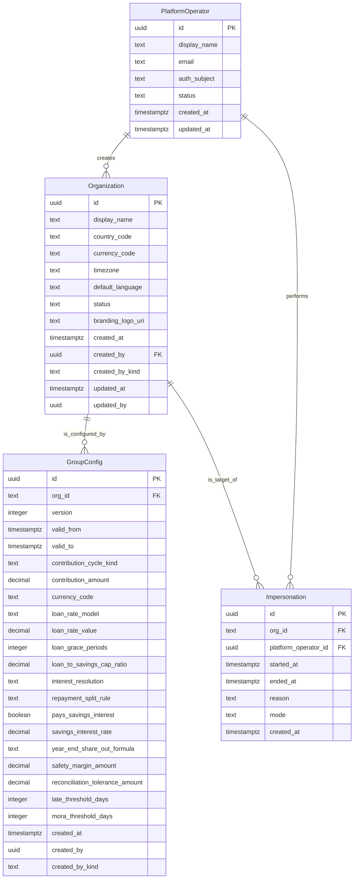
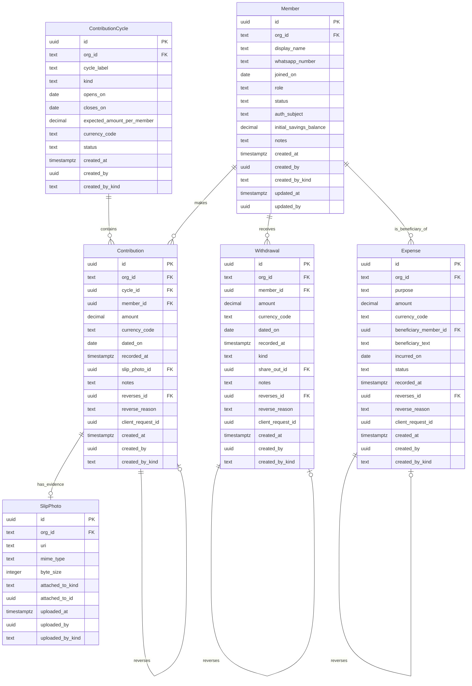
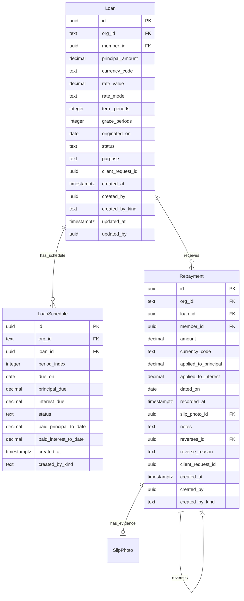
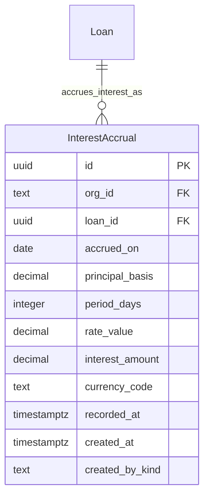
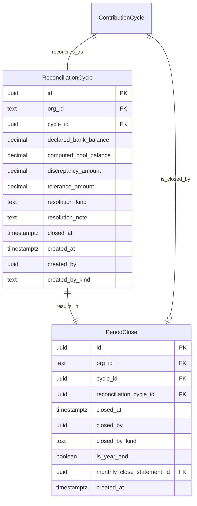
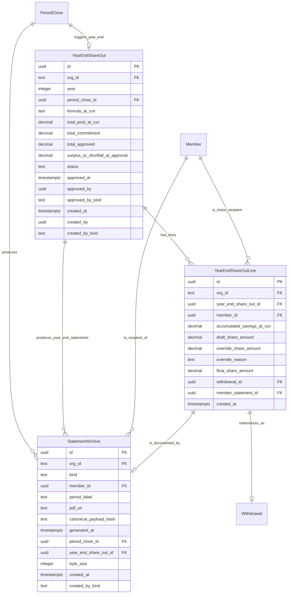
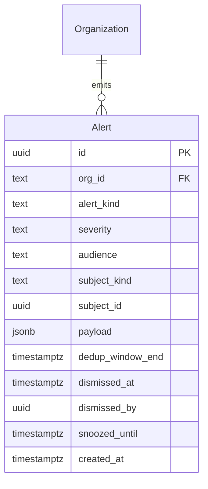
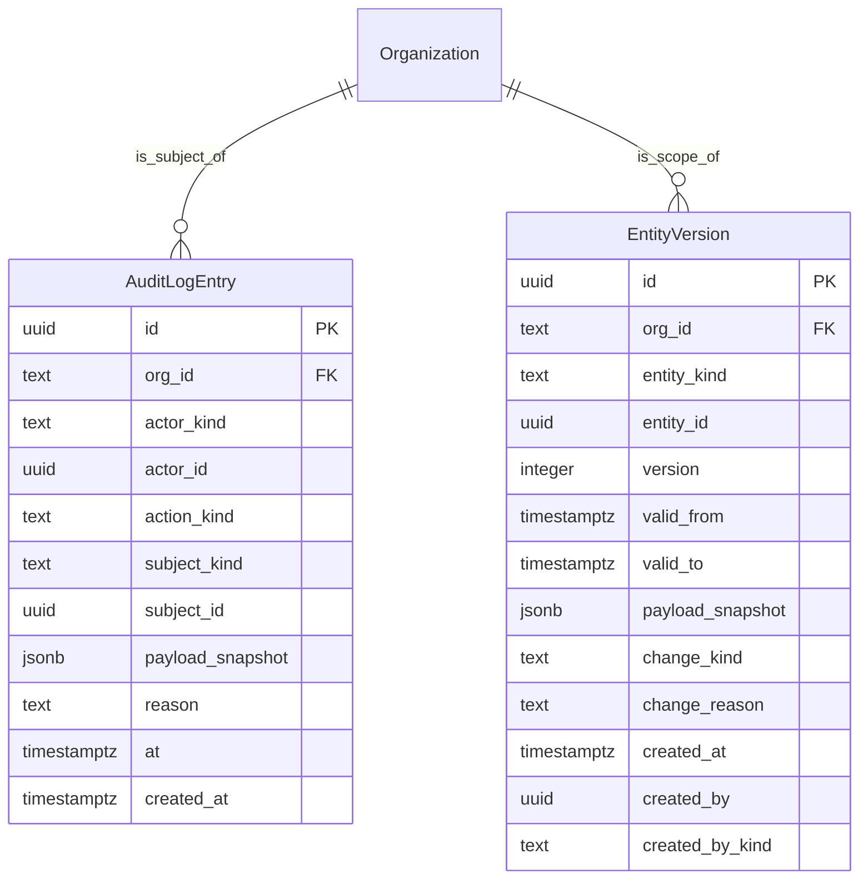
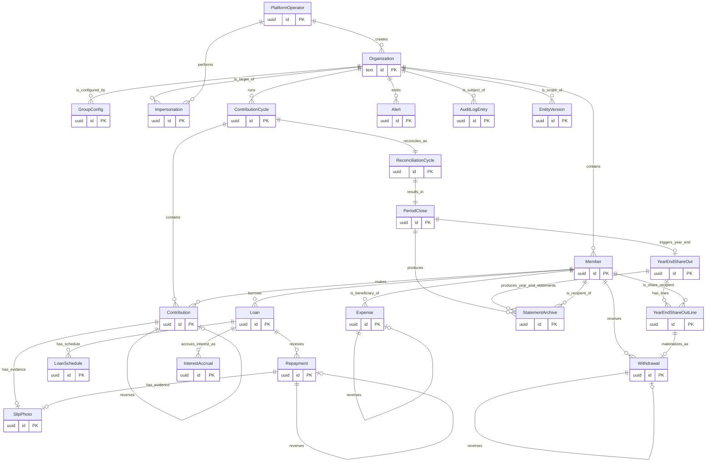

# 04 — ER Model: Mi Banquito

**Project:** Mi Banquito (`fcostudios__mi-banquito`)
**Step:** 4 — Entity-Relationship Model
**Date:** 2026-05-28
**Author:** Francisco Lomas (via Nous pipeline, `prompts/entity_relationship.md`)
**Report language:** en-US
**PRIOR_WORK:**
- `Nous/Specs/fcostudios/mi-banquito/PRODUCT_BRIEF.md`
- `Nous/Specs/fcostudios/mi-banquito/v1/01_research.md`
- `Nous/Specs/fcostudios/mi-banquito/v1/02_cx_personas.md` (4 personas)
- `Nous/Specs/fcostudios/mi-banquito/v1/03_cx_journeys.md` (4 journeys, 6+1 stage sets, entity seed in SEC12)
- `Nous/Specs/fcostudios/mi-banquito/v1/03b_service_blueprint.md` (20 processes, 9 bounded contexts, entity-ownership matrix in §8)

---

---SECTION: SEC0---

## ER Model Executive Summary

Mi Banquito is a **multi-tenant SaaS treasury system** for informal community savings & lending groups ("banquitos") in Ecuador (R1) and LATAM (R3+). The ER model below realizes the **9 bounded contexts** proposed in `03b_service_blueprint.md §8` as a single PostgreSQL schema, with **18 persisted entities** (17 owned by 8 contexts + 1 cross-context configuration entity) plus 2 derived views that are documented here for completeness but not persisted as ER entities (`member_compliance_state`, `liquidez_proyectada`).

The model's **non-negotiable design constraints** are: (i) **append-only ledger semantics** for every money-touching entity (`Contribution`, `Withdrawal`, `Repayment`, `InterestAccrual`, `Expense`) — no destructive edits, corrections are reversal entries with a `reverses_id` FK and a documented reason; (ii) **multi-tenant scoping via `org_id` on every row** — substrate-wide invariant from `PRODUCT_BRIEF.md` and forensic precedent in IMP-206/`03_cx_journeys.md §3.3`; (iii) **period-lock immutability** — once a `PeriodClose` is written, no entity with `dated_on ≤ closed_at` can be inserted or modified except as an explicit adjustment-period entry; (iv) **HR-1 versioning** (per IMP-105) on `GroupConfig`, `Member` status, and `Loan` lifecycle states via a `_history` companion table pattern.

Cross-cutting concerns covered in SEC6: standard audit fields on all entities; **append-only** semantics replace soft-delete for ledger entries (soft-delete applies only to `Member` lifecycle); `entity_versions` pattern for HR-1 compliance on mutable configuration entities; multi-tenancy via `org_id` FK + composite uniqueness `(org_id, natural_key)`; and the **audit-write-failure invariant** from `03b §7` — if `audit_log_entry` fails to persist, the originating action MUST roll back.

---

---SECTION: SEC1---

## Inputs Synthesis & Modeling Scope

### Inputs synthesis

- **`[SRC:RAW]` from `01_research.md`:** identifies the AS-IS process as paper + Excel + WhatsApp + bank; the TO-BE process as a single canonical electronic ledger with automated interest accrual, A/R aging, reconciliation, monthly close, and year-end share-out. Critical fixed-point entities surfaced: Organization (group), Member, Contribution, Loan, Repayment, Expense, AuditLog, StatementArchive.
- **`[SRC:PER]` from `02_cx_personas.md`:** 4 personas — Treasurer (P01) writes everything in the tenant scope; President (P02) and Member (P03) consume PDF artifacts via WhatsApp (no app login R1, no DB writes); Platform Operator (P04) operates at platform scope (org lifecycle, impersonation, data export). Important: P04's actions write to the same `audit_log_entry` table but with `actor_kind = 'platform_operator'`.
- **`[SRC:CJ]` from `03_cx_journeys.md` SEC12:** 16-entity seed enumerated; 6 tenant journey stages (S1–S6) + 7 platform substages (PA-S1..PA-S7); the entity catalog already names the entities used here.
- **`[SRC:CJ]` from `03b_service_blueprint.md`:** the entity-ownership matrix (§8) maps every entity to exactly one bounded context; the 20-process catalogue (§2) defines every entity's read/write surface; the cascade diagrams (§3) make the FK-chain explicit (e.g., `RecordContribution` writes `Contribution` + `AuditLogEntry`, then fires recomputes of derived views).
- **`[SRC:LEGACY]`:** none — greenfield project. SEC5 below confirms.

### Scope — in scope

- 18 persisted entities + 2 documented derived views, across 9 bounded contexts (`ledger_context`, `loan_context`, `interest_context`, `reconciliation_context`, `reporting_context`, `liquidity_context` [derived only], `alerts_context`, `audit_context`, `platform_context`).
- Standard audit fields, append-only ledger pattern, HR-1 versioning on mutable config, multi-tenant `org_id` scoping, period-lock invariant, cryptographic-hash integrity for statement archive.
- Reference relationships only — no cross-org FKs (all FKs constrained within an org by composite key).
- Indexes for: per-member balance derivation, A/R aging cron, daily interest accrual cron, reconciliation discrepancy detection, year-end share-out summation.

### Scope — out of scope (explicit)

- **Bank-API / Open-Banking integration** — out per `PRODUCT_BRIEF.md §Out of Scope (R1)`. Bank balance is manually entered into `reconciliation_cycle.declared_bank_balance`.
- **OCR on `slip_photo`** — out per R1 scope. Photo stored as blob URI; amount entered by treasurer.
- **Member-side login** — out R1; no `member_credentials` entity in R1. R2 will add it.
- **Multi-currency per org** — designed-for (every money entity has `currency_code`) but only USD ships in R1.
- **WhatsApp Business API integration** — out R1; channel remains manual.
- **Federated identity / SSO** — out R1; treasurer auth is local with magic link.
- **Encryption-at-rest for member PII** — deferred to R3 (no regulator-mandated requirement in R1 closed-group framing). `[OPEN_QUESTION]` if PCI/PII concerns surface earlier.

### Assumptions `[ASSUMPTION]`

- **A-ER-1.** PostgreSQL 16+ is the target DB engine (matches `nous-portal` substrate + `nous.db` choice).
- **A-ER-2.** All primary keys are `uuid v7` (time-ordered) for ledger entities to optimize index locality; `uuid v4` elsewhere. *(Open: confirm in Step 9 — `[OPEN_QUESTION]`.)*
- **A-ER-3.** All monetary amounts use `decimal(18,4)` to support 4-decimal-precision currencies and avoid floating-point drift. R1 USD only — `decimal(14,2)` would suffice, but `(18,4)` future-proofs for COP/MXN/PEN where decimals matter.
- **A-ER-4.** Timestamps are `timestamptz` (UTC stored; rendered per `Organization.timezone`).
- **A-ER-5.** The `entity_versions` table (from IMP-105 / HR-1) is reused as a generic version sink for `GroupConfig`, `Member` (status), and `Loan` (status). One row per change; payload is a JSON snapshot.
- **A-ER-6.** Cron-driven processes (`AccrueInterestDaily`, `RecomputeARAging`) use server-side scheduled jobs that read the `Organization.timezone` to determine "day boundary"; one cron tick per org per day. *(Alternative: a single global cron with per-org day-boundary computation. Resolved in Step 9.)*
- **A-ER-7.** No FK ever crosses `org_id` boundaries — every child entity carries its parent's `org_id` and a composite uniqueness `(org_id, …)` ensures cross-tenant safety. This is also enforced at query time per `03b §7 invariant 3`.

---

---SECTION: SEC2---

## Domain Decomposition & High-Level Entity Map

The 9 bounded contexts from `03b §8` are the data domains. Each context owns its entities; cross-context reads happen via FK (no shared writes).

| Domain | Entity | Brief business description | Source(s) |
|---|---|---|---|
| `platform_context` | `Organization` | A tenant (one banquito group); root of multi-tenant scoping | `[SRC:RAW]` `[SRC:PER]` `[SRC:CJ]` |
| `platform_context` | `GroupConfig` | Group rules: contribution amount, interest rate model, share-out formula, safety margin, reconciliation tolerance | `[SRC:CJ]` `03b §2 P1/P3/P5/P11` |
| `platform_context` | `PlatformOperator` | The FcoStudios SaaS-layer admin (P04); root of platform-side actor identity | `[SRC:PER]` `[SRC:CJ]` `02_cx_personas.md §SEC2 P04` |
| `platform_context` | `Impersonation` | Append-only record of read-only impersonation sessions by Platform Operator | `[SRC:CJ]` `03b §2 PA-S5` |
| `ledger_context` | `Member` | A person in a group (the "socia/socio/aportante"); the subject of every contribution, loan, statement | `[SRC:RAW]` `[SRC:CJ]` |
| `ledger_context` | `ContributionCycle` | A cycle (typically monthly) for the org's contributions | `[SRC:CJ]` |
| `ledger_context` | `Contribution` | A single member's contribution (append-only; reversed via new entry) | `[SRC:RAW]` `[SRC:CJ]` `03b §2 P1` |
| `ledger_context` | `Withdrawal` | A non-loan outflow to a member (refund on exit, year-end share-out payout) | `[SRC:CJ]` `03b §2 P2` |
| `ledger_context` | `Expense` | A non-member outflow; now **categorized** (bank_fee/supplies/shared/solidarity_payout/treasurer_comp/operating) — covers cases #1/#4/#5/#6 | `[SRC:CJ]` CHG-001 |
| `ledger_context` | `SlipPhoto` | Photo of a deposit / repayment slip stored as evidence | `[SRC:RAW]` `[SRC:CJ]` |
| `ledger_context` | `Account` | A money-holding account (group bank / cash box / treasurer-personal / external); group holds several | DEC-MB-001 CHG-001 |
| `ledger_context` | `Transfer` | Inter-account movement + **regularization** of deposits landed in a non-group account (crown jewel) | DEC-MB-001 CHG-001 |
| `ledger_context` | `ExtraordinaryCollection` (+`…Line`) | One-off solidarity collection (calamidad) → hold → payout | `[SRC:CJ]` CHG-001 |
| `loan_context` | `Loan` | A loan from the group's pool to a member | `[SRC:RAW]` `[SRC:CJ]` `03b §2 P3` |
| `loan_context` | `LoanSchedule` | The generated payment schedule of a loan | `[SRC:CJ]` `03b §2 P4` |
| `loan_context` | `Repayment` | A single repayment against a loan (append-only; split into principal + interest) | `[SRC:RAW]` `[SRC:CJ]` `03b §2 P6` |
| `interest_context` | `InterestAccrual` | A per-period (or per-day, per config) immutable accrual entry per outstanding loan | `[SRC:CJ]` `03b §2 P5` |
| `reconciliation_context` | `ReconciliationCycle` | One reconciliation event per cycle (declared bank balance + computed pool + discrepancy + resolution) | `[SRC:CJ]` `03b §2 P12` |
| `reconciliation_context` | `PeriodClose` | A cycle close event; locks all entries with `dated_on ≤ closed_at` as immutable | `[SRC:CJ]` `03b §2 P13` |
| `reporting_context` | `StatementArchive` | An immutable PDF artifact (monthly_close / monthly_member / year_end_member / year_end_share_out) with cryptographic hash | `[SRC:CJ]` `03b §2 P14/P15` |
| `reporting_context` | `YearEndShareOut` | The annual share-out event with per-member draft + overrides + approvals | `[SRC:CJ]` `03b §2 P16` |
| `reporting_context` | `YearEndShareOutLine` | Per-member line within a `YearEndShareOut` (treasurer-overridable) | `[SRC:CJ]` `[DERIVED_ENTITY]` from §SEC4 cardinality |
| `alerts_context` | `Alert` | Append-only record of a system alert (14-kind catalogue from `03b §6`) | `[SRC:CJ]` `03b §2 P17` |
| `audit_context` | `AuditLogEntry` | Every tenant write + every platform-operator action; foundation of dispute resolution | `[SRC:RAW]` `[SRC:CJ]` `03b §2 P18` |
| (cross-cutting) | `EntityVersion` | HR-1 / IMP-105 entity version sink (snapshots of `GroupConfig`, `Member` status, `Loan` status) | `[SRC:RAW]` (HR-1, IMP-105) |

**Note on `liquidity_context`.** Per `03b §8`, this context owns *derived views only* — `liquidez_proyectada` and `member_compliance_state` are materialized read-models, not persistent entities. They are documented in SEC6 as views and excluded from SEC3 entity catalogue + SEC7 diagrams. **`[ASSUMPTION] A-ER-8`** they are implemented as materialized views in PostgreSQL refreshed on the post-commit hooks defined in `03b §2 P7/P8/P9`; alternative is a true OLTP recomputation on read. Resolved in Step 9.

---

---SECTION: SEC3---

## Detailed Entity Catalogue

> **Standard audit attributes (applied to every entity unless overridden in the entity's "append-only" note).** Mutable entities carry: `created_at timestamptz NOT NULL DEFAULT now()`, `created_by uuid FK → PlatformOperator.id OR Treasurer.id NOT NULL` (resolved as polymorphic via `created_by_kind text` enum), `updated_at timestamptz NULL`, `updated_by uuid NULL` (same polymorphism). **Append-only entities** (Contribution, Withdrawal, Repayment, Expense, InterestAccrual, AuditLogEntry, StatementArchive, Alert, Impersonation, EntityVersion) carry only `created_at` + `created_by` — `updated_at`/`updated_by` are absent by design (the existence of a column invites a `UPDATE` which would violate append-only). **Treasurer identity in R1** is the `Member` row whose `role = 'tesorera'` AND whose `auth_subject` is non-null; no separate `Treasurer` entity is needed (sources: `02_cx_personas.md §SEC2 P01`, `03_cx_journeys.md §SEC4 S1`).

---

### `Organization`

- **Domain:** `platform_context`
- **Business purpose.** The tenant. Root of multi-tenant scoping. Each org = one banquito group with one bank account, one treasurer at a time, ~10–50 members.
- **Lifecycle.** Created at PA-S1 by Platform Operator `[SRC:CJ]`. Configured at PA-S2. Lifecycle states: `active`, `paused`, `archived`. Never deleted (archived only).
- **Flags.** `requires_versioning: no` (name change is rare; if needed, snapshot via EntityVersion). `has_soft_delete: yes` (status=archived = soft delete). `audit_required: yes`. `multi_tenant_scoped: n/a` (this IS the tenant root).

| Attribute | Type | PK/FK/IDX | Nullable | Description | Example | Source(s) |
|---|---|---|---|---|---|---|
| `id` | `uuid` | PK | no | Per-group tenant id (uuid v4, generated at provisioning). The Nous project key `fcostudios__mi-banquito` is a build-time substrate identifier (IMP-198) held in `nous.db` only — it is **not** stored on the runtime tenant row. | `e1d2c3b4-a5f6-4789-b012-3456789abcde` | `[SRC:RAW]` |
| `display_name` | `text` |  | no | Human-readable group name | `"Banquito Las Amigas"` | `[SRC:CJ]` |
| `country_code` | `text` (ISO-3166-1-alpha-2) |  | no | R1 = `EC` | `EC` | `[SRC:CJ]` |
| `currency_code` | `text` (ISO-4217) |  | no | R1 = `USD` | `USD` | `[SRC:RAW]` |
| `timezone` | `text` (IANA) |  | no | R1 = `America/Guayaquil` | `America/Guayaquil` | `[SRC:CJ]` |
| `default_language` | `text` (BCP-47) |  | no | R1 = `es-EC` | `es-EC` | `[SRC:CJ]` |
| `status` | `text` (enum) | IDX | no | `active / paused / archived` | `active` | `[SRC:CJ]` |
| `branding_logo_uri` | `text` |  | yes | Object-store URI for group logo (PDF footer) | `r2://logos/<uuid>.png` | `[SRC:CJ]` |
| `created_at` | `timestamptz` |  | no | (audit) | `2026-05-28T13:42:09Z` | `[SRC:RAW]` |
| `created_by` | `uuid` | FK => PlatformOperator.id | no | Platform Operator that created the org | … | `[SRC:CJ] PA-S1` |
| `created_by_kind` | `text` (enum) |  | no | `platform_operator` (always for org create) | `platform_operator` | `[SRC:CJ]` |
| `updated_at` | `timestamptz` |  | yes | (audit) | … | `[SRC:RAW]` |
| `updated_by` | `uuid` |  | yes | (audit) | … | `[SRC:RAW]` |

---

### `GroupConfig`

- **Domain:** `platform_context` (initial seed at PA-S2; treasurer edits subsequently — see `03b §8`).
- **Business purpose.** Group rules: contribution cycle amount + cadence, loan rate model + cap, share-out formula, safety margin, reconciliation tolerance, repayment split rule. Drives every domain process. Surfaced as the "Rules of the group" screen `[SRC:CJ] §SEC4 S1 TO-BE #5`.
- **Lifecycle.** Seeded at PA-S2; can be edited by Treasurer (R1) with each edit creating an `EntityVersion` snapshot; previous version's `valid_to` is set; new version is current.
- **Flags.** `requires_versioning: yes` (HR-1). `has_soft_delete: no`. `audit_required: yes`. `multi_tenant_scoped: yes`.

| Attribute | Type | PK/FK/IDX | Nullable | Description | Example | Source(s) |
|---|---|---|---|---|---|---|
| `id` | `uuid` | PK | no |  | … | — |
| `org_id` | `uuid` | FK => Organization.id, IDX | no | Tenant scope | `7b9e4c10-3a2f-4d51-9c8e-1f2a3b4c5d6e` | `[SRC:RAW]` |
| `version` | `integer` | UNIQUE(org_id, version) | no | Monotonic per-org version number | `2` | `[SRC:RAW]` (HR-1) |
| `valid_from` | `timestamptz` |  | no | When this version became current | … | HR-1 |
| `valid_to` | `timestamptz` |  | yes | Set when a newer version is created; NULL = current | … | HR-1 |
| `contribution_cycle_kind` | `text` (enum) |  | no | `monthly / weekly` | `monthly` | `[SRC:CJ]` |
| `contribution_amount` | `decimal(18,4)` |  | no | Per-cycle contribution amount per member | `50.0000` | `[SRC:CJ]` |
| `currency_code` | `text` |  | no | Denormalized from Organization for safety | `USD` | `A-ER-7` |
| `loan_rate_model` | `text` (enum) |  | no | R1 default: `flat_per_period`. Alternatives: `compound`, `simple_with_fee` (R2+) | `flat_per_period` | `[SRC:CJ]` `OQ-B1` |
| `loan_rate_value` | `decimal(8,4)` |  | no | E.g., 0.0200 = 2% per period | `0.0200` | `[SRC:CJ]` |
| `loan_grace_periods` | `integer` |  | no | Grace periods before interest accrues | `0` | `[SRC:CJ]` |
| `loan_to_savings_cap_ratio` | `decimal(4,2)` |  | no | E.g., 3.00 = max loan is 3× member's savings | `3.00` | `[SRC:CJ]` |
| `interest_resolution` | `text` (enum) |  | no | `per_period / daily`. R1 default: `per_period` per `OQ-B2` | `per_period` | `[SRC:CJ]` `OQ-B2` |
| `repayment_split_rule` | `text` (enum) |  | no | `interest_first / principal_first / even_split` | `interest_first` | `[SRC:CJ]` |
| `pays_savings_interest` | `boolean` |  | no | R1 default `false` per `OQ-B3` — many informal banquitos don't | `false` | `[SRC:CJ]` `OQ-B3` |
| `savings_interest_rate` | `decimal(8,4)` |  | yes | Only relevant if `pays_savings_interest = true` | `NULL` | `[SRC:CJ]` |
| `year_end_share_out_formula` | `text` (enum) |  | yes | **DEPRECATED (CHG-004)** — the year-end model is now **two-pool** (BR-21): pool-split % lives in `config.distribution {loan_pct, savings_pct}` and reparto/reserva on `SurplusGovernanceDecision`. Retained nullable for back-compat; not read by the two-pool engine. | `NULL` | CHG-004 |
| `safety_margin_amount` | `decimal(18,4)` |  | no | Floor for liquidity projector alerts | `1000.0000` | `[SRC:CJ]` `OQ-B5` |
| `reconciliation_tolerance_amount` | `decimal(18,4)` |  | no | E.g., 1.00 — discrepancy below this can be auto-annotated | `1.0000` | `[SRC:CJ]` |
| `late_threshold_days` | `integer` |  | no | E.g., 14 — days after due before `atrasado` | `14` | `[SRC:CJ]` |
| `mora_threshold_days` | `integer` |  | no | E.g., 30 — days after due before `en_mora` | `30` | `[SRC:CJ]` |
| `config` | `jsonb` |  | no | **(CHG-002 / arch D-ARCH-1)** Versioned rule-param namespaces for the rule-driven long-tail: `config.mora` `{mechanic ∈ flat_per_day\|pct_of_installment\|flat_amount\|pct_per_period, per_day_amount, cap:{kind ∈ overdue_installment\|flat_max\|pct_of_principal\|none, value}, day_count ∈ calendar\|business, scope ∈ loans\|loans_and_savings, feeds_surplus}`; `config.distribution` reserved (CHG-004). Typed via a zod `RuleConfig` schema (write+read validation); platform defaults merged at read (defaults-at-read for absent keys on old versions). Hot/MV/RLS values (thresholds above) stay as typed columns. | `{"mora":{"mechanic":"flat_per_day","per_day_amount":0.2500,"cap":{"kind":"overdue_installment"},"day_count":"calendar","scope":"loans","feeds_surplus":true}}` | D-ARCH-1 |
| `created_at` | `timestamptz` |  | no | (audit) |  | `[SRC:RAW]` |
| `created_by` | `uuid` | FK polymorphic | no | (audit) |  | `[SRC:CJ]` |
| `created_by_kind` | `text` (enum) |  | no | `platform_operator / member` | `member` | `[SRC:CJ]` |

---

### `PlatformOperator`

- **Domain:** `platform_context`
- **Business purpose.** The FcoStudios SaaS-layer admin (P04). One row per operator. R1: a single super-user (Francisco Lomas).
- **Lifecycle.** Created at substrate-init; no in-app self-service. R2: multi-operator roles.
- **Flags.** `requires_versioning: no`. `has_soft_delete: yes`. `audit_required: yes`. `multi_tenant_scoped: no` (platform-level).

| Attribute | Type | PK/FK/IDX | Nullable | Description | Example | Source(s) |
|---|---|---|---|---|---|---|
| `id` | `uuid` | PK | no |  |  | — |
| `display_name` | `text` |  | no |  | `"Francisco Lomas"` | `[SRC:PER]` P04 |
| `email` | `text` | UNIQUE | no |  | `fcolomas@gmail.com` | `[SRC:PER]` |
| `auth_subject` | `text` | UNIQUE | yes | Magic-link auth subject id | … | A-ER-1 |
| `status` | `text` (enum) | IDX | no | `active / disabled` | `active` | `[SRC:CJ]` |
| `created_at` | `timestamptz` |  | no |  |  | `[SRC:RAW]` |
| `updated_at` | `timestamptz` |  | yes |  |  | `[SRC:RAW]` |

---

### `Impersonation`

- **Domain:** `platform_context`
- **Business purpose.** Append-only record of read-only impersonation sessions where a Platform Operator views a tenant as if they were that tenant's treasurer. R1 is **read-only** (no writes); R2 may allow write impersonation with explicit role-switch. Each session emits an `AuditLogEntry` at start AND end.
- **Lifecycle.** Created at PA-S5 start; `ended_at` set on session close.
- **Flags.** `requires_versioning: no`. `has_soft_delete: no` (append-only). `audit_required: yes`. `multi_tenant_scoped: yes` (cross-tenant by nature; `org_id` is the *target* tenant).

| Attribute | Type | PK/FK/IDX | Nullable | Description | Example | Source(s) |
|---|---|---|---|---|---|---|
| `id` | `uuid` | PK | no |  |  | — |
| `org_id` | `uuid` | FK => Organization.id, IDX | no | The tenant being impersonated | `7b9e4c10-3a2f-4d51-9c8e-1f2a3b4c5d6e` | `[SRC:CJ]` |
| `platform_operator_id` | `uuid` | FK => PlatformOperator.id | no | Who is impersonating | … | `[SRC:CJ]` |
| `started_at` | `timestamptz` |  | no |  |  | `[SRC:CJ]` |
| `ended_at` | `timestamptz` |  | yes | NULL = still active | … | `[SRC:CJ]` |
| `reason` | `text` |  | no | Free-text reason (required for audit defensibility) | `"Support ticket #12 — treasurer can't see Maria's balance"` | `[SRC:CJ]` |
| `mode` | `text` (enum) |  | no | R1: `read_only`. R2: `read_only / write_with_explicit_switch` | `read_only` | `03b §8 invariant 6` |
| `created_at` | `timestamptz` |  | no |  |  | — |

---

### `UserAccount`

- **Domain:** `platform_context`. **Org-independent identity** (CHG-008; O11 = app-DB, not Auth0 orgs). Mirrors the HR-42 field discipline by design (it is NOT bound by HR-42 — that governs the `nous.db` substrate table, not this app's model).
- **Business purpose.** One human (a treasurer) who may manage **multiple banquito groups**. Decouples identity from a single org — the lifted `Member.auth_subject` UNIQUE blocker. Identity (auth subject, email) lives here; the groups they manage are `UserOrgMembership` rows.
- **Lifecycle.** **Greenfield** (no app access today — the truth is the written notebooks): provisioned once per treasurer at launch with N `UserOrgMembership` rows; **no identity-merge migration**.
- **Flags.** `requires_versioning: no`. `has_soft_delete: yes` (status=disabled). `audit_required: yes`. `multi_tenant_scoped: no`.

| Attribute | Type | PK/FK/IDX | Nullable | Description | Example | Source(s) |
|---|---|---|---|---|---|---|
| `id` | `uuid` | PK | no |  |  | — |
| `auth_subject` | `text` | UNIQUE | no | Magic-link subject (the cross-org identity anchor) | … | CHG-008 |
| `email` | `text` | UNIQUE | no |  | `monica@…` | CHG-008 |
| `display_name` | `text` |  | no |  | `"Mónica Beltrán"` | CHG-008 |
| `status` | `text` (enum) | IDX | no | `active / disabled` | `active` | CHG-008 |
| `created_at` | `timestamptz` |  | no |  |  | — |
| `updated_at` | `timestamptz` |  | yes |  |  | — |

---

### `UserOrgMembership`

- **Domain:** `platform_context`. **Spans orgs by nature** (`multi_tenant_scoped: no`; precedent `Impersonation`). **HR-1 versioned** (grant/revoke history).
- **Business purpose.** The user↔org many-to-many: which groups a user manages + their per-group role. The **active group** is resolved from — and **re-validated server-side against** — this set before any `SET app.current_org` (BR-25; the cross-group-leakage guard).
- **Lifecycle.** Created when a user is granted a group (operator-provisioned per O13); revoke sets `status`. Grant/revoke → `EntityVersion`.
- **Flags.** `requires_versioning: yes` (HR-1). `has_soft_delete: no` (status=revoked). `audit_required: yes`. `multi_tenant_scoped: no`.

| Attribute | Type | PK/FK/IDX | Nullable | Description | Example | Source(s) |
|---|---|---|---|---|---|---|
| `id` | `uuid` | PK | no |  |  | — |
| `user_id` | `uuid` | FK => UserAccount.id, IDX | no |  |  | CHG-008 |
| `org_id` | `uuid` | FK => Organization.id, IDX | no | The group (one of the user's banquitos) | `7b9e4c10-3a2f-4d51-9c8e-1f2a3b4c5d6e` | CHG-008 |
| `role` | `text` (enum) | IDX | no | `tesorera / presidente / secretaria` (per-group) | `tesorera` | CHG-008 |
| `status` | `text` (enum) |  | no | `active / revoked` | `active` | CHG-008 |
| `member_id` | `uuid` | FK => Member.id | yes | The user's `Member` row in that org (links identity ↔ ledger subject) | … | CHG-008 |
| `granted_at` | `timestamptz` |  | no |  |  | — |
| `revoked_at` | `timestamptz` |  | yes |  |  | — |
| — | — | UNIQUE(user_id, org_id) | — | One membership per (user, group) |  | CHG-008 |

---

### `Member`

- **Domain:** `ledger_context`
- **Business purpose.** A person in a group. Subject of every Contribution, Loan, Repayment, Withdrawal. The treasurer (P01) is also a Member row with `role = 'tesorera'` AND `auth_subject` non-null. The president (P02) is a Member with `role = 'presidente'` (no auth_subject in R1 — they consume PDFs over WhatsApp).
- **Lifecycle.** Admitted at S1 step 1 `[SRC:CJ]`. Status transitions: `activo → en_pausa → activo` (or `→ baja`). `baja` is a soft-delete state — never `DELETE`. Status changes versioned via `EntityVersion`.
- **Flags.** `requires_versioning: yes` (status transitions). `has_soft_delete: yes` (status=baja). `audit_required: yes`. `multi_tenant_scoped: yes`.

| Attribute | Type | PK/FK/IDX | Nullable | Description | Example | Source(s) |
|---|---|---|---|---|---|---|
| `id` | `uuid` | PK | no |  |  | — |
| `org_id` | `uuid` | FK => Organization.id, IDX | no | Tenant scope; UNIQUE(org_id, display_name) NOT enforced (homonyms possible) | `7b9e4c10-3a2f-4d51-9c8e-1f2a3b4c5d6e` | `[SRC:RAW]` |
| `display_name` | `text` |  | no | As the treasurer types it | `"María González"` | `[SRC:CJ]` |
| `whatsapp_number` | `text` |  | yes | E.164; nullable for legacy members | `+593987654321` | `[SRC:CJ]` |
| `joined_on` | `date` |  | no | Defaults to today | `2026-05-28` | `[SRC:CJ]` |
| `role` | `text` (enum) | IDX | no | `aportante / tesorera / presidente / secretaria` | `aportante` | `[SRC:CJ]` `[SRC:PER]` |
| `status` | `text` (enum) | IDX | no | `activo / en_pausa / baja` | `activo` | `[SRC:CJ]` |
| `auth_subject` | `text` | IDX | yes | **(CHG-008) No longer globally UNIQUE** — identity now lives on `UserAccount.auth_subject`; the user↔org link is `UserOrgMembership`. Kept as a denormalized per-org pointer for back-compat. | … | CHG-008 |
| `initial_savings_balance` | `decimal(18,4)` |  | no | Captured at admission (default 0) | `0.0000` | `[SRC:CJ]` |
| `notes` | `text` |  | yes | Free-text | … | `[SRC:CJ]` |
| `created_at` | `timestamptz` |  | no |  |  | — |
| `created_by` | `uuid` | FK polymorphic | no | The treasurer who admitted them |  | `[SRC:CJ] S1` |
| `created_by_kind` | `text` (enum) |  | no | `member` (always — the treasurer who is a member with `role=tesorera`) | `member` | `[SRC:CJ]` |
| `updated_at` | `timestamptz` |  | yes |  |  | — |
| `updated_by` | `uuid` | FK polymorphic | yes |  |  | — |

---

### `ContributionCycle`

- **Domain:** `ledger_context`
- **Business purpose.** A cycle (typically monthly) for the org's contributions. Created automatically at cycle start (`SYS_Ledger`).
- **Lifecycle.** Status: `open / closed`. Closed when `PeriodClose` writes against it.
- **Flags.** `requires_versioning: no`. `has_soft_delete: no`. `audit_required: yes`. `multi_tenant_scoped: yes`.

| Attribute | Type | PK/FK/IDX | Nullable | Description | Example | Source(s) |
|---|---|---|---|---|---|---|
| `id` | `uuid` | PK | no |  |  | — |
| `org_id` | `uuid` | FK => Organization.id, IDX | no |  |  | `[SRC:RAW]` |
| `cycle_label` | `text` | UNIQUE(org_id, cycle_label) | no | E.g., `2026-05` (monthly) or `2026-W22` (weekly) | `2026-05` | `[SRC:CJ]` |
| `kind` | `text` (enum) |  | no | `monthly / weekly` (denormalized from GroupConfig at creation time) | `monthly` | `[SRC:CJ]` |
| `opens_on` | `date` |  | no |  | `2026-05-01` | `[SRC:CJ]` |
| `closes_on` | `date` |  | no |  | `2026-05-31` | `[SRC:CJ]` |
| `expected_amount_per_member` | `decimal(18,4)` |  | no | Denormalized from GroupConfig at cycle creation | `50.0000` | `[SRC:CJ]` |
| `currency_code` | `text` |  | no | Denormalized | `USD` | `[SRC:RAW]` |
| `status` | `text` (enum) | IDX | no | `open / closed` | `open` | `[SRC:CJ]` |
| `created_at` | `timestamptz` |  | no |  |  | — |
| `created_by` | `uuid` | FK polymorphic | no | `SYS_Ledger` (system actor) at auto-creation, or treasurer for manual open | … | `[SRC:CJ]` |
| `created_by_kind` | `text` (enum) |  | no | `system / member` | `system` | `[SRC:CJ]` |

---

### `Contribution`

- **Domain:** `ledger_context`. **Append-only.**
- **Business purpose.** A single member's contribution within a cycle. Per `RecordContribution` (Process P1).
- **Lifecycle.** Created by treasurer at S2 step `TB_S2_2`. **Never updated, never deleted.** Corrections = a new `Contribution` row with `reverses_id` FK and `reason`.
- **Flags.** `requires_versioning: no` (append-only). `has_soft_delete: no` (append-only). `audit_required: yes`. `multi_tenant_scoped: yes`.

| Attribute | Type | PK/FK/IDX | Nullable | Description | Example | Source(s) |
|---|---|---|---|---|---|---|
| `id` | `uuid` (v7) | PK | no |  |  | A-ER-2 |
| `org_id` | `uuid` | FK => Organization.id, IDX | no |  |  | `[SRC:RAW]` |
| `cycle_id` | `uuid` | FK => ContributionCycle.id, IDX | no |  |  | `[SRC:CJ]` |
| `member_id` | `uuid` | FK => Member.id, IDX | no |  |  | `[SRC:CJ]` |
| `amount` | `decimal(18,4)` |  | no |  | `50.0000` | `[SRC:CJ]` |
| `currency_code` | `text` |  | no |  | `USD` | A-ER-7 |
| `dated_on` | `date` | IDX | no | The bank-credit date (for reconciliation) | `2026-05-12` | `[SRC:CJ]` |
| `recorded_at` | `timestamptz` |  | no | When system wrote the row | … | `[SRC:CJ]` |
| `slip_photo_id` | `uuid` | FK => SlipPhoto.id | yes | Optional evidence | … | `[SRC:CJ]` `P11 alert` |
| `notes` | `text` |  | yes |  |  | `[SRC:CJ]` |
| `reverses_id` | `uuid` | FK => Contribution.id | yes | Self-FK; non-null = this is a reversal of an earlier contribution | … | `03b §7 invariant 1` |
| `reverse_reason` | `text` |  | yes | Required when `reverses_id` is non-null | `"Aporte duplicado, ver fila #4321"` | `[SRC:CJ]` |
| `client_request_id` | `uuid` | UNIQUE(org_id, client_request_id), yes | yes | For idempotent retries `03b §2 P1` | … | `03b §2 P1` |
| `created_at` | `timestamptz` |  | no |  |  | — |
| `created_by` | `uuid` | FK polymorphic | no | Treasurer who recorded |  | `[SRC:CJ]` |
| `created_by_kind` | `text` (enum) |  | no | `member` (treasurer is a member) | `member` | `[SRC:CJ]` |

---

### `Withdrawal`

- **Domain:** `ledger_context`. **Append-only.** Same pattern as `Contribution`.
- **Business purpose.** A non-loan outflow to a member: refund on exit, year-end share-out payout, etc.
- **Lifecycle.** Created by treasurer OR by `SYS_ShareOutEngine` at year-end (P16). Never updated.

| Attribute | Type | PK/FK/IDX | Nullable | Description | Example | Source(s) |
|---|---|---|---|---|---|---|
| `id` | `uuid` (v7) | PK | no |  |  | — |
| `org_id` | `uuid` | FK => Organization.id, IDX | no |  |  | `[SRC:RAW]` |
| `member_id` | `uuid` | FK => Member.id, IDX | no |  |  | `[SRC:CJ]` |
| `amount` | `decimal(18,4)` |  | no |  |  | `[SRC:CJ]` |
| `currency_code` | `text` |  | no |  | `USD` | A-ER-7 |
| `dated_on` | `date` | IDX | no | Bank-debit date | `2026-12-31` | `[SRC:CJ]` |
| `recorded_at` | `timestamptz` |  | no |  |  | — |
| `kind` | `text` (enum) |  | no | `member_refund / year_end_share_out / other` | `year_end_share_out` | `[SRC:CJ]` |
| `share_out_id` | `uuid` | FK => YearEndShareOut.id | yes | Set when `kind = year_end_share_out` | … | `[SRC:CJ]` |
| `notes` | `text` |  | yes |  |  | — |
| `reverses_id` | `uuid` | FK => Withdrawal.id | yes |  |  | `03b §7 invariant 1` |
| `reverse_reason` | `text` |  | yes |  |  | — |
| `client_request_id` | `uuid` | UNIQUE(org_id, client_request_id), yes | yes |  |  | `03b §2 P2` |
| `created_at` | `timestamptz` |  | no |  |  | — |
| `created_by` | `uuid` | FK polymorphic | no |  |  | — |
| `created_by_kind` | `text` (enum) |  | no | `member / system` | `system` | `[SRC:CJ]` |

---

### `Expense`

- **Domain:** `ledger_context`. **Append-only.**
- **Business purpose.** Non-member outflow (group event, supplies, reimbursement).
- **Lifecycle.** Created by treasurer. Status (`planned / paid`) lets the cash-flow projector treat `planned` as a future outflow.

| Attribute | Type | PK/FK/IDX | Nullable | Description | Example | Source(s) |
|---|---|---|---|---|---|---|
| `id` | `uuid` (v7) | PK | no |  |  | — |
| `org_id` | `uuid` | FK => Organization.id, IDX | no |  |  | `[SRC:RAW]` |
| `purpose` | `text` |  | no |  | `"Cena de fin de año"` | `[SRC:CJ]` |
| `amount` | `decimal(18,4)` |  | no |  | `120.0000` | `[SRC:CJ]` |
| `currency_code` | `text` |  | no |  | `USD` | A-ER-7 |
| `beneficiary_member_id` | `uuid` | FK => Member.id | yes | If the expense is a reimbursement to a member | … | `[SRC:CJ]` |
| `beneficiary_text` | `text` |  | yes | Free-text if not a member (vendor, supplier) | `"Catering Las Rosas"` | `[SRC:CJ]` |
| `incurred_on` | `date` | IDX | no |  | `2026-12-15` | `[SRC:CJ]` |
| `status` | `text` (enum) | IDX | no | `planned / paid` | `planned` | `[SRC:CJ]` `03b §5 inputs` |
| `recorded_at` | `timestamptz` |  | no |  |  | — |
| `reverses_id` | `uuid` | FK => Expense.id | yes |  |  | `03b §7 invariant 1` |
| `reverse_reason` | `text` |  | yes |  |  | — |
| `client_request_id` | `uuid` | UNIQUE(org_id, client_request_id), yes | yes |  |  | — |
| `created_at` | `timestamptz` |  | no |  |  | — |
| `created_by` | `uuid` | FK polymorphic | no |  |  | — |
| `created_by_kind` | `text` (enum) |  | no | `member` (treasurer) | `member` | `[SRC:CJ]` |

---

### `SlipPhoto`

- **Domain:** `ledger_context`. **Append-only.**
- **Business purpose.** Photo of a deposit / repayment slip stored in object storage. Lifecycle bound to its `Contribution` or `Repayment`.
- **Lifecycle.** Created when treasurer attaches a photo at S2 / S3. Never deleted (per `03b §7 invariant 1`).

| Attribute | Type | PK/FK/IDX | Nullable | Description | Example | Source(s) |
|---|---|---|---|---|---|---|
| `id` | `uuid` (v7) | PK | no |  |  | — |
| `org_id` | `uuid` | FK => Organization.id, IDX | no |  |  | `[SRC:RAW]` |
| `uri` | `text` |  | no | Object-store URI | `r2://slips/<uuid>.jpg` | `[SRC:CJ]` |
| `mime_type` | `text` |  | no |  | `image/jpeg` | A-ER-1 |
| `byte_size` | `integer` |  | no |  | `345678` | A-ER-1 |
| `attached_to_kind` | `text` (enum) |  | no | `contribution / repayment` | `contribution` | `[SRC:CJ]` |
| `attached_to_id` | `uuid` |  | no | Polymorphic FK; integrity enforced at app layer (or via partial unique indexes) | … | A-ER-1 |
| `uploaded_at` | `timestamptz` |  | no |  |  | — |
| `uploaded_by` | `uuid` | FK polymorphic | no |  |  | — |
| `uploaded_by_kind` | `text` (enum) |  | no | `member` (treasurer) | `member` | `[SRC:CJ]` |

---

<!-- ───────────────────────── CHG-001 — Treasury adjustments / multi-account ───────────────────────── -->

### `Country`

- **Domain:** `platform_context`. **Reference data** (admin-maintained; maintenance UI deferred R3+). Shared across the deployment — not per-org.
- **Business purpose.** Reference list of countries for financial institutions (CHG-006). Seeded with Ecuador now.
- **Flags.** `requires_versioning: no`. `has_soft_delete: no`. `audit_required: no`. `multi_tenant_scoped: no` (shared reference).

| Attribute | Type | PK/FK/IDX | Nullable | Description | Example | Source(s) |
|---|---|---|---|---|---|---|
| `id` | `uuid` | PK | no |  |  | — |
| `iso2` | `text` | UNIQUE | no | ISO-3166 alpha-2 | `EC` | CHG-006 |
| `iso3` | `text` |  | no | ISO-3166 alpha-3 | `ECU` | CHG-006 |
| `name` | `text` |  | no |  | `Ecuador` | CHG-006 |
| `currency_code` | `text` |  | no |  | `USD` | CHG-006 |
| `created_at` | `timestamptz` |  | no |  |  | — |

---

### `Institution`

- **Domain:** `platform_context`. **Reference data** (admin-maintained; maintenance UI deferred R3+). Shared across the deployment — not per-org.
- **Business purpose.** Reference list of banks/cooperatives for `Account.institution_id` (CHG-006). **Ecuador seed:** Banco Pichincha, Banco Guayaquil, Banco Produbanco, Cooperativa Andalucía, Cooperativa 29 de Octubre.
- **Flags.** `requires_versioning: no`. `has_soft_delete: no` (status `active/inactive`). `audit_required: no`. `multi_tenant_scoped: no`.

| Attribute | Type | PK/FK/IDX | Nullable | Description | Example | Source(s) |
|---|---|---|---|---|---|---|
| `id` | `uuid` | PK | no |  |  | — |
| `country_id` | `uuid` | FK => Country.id, IDX | no |  | … | CHG-006 |
| `name` | `text` |  | no |  | `Banco Pichincha` | CHG-006 |
| `kind` | `text` (enum) | IDX | no | `bank / coop / other` | `bank` | CHG-006 |
| `swift_bic` | `text` |  | yes |  | `PICHECEQ` | CHG-006 |
| `status` | `text` (enum) |  | no | `active / inactive` | `active` | CHG-006 |
| `created_at` | `timestamptz` |  | no |  |  | — |

---

### `Account`

- **Domain:** `ledger_context`. **Mutable + HR-1 versioned** (`_history` companion).
- **Business purpose.** A money-holding account the group operates through. The group holds **several**: its own bank account(s), a cash box, and external/treasurer-personal holding accounts. Every money movement references the account it touched, and a deposit that lands in a **non-group** account is held `pending` until regularized into a group account (the crown-jewel reconciliation — DEC-MB-001). `[SRC:CJ]` (operator 2026-05-29)

| Attribute | Type | PK/FK/IDX | Nullable | Description | Example | Source(s) |
|---|---|---|---|---|---|---|
| `id` | `uuid` (v7) | PK | no |  |  | — |
| `org_id` | `uuid` | FK => Organization.id, IDX | no |  |  | `[SRC:RAW]` |
| `name` | `text` |  | no |  | `"Cuenta del grupo · Banco Pichincha"` | DEC-MB-001 |
| `type` | `text` (enum) | IDX | no | `group_bank / cash_box / treasurer_personal / external` | `group_bank` | DEC-MB-001 |
| `is_group_fund` | `boolean` | IDX | no | True for accounts that ARE the group fund; deposits to a non-group-fund account are `pending` | `true` | DEC-MB-001 |
| `last4` | `text` |  | yes | Last 4 digits for statements/public-verify | `4821` | `03b` |
| `product_type` | `text` (enum) |  | yes | **(CHG-006)** `savings / checking` — bank product type; NULL for `cash_box`/`treasurer_personal` | `savings` | CHG-006 |
| `institution_id` | `uuid` | FK => Institution.id | yes | **(CHG-006)** Financial institution; NULL for cash box / non-bank | … | CHG-006 |
| `status` | `text` (enum) |  | no | `active / archived` | `active` | — |
| `created_at` | `timestamptz` |  | no |  |  | — |
| `created_by` | `uuid` | FK polymorphic | no |  |  | — |

---

### `Transfer`

- **Domain:** `ledger_context`. **Append-only.**
- **Business purpose.** An inter-account movement of group money. Covers (a) ordinary transfers between group accounts, and (b) **regularization** — when a contribution/repayment/collection landed in a non-group account (e.g. the treasurer's personal account), a `Transfer` into a group account regularizes it and flips the source movement's `reconciliation_status` to `regularized`. `03b §2 P2`, DEC-MB-001

| Attribute | Type | PK/FK/IDX | Nullable | Description | Example | Source(s) |
|---|---|---|---|---|---|---|
| `id` | `uuid` (v7) | PK | no |  |  | — |
| `org_id` | `uuid` | FK => Organization.id, IDX | no |  |  | `[SRC:RAW]` |
| `from_account_id` | `uuid` | FK => Account.id, IDX | no |  |  | DEC-MB-001 |
| `to_account_id` | `uuid` | FK => Account.id, IDX | no |  |  | DEC-MB-001 |
| `amount` | `decimal(18,4)` |  | no |  | `680.0000` | `[SRC:CJ]` |
| `currency_code` | `text` |  | no |  | `USD` | A-ER-7 |
| `dated_on` | `date` | IDX | no |  | `2026-05-03` | `[SRC:CJ]` |
| `purpose` | `text` |  | yes | `transfer / regularization / bank_settlement` | `regularization` | DEC-MB-001 |
| `regularizes_kind` | `text` (enum) |  | yes | What this transfer regularizes: `contribution / repayment / extraordinary_collection` | `contribution` | DEC-MB-001 |
| `regularizes_id` | `uuid` |  | yes | Polymorphic FK to the pending source movement | … | DEC-MB-001 |
| `slip_photo_id` | `uuid` | FK => SlipPhoto.id | yes |  |  | `03b §7` |
| `reverses_id` | `uuid` | FK => Transfer.id | yes | Corrections via reversal (append-only) | | `03b §7 invariant 1` |
| `created_at` | `timestamptz` |  | no |  |  | — |
| `created_by` | `uuid` | FK polymorphic | no | Treasurer (member) | | `[SRC:CJ]` |

---

### `ExtraordinaryCollection`

- **Domain:** `ledger_context`. **Mutable lifecycle** (status machine; lines are append-only).
- **Business purpose.** A one-off collection outside the regular cycle — e.g. a **cuota extraordinaria** to help a member with a **calamidad doméstica** (solidarity). Lifecycle: `open → collecting → paid_out → closed`; the payout (a categorized `Expense`) must be `≤` total collected (BR-14). `[SRC:CJ]` (operator 2026-05-29)

| Attribute | Type | PK/FK/IDX | Nullable | Description | Example | Source(s) |
|---|---|---|---|---|---|---|
| `id` | `uuid` (v7) | PK | no |  |  | — |
| `org_id` | `uuid` | FK => Organization.id, IDX | no |  |  | `[SRC:RAW]` |
| `kind` | `text` (enum) | IDX | no | `solidarity` (calamidad) / `treasurer_recognition` (pago por gestión) — the discriminator BR-15 sums for the treasurer-comp ceiling | `solidarity` | BR-14/BR-15 |
| `purpose` | `text` |  | no |  | `"Calamidad doméstica — Manuela"` | `[SRC:CJ]` |
| `beneficiary_member_id` | `uuid` | FK => Member.id | yes | The socia being helped (null if external/group purpose) | … | `[SRC:CJ]` |
| `target_amount` | `decimal(18,4)` |  | yes | Suggested per-member or total target | `70.0000` | `[SRC:CJ]` |
| `status` | `text` (enum) | IDX | no | `open / collecting / paid_out / closed / cancelled` — `cancelled` requires a documented disposition (return Transfer to contributors, or a group-voted retention that enters the fund); a collection cannot sit in `collecting` indefinitely with regularized money and no payout (BR-14) | `collecting` | BR-14 |
| `opened_on` | `date` | IDX | no |  | `2026-05-10` | `[SRC:CJ]` |
| `paid_out_expense_id` | `uuid` | FK => Expense.id | yes | The solidarity payout (Expense, category=`solidarity_payout`) | … | BR-14 |
| `surplus_amount` | `decimal(18,4)` |  | yes | Set exactly once at the transition to `closed` or `cancelled`: `Σ(regularized lines) − payout` (payout = 0 for `cancelled`). NULL while `open`/`collecting`/`paid_out` (CHG-011) | `12.5000` | BR-14/CHG-011 |
| `disposition` | `text` (enum) |  | yes | `returned` / `retained` — REQUIRED (transition rule, not column constraint) when `surplus_amount > 0` at close AND always on `cancelled` with regularized funds; NULL when surplus = 0 (CHG-011: "no silent surplus", mirrors `YearEndShareOutLine.disposition`) | `returned` | BR-14/CHG-011 |
| `disposition_motive` | `text` |  | yes | Free text; REQUIRED when `disposition = retained` (the group-vote reference) | `"Voto 2026-06: retener para fondo"` | BR-14/CHG-011 |
| `surplus_transfer_id` | `uuid` | FK => Transfer.id, UNIQUE (`uq_collection_surplus_transfer_once`) | yes | REQUIRED when `disposition = returned` — links the **single aggregate** return `Transfer` (`purpose = collection_surplus_return`) from a group-fund account to ONE active same-org NON-group return-channel account selected by the treasurer; physical distribution to contributors happens off-ledger from that channel; the trigger revalidates direction/amount/purpose (DEC-MB-006, CHG-012) | … | BR-14/CHG-011/CHG-012 |
| `recognition_fiscal_year` | `int` |  | yes | REQUIRED when `kind = treasurer_recognition`; **INSERT-only** — set at creation, never updatable (wrong year ⇒ cancel + recreate while `open`); NULL for `kind = solidarity`. BR-15 attributes recognition collections by THIS column — never by `opened_on` (CHG-011) | `2026` | BR-15/CHG-011 |
| `created_at` | `timestamptz` |  | no |  |  | — |
| `created_by` | `uuid` | FK polymorphic | no | Treasurer (member) | | `[SRC:CJ]` |

---

### `ExtraordinaryCollectionLine`

- **Domain:** `ledger_context`. **Append-only.**
- **Business purpose.** One member's contribution to an `ExtraordinaryCollection`. `[SRC:CJ]`

| Attribute | Type | PK/FK/IDX | Nullable | Description | Example | Source(s) |
|---|---|---|---|---|---|---|
| `id` | `uuid` (v7) | PK | no |  |  | — |
| `org_id` | `uuid` | FK => Organization.id, IDX | no |  |  | `[SRC:RAW]` |
| `collection_id` | `uuid` | FK => ExtraordinaryCollection.id, IDX | no |  |  | `[SRC:CJ]` |
| `member_id` | `uuid` | FK => Member.id, IDX | no |  |  | `[SRC:CJ]` |
| `amount` | `decimal(18,4)` |  | no |  | `10.0000` | `[SRC:CJ]` |
| `account_id` | `uuid` | FK => Account.id | no | Which account it landed in (pending if non-group) — REQUIRED per US-096 AC-2/AC-5 (CHG-011: was nullable; every line must name the receiving account) | … | DEC-MB-001/CHG-011 |
| `reconciliation_status` | `text` (enum) |  | no | `pending / regularized` | `regularized` | DEC-MB-001 |
| `dated_on` | `date` | IDX | no |  | `2026-05-12` | `[SRC:CJ]` |
| `slip_photo_id` | `uuid` | FK => SlipPhoto.id | yes |  |  | `03b §7` |
| `reverses_id` | `uuid` | FK => ExtraordinaryCollectionLine.id | yes | BR-16 correction: a reversing line points at the line it negates (amount sign inverted in projections); never UPDATE/DELETE (CHG-011 — same pattern as the other append-only ledger entities) | … | BR-16/CHG-011 |
| `reverse_reason` | `text` |  | yes | REQUIRED when `reverses_id` is set | `"monto digitado mal"` | BR-16/CHG-011 |
| `created_at` | `timestamptz` |  | no |  |  | — |
| `created_by` | `uuid` | FK polymorphic | no | Treasurer (member) | | `[SRC:CJ]` |

> **CHG-001 extensions to existing money-touching entities (undelivered → amended freely):**
> - `Contribution`, `Withdrawal`, `Expense`, `Repayment`, `ExtraordinaryCollectionLine` each gain **`account_id` (FK => Account.id)** + **`reconciliation_status` (`pending`/`regularized`)** — a deposit into a non-group account is `pending` until a `Transfer` regularizes it (DEC-MB-001).
> - `Expense` gains **`category` (enum: `bank_fee` / `supplies` / `shared_expense` / `solidarity_payout` / `treasurer_comp_payout` / `operating`)** — covers cases #1 (comisión bancaria), #4 (pago por gestión, composes BR-07/08), #5 (insumos), #6 (desayunos/compartidos). `SlipPhoto.attached_to_kind` gains `expense / transfer`.
> - New write-matrix processes: `P_RecordExpense`→Expense, `P_RecordTransfer`→Transfer, `P_RegularizeDeposit`→Transfer+source.reconciliation_status, `P_ExtraordinaryCollect`→ExtraordinaryCollection(+Line), `P_SolidarityPayout`→Expense(category=solidarity_payout)+collection.status, `P_TreasurerCompPayout`→Expense(category=treasurer_comp_payout) — all also write `AuditLogEntry`.

> **Mutation contract (CHG-011, reconciled to the shipped trigger by CHG-012 — DEC-MB-005/006).**
> Authoritative implementation: `allow_extraordinary_collection_transition()` in migration
> `V20260721133500__extraordinary_collection_financial_bindings.sql` (supersedes the CHG-011 draft;
> the init migration's blanket append-only triggers were replaced per HR-25 by a new migration).
> - **`open→collecting`:** only `status` may change (jsonb-diff equality on all other columns).
> - **`collecting→paid_out` is per-`kind`:**
>   - `kind='solidarity'` REQUIRES a valid **paid** `solidarity_payout` Expense linked via
>     `paid_out_expense_id` (beneficiary match; `0 < payout ≤ Σ regularized lines`).
>   - `kind='treasurer_recognition'` REQUIRES `paid_out_expense_id IS NULL`
>     (`recognition_payout_expense_forbidden`) — **`paid_out` is a zero-payout waypoint**; there is
>     deliberately NO direct `collecting→closed` edge (DEC-MB-005).
> - **`paid_out→closed` and `open|collecting→cancelled`:** only `status` + the four surplus columns
>   (`surplus_amount`, `disposition`, `disposition_motive`, `surplus_transfer_id`) may change;
>   `surplus_amount = Σ(regularized lines) − payout` (payout 0 with no expense — so a closed
>   recognition colecta retains its FULL regularized total); terminal edges reject any pending line
>   (`collection_pending_regularization`); `cancelled` from `collecting` rejects any
>   `paid_out_expense_id` (`cancelled_collection_payout_forbidden`); `disposition='retained'`
>   REQUIRES `disposition_motive` (trimmed length ≥ 3 — the group-vote reference);
>   `disposition='returned'` REQUIRES the single surplus Transfer (see `surplus_transfer_id` row +
>   DEC-MB-006): trigger-revalidated `purpose='collection_surplus_return'`,
>   `regularizes_kind='extraordinary_collection'`, group-fund source → active same-org NON-group
>   return-channel destination, not reversed, `amount = surplus_amount`
>   (`collection_surplus_return_invalid`); at-most-one enforced by `uq_collection_surplus_transfer_once`.
> - `recognition_fiscal_year` is **INSERT-only** — never legal in any UPDATE. DELETE always forbidden.
> - **`extraordinary_collection_line`:** UPDATE permitted ONLY for
>   `reconciliation_status pending→regularized` with no other column changing
>   (`allow_extraordinary_collection_line_regularization()`). DELETE forbidden.
> - Everything else stays append-only + audited (BR-16). Adversarial set: state-skips (`open→paid_out`,
>   `collecting→closed`), regressions (`closed→collecting`), `purpose` edits post-open,
>   `regularized→pending` flips, a recognition colecta carrying an expense at `paid_out`, and a
>   solidarity colecta without one must ALL RAISE.

<!-- ───────────────────────── end CHG-001 ───────────────────────── -->

### `Loan`

- **Domain:** `loan_context`
- **Business purpose.** A loan from the group's pool to a member. Parent of `LoanSchedule` (the generated repayment plan) and `Repayment` (incoming payments) and `InterestAccrual` (computed accrual entries).
- **Lifecycle.** `proposed → originated → activo → pagado / cancelado / en_mora` (state machine). Versioned via `EntityVersion` on state transitions.
- **Flags.** `requires_versioning: yes` (status transitions). `has_soft_delete: no` (use `status=cancelado`). `audit_required: yes`. `multi_tenant_scoped: yes`.

| Attribute | Type | PK/FK/IDX | Nullable | Description | Example | Source(s) |
|---|---|---|---|---|---|---|
| `id` | `uuid` (v7) | PK | no |  |  | — |
| `org_id` | `uuid` | FK => Organization.id, IDX | no |  |  | `[SRC:RAW]` |
| `member_id` | `uuid` | FK => Member.id, IDX | no |  |  | `[SRC:CJ]` |
| `principal_amount` | `decimal(18,4)` |  | no |  | `500.0000` | `[SRC:CJ]` |
| `currency_code` | `text` |  | no |  | `USD` | A-ER-7 |
| `rate_value` | `decimal(8,4)` |  | no | Per-period rate (e.g. 0.0200 = 2%). Defaults from `GroupConfig.loan_rate_value`; overrideable | `0.0200` | `[SRC:CJ]` |
| `rate_model` | `text` (enum) |  | no | Defaults from `GroupConfig.loan_rate_model` | `flat_per_period` | `[SRC:CJ]` |
| `term_periods` | `integer` |  | no | Number of periods | `12` | `[SRC:CJ]` |
| `grace_periods` | `integer` |  | no | Grace periods before interest accrues | `0` | `[SRC:CJ]` |
| `originated_on` | `date` | IDX | no |  |  | `[SRC:CJ]` |
| `status` | `text` (enum) | IDX | no | `proposed / originated / activo / pagado / cancelado / en_mora` | `activo` | `[SRC:CJ]` |
| `purpose` | `text` |  | yes | Free-text |  | `[SRC:CJ]` |
| `client_request_id` | `uuid` | UNIQUE(org_id, client_request_id), yes | yes |  |  | `03b §2 P3` |
| `created_at` | `timestamptz` |  | no |  |  | — |
| `created_by` | `uuid` | FK polymorphic | no | Treasurer |  | `[SRC:CJ]` |
| `created_by_kind` | `text` (enum) |  | no | `member` | `member` | `[SRC:CJ]` |
| `updated_at` | `timestamptz` |  | yes |  |  | — |
| `updated_by` | `uuid` | FK polymorphic | yes |  |  | — |

---

### `LoanSchedule`

- **Domain:** `loan_context`. **Append-only at row level**; status field is the only mutable column.
- **Business purpose.** The generated payment schedule for a loan. One row per period.
- **Lifecycle.** Created by `GenerateLoanSchedule` (P4) post-commit of `OriginateLoan`. Status updates as payments come in.

| Attribute | Type | PK/FK/IDX | Nullable | Description | Example | Source(s) |
|---|---|---|---|---|---|---|
| `id` | `uuid` | PK | no |  |  | — |
| `org_id` | `uuid` | FK => Organization.id, IDX | no |  |  | `[SRC:RAW]` |
| `loan_id` | `uuid` | FK => Loan.id, IDX | no |  |  | `[SRC:CJ]` |
| `period_index` | `integer` | UNIQUE(loan_id, period_index) | no | `1..term_periods` | `1` | `[SRC:CJ]` |
| `due_on` | `date` | IDX | no |  | `2026-06-15` | `[SRC:CJ]` |
| `principal_due` | `decimal(18,4)` |  | no |  | `41.6700` | `[SRC:CJ]` |
| `interest_due` | `decimal(18,4)` |  | no |  | `10.0000` | `[SRC:CJ]` |
| `status` | `text` (enum) | IDX | no | `pendiente / parcial / pagado / atrasado / en_mora` | `pendiente` | `[SRC:CJ]` |
| `paid_principal_to_date` | `decimal(18,4)` |  | no |  | `0.0000` | `[SRC:CJ]` |
| `paid_interest_to_date` | `decimal(18,4)` |  | no |  | `0.0000` | `[SRC:CJ]` |
| `created_at` | `timestamptz` |  | no |  |  | — |
| `created_by_kind` | `text` (enum) |  | no | `system` (always — `SYS_LoanEngine`) | `system` | `[SRC:CJ]` |

---

### `LoanFee`

- **Domain:** `loan_context`. **Append-only** (waivers are reversal rows, never `DELETE`).
- **Business purpose.** A fee charged against a loan. Covers (a) the **1% admin/solicitud fee on installment 1** (BR-03 — `fee_kind='admin'`; the treasurer's "solicitud") and (b) the **late/mora fee** on overdue installments (BR-D — `fee_kind='mora'`/`late'`). **Formalized by CHG-002** — previously referenced by BR-03/origination stories but absent from the catalogue. `admin` + `mora` fees **feed the distributable surplus** (consumed by CHG-004's `mv_distributable_surplus`).
- **Lifecycle.** `admin` fee: written by `ChargeAdminFee` post-commit of `OriginateLoan` (one per loan). `mora` fee: emitted idempotently by the `AccrueInterestDaily`/mora cron (P5) per overdue period. **Per-accrual-day version resolution (D-ARCH-2):** each mora row stamps `group_config_version` = the `GroupConfig` version in force on `accrued_on` (a span crossing a config change splits at the new version's `valid_from`). Waiver (O5, treasurer discretion): a reversal `LoanFee` with `reverses_id` + `reverse_reason`, audit-logged.
- **Flags.** `requires_versioning: no` (append-only). `has_soft_delete: no`. `audit_required: yes`. `multi_tenant_scoped: yes`.

| Attribute | Type | PK/FK/IDX | Nullable | Description | Example | Source(s) |
|---|---|---|---|---|---|---|
| `id` | `uuid` (v7) | PK | no |  |  | — |
| `org_id` | `uuid` | FK => Organization.id, IDX | no |  |  | `[SRC:RAW]` |
| `loan_id` | `uuid` | FK => Loan.id, IDX | no |  |  | BR-03/BR-D |
| `loan_schedule_id` | `uuid` | FK => LoanSchedule.id, IDX | yes | The overdue installment (mora) or installment 1 (admin); null for loan-level | … | BR-D |
| `fee_kind` | `text` (enum) | IDX | no | `admin / late / mora` (IMP-087 enum persistence) | `mora` | BR-03/BR-D |
| `amount` | `decimal(18,4)` |  | no | Computed per mechanic; mora `flat_per_day` = days_overdue × `config.mora.per_day_amount`, bounded by `config.mora.cap` | `0.7500` | BR-D |
| `currency_code` | `text` |  | no |  | `USD` | A-ER-7 |
| `dated_on` | `date` | IDX | no | Charge date | `2026-06-20` | BR-D |
| `accrued_on` | `date` | UNIQUE(loan_id, fee_kind, accrued_on) | no | Idempotency key (mirrors `InterestAccrual`); admin fee uses origination date | `2026-06-20` | BR-D |
| `group_config_version` | `integer` |  | no | The `GroupConfig` version whose `config.mora`/admin-fee produced this row (D-ARCH-2 per-accrual-day stamp) | `2` | D-ARCH-2 |
| `feeds_surplus` | `boolean` |  | no | `true` for `admin`+`mora` (into `mv_distributable_surplus`) | `true` | BR-D / CHG-004 |
| `account_id` | `uuid` | FK => Account.id | yes | Which account the fee landed in (CHG-001 multi-account) | … | CHG-001 |
| `reconciliation_status` | `text` (enum) | IDX | yes | `pending / regularized` (CHG-001) | `regularized` | CHG-001 |
| `reverses_id` | `uuid` | FK => LoanFee.id | yes | Set for a waiver/reversal row (O5) | … | O5 |
| `reverse_reason` | `text` |  | yes | Required when `reverses_id` set (waiver justification) | `"Condonada por enfermedad — acta 12"` | O5 |
| `created_at` | `timestamptz` |  | no |  |  | — |
| `created_by` | `uuid` | FK polymorphic | no |  |  | — |
| `created_by_kind` | `text` (enum) |  | no | `system` (mora cron / admin-fee) or `member` (treasurer waiver) | `system` | BR-D |

---

### `Repayment`

- **Domain:** `loan_context` (loan-side leg) + `ledger_context` (ledger-side leg via Process P6 dual-write). **Append-only.**
- **Business purpose.** A single repayment against a loan. Split into `applied_to_principal` + `applied_to_interest` per `GroupConfig.repayment_split_rule`.
- **Lifecycle.** Created at S3 step `TB_S3_8`. Never updated. Corrections via reversal.

| Attribute | Type | PK/FK/IDX | Nullable | Description | Example | Source(s) |
|---|---|---|---|---|---|---|
| `id` | `uuid` (v7) | PK | no |  |  | — |
| `org_id` | `uuid` | FK => Organization.id, IDX | no |  |  | `[SRC:RAW]` |
| `loan_id` | `uuid` | FK => Loan.id, IDX | no |  |  | `[SRC:CJ]` |
| `member_id` | `uuid` | FK => Member.id, IDX | no | Denormalized for query convenience | … | `[SRC:CJ]` |
| `amount` | `decimal(18,4)` |  | no | Total received | `52.0000` | `[SRC:CJ]` |
| `currency_code` | `text` |  | no |  | `USD` | A-ER-7 |
| `applied_to_principal` | `decimal(18,4)` |  | no | Per `GroupConfig.repayment_split_rule` | `41.6700` | `[SRC:CJ]` |
| `applied_to_interest` | `decimal(18,4)` |  | no |  | `10.3300` | `[SRC:CJ]` |
| `dated_on` | `date` | IDX | no |  | `2026-06-14` | `[SRC:CJ]` |
| `recorded_at` | `timestamptz` |  | no |  |  | — |
| `slip_photo_id` | `uuid` | FK => SlipPhoto.id | yes |  |  | `[SRC:CJ]` |
| `notes` | `text` |  | yes |  |  | — |
| `reverses_id` | `uuid` | FK => Repayment.id | yes |  |  | `03b §7 invariant 1` |
| `reverse_reason` | `text` |  | yes |  |  | — |
| `client_request_id` | `uuid` | UNIQUE(org_id, client_request_id), yes | yes |  |  | `03b §2 P6` |
| `created_at` | `timestamptz` |  | no |  |  | — |
| `created_by` | `uuid` | FK polymorphic | no |  |  | — |
| `created_by_kind` | `text` (enum) |  | no | `member` (treasurer) | `member` | `[SRC:CJ]` |

---

### `InterestAccrual`

- **Domain:** `interest_context`. **Append-only.**
- **Business purpose.** A per-period (or per-day, per `GroupConfig.interest_resolution`) immutable accrual entry per outstanding loan. The "cron-replay-safety" entity per `03b §2 P5`.
- **Lifecycle.** Created by `AccrueInterestDaily` (P5) cron. Idempotent on `(loan_id, accrued_on)` unique constraint.

| Attribute | Type | PK/FK/IDX | Nullable | Description | Example | Source(s) |
|---|---|---|---|---|---|---|
| `id` | `uuid` (v7) | PK | no |  |  | — |
| `org_id` | `uuid` | FK => Organization.id, IDX | no |  |  | `[SRC:RAW]` |
| `loan_id` | `uuid` | FK => Loan.id, IDX | no |  |  | `[SRC:CJ]` |
| `accrued_on` | `date` | UNIQUE(loan_id, accrued_on) | no | Idempotency key | `2026-06-15` | `03b §2 P5` |
| `principal_basis` | `decimal(18,4)` |  | no | Outstanding principal on which accrual is computed | `500.0000` | `[SRC:CJ]` |
| `period_days` | `integer` |  | no | Days covered by this accrual (per_period = full period; daily = 1) | `30` | `[SRC:CJ]` |
| `rate_value` | `decimal(8,4)` |  | no | Applied rate | `0.0200` | `[SRC:CJ]` |
| `interest_amount` | `decimal(18,4)` |  | no | Computed accrual | `10.0000` | `[SRC:CJ]` |
| `currency_code` | `text` |  | no |  | `USD` | A-ER-7 |
| `recorded_at` | `timestamptz` |  | no |  |  | — |
| `created_at` | `timestamptz` |  | no |  |  | — |
| `created_by_kind` | `text` (enum) |  | no | `system` (always) | `system` | `[SRC:CJ]` |

---

### `ReconciliationCycle`

- **Domain:** `reconciliation_context`
- **Business purpose.** One reconciliation event per cycle: declared bank balance, computed pool, discrepancy, tolerance, resolution.
- **Lifecycle.** Created by `ExecuteReconciliation` (P12) at S5. Idempotent on `(org_id, cycle_id)`.

| Attribute | Type | PK/FK/IDX | Nullable | Description | Example | Source(s) |
|---|---|---|---|---|---|---|
| `id` | `uuid` | PK | no |  |  | — |
| `org_id` | `uuid` | FK => Organization.id, IDX | no |  |  | `[SRC:RAW]` |
| `cycle_id` | `uuid` | FK => ContributionCycle.id, UNIQUE(org_id, cycle_id) | no |  |  | `[SRC:CJ]` |
| `declared_bank_balance` | `decimal(18,4)` |  | no | Treasurer input |  | `[SRC:CJ]` |
| `computed_pool_balance` | `decimal(18,4)` |  | no | Derived from ledger |  | `[SRC:CJ]` |
| `discrepancy_amount` | `decimal(18,4)` |  | no | declared − computed |  | `[SRC:CJ]` |
| `tolerance_amount` | `decimal(18,4)` |  | no | Snapshot from `GroupConfig.reconciliation_tolerance_amount` |  | `[SRC:CJ]` |
| `resolution_kind` | `text` (enum) | IDX | no | `auto_within_tolerance / resolved_by_correction / annotated_acceptance` | `auto_within_tolerance` | `[SRC:CJ]` |
| `resolution_note` | `text` |  | yes | Required when `resolution_kind = annotated_acceptance` |  | `[SRC:CJ]` |
| `closed_at` | `timestamptz` |  | yes | Set on successful close (i.e., when `PeriodClose` is written) |  | `[SRC:CJ]` |
| `created_at` | `timestamptz` |  | no |  |  | — |
| `created_by` | `uuid` | FK polymorphic | no |  |  | — |
| `created_by_kind` | `text` (enum) |  | no | `member` (treasurer) | `member` | `[SRC:CJ]` |

---

### `PeriodClose`

- **Domain:** `reconciliation_context`. **Append-only.**
- **Business purpose.** Cycle-close event; locks ledger entries with `dated_on ≤ closed_at`. Required FK for `StatementArchive` of `kind=monthly_close`.
- **Lifecycle.** Created by `LockPeriodClose` (P13).

| Attribute | Type | PK/FK/IDX | Nullable | Description | Example | Source(s) |
|---|---|---|---|---|---|---|
| `id` | `uuid` | PK | no |  |  | — |
| `org_id` | `uuid` | FK => Organization.id, IDX | no |  |  | `[SRC:RAW]` |
| `cycle_id` | `uuid` | FK => ContributionCycle.id, UNIQUE(org_id, cycle_id) | no |  |  | `[SRC:CJ]` |
| `reconciliation_cycle_id` | `uuid` | FK => ReconciliationCycle.id | no |  |  | `[SRC:CJ]` |
| `closed_at` | `timestamptz` |  | no | Cut-off; entries with `dated_on ≤ closed_at::date` are immutable |  | `[SRC:CJ]` |
| `closed_by` | `uuid` | FK polymorphic | no | Treasurer |  | `[SRC:CJ]` |
| `closed_by_kind` | `text` (enum) |  | no | `member` | `member` | `[SRC:CJ]` |
| `is_year_end` | `boolean` |  | no | True for the December close (or per group config) | `false` | `[SRC:CJ]` |
| `monthly_close_statement_id` | `uuid` | FK => StatementArchive.id | yes | Linked to the generated monthly close PDF |  | `[SRC:CJ]` `[DERIVED_ENTITY]` linkage |
| `created_at` | `timestamptz` |  | no |  |  | — |

---

### `StatementArchive`

- **Domain:** `reporting_context`. **Append-only.**
- **Business purpose.** An immutable PDF artifact: `monthly_close`, `monthly_member`, `year_end_member`, `year_end_share_out`, `year_end_snapshot` (the year-end balance cut — CHG-003), `balance_banquito` (BALANCE BANQUITO al 31/dic — CHG-007), `year_end_economic_summary` (per-member Saldo Económico — CHG-007), `monthly_summary` (RESUMEN MENSUAL — CHG-007, R2). Cryptographic integrity hash (over canonical JSON, NOT over PDF bytes — font-rendering safe).
- **Lifecycle.** Created by `GenerateMonthlyCloseReport` (P14), `GenerateMemberStatement` (P15), `ComputeYearEndShareOut` (P16).

| Attribute | Type | PK/FK/IDX | Nullable | Description | Example | Source(s) |
|---|---|---|---|---|---|---|
| `id` | `uuid` | PK | no |  |  | — |
| `org_id` | `uuid` | FK => Organization.id, IDX | no |  |  | `[SRC:RAW]` |
| `kind` | `text` (enum) | IDX | no | `monthly_close / monthly_member / year_end_member / year_end_share_out / year_end_snapshot / balance_banquito / year_end_economic_summary / monthly_summary` |  | `[SRC:CJ]` |
| `member_id` | `uuid` | FK => Member.id | yes | Required for `monthly_member` + `year_end_member`; NULL for group-wide |  | `[SRC:CJ]` |
| `period_label` | `text` |  | no | E.g., `2026-05` or `2026` (year-end) |  | `[SRC:CJ]` |
| `pdf_uri` | `text` |  | no | Object-store URI | `r2://stmts/<hash>.pdf` | `[SRC:CJ]` |
| `canonical_payload_hash` | `text` | UNIQUE(org_id, kind, member_id, period_label) | no | SHA-256 over canonical JSON | `sha256:abc…` | `[SRC:CJ]` `03b §2 P14 note` |
| `generated_at` | `timestamptz` |  | no |  |  | — |
| `period_close_id` | `uuid` | FK => PeriodClose.id | yes | Set for `monthly_close` |  | `[SRC:CJ]` |
| `year_end_share_out_id` | `uuid` | FK => YearEndShareOut.id | yes | Set for `year_end_*` |  | `[SRC:CJ]` |
| `byte_size` | `integer` |  | no |  |  | A-ER-1 |
| `created_at` | `timestamptz` |  | no |  |  | — |
| `created_by_kind` | `text` (enum) |  | no | `system` (always) | `system` | `[SRC:CJ]` |

---

### `SurplusGovernanceDecision`

- **Domain:** `reporting_context`. **HR-1 versioned** (the Assembly may revise before the reparto runs; history kept).
- **Business purpose.** The **Assembly's year-end governance decision** (CHG-004): how much of the distributable surplus is **repartido vs held as reserva**, and the **reserva disposition**. Set *before* `RunTwoPoolShareOut`; **locks at approval**. Holds the year-end params the arch review moved off `GroupConfig` (Tier C — retiring the opaque `GroupConfig.year_end_share_out_formula`). The pool-split % is sourced from `GroupConfig.config.distribution` and **snapshotted here** for replay.
- **Lifecycle.** Created `status=draft` by the treasurer recording the Assembly vote; revisable (new version, prior `valid_to` set) until `approved`; once approved it is the locked input to `RunTwoPoolShareOut` (P-new). BR-20.
- **Flags.** `requires_versioning: yes` (HR-1). `has_soft_delete: no`. `audit_required: yes`. `multi_tenant_scoped: yes`.

| Attribute | Type | PK/FK/IDX | Nullable | Description | Example | Source(s) |
|---|---|---|---|---|---|---|
| `id` | `uuid` | PK | no |  |  | — |
| `org_id` | `uuid` | FK => Organization.id, IDX | no |  | `7b9e4c10-3a2f-4d51-9c8e-1f2a3b4c5d6e` | `[SRC:RAW]` |
| `year` | `integer` | IDX | no | Fiscal year | `2025` | CHG-004 |
| `version` | `integer` | UNIQUE(org_id, year, version) | no | HR-1 monotonic | `1` | HR-1 |
| `valid_from` | `timestamptz` |  | no |  |  | HR-1 |
| `valid_to` | `timestamptz` |  | yes | NULL = current | … | HR-1 |
| `distributable_surplus` | `decimal(18,4)` |  | no | `(interest + solicitudes/admin + mora) − cxc_anterior` (BR-19) | `2487.0000` | BR-19 |
| `reparto_total` | `decimal(18,4)` |  | no | Amount the Assembly distributes | `2100.0000` | BR-20 |
| `reserva_amount` | `decimal(18,4)` |  | no | Amount held back | `327.5000` | BR-20 |
| `reserva_disposition` | `text` (enum) |  | no | `reserva / capital` (default `reserva`; `capital` → next-year pool at open, O3) | `reserva` | O3 |
| `loan_pool_pct` | `decimal(6,4)` |  | no | Snapshot of `config.distribution.loan_pct` (O8) | `0.3000` | O8 |
| `savings_pool_pct` | `decimal(6,4)` |  | no | Snapshot of `config.distribution.savings_pct` | `0.7000` | O8 |
| `status` | `text` (enum) | IDX | no | `draft / approved / locked` | `draft` | BR-20 |
| `decided_at` | `timestamptz` |  | yes | Assembly decision timestamp | … | BR-20 |
| `decided_by` | `uuid` | FK polymorphic | no | Treasurer (records the Assembly vote) |  | BR-20 |
| `decided_by_kind` | `text` (enum) |  | no | `member` | `member` | BR-20 |
| `created_at` | `timestamptz` |  | no |  |  | — |

---

### `YearEndShareOut`

- **Domain:** `reporting_context`
- **Business purpose.** The annual share-out event with per-member draft + approval. **Two-pool (CHG-004):** loan-activity pool + savings pool, governed by a `SurplusGovernanceDecision`. Parent of `YearEndShareOutLine`.
- **Lifecycle.** Created by `ComputeYearEndShareOut` (P16) as `kind=draft`; treasurer reviews + optionally overrides each line; treasurer approves → status moves to `approved` → payouts created as `Withdrawal` rows + per-member PDFs.

| Attribute | Type | PK/FK/IDX | Nullable | Description | Example | Source(s) |
|---|---|---|---|---|---|---|
| `id` | `uuid` | PK | no |  |  | — |
| `org_id` | `uuid` | FK => Organization.id, IDX | no |  |  | `[SRC:RAW]` |
| `year` | `integer` | UNIQUE(org_id, year) | no |  | `2026` | `[SRC:CJ]` |
| `period_close_id` | `uuid` | FK => PeriodClose.id | no | The year-end PeriodClose that triggered this |  | `[SRC:CJ]` |
| `formula_at_run` | `text` (enum) |  | yes | **Legacy single-pool snapshot — NULL for two-pool runs (CHG-004).** Two-pool runs are governed by `governance_decision_id` + the derived alícuotas below. | `NULL` | CHG-004 |
| `total_pool_at_run` | `decimal(18,4)` |  | no | Snapshot |  | `[SRC:CJ]` |
| `total_commitment` | `decimal(18,4)` |  | no | Sum of draft shares before override |  | `[SRC:CJ]` |
| `total_approved` | `decimal(18,4)` |  | yes | Sum after override + approval | … | `[SRC:CJ]` |
| `surplus_or_shortfall_at_approval` | `decimal(18,4)` |  | yes | `total_pool_at_run − total_approved` |  | `[SRC:CJ]` |
| `governance_decision_id` | `uuid` | FK => SurplusGovernanceDecision.id | yes | The approved Assembly decision driving this run (CHG-004) | … | BR-20 |
| `distributable_surplus` | `decimal(18,4)` |  | yes | Snapshot from the governance decision (BR-19) | `2487.0000` | BR-19 |
| `cxc_anterior` | `decimal(18,4)` |  | yes | Prior-year receivables netted (from `YearEndBalanceSnapshot`) | `-600.3000` | CHG-003 |
| `reparto_total` | `decimal(18,4)` |  | yes | Total distributed this run (BR-22 reconciles to this) | `2100.0000` | BR-20 |
| `loan_pool_amount` | `decimal(18,4)` |  | yes | `loan_pool_pct × reparto_total` | `630.0000` | BR-21 |
| `savings_pool_amount` | `decimal(18,4)` |  | yes | `savings_pool_pct × reparto_total` | `1470.0000` | BR-21 |
| `alicuota_prestamos` | `decimal(12,10)` |  | yes | **Derived at run** = `loan_pool_amount ÷ Σ(A+B)` (snapshot, NOT config) | `0.0231112000` | BR-21 |
| `alicuota_ahorros` | `decimal(12,10)` |  | yes | **Derived at run** = `savings_pool_amount ÷ Σ(USD-días)` (snapshot) | `0.0057097658` | BR-21 |
| `ajuste_amount` | `decimal(18,4)` |  | yes | Reconciliation residual so `Σ shares === reparto_total` (BR-22) | `0.0000` | BR-22 |
| `status` | `text` (enum) | IDX | no | `draft / approved / distributed / locked` | `draft` | `[SRC:CJ]` |
| `approved_at` | `timestamptz` |  | yes |  |  | `[SRC:CJ]` |
| `approved_by` | `uuid` | FK polymorphic | yes | Treasurer |  | `[SRC:CJ]` |
| `approved_by_kind` | `text` (enum) |  | yes | `member` | `member` | `[SRC:CJ]` |
| `created_at` | `timestamptz` |  | no |  |  | — |
| `created_by` | `uuid` | FK polymorphic | no | Treasurer (initiates) |  | `[SRC:CJ]` |
| `created_by_kind` | `text` (enum) |  | no | `member` | `member` | `[SRC:CJ]` |

---

### `YearEndShareOutLine`

- **Domain:** `reporting_context`. `[DERIVED_ENTITY]` per SEC4 cardinality (1-N from `YearEndShareOut`).
- **Business purpose.** Per-member line within a `YearEndShareOut`: computed draft, optional treasurer override, override reason.

| Attribute | Type | PK/FK/IDX | Nullable | Description | Example | Source(s) |
|---|---|---|---|---|---|---|
| `id` | `uuid` | PK | no |  |  | — |
| `org_id` | `uuid` | FK => Organization.id, IDX | no |  |  | `[SRC:RAW]` |
| `year_end_share_out_id` | `uuid` | FK => YearEndShareOut.id, IDX | no |  |  | `[SRC:CJ]` |
| `member_id` | `uuid` | FK => Member.id, UNIQUE(year_end_share_out_id, member_id) | no |  |  | `[SRC:CJ]` |
| `accumulated_savings_at_run` | `decimal(18,4)` |  | no |  |  | `[SRC:CJ]` |
| `loan_activity_basis` | `decimal(18,4)` |  | yes | Σ(A+B) = total loan **PRINCIPAL repaid** (own + guaranteed) in the year — data-proven O9 | `729.0000` | O9 |
| `loan_bonus_c` | `decimal(18,4)` |  | yes | `loan_activity_basis × alicuota_prestamos` (BR-21 loan pool) | `16.8500` | BR-21 |
| `savings_interest` | `decimal(18,4)` |  | yes | `time_weighted_balance × alicuota_ahorros` (BR-09 method, savings pool) | `48.4300` | BR-09/BR-21 |
| `draft_share_amount` | `decimal(18,4)` |  | no | Computed by `SYS_ShareOutEngine`; two-pool = `loan_bonus_c + savings_interest` |  | `[SRC:CJ]` |
| `override_share_amount` | `decimal(18,4)` |  | yes | Treasurer override; if set, this is the final |  | `[SRC:CJ]` |
| `override_reason` | `text` |  | yes | Required when `override_share_amount` is non-null |  | `[SRC:CJ]` |
| `final_share_amount` | `decimal(18,4)` |  | no | = `override_share_amount` if set else `draft_share_amount` (derived stored for query convenience) |  | `[SRC:CJ]` |
| `disposition` | `text` (enum) | IDX | yes | **(CHG-005)** `withdraw` (cash out) / `retain` (credit savings). Set at distribution. | `retain` | BR-23 |
| `disposition_motive` | `text` |  | yes | **Required** when `disposition` is set — the registered reason (O8), tied to the bank movement on `withdraw`. | `"Retira para gastos médicos"` | BR-23 |
| `withdrawal_id` | `uuid` | FK => Withdrawal.id | yes | Set when `disposition='withdraw'` — the payout `Withdrawal` (`kind=year_end_share_out`, carries `account_id` per CHG-001) | … | `[SRC:CJ]` |
| `retained_contribution_id` | `uuid` | FK => Contribution.id | yes | **(CHG-005)** Set when `disposition='retain'` — the savings credit; dated at the credit date so BR-09 time-weighting picks it up in the next year's base (O10) | … | BR-23 |
| `member_statement_id` | `uuid` | FK => StatementArchive.id | yes | Set when the per-member year-end PDF is generated |  | `[SRC:CJ]` |
| `created_at` | `timestamptz` |  | no |  |  | — |

---

### `YearEndBalanceSnapshot`

- **Domain:** `reporting_context`. **Append-only / immutable** (never `UPDATE`/`DELETE`; a correction is a new snapshot version — but per year there is exactly one canonical cut).
- **Business purpose.** The **immutable year-end "cut"** (CHG-003): the group's closing balances at the fiscal `PeriodClose(is_year_end)`, mirroring the client's `BALANCE BANQUITO al 31/dic`. Preserves what each year started/ended with so balances are **queryable point-in-time later** and the next year's surplus has a `cxc_anterior` source. Satisfies the "saldos iniciales" roll-forward via **preservation, not reseed** (the append-only ledger still derives live balances). Hashed like `StatementArchive` (canonical JSON).
- **Lifecycle.** Created by `SnapshotYearEnd` (P-new) at the year-end close; freezes `group_config_version` (BR-09 method/rate locked for the period — D-ARCH-2 governance-snapshot). Historical 2025 (+ partial 2026) seeded by a one-time importer (O6).
- **Flags.** `requires_versioning: no`. `has_soft_delete: no` (immutable). `audit_required: yes`. `multi_tenant_scoped: yes`.

| Attribute | Type | PK/FK/IDX | Nullable | Description | Example | Source(s) |
|---|---|---|---|---|---|---|
| `id` | `uuid` | PK | no |  |  | — |
| `org_id` | `uuid` | FK => Organization.id, IDX | no |  | `7b9e4c10-3a2f-4d51-9c8e-1f2a3b4c5d6e` | `[SRC:RAW]` |
| `year` | `integer` | UNIQUE(org_id, year) | no | Fiscal year of the cut | `2025` | CHG-003 |
| `snapshot_date` | `date` |  | no | The 31/dic cut date | `2025-12-31` | CHG-003 |
| `period_close_id` | `uuid` | FK => PeriodClose.id | no | The year-end close that triggered it | … | CHG-003 |
| `prior_snapshot_id` | `uuid` | FK => YearEndBalanceSnapshot.id | yes | Lineage to year N−1 (NULL for the first/seeded year) | … | CHG-003 |
| `total_ahorros` | `decimal(18,4)` |  | no | Group savings owed to members | `16410.0000` | CHG-003 |
| `total_cuota_acumulada` | `decimal(18,4)` |  | no | Accumulated annual quota | `2281.0000` | CHG-003 |
| `total_prestamos_por_cobrar` | `decimal(18,4)` |  | no | Loans receivable | `18930.0000` | CHG-003 |
| `total_interes_por_cobrar` | `decimal(18,4)` |  | no | Interest receivable | `0.0000` | CHG-003 |
| `banco_balance` | `decimal(18,4)` |  | no | Bank balance | `415.2000` | CHG-003 |
| `cxc_anterior` | `decimal(18,4)` |  | no | Prior-year receivables carried (feeds next-year surplus base, CHG-004) | `-600.3000` | CHG-004 |
| `group_config_version` | `integer` |  | no | GroupConfig version frozen at close (BR-09 method/rate lock; D-ARCH-2) | `2` | D-ARCH-2 |
| `canonical_payload_hash` | `text` | UNIQUE(org_id, year) | no | SHA-256 over canonical JSON | `sha256:…` | CHG-003 |
| `statement_archive_id` | `uuid` | FK => StatementArchive.id | yes | The `kind=year_end_snapshot` PDF | … | CHG-003 |
| `created_at` | `timestamptz` |  | no |  |  | — |
| `created_by_kind` | `text` (enum) |  | no | `system` (P-new) or `system` (seed importer) | `system` | CHG-003 |

---

### `YearEndBalanceSnapshotLine`

- **Domain:** `reporting_context`. **Append-only / immutable.** `[DERIVED_ENTITY]` (1-N from `YearEndBalanceSnapshot`).
- **Business purpose.** The **per-member libreta cut** (the client's `CUENTA PERSONAL` SALDO FINAL): each member's closing balances at the year-end snapshot — the per-member "saldo inicial" of the next year (preserved, not reseeded).
- **Lifecycle.** Created with its parent snapshot by `SnapshotYearEnd`; immutable.
- **Flags.** `requires_versioning: no`. `has_soft_delete: no` (immutable). `audit_required: yes`. `multi_tenant_scoped: yes`.

| Attribute | Type | PK/FK/IDX | Nullable | Description | Example | Source(s) |
|---|---|---|---|---|---|---|
| `id` | `uuid` | PK | no |  |  | — |
| `org_id` | `uuid` | FK => Organization.id, IDX | no |  |  | `[SRC:RAW]` |
| `snapshot_id` | `uuid` | FK => YearEndBalanceSnapshot.id, IDX | no |  |  | CHG-003 |
| `member_id` | `uuid` | FK => Member.id, UNIQUE(snapshot_id, member_id) | no |  |  | CHG-003 |
| `ahorros_balance` | `decimal(18,4)` |  | no | SALDO FINAL ahorros (= next-year saldo inicial) | `538.9600` | CHG-003 |
| `cuota_acumulada` | `decimal(18,4)` |  | no | Cuota anual acumulada | `160.0000` | CHG-003 |
| `prestamos_por_cobrar` | `decimal(18,4)` |  | no | Member loan receivable carried | `-500.0000` | CHG-003 |
| `interes_por_cobrar` | `decimal(18,4)` |  | no | Interest receivable carried | `0.0000` | CHG-003 |
| `created_at` | `timestamptz` |  | no |  |  | — |

---

### `Alert`

- **Domain:** `alerts_context`. **Append-only.**
- **Business purpose.** Record of an emitted alert per `03b §6` catalogue. De-duplicated by `(org_id, alert_kind, subject_kind, subject_id, dedup_window_end)`.

| Attribute | Type | PK/FK/IDX | Nullable | Description | Example | Source(s) |
|---|---|---|---|---|---|---|
| `id` | `uuid` (v7) | PK | no |  |  | — |
| `org_id` | `uuid` | FK => Organization.id, IDX | yes | NULL for operator-only alerts (A12) |  | `[SRC:CJ]` |
| `alert_kind` | `text` (enum) | IDX | no | One of A1..A14 from `03b §6` |  | `[SRC:CJ]` |
| `severity` | `text` (enum) | IDX | no | `low / medium / high / critical` |  | `[SRC:CJ]` |
| `audience` | `text` (enum) | IDX | no | `treasurer / platform_operator / both` |  | `[SRC:CJ]` |
| `subject_kind` | `text` |  | yes | E.g., `Loan / Member / ContributionCycle` |  | `[SRC:CJ]` |
| `subject_id` | `uuid` |  | yes | Polymorphic |  | `[SRC:CJ]` |
| `payload` | `jsonb` |  | no | Structured payload; includes Spanish copy template variables |  | `[SRC:CJ]` |
| `dedup_window_end` | `timestamptz` | UNIQUE(org_id, alert_kind, subject_kind, subject_id, dedup_window_end) | no | End of dedup window for this alert occurrence; new occurrences after this re-emit |  | `[SRC:CJ]` `03b §2 P17` |
| `dismissed_at` | `timestamptz` |  | yes |  |  | `[SRC:CJ]` |
| `dismissed_by` | `uuid` | FK polymorphic | yes |  |  | `[SRC:CJ]` |
| `snoozed_until` | `timestamptz` |  | yes |  |  | `[SRC:CJ]` |
| `created_at` | `timestamptz` |  | no |  |  | — |

---

### `AuditLogEntry`

- **Domain:** `audit_context`. **Append-only.**
- **Business purpose.** Every tenant write + every platform operator action. Foundation of dispute resolution. Per `03b §7 invariant 2` audit failure rolls back the originating action.

| Attribute | Type | PK/FK/IDX | Nullable | Description | Example | Source(s) |
|---|---|---|---|---|---|---|
| `id` | `uuid` (v7) | PK | no |  |  | — |
| `org_id` | `uuid` | FK => Organization.id, IDX | yes | NULL for platform-level entries that span tenants |  | `[SRC:CJ]` |
| `actor_kind` | `text` (enum) | IDX | no | `member / platform_operator / system` |  | `[SRC:CJ]` |
| `actor_id` | `uuid` |  | no | FK to Member.id, PlatformOperator.id, or system constant uuid | … | `[SRC:CJ]` |
| `action_kind` | `text` | IDX | no | E.g., `contribution.created`, `loan.disbursed`, `period.closed`, `impersonation.started` |  | `[SRC:CJ]` |
| `subject_kind` | `text` |  | no | E.g., `Contribution`, `Loan`, `Organization` |  | `[SRC:CJ]` |
| `subject_id` | `uuid` |  | yes | NULL for some platform-level events |  | `[SRC:CJ]` |
| `payload_snapshot` | `jsonb` |  | no | JSON of the relevant state at action moment |  | `[SRC:CJ]` |
| `reason` | `text` |  | yes | Required for: reversal, impersonation, override (per `03b §7 invariant 6`) |  | `[SRC:CJ]` |
| `at` | `timestamptz` | IDX | no |  |  | `[SRC:CJ]` |
| `created_at` | `timestamptz` |  | no |  |  | — |

---

### `EntityVersion`

- **Domain:** cross-cutting (substrate-level pattern per IMP-105 / HR-1)
- **Business purpose.** Generic versioning sink. One row per change of a versioned entity (`GroupConfig`, `Member` status, `Loan` status).

| Attribute | Type | PK/FK/IDX | Nullable | Description | Example | Source(s) |
|---|---|---|---|---|---|---|
| `id` | `uuid` | PK | no |  |  | — |
| `org_id` | `uuid` | FK => Organization.id, IDX | yes | Some versioned entities have no org (e.g., PlatformOperator if versioned) |  | HR-1 |
| `entity_kind` | `text` | IDX | no | `GroupConfig / Member / Loan` |  | HR-1 |
| `entity_id` | `uuid` |  | no |  |  | HR-1 |
| `version` | `integer` | UNIQUE(entity_kind, entity_id, version) | no |  | `2` | HR-1 |
| `valid_from` | `timestamptz` |  | no |  |  | HR-1 |
| `valid_to` | `timestamptz` |  | yes | NULL = current; non-null = superseded |  | HR-1 |
| `payload_snapshot` | `jsonb` |  | no | The full attribute set at version-write time |  | HR-1 |
| `change_kind` | `text` (enum) |  | no | `create / update / status_transition` |  | HR-1 |
| `change_reason` | `text` |  | yes |  |  | HR-1 |
| `created_at` | `timestamptz` |  | no |  |  | — |
| `created_by` | `uuid` | FK polymorphic | no |  |  | — |
| `created_by_kind` | `text` (enum) |  | no | `member / platform_operator / system` |  | — |

---

---SECTION: SEC4---

## Relationships Catalogue

| From entity | To entity | Cardinality | Optionality | Relationship type | Implementation detail | Source(s) |
|---|---|---|---|---|---|---|
| `Organization` | `GroupConfig` | 1:N | mandatory | composition | FK `GroupConfig.org_id` | `[SRC:CJ]` |
| `Organization` | `Member` | 1:N | mandatory | composition | FK `Member.org_id` | `[SRC:CJ]` |
| `Organization` | `ContributionCycle` | 1:N | mandatory | composition | FK `ContributionCycle.org_id` | `[SRC:CJ]` |
| `Organization` | `Contribution` | 1:N | mandatory | composition | FK `Contribution.org_id` (denorm for indexed queries) | `[SRC:RAW]` |
| `Organization` | `Withdrawal` | 1:N | mandatory | composition | FK `Withdrawal.org_id` | `[SRC:CJ]` |
| `Organization` | `Expense` | 1:N | mandatory | composition | FK `Expense.org_id` | `[SRC:CJ]` |
| `Organization` | `SlipPhoto` | 1:N | mandatory | composition | FK `SlipPhoto.org_id` | `[SRC:CJ]` |
| `Organization` | `Loan` | 1:N | mandatory | composition | FK `Loan.org_id` | `[SRC:CJ]` |
| `Organization` | `LoanSchedule` | 1:N | mandatory | composition | FK `LoanSchedule.org_id` | `[SRC:CJ]` |
| `Organization` | `Repayment` | 1:N | mandatory | composition | FK `Repayment.org_id` | `[SRC:CJ]` |
| `Organization` | `InterestAccrual` | 1:N | mandatory | composition | FK `InterestAccrual.org_id` | `[SRC:CJ]` |
| `Organization` | `ReconciliationCycle` | 1:N | mandatory | composition | FK `ReconciliationCycle.org_id` | `[SRC:CJ]` |
| `Organization` | `PeriodClose` | 1:N | mandatory | composition | FK `PeriodClose.org_id` | `[SRC:CJ]` |
| `Organization` | `StatementArchive` | 1:N | mandatory | composition | FK `StatementArchive.org_id` | `[SRC:CJ]` |
| `Organization` | `YearEndShareOut` | 1:N | mandatory | composition | FK `YearEndShareOut.org_id` | `[SRC:CJ]` |
| `Organization` | `YearEndShareOutLine` | 1:N | mandatory | composition | FK `YearEndShareOutLine.org_id` | `[SRC:CJ]` |
| `Organization` | `Alert` | 1:N | optional | composition | FK `Alert.org_id` (nullable for platform-level alerts) | `[SRC:CJ]` |
| `Organization` | `AuditLogEntry` | 1:N | optional | composition | FK `AuditLogEntry.org_id` (nullable for platform-level audits) | `[SRC:CJ]` |
| `Organization` | `Impersonation` | 1:N | mandatory | composition | FK `Impersonation.org_id` | `[SRC:CJ]` |
| `Organization` | `EntityVersion` | 1:N | optional | composition | FK `EntityVersion.org_id` (nullable for non-org-scoped versions) | HR-1 |
| `PlatformOperator` | `Organization` | 1:N | mandatory | reference | FK `Organization.created_by` (polymorphic, kind=platform_operator) | `[SRC:CJ] PA-S1` |
| `PlatformOperator` | `Impersonation` | 1:N | mandatory | reference | FK `Impersonation.platform_operator_id` | `[SRC:CJ]` |
| `Member` | `Contribution` | 1:N | mandatory | reference | FK `Contribution.member_id` | `[SRC:CJ]` |
| `Member` | `Withdrawal` | 1:N | mandatory | reference | FK `Withdrawal.member_id` | `[SRC:CJ]` |
| `Member` | `Loan` | 1:N | mandatory | reference | FK `Loan.member_id` | `[SRC:CJ]` |
| `Member` | `Repayment` | 1:N | mandatory | reference (denormalized via loan) | FK `Repayment.member_id` (denorm for queries; integrity via loan.member_id = repayment.member_id at app layer) | `[SRC:CJ]` `[ASSUMPTION] A-ER-9` |
| `Member` | `Expense` | 1:N | optional | reference | FK `Expense.beneficiary_member_id` (nullable) | `[SRC:CJ]` |
| `Member` | `StatementArchive` | 1:N | optional | reference | FK `StatementArchive.member_id` (nullable for group-wide statements) | `[SRC:CJ]` |
| `Member` | `YearEndShareOutLine` | 1:N | mandatory | reference | FK `YearEndShareOutLine.member_id` | `[SRC:CJ]` |
| `ContributionCycle` | `Contribution` | 1:N | mandatory | composition | FK `Contribution.cycle_id` | `[SRC:CJ]` |
| `ContributionCycle` | `ReconciliationCycle` | 1:1 | mandatory | reference | FK `ReconciliationCycle.cycle_id` UNIQUE(org_id, cycle_id) | `[SRC:CJ]` |
| `ContributionCycle` | `PeriodClose` | 1:1 | optional | reference | FK `PeriodClose.cycle_id` UNIQUE(org_id, cycle_id) | `[SRC:CJ]` |
| `Loan` | `LoanSchedule` | 1:N | mandatory | composition | FK `LoanSchedule.loan_id` | `[SRC:CJ]` |
| `Loan` | `Repayment` | 1:N | mandatory | composition | FK `Repayment.loan_id` | `[SRC:CJ]` |
| `Loan` | `InterestAccrual` | 1:N | mandatory | composition | FK `InterestAccrual.loan_id` UNIQUE(loan_id, accrued_on) | `[SRC:CJ]` |
| `Contribution` | `SlipPhoto` | 1:1 | optional | reference | FK `Contribution.slip_photo_id` | `[SRC:CJ]` |
| `Repayment` | `SlipPhoto` | 1:1 | optional | reference | FK `Repayment.slip_photo_id` | `[SRC:CJ]` |
| `Contribution` | `Contribution` | 1:1 | optional | self-reference (reversal) | FK `Contribution.reverses_id` | `03b §7 invariant 1` |
| `Withdrawal` | `Withdrawal` | 1:1 | optional | self-reference (reversal) | FK `Withdrawal.reverses_id` | `03b §7 invariant 1` |
| `Repayment` | `Repayment` | 1:1 | optional | self-reference (reversal) | FK `Repayment.reverses_id` | `03b §7 invariant 1` |
| `Expense` | `Expense` | 1:1 | optional | self-reference (reversal) | FK `Expense.reverses_id` | `03b §7 invariant 1` |
| `ReconciliationCycle` | `PeriodClose` | 1:1 | mandatory | reference | FK `PeriodClose.reconciliation_cycle_id` | `[SRC:CJ]` |
| `PeriodClose` | `StatementArchive` | 1:N | mandatory | reference | FK `StatementArchive.period_close_id` (nullable; set for `kind=monthly_close` + linked per-member statements) | `[SRC:CJ]` |
| `PeriodClose` | `YearEndShareOut` | 1:1 | optional | reference | FK `YearEndShareOut.period_close_id` (set only on the year-end PeriodClose) | `[SRC:CJ]` |
| `YearEndShareOut` | `YearEndShareOutLine` | 1:N | mandatory | composition | FK `YearEndShareOutLine.year_end_share_out_id` UNIQUE(year_end_share_out_id, member_id) | `[SRC:CJ]` |
| `YearEndShareOut` | `StatementArchive` | 1:N | mandatory | reference | FK `StatementArchive.year_end_share_out_id` | `[SRC:CJ]` |
| `YearEndShareOutLine` | `Withdrawal` | 1:1 | optional | reference | FK `YearEndShareOutLine.withdrawal_id` (set on materialization) | `[SRC:CJ]` |
| `YearEndShareOutLine` | `StatementArchive` | 1:1 | optional | reference | FK `YearEndShareOutLine.member_statement_id` (set on PDF generation) | `[SRC:CJ]` |
| `Withdrawal` | `YearEndShareOut` | N:1 | optional | reference | FK `Withdrawal.share_out_id` (set for year-end payouts) | `[SRC:CJ]` |

**No N:M relationships** in this model — all 1:1 and 1:N. No join entities needed.

**`[OPEN_QUESTION] OQ-ER-1.**` Should `SlipPhoto.attached_to_id` use a polymorphic FK (current proposal) or two nullable FKs (`contribution_id` + `repayment_id`)? Polymorphic = looser integrity but flexible; dual-nullable-FK = stricter integrity but slightly more complex queries. Resolve in Step 9.

**`[OPEN_QUESTION] OQ-ER-2.**` Should `created_by` use polymorphic FKs with `created_by_kind` discriminator (current proposal), or a unified `Actor` entity that consolidates `Member` + `PlatformOperator`? Polymorphic = simpler now; `Actor` = cleaner long-term. Resolve in Step 9.

---

---SECTION: SEC5---

## Legacy vs To-Be Model Mapping

**No legacy model.** Mi Banquito is a greenfield project (`PRODUCT_BRIEF.md §Source Kind: greenfield`). There is no legacy schema to map from. The "AS-IS" tooling is paper + Excel + WhatsApp (see `01_research.md §2.4`); there is no structured legacy data to import. This section is intentionally short.

---

---SECTION: SEC6---

## Cross-Cutting Concerns: Audit, Versioning, Soft Delete, Multi-Tenancy

### Audit fields

All entities carry `created_at`. Mutable entities additionally carry `updated_at`, `updated_by`, `updated_by_kind`. Append-only entities carry `created_at`, `created_by`, `created_by_kind` only.

**Polymorphic actor pattern (`[ASSUMPTION] A-ER-10`).** `created_by` is a `uuid` interpreted via `created_by_kind ∈ {member, platform_operator, system}`. Integrity is enforced at the application layer (and optionally with CHECK constraints + partial FK indexes). Alternative: a unified `Actor` entity (`[OPEN_QUESTION] OQ-ER-2` above). Resolved in Step 9.

**Set-by personas/journeys.** Treasurer (P01, a `Member` row with `role = 'tesorera'` and `auth_subject` non-null) writes most rows in tenant scope. Platform Operator (P04, a `PlatformOperator` row) writes platform-scope rows: `Organization`, initial `GroupConfig`, `Impersonation`, `Export*` audit entries. System actors (`SYS_*` per `03b §1`) write `ContributionCycle` (auto-creation), `LoanSchedule`, `InterestAccrual`, `Alert`, `StatementArchive`, and emit `AuditLogEntry` rows for their own actions.

### Soft delete

**Append-only ledger entries do NOT support soft delete.** Corrections are reversal entries (`reverses_id` FK + `reverse_reason`). Per `03b §7 invariant 1`. Entities: `Contribution`, `Withdrawal`, `Repayment`, `Expense`, `InterestAccrual`, `StatementArchive`, `Alert`, `Impersonation`, `AuditLogEntry`, `EntityVersion`, **`Transfer`, `ExtraordinaryCollectionLine`** (CHG-001 — BR-16; the `ExtraordinaryCollection` *header* is the one exception: a status-machine, mutable only along `open→collecting→paid_out→closed/cancelled`).

**Mutable entities with soft-delete via status field:**

- `Member.status = baja` — soft delete; member retained for audit + historical statement integrity.
- `Organization.status = archived` — soft delete; org retained for export + audit.
- `PlatformOperator.status = disabled` — soft delete.

**No explicit `is_deleted` / `deleted_at` / `deleted_by` columns.** Status field IS the soft-delete signal. Queries filter by status; UI default-hides non-`active` rows unless explicitly requested.

### Versioning (HR-1 / IMP-105)

Entities flagged `requires_versioning: yes`:

- **`GroupConfig`** — every config change creates a new `GroupConfig` row (with the same `org_id`, incremented `version`); the prior current row gets `valid_to` set. This entity itself carries the versioning (no `EntityVersion` row needed) — `version`, `valid_from`, `valid_to` are columns.
- **`Member.status`** — status transitions write an `EntityVersion` row with `entity_kind = 'Member'`, `change_kind = 'status_transition'`, `payload_snapshot` = the Member row at the moment.
- **`Loan.status`** — status transitions write an `EntityVersion` row with `entity_kind = 'Loan'`, `change_kind = 'status_transition'`.

`EntityVersion` is a generic sink for any entity with versioning needs; `GroupConfig` is self-versioning (in-row) but additionally emits an `EntityVersion` row on every change for cross-cutting query convenience (`[ASSUMPTION] A-ER-11`).

### Multi-tenancy

`Organization.id` is the tenant root. Every entity except `PlatformOperator` carries `org_id` (FK to `Organization.id`).

- **Hard rule (cross-tenant safety, per `03b §7 invariant 3`):** every query in every process MUST include `org_id` in the WHERE clause. A single missing `org_id` predicate is a Sev-1 substrate bug.
- **Composite uniqueness pattern:** natural-key uniqueness constraints are always scoped by `org_id` (e.g., `UNIQUE(org_id, cycle_label)`, `UNIQUE(org_id, client_request_id)`).
- **No FK ever crosses `org_id`** (per `A-ER-7`). FK targets within the same org are guaranteed by application-layer checks + composite-FK pattern where supported.

### Period-lock invariant

Once a `PeriodClose` is written:

- All ledger entries (`Contribution`, `Withdrawal`, `Repayment`, `InterestAccrual`, `Expense`) with `dated_on ≤ PeriodClose.closed_at::date` are **immutable** for insert AND for update (reversal entries are ALSO blocked from inserting into a locked period; they must be entered as adjustment-period entries in the next open cycle).
- Enforced at the application layer and via DB triggers (`[ASSUMPTION] A-ER-12`; alternative: row-level security policy).

### Audit-write-failure rollback (per `03b §7 invariant 2`)

The `AuditLogEntry` write MUST happen in the same DB transaction as the originating action's write. If the audit write fails, the originating action MUST roll back. Implementation: a single `BEGIN..COMMIT` with both writes; or DB trigger on the originating table that writes the audit row in the same transaction; or app-layer hook with strict transactional discipline.

---

---SECTION: SEC7---

## Mermaid ER Diagrams

> **Diagram-per-context** then **global overview**. Attribute lists omitted in the global overview for readability. Per HR-2 / IMP-112 ready-check `60_visual_required.py`.

### Diagram 1 — `platform_context`

### Diagram 2 — `ledger_context`

### Diagram 3 — `loan_context`

### Diagram 4 — `interest_context`

### Diagram 5 — `reconciliation_context`

### Diagram 6 — `reporting_context`

### Diagram 7 — `alerts_context`

### Diagram 8 — `audit_context`

### Diagram 9 — Global overview (inter-context, attribute lists omitted)

---

---SECTION: SEC8---

## Alignment with Personas & Customer Journeys

### Persona × Entity C/R/U/A/D matrix

> Letters: **C** = create, **R** = read, **U** = update, **A** = approve, **D** = delete (soft-delete via status). Anywhere a destructive **D** would appear, append-only entities show "**—**" (corrections via reversal).

| Persona | Journey stage | Entities involved | C/R/U/A/D |
|---|---|---|---|
| **La Tesorera (P01)** | S1 — Group setup + member admin | `GroupConfig` (edit) · `Member` (admit/freeze/exit) · `EntityVersion` (auto) | C (Member) · U (GroupConfig new version) · U (Member.status → status_transition) · — (no deletes) |
| **La Tesorera (P01)** | S2 — Contribution cycle | `Contribution` · `SlipPhoto` · `ContributionCycle` (auto-created by system) · `AuditLogEntry` (auto) | C (Contribution) · C (SlipPhoto) · R (ContributionCycle, Member balance) |
| **La Tesorera (P01)** | S3 — Loan lifecycle | `Loan` · `LoanSchedule` (auto by SYS_LoanEngine) · `Repayment` · `SlipPhoto` · `InterestAccrual` (auto by SYS_InterestEngine) · `Withdrawal` (for disbursement) · `Expense` (A/P leg) | C (Loan, Repayment, SlipPhoto) · R (LoanSchedule, InterestAccrual) · U (Loan.status → status_transition) |
| **La Tesorera (P01)** | S4 — Collections | `Alert` (dismiss/snooze) · derived A/R aging view · `Repayment` (when chase succeeds) | R (Alert, A/R aging) · U (Alert.dismissed_at/snoozed_until) · C (Repayment when paid) |
| **La Tesorera (P01)** | S5 — Reconciliation + monthly close | `ReconciliationCycle` · `PeriodClose` · `StatementArchive` (kind=monthly_close, auto) | C (ReconciliationCycle, PeriodClose) · R (computed_pool_balance derived) |
| **La Tesorera (P01)** | S6 — Statement distribution + year-end | `StatementArchive` (kind=monthly_member, auto) · `YearEndShareOut` · `YearEndShareOutLine` · `Withdrawal` (year-end payouts) | C (YearEndShareOut, YearEndShareOutLine override) · U (YearEndShareOutLine.override_share_amount) · A (YearEndShareOut.status → approved) · R (StatementArchive) |
| **El Presidente (P02)** | S5/S6 (read-only via WhatsApp PDF) | `StatementArchive` (consumed externally) | (none in DB — consumes PDF artifact via WhatsApp; no app login R1) |
| **El Miembro/a (P03)** | S6 (read-only via WhatsApp PDF) | `StatementArchive` (consumed externally) | (none in DB — R2 adds member read-only PWA) |
| **La Operadora de la Plataforma (P04)** | PA-S1 Create tenant org | `Organization` · `GroupConfig` (seed) · `EntityVersion` · `AuditLogEntry` | C (Organization, GroupConfig v1) |
| **La Operadora de la Plataforma (P04)** | PA-S2 Configure | `GroupConfig` (subsequent versions if needed) | U (GroupConfig new version) |
| **La Operadora de la Plataforma (P04)** | PA-S3 Invite treasurer | `Member` (with role=tesorera + auth_subject) | C (Member with treasurer role) |
| **La Operadora de la Plataforma (P04)** | PA-S4 Observe per-org health | derived views (computed_pool, A/R, projection) · `Alert` (cross-tenant view) | R only |
| **La Operadora de la Plataforma (P04)** | PA-S5 Read-only impersonation | `Impersonation` · `AuditLogEntry` (impersonation.start + .end) | C (Impersonation) · U (Impersonation.ended_at) · C (AuditLogEntry × 2) |
| **La Operadora de la Plataforma (P04)** | PA-S6 Data export | (reads every org-scoped entity) · `AuditLogEntry` (export action) | R · C (AuditLogEntry) |
| **La Operadora de la Plataforma (P04)** | PA-S7 IMP filing | (substrate-level; no Mi Banquito DB writes) | — (substrate scope) |

### Entities critical to UX (heavily used in workflows)

- **`Member`** — every screen touches it.
- **`Contribution`** — the most-frequently-written entity.
- **`Loan` + `LoanSchedule` + `Repayment`** — the loan trio is the second most-used workflow.
- **`ReconciliationCycle` + `PeriodClose`** — the trust-defining entities; UX investment per `03b §5`.
- **`StatementArchive`** — the trust-artifact for P02 + P03; PDF UX is part of the product.
- **`Alert`** — the proactive surface.

### Data gaps `[OPEN_QUESTION]`

- **`OQ-ER-3`** — Is `Treasurer` ever distinct from `Member`? Currently merged (`Member.role = 'tesorera' AND auth_subject IS NOT NULL`). If a future scenario allows the treasurer to NOT be a member of the group (e.g., a hired bookkeeper), we'd need a separate `Treasurer` entity or a polymorphic role-assignment.
- **`OQ-ER-4`** — Does the system need to model the **act of disbursing a loan** as a distinct entity, or is it sufficient to record it as a `Withdrawal` with `kind = loan_disbursement`? Currently the Loan entity itself + the implicit pool-balance reduction suffice; but if disbursement bookkeeping needs evidence (slip photo of the bank transfer to the member), a `LoanDisbursement` entity may be warranted. Defer to Step 9.
- **`OQ-ER-5`** — Member-side magic-link auth tokens (R2 scope): does the auth substrate write into `Member.auth_subject` or a separate `MemberAuthIdentity` entity? Defer to R2 planning.

---

---SECTION: SEC9---

## Risks, Open Questions & Validation Checklist

### Modeling risks

| Risk | Severity | Mitigation |
|---|---|---|
| `Repayment.member_id` denormalization can drift from `Loan.member_id` if Loan is somehow transferred between members (it isn't, but defensive design) | Low | App-layer invariant check; rejected-write test in Step 9 acceptance |
| Polymorphic `SlipPhoto.attached_to_id` integrity is enforced at app layer only | Medium | Consider partial unique indexes per attached_to_kind in Step 9; `[OQ-ER-1]` |
| Polymorphic `created_by` actor lineage may complicate Step 9 query patterns | Medium | Consider unified Actor entity; `[OQ-ER-2]` |
| `EntityVersion.payload_snapshot` JSON bloat over many years | Low | R3 archival pattern (TBD); not in R1 scope |
| High-cardinality `InterestAccrual` table (one per loan per day in `daily` resolution mode) | Medium | R1 default `per_period` per `OQ-B2` minimizes; opt-in `daily` only if group needs it |
| `Alert.payload jsonb` schema drift | Low | Versioned payload schema per alert_kind; R2 |
| Period-lock enforcement at app layer can be bypassed by a substrate bug | High | DB triggers + tests in Step 9 |
| Cross-tenant FK leak via misuse of polymorphic FKs (e.g., `subject_id` in AuditLogEntry/Alert) | High | Per-row `org_id` is mandatory; integrity test in Step 9 |

### Open questions (consolidated; carry forward to Step 9)

- **`OQ-ER-1`** — Polymorphic `SlipPhoto.attached_to_id` vs dual nullable FKs.
- **`OQ-ER-2`** — Polymorphic `created_by` vs unified `Actor` entity.
- **`OQ-ER-3`** — Will the treasurer always be a member, or do we need a separate `Treasurer`?
- **`OQ-ER-4`** — Should loan disbursement be its own entity (`LoanDisbursement`)?
- **`OQ-ER-5`** — Member auth substrate (R2): `Member.auth_subject` extension vs separate `MemberAuthIdentity`.
- **`OQ-ER-6`** — Should `liquidez_proyectada` be a true materialized view or computed on read? `[ASSUMPTION] A-ER-8` is materialized.
- **`OQ-ER-7`** — Should the period-lock invariant be enforced via DB triggers (`[A-ER-12]`) or via PostgreSQL row-level security policies?
- **`OQ-ER-8`** — Should `GroupConfig` carry its own version columns (in-row HR-1) AND emit `EntityVersion` rows (`[A-ER-11]`), or one or the other?

Plus open questions carried from `03b §9`: `OQ-B1` (loan rate model variants), `OQ-B2` (interest resolution), `OQ-B3` (savings-interest yes/no), `OQ-B4` (treasurer reaction to A5), `OQ-B5` (safety margin default), `OQ-B6` (which alerts surface to operator).

Plus open questions from `03_cx_journeys.md §SEC8`: `A1`–`A16` (design-partner validation).

### Validation checklist (for design-partner walkthrough + Step 9 Architecture)

- [ ] Every entity in SEC3 is reachable from `Organization` (no platform-orphans except `PlatformOperator`).
- [ ] Every FK in SEC3 has a corresponding relationship in SEC4 AND appears in the relevant SEC7 diagram.
- [ ] Every relationship in SEC4 is backed by a concrete FK or join entity (no join entities needed here — model has no N:M).
- [ ] No orphan entities; every entity participates in at least one relationship.
- [ ] All money-touching entities are append-only with reversal pattern (Contribution, Withdrawal, Repayment, Expense, InterestAccrual).
- [ ] HR-1 versioning is wired on `GroupConfig`, `Member.status`, `Loan.status`.
- [ ] `org_id` is present on every entity except `PlatformOperator`.
- [ ] Composite uniqueness `(org_id, …)` is declared on every natural-key constraint.
- [ ] `client_request_id` is declared on every UI-driven append-only entity (idempotent retries).
- [ ] `AuditLogEntry` is wired to every write per `03b §7 invariant 2`.
- [ ] Period-lock invariant is enforced for all ledger entries.
- [ ] Polymorphic FK strategies (`SlipPhoto.attached_to_id`, `created_by`, `AuditLogEntry.subject_id`) are reviewed in Step 9.
- [ ] All 14 alert kinds from `03b §6` have a matching `Alert.alert_kind` enum value.
- [ ] All 20 processes from `03b §2` only write to entities they OWN per `03b §8`.
- [ ] Multi-currency design (no hardcoded `USD` literals); per-org `currency_code` is denormalized for safety.
- [ ] All open questions OQ-ER-1..8 + OQ-B1..6 have an explicit decision recorded as `DEC-NNN` in the project's `DECISIONS.md` before Step 9 begins.

---END_OF_REPORT---
