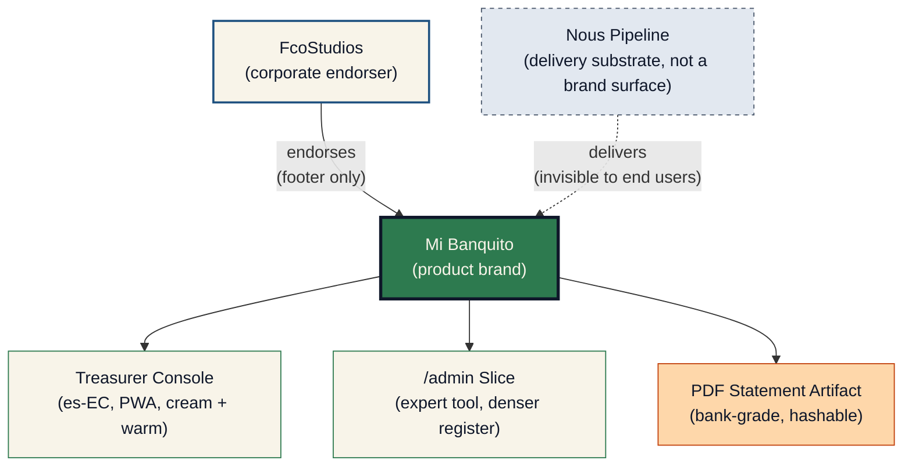
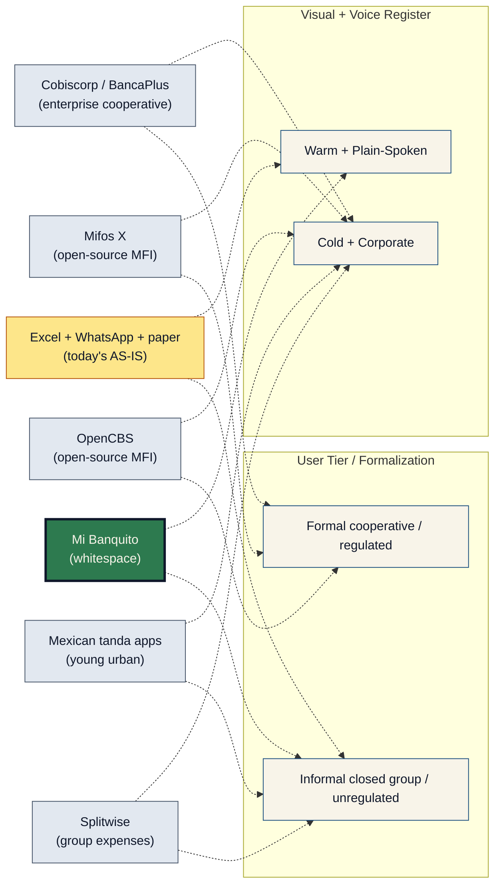

# 05 — Brand: Mi Banquito

**Project:** Mi Banquito (`fcostudios__mi-banquito`)
**Step:** 5 — Brand
**Date:** 2026-05-28
**Author:** Francisco Lomas (via Nous pipeline, `prompts/brand_research.md`)
**Report language:** en-US (spec convention); product UI is es-EC (primary locale)
**Scenario:** **SCENARIO_B** — New Brand Proposal
**PRIOR_WORK:**
- `Nous/Specs/fcostudios/mi-banquito/PRODUCT_BRIEF.md`
- `Nous/Specs/fcostudios/mi-banquito/v1/01_research.md`
- `Nous/Specs/fcostudios/mi-banquito/v1/02_cx_personas.md` (4 personas)
- `Nous/Specs/fcostudios/mi-banquito/v1/03_cx_journeys.md`
- `Nous/Specs/fcostudios/mi-banquito/v1/03b_service_blueprint.md`
- `Nous/Specs/fcostudios/mi-banquito/v1/04_er_model.md`

---

---SECTION: SEC0---

## Executive Summary

- **Product.** Mi Banquito is a multi-tenant SaaS treasury system for informal community savings & lending cooperatives (*banquitos / cajas*) in Ecuador (R1), then LATAM (R3+). The primary user is the group's treasurer — a non-technical mid-life adult who runs the books on her phone today using paper, Excel, and WhatsApp. The product is the system of record for member contributions, loans, repayments, A/R, reconciliation, monthly close, and year-end share-out.
- **Scenario.** **SCENARIO_B — new brand proposal.** No existing brand, logo, voice, or color palette. Product name `"Mi Banquito"` is already chosen (used throughout `PRODUCT_BRIEF.md`); it is confirmed in §SEC4 as the brand name and validated below against personas and positioning.
- **Brand essence (in one sentence).** *Mi Banquito es el cuaderno digital del grupo* — "the group's digital notebook." The brand frames itself as a familiar tool (a notebook) made digital, not as a "system." This frame is the single most-important brand decision: it disarms the top adoption risk identified in `PRODUCT_BRIEF.md §Risks` ("the app is too complex for the actual user").
- **Tone in one phrase.** *Cercana, clara y confiable* — warm, clear, trustworthy. Spanish-`tú` register by default for peer-to-peer feel; never corporate-formal. (`OQ-BR-1`: confirm `tú` vs `usted` with design partner — her mother's group's actual register.)
- **Visual lines.** A grounded community palette: warm cream backgrounds, a deep trust-green primary, a steady trust-blue accent, a single warm terracotta accent for human moments. Status color encoding (`al día` / `atrasado` / `en mora`) uses WCAG-AA-compliant hexes selected for mid-life-eye contrast on a phone in outdoor light. Typography defaults to a humanist sans-serif (Inter is the proposal) at large baseline sizes.
- **Main CX/UX implications.** (i) Every screen renders as a *page from a notebook*, not a *dashboard*. (ii) PDF artifacts (statements, monthly close, year-end share-out) look like *bank statements*, not like *receipts from an app*. (iii) Voice is *plain spoken Spanish* — never corporate accounting jargon. (iv) Microcopy reflects the treasurer's actual speech (e.g., *"Aún no tienes aportes este mes"* not *"No data available"*). (v) The platform admin surface (`/admin` for the Platform Operator persona P04) deliberately uses a different visual register — tighter, denser, expert-tool feel — but inherits the same color tokens for cross-surface consistency.

---

---SECTION: SEC1---

## Context, Problem and Scope

### Business problem and CX pain points

Informal community savings groups in Ecuador (and LATAM more broadly) run on paper, Excel, and WhatsApp. The treasurer carries the group's entire ledger in her head, on paper, and across WhatsApp scrolls — and bears personal reputational risk for every cent. The top brand-relevant pain points (sourced from `01_research.md §3` and `PRODUCT_BRIEF.md §Risks`):

- **Adoption risk:** any tool that "looks like a system" gets abandoned within 30 seconds of opening.
- **Reputational fragility:** a single visible arithmetic error collapses the treasurer's trust standing in her group.
- **Trust-by-artifact:** members ultimately judge the system by the PDF statements they receive over WhatsApp; if those don't look "official," trust is not transferred.
- **Tooling gap:** no existing product specifically targets the informal-tier closed-group treasurer. Available cooperative software (Mifos X, OpenCBS, regional banking platforms) assumes formal cooperatives with regulatory infrastructure these groups don't have and intentionally avoid. **Mi Banquito sits in the whitespace** below SEPS-registered cooperatives and above Splitwise-style group-expense apps.

### Target environment

- **Geography (R1):** Ecuador. Spanish (`es-EC`). USD. Andean cultural context. **Designed-for, not enabled-in-R1:** other LATAM Spanish variants and currencies; R3 expansion target.
- **Channel:** PWA on low-end Android phones over intermittent 3G. The brand renders on a phone, in outdoor light, in a hand that is also holding a paper notebook.
- **Regulatory posture:** explicitly positioned as **closed-group internal recordkeeping**, NOT as consumer lending or deposit-taking. The brand voice supports this framing by speaking *for the group, to the group*, never to a "customer" or "borrower."
- **Cultural framing:** Andean banquitos are typically majority-female, multigenerational, community-rooted, and trust-led. Brand cues that read as "fintech" (over-clean, blue-and-white, gradient-heavy, English-loanword-y) actively damage trust. Brand cues that read as "everyday community" (warm earthy palette, plain-Spanish copy, hand-feel iconography) build it.

### Scope of this brand report

**In scope:**
- Brand essence, positioning, name confirmation, personality, values, tone.
- Visual identity: color palette (with WCAG-AA-compliant compliance encoding), typography direction, imagery style, iconography style.
- Per-locale voice for `es-EC` (the only R1 locale).
- Microcopy examples grounded in journey stages.
- Brand architecture (Mi Banquito under FcoStudios) and competitive positioning.

**Out of scope (R1):**
- A full brand book / brand manual (deferred to post-pilot R2; this report is sufficient for Step 6 Design System).
- Logo *file production* (this report proposes a logo *concept*; the actual vector logo is produced in Step 6 alongside the design system).
- Marketing campaign assets / out-of-app brand surfaces (no marketing exists; pilot is one design-partner group).
- Trademark search and registration (deferred until the platform onboards a second tenant).
- Voice guidance for other locales — `en-US`, `es-MX`, `es-CO`, `es-PE` are flagged as "Planned (R3+)" per `01_research.md §11.4`.

### Assumptions

- **`[ASSUMPTION] A-BR-1`** The product name **"Mi Banquito"** is final. (Confirmed used throughout PRIOR_WORK; no naming competition needed.)
- **`[ASSUMPTION] A-BR-2`** Spanish-`tú` register is appropriate for the design partner's group. Open question `OQ-BR-1` flags this for design-partner confirmation. The brand voice in this report is authored in `tú` with `usted` variants noted where critical.
- **`[ASSUMPTION] A-BR-3`** The font family of choice is **Inter** (sans-serif, Latin-1 + extended diacritics, free OFL license). Alternative: **Source Sans 3**, **IBM Plex Sans**. Final selection in Step 6.
- **`[ASSUMPTION] A-BR-4`** The brand renders the founder's mother as the canonical "design partner" persona throughout — she is the reference for every microcopy decision.
- **`[ASSUMPTION] A-BR-5`** FcoStudios is the corporate endorser; "Mi Banquito" is the product brand. The corporate brand FcoStudios is intentionally low-profile in R1 (footer presence in PDFs only).

---

---SECTION: SEC2---

## Inputs Used and Methodology

### Key inputs (internal)

- **Problem research (`01_research.md`)** — 11-section structured report. Most brand-relevant sections: §2 AS-IS process (paper + Excel + WhatsApp pattern), §3 pain points (adoption + trust + jargon), §4 external benchmarks (no existing competitor at this tier), §5 TO-BE design principles ("no jargon", "trust by transparency"), §11 sizing tier `S` (small, solo-team, < $30/month hosting). Critical brand take-aways:
  - The product replaces *paper + Excel + WhatsApp*. The brand should *honor*, not *replace*, the paper notebook's familiarity.
  - The brand cannot read as "fintech."
  - The brand must read as *trustworthy enough to be the group's books*, but *friendly enough not to scare the treasurer away*.

- **Personas map (`02_cx_personas.md`)** — 4 personas. Brand-relevant traits:
  - **La Tesorera (P01)** — mid-life adult, non-technical, phone-first, Spanish-only, anxiety-sensitive, vocabulary-locked to `aporte / retiro / préstamo / cuota / saldo / cierre / conciliación / historial / aportante`. Sets the tone register.
  - **El Presidente (P02)** — peer of treasurer; same Spanish-only profile; consumes monthly close PDF over WhatsApp. The PDF artifact must read as official to *him*.
  - **El Miembro/a (P03)** — broader age range; lowest tech savviness; receives PDF statements. The statement must read as *bank-statement-credible* to him/her.
  - **La Operadora de la Plataforma (P04)** — expert user; tolerates technical vocabulary, dense tables, CLI affordances. The admin surface gets a different visual register (denser, more workmanlike) while inheriting color tokens.

- **Customer journeys (`03_cx_journeys.md`)** + **service blueprint (`03b_service_blueprint.md`)** — anchor microcopy to specific journey stages. The S5 reconciliation + monthly close stage is the most brand-defining moment (the "trust artifact" is generated here).

- **ER model (`04_er_model.md`)** — entity status enums (`activo / pausa / baja / al_día / atrasado / en_mora / pendiente / parcial / pagado / cancelado / proposed / originated`) are the source-of-truth for status-color encoding in §SEC7.

### Key inputs (external — web research)

Per `prompts/brand_research.md §1.2`, the prompt expects the agent to "investigate the company and product on the web." Since Mi Banquito is greenfield with no existing online presence (no website, no social channels, no prior marketing), web research is limited to **competitive landscape** and **cultural references**:

- **Competitive scan of LATAM tanda / banquito apps** (per `01_research.md §4.2`) — Mexican tanda apps tend toward fintech-blue + dynamic gradient aesthetics; they target younger urban users. **Mi Banquito intentionally diverges**: its target user is older, rural-or-peri-urban, community-grounded.
- **Formal cooperative-software incumbents** (Mifos X, OpenCBS, Cobiscorp, BancaPlus) — all read as enterprise banking software with cold blue palettes, dense data tables, and Spanish-as-second-language UI. Mi Banquito's brand differentiation is *warmer, plainer-spoken, and visually grounded in everyday community life*.
- **Cultural references for Ecuadorian Andean community life** — handwoven textile patterns, market-stall warmth, hand-lettered ledger covers, ceramic earthen tones. These inform the imagery and iconography direction, not the literal palette.

### Methodology

- **Desk research** — synthesis of PRIOR_WORK + competitive scan above.
- **Persona-driven tone derivation** — every brand attribute is tied back to a persona need (e.g., "no jargon" → ties to P01's "any tool that looks like a system is abandoned" pain).
- **Journey-anchored microcopy** — every microcopy sample maps to a specific journey stage in `03_cx_journeys.md §SEC4`.
- **Inputs that are missing or low-quality:** (i) no prior user-research interviews with the design partner *yet* — those are scheduled per `01_research.md §9.3 Next Research Steps`; brand voice tests in §SEC10 will validate. (ii) no direct color-preference data from the design partner; the palette proposal is hypothesized from cultural/persona research and is flagged for validation.

---

---SECTION: SEC3---

## Brand Scenario and Initial Conclusion

### Scenario: **SCENARIO_B — New Brand Proposal**

**Evidence supporting SCENARIO_B:**

- Mi Banquito is a **greenfield project** (`PRODUCT_BRIEF.md §Source Kind: greenfield`). No prior brand exists.
- No prior website, social media presence, marketing material, or customer-facing identity has been authored.
- The product name "Mi Banquito" is settled (used consistently throughout PRIOR_WORK + `Organization.display_name` + `branding` in `project_configs`) but no visual identity, voice guide, or positioning statement has been authored.
- FcoStudios (the corporate endorser) likewise has no prior product brand — Mi Banquito is FcoStudios' first product.

### Opportunity for a new brand

- **Whitespace position.** No incumbent commands the *informal closed-group savings ledger* category in LATAM. Mi Banquito can plant a flag in a category no one else has named.
- **Trust-instrument differentiation.** Competitors lean "fintech-modern" or "enterprise-banking-formal." Mi Banquito can lean "warm, plain-spoken, trustworthy notebook" — a position none of them occupy.
- **Vocabulary ownership.** By locking `aporte / retiro / préstamo / cuota / cierre / conciliación / aportante` as the canonical Spanish vocabulary (per `02_cx_personas.md` Recommendation 19 + `04_er_model.md` status enums), Mi Banquito owns the *language* of the informal banquito category.
- **PDF artifact as brand surface.** The PDF statement that the treasurer sends to members over WhatsApp is, for most members, *the only brand contact they'll ever have*. Owning that artifact's design is the highest-leverage brand investment in R1.
- **Cultural alignment.** The category (informal community savings) is older than the SaaS industry; the brand has the opportunity to honor it visually rather than override it with imported fintech aesthetics.

---

---SECTION: SEC4---

## Brand Essence and Positioning

### Brand name

**Mi Banquito** (confirmed). Alternatives considered for completeness (per the prompt's "1 recommended + 2 alternatives" pattern):

| Option | Rationale | Verdict |
|---|---|---|
| **Mi Banquito** (recommended) | Diminutive of *mi banco* — "my little bank." Already the colloquial term groups use for themselves (*"voy a aportar al banquito esta semana"*). Phonetically warm, ownable, two-word memorable. | **Selected.** |
| *Cuaderno* (alternative) | Pure honor to the AS-IS tool. Risks reading as "a notebook product," not "a treasury product." | Rejected — over-modest. |
| *La Caja* (alternative) | Alternative regional term (Peru, Bolivia). Risks region-specific connotation; less warm than diminutive form. | Rejected — too neutral. |

The name *Mi Banquito* is final.

### Brand essence

> **El cuaderno digital del grupo.** *(The group's digital notebook.)*
>
> Mi Banquito is the trustworthy, plain-spoken digital ledger that the treasurer of a community savings group keeps on her phone — as familiar as the paper notebook it replaces, as reliable as a bank statement.

This essence in two sentences is the **single most-important brand decision in this report.** Every downstream choice — palette, tone, microcopy, iconography, PDF layout — refers back to this sentence.

### Positioning statement

> **Para la tesorera de un banquito** *(for the treasurer of a banquito)* — **que necesita llevar las cuentas claras del grupo sin perder fines de semana** *(who needs to keep the group's books clear without losing weekends)* — **Mi Banquito es el cuaderno digital de tu grupo** *(Mi Banquito is your group's digital notebook)* — **que registra los aportes, los préstamos y el cierre del mes con la simpleza de un cuaderno y la confianza de un libro de banco** *(that records contributions, loans, and the monthly close with the simplicity of a notebook and the confidence of a bank book)* — **a diferencia de los sistemas contables formales** *(unlike formal accounting systems)* — **que asumen que ya sabes contabilidad** *(which assume you already know accounting)*.

English equivalent:

> **For the treasurer of a community savings group** who needs to keep the group's books clear without losing weekends, **Mi Banquito** is the **digital notebook of your group** — that records contributions, loans, and the monthly close with the simplicity of a notebook and the confidence of a bank book — **unlike formal accounting systems**, which assume you already know accounting.

### Alignment with problem + personas

- The essence frames the product as a *familiar tool* (notebook), disarming the adoption-friction risk surfaced in `02_cx_personas.md §SEC4 P01`.
- The positioning calls out *the treasurer* directly, which mirrors the brief's "single point of cognitive load" focus.
- The contrast "vs. formal accounting systems" gives the brand explicit competitive ground without naming any vendor.
- The phrase *cuaderno digital del grupo* — "the group's digital notebook" — is **ownable, repeatable, and culturally legible** to the target audience.

---

---SECTION: SEC5---

## Brand Personality, Values, and Tone of Voice

### Primary persona anchoring

- **La Tesorera (P01)** is the dominant brand-shaping persona. Her emotional posture (*quietly anxious about reputational risk*; *avoids anything that looks like a system*) sets the entire tone.
- **El Miembro/a (P03)** is the *artifact recipient* and shapes the **PDF voice** — official enough to trust, warm enough not to feel cold.
- **El Presidente (P02)** consumes the monthly-close PDF before meetings — informs the *report voice* (clear, defensible, calm).
- **La Operadora de la Plataforma (P04)** uses the admin surface and tolerates a *different* voice — workmanlike, technical, English/Spanish mix. This is the only persona where the brand voice deliberately diverges.

### Personality attributes (5)

1. **Cercana** *(warm)* — talks like a respected member of the community, never like a corporate vendor.
2. **Clara** *(clear)* — short sentences, plain Spanish, zero accounting jargon.
3. **Confiable** *(trustworthy)* — every number is sourced; every action is reversible via reversal entry, never destructive; every artifact is hashable.
4. **Respetuosa** *(respectful)* — treats the treasurer's authority as final; the system advises, it never vetoes (per `03b §7 invariant 6`).
5. **Reposada** *(calm / unhurried)* — no animations that demand attention; no urgent-red modals; no countdown timers. The brand is the *calm* in a community's relationship with its money.

### Core brand values

- **Cuidado** *(care)* — for the treasurer's time, the members' money, the group's trust.
- **Sencillez** *(simplicity)* — every screen passes the 30-second test or it gets reworked.
- **Transparencia** *(transparency)* — every action recorded, every statement hashable, every prior period locked.
- **Comunidad** *(community)* — the product serves *the group*, not the individual user. Plural "we" is implicit.
- **Integridad** *(integrity)* — append-only ledger; no destructive edits; documented reversals.

### Tone of voice (cross-locale, language-agnostic traits)

- **How the brand should sound:** *direct, conversational, warm-respectful, never formal-corporate, never breezy-startup.*
- **Register:** mid-register — neither slang nor academia. Closer to how a respected community elder would speak to her peers.
- **Length:** short. Most microcopy is ≤ 12 words. Confirmation sentences may run longer to be unambiguous (`03_cx_journeys.md §SEC9 Rec 9`).

**What to do:**

- Use the locked Spanish vocabulary (`aporte / retiro / préstamo / cuota / saldo / cierre / conciliación / historial / aportante / al día / atrasado / en mora`).
- Address the treasurer directly (default register: `tú`).
- Use first-person plural "we" sparingly to signal "the product is part of the group" (e.g., *"Te recordamos…"* not *"Le recordamos…"*).
- Acknowledge feeling in error states (*"Algo no funcionó. Intenta de nuevo."* — admits a problem without blaming).
- Use full sentences in destructive confirmations (`03_cx_journeys.md §SEC9 Rec 9`).
- Use specific numbers and member names in alerts (*"El aporte de María está atrasado por 14 días"*, not *"A contribution is overdue"*).

**What NOT to do:**

- **Never** use corporate-finance jargon: *débito, crédito, asiento contable, mayor general, conciliación de cuentas* (the formal phrase). Use **`conciliación`** alone, framed as "la conciliación de fin de mes."
- **Never** use English loanwords where Spanish exists: avoid *check, balance, account, dashboard, settings*.
- **Never** use breezy-startup phrases: avoid *"¡Listo!"*, *"¡Genial!"*, *"¡Vamos!"*, emoji-heavy copy. The product is about money; tone is calm.
- **Never** apologize excessively (*"Lo sentimos mucho mucho…"* reads as performative). One short acknowledgment is enough.
- **Never** use technical IDs in user-facing copy. *"Aporte #4321 confirmado"* — wrong. *"Aporte de María confirmado — USD 50, 12 de mayo"* — right.
- **Never** put exclamation marks on financial confirmations. The brand is *reposada*.

### Per-Locale Voice Guidance — `es-EC` (primary)

#### Voice in `es-EC`

- **Formality register:** `tú` by default (`[ASSUMPTION] A-BR-2`; `[OPEN_QUESTION] OQ-BR-1`). Ecuador uses `tú` and `usted` regionally; in coastal urban contexts `tú` is more common, in highland and elder contexts `usted` is more common. The design partner's group's actual register MUST be confirmed at the first observation session. Provide system-message variants in both registers in Step 6 strings file.
- **Regional idioms & vocabulary:**

| Concept | es-EC (recommended) | Avoid (Spain or regional) | Why |
|---|---|---|---|
| Phone | *teléfono / celular* | *móvil* (Spain) | `móvil` reads as Iberian Spanish |
| To save | *ahorrar* | *guardar* (= "to keep / store") | `guardar` in finance reads imprecise |
| Money | *plata* (informal) / *dinero* (neutral) | *pasta* (Spain), *guita* (Argentina) | `plata` is warm and Andean |
| Contribution | **`aporte`** | *cotización* (= "social-security contribution") | vocabulary lock from `02_cx_personas.md` |
| Member | **`socia / socio`** or **`aportante`** | *cliente / usuario* | `cliente / usuario` reads as commercial-customer; banquito members are *socias* |
| Late | **`atrasado`** | *demorado* (acceptable, less common) | `atrasado` matches everyday speech |
| Default (en mora) | **`en mora`** | *en default / impagado* | `en mora` is the established legal term and is locally understood |
| Notebook | **`cuaderno`** | *libreta* (acceptable, slightly more elderly register) | `cuaderno` aligns with brand essence |
| Bank account | *cuenta del grupo* | *cuenta corporativa / empresarial* | "cuenta del grupo" honors the group as the owner |
| Statement | *estado de cuenta* | *extracto / reporte* | matches bank-statement reference frame |
| Reconciliation | **`conciliación`** | *cuadre* (regional, also fine) | confirm with design-partner (`A13` from `03_cx_journeys.md`) |
| To approve | *aprobar* | *autorizar* (formal, OK in headers) | `aprobar` is warmer |
| OK / Confirm | *Confirmar* | *Aceptar* (too transactional) | `Confirmar` carries the weight the brand wants |

- **Tone calibration:** in es-EC, the language already softens directness through politeness markers (*"por favor"*, *"si gustas"*). The brand uses these **sparingly** — the goal is friendly *clarity*, not over-politeness that obscures the message. One `por favor` per confirmation max.

- **Sample microcopy, es-EC primary (with en-US equivalents for reviewer reference only — en-US is NOT shipped in R1):**

| Context | es-EC (`tú`) | en-US (reference only) |
|---|---|---|
| Welcome banner (first login) | *"Bienvenida a Mi Banquito. Empecemos por crear tu grupo."* | "Welcome to Mi Banquito. Let's start by creating your group." |
| Primary CTA (home) | *"Registrar aporte"* | "Record a contribution" |
| Empty state — no contributions this cycle | *"Aún no hay aportes este mes."* + sub-button *"Registrar el primer aporte"* | "No contributions this month yet." + "Record the first contribution" |
| Validation error — empty amount | *"Falta poner el monto del aporte."* | "The contribution amount is missing." |
| Validation error — invalid amount | *"El monto tiene que ser mayor a cero."* | "The amount must be greater than zero." |
| Success confirmation — deposit recorded | *"Aporte de María registrado — USD 50, 12 de mayo."* | "María's contribution recorded — USD 50, May 12." |
| Destructive confirmation (per `03_cx_journeys §SEC9 Rec 9`) | *"¿Estás segura de eliminar el aporte de María por USD 50 del 12 de mayo? Se creará una reversión en el historial."* | "Are you sure you want to remove María's USD 50 contribution from May 12? A reversal will be recorded in the history." |
| Reconciliation discrepancy | *"Hay una diferencia de USD 75 entre el saldo del banco y el saldo calculado. Revisemos juntos antes de cerrar el mes."* | "There's a USD 75 difference between the bank balance and the calculated balance. Let's review together before closing the month." |
| Loan eligibility block | *"No se puede aprobar: el capital disponible es USD 1.200 y el préstamo solicitado es USD 2.000."* | "Cannot approve: available capital is USD 1,200 and requested loan is USD 2,000." |
| Year-end shortfall alert | *"El reparto proyectado de fin de año (USD 8.500) supera la liquidez disponible (USD 4.200). Considera revisar los préstamos abiertos."* | "Projected year-end share-out (USD 8,500) exceeds available liquidity (USD 4,200). Consider reviewing open loans." |

- **Known pitfalls (es-EC):**
  - *Translated literally from English* — *"Tienes 3 nuevas notificaciones"* sounds like a notification app. Use *"Hay 3 avisos nuevos para ti"* (warmer, less alert-y).
  - *Overly formal/imperative* — *"Proceda con el registro"* reads as bureaucratic. Use *"Continúa para registrar"* (or *Continuemos*).
  - *Currency formatting* — Ecuador uses both `1.250,00` and `1,250.00` in different contexts (bank statements often the former). **Default: `$1.250,00`** with the dollar sign followed by space then number. `[OPEN_QUESTION] OQ-BR-2`: confirm with the design partner what her bank statement formatting looks like; match it for cognitive continuity.
  - *Date formatting* — es-EC uses `dd/MM/yyyy` (e.g., `12/05/2026`). Never `yyyy-MM-dd` in user-facing copy.

- **Translation source:** all es-EC copy in this artifact is `LLM-generated + human-reviewed-by-Francisco-Lomas`. Per the DEC-125 pattern referenced in `prompts/brand_research.md`, every es-EC string must be re-validated by a native non-technical reviewer (the design partner) before R1 ship.

### Deferred locales

- **`en-US`** — Planned (R3+). Voice guidance deferred.
- **`es-MX`, `es-CO`, `es-PE`** — Planned (R3+). Voice guidance deferred until first non-Ecuadorian tenant onboarding.

---

---SECTION: SEC6---

## Value Proposition and Key Messages

### Core value proposition

> **Mi Banquito** lleva las cuentas de tu grupo con la simpleza de un cuaderno y la confianza de un banco — para que cierres el mes en menos de media hora y le respondas a cualquier socia con seguridad.

English equivalent:

> **Mi Banquito** keeps your group's books with the simplicity of a notebook and the trust of a bank — so you close the month in less than half an hour and answer any member with confidence.

### Key messages

| # | Headline (es-EC) | Target persona | Type | Proof / evidence |
|---|---|---|---|---|
| **M1** | *"Cierra el mes en menos de media hora."* | P01 La Tesorera | Functional benefit | KPI in `01_research.md §8.1` (target < 30 min); baseline 3–5 h |
| **M2** | *"Cuadra al centavo con tu banco — todos los meses."* | P01 La Tesorera | Functional + trust | KPI in `01_research.md §8.1` (zero discrepancy 3 months); `03b §2 P12` |
| **M3** | *"Cada aporte queda registrado. Sin perder fotos en WhatsApp."* | P01, P03 | Risk-neutralization | `03_cx_journeys.md` S2 pain point: "deposit slips lost in chat scroll" |
| **M4** | *"Tus socias reciben su estado de cuenta como si fuera del banco."* | P01 (→ P03 implicit) | Trust-by-artifact | `03b §2 P15` `StatementArchive` with hash; positions PDF as the trust artifact |
| **M5** | *"Antes de aprobar un préstamo, sabes si tu grupo lo puede sostener hasta fin de año."* | P01 La Tesorera | Risk-neutralization | `03b §5` Cash-Flow Projection; alert `A5` Year-End Shortfall |
| **M6** | *"Te avisamos cuando hay algo que necesita tu atención — sin agobiarte."* | P01 La Tesorera | Emotional benefit | `03b §6` alert UX rules: dismissable, snoozable, never blocking |
| **M7** | *"Nadie puede borrar un aporte. Las correcciones siempre quedan en el historial."* | P01 (→ P02, P03 implicit) | Trust-by-design | `03b §7 invariant 1`: append-only; `04_er_model.md §SEC6` reversal pattern |

### Risks/perceptions to neutralize

- **"This is going to be too complex for me."** (P01 fear) → countered by M1, M6, and the brand essence frame ("a digital notebook, not a system").
- **"What if I make a mistake and can't undo it?"** (P01 reputational fear) → countered by M7 (no destructive edits; reversals always recorded).
- **"My members won't trust an app number more than a paper one."** (P01 social fear) → countered by M4 (PDF statement as bank-grade artifact).
- **"Is this even legal/safe for our group?"** (group-level fear) → addressed in the **closed-group framing** copy (out-of-app legal section + Step 14 Legal).

---

---SECTION: SEC7---

## Visual Identity and Design System

> **Scenario:** SCENARIO_B (new proposal). All recommendations marked as such; the design partner's color preferences will validate at first observation.

### Color palette

**Primary color: `Verde Confianza` (Trust Green)** — `#2D7A4F`.

A deep, earthy green. Suggests *growth*, *savings*, *community garden / market produce* rather than fintech-finance-green. Distinguishable from generic Slack/WhatsApp greens. WCAG-AA contrast ratio ≥ 4.5:1 on `#F8F4E9` background (verified).

**Secondary 1: `Crema Cuaderno` (Notebook Cream)** — `#F8F4E9`.

Off-white warm background. The color of an unbleached notebook page. Avoids the cold "tech-white" `#FFFFFF` while preserving readability. Primary canvas color for the treasurer console.

**Secondary 2: `Azul Cuenta` (Account Blue)** — `#1E5180`.

Deep trust-blue used as accent for: links, secondary actions, statement PDF headers. Echoes bank-statement conventions without being a cold fintech blue. WCAG-AA ≥ 4.5:1 on cream + on white.

**Secondary 3: `Terracota Comunidad` (Community Terracotta)** — `#C45F36`.

Warm accent for *human moments*: welcome banners, year-end share-out screens, celebration confirmations. Used sparingly. Echoes Andean ceramic + textile traditions.

**Compliance status encoding** — **WCAG-AA compliant on `#F8F4E9` cream background and on `#FFFFFF`:**

| Status | Color name | Hex | Use |
|---|---|---|---|
| `al día` / `pagado` / `activo` | **`Verde Al Día`** | `#15803D` | Member compliance: up to date. Loan / period: paid / active. |
| `pendiente` / `parcial` | **`Ámbar Pendiente`** | `#B45309` (text) / `#FDE68A` (background) | Treated as info, not alarm. |
| `atrasado` | **`Ámbar Atrasado`** | `#C2410C` (text) / `#FED7AA` (background) | Visible but calm — does not shout. |
| `en mora` / `error` / `discrepancia bancaria` | **`Rojo En Mora`** | `#B91C1C` (text) / `#FECACA` (background) | Reserved for serious states only. Triggers a calm, not panicked, treatment. |

**Why these hexes (not lighter Tailwind defaults):** the target user is mid-life with a low-end Android phone often used in outdoor light. Contrast must be conservative. All status hexes verified ≥ 4.5:1 on the cream background. The dark slate text default `#0F172A` exceeds 12:1 contrast on cream — generous for older eyes.

**Neutrals:**

- **`Tinta Oscura` (Dark Ink)** — `#0F172A`. Primary text. Reads as ink-on-paper, not as cold tech-grey.
- **`Tinta Media` (Mid Ink)** — `#475569`. Secondary text, labels.
- **`Línea` (Line)** — `#CBD5E1`. Dividers, table borders. Subtle.
- **`Línea Suave` (Soft Line)** — `#E2E8F0`. Card backgrounds, alternating rows.

**Anti-recommendations (do NOT use):**

- Pure white `#FFFFFF` as the primary canvas (replaces with `#F8F4E9`).
- Sky blue / Twitter blue (reads as social-media, not banking).
- Pure black `#000000` (too harsh against warm cream).
- Neon / over-saturated hues.
- Gradients of any kind (read as fintech-2010s).
- Dark mode in R1 (`02_cx_personas.md §SEC9 Rec 28`: "High contrast is the default, not an option" — no light/dark toggle in R1).

### Typography

**Recommended family:** **Inter** (variable, sans-serif, OFL-licensed, excellent Latin-extended diacritics).

Alternatives if Inter licensing or rendering becomes a concern: **Source Sans 3** (Adobe OFL), **IBM Plex Sans** (IBM OFL).

**Type scale (R1):**

| Token | Size | Line height | Weight | Use |
|---|---|---|---|---|
| `display.lg` | 32 px | 40 px | 600 | Large numbers (member balance, monthly close summary headline) |
| `display.md` | 24 px | 32 px | 600 | Screen titles |
| `heading.lg` | 20 px | 28 px | 600 | Section headings |
| `heading.md` | 18 px | 24 px | 600 | Card titles |
| `body.lg` | 18 px | 28 px | 400 | **Default body text** (larger than typical web 16; honors mid-life-eye baseline) |
| `body.md` | 16 px | 24 px | 400 | Secondary text / table cells |
| `body.sm` | 14 px | 20 px | 400 | Footers, captions only — **NEVER for primary content** |
| `numeric.balance` | 28 px | 36 px | 700 (tabular-figures) | Member balance display. Tabular figures locked. |
| `numeric.amount` | 20 px | 28 px | 600 (tabular-figures) | Transaction amounts in tables. |
| `label.uppercase` | 12 px | 16 px | 600 (letter-spacing 0.08em) | Status pills only |

**Why ≥ 16 px body and ≥ 18 px default:** `02_cx_personas.md §SEC2 P01 accessibility constraints` mandates ≥ 16 px body text. The brand exceeds this baseline (18 px default) because the target user is older than the average web reader.

**Tabular figures locked for all numeric displays** so that amounts line up vertically in tables without alignment drift.

**Spanish-language considerations:** Inter renders all es-EC accents (á, é, í, ó, ú, ñ, ü) at the same vertical baseline as ASCII, important because Spanish has accented letters at sentence beginnings (`¿`, `¡`) and accented capitals (`Á`, `É`, `Í`, `Ó`, `Ú`).

### Iconography style

- **Outline icons preferred over filled** — reads warmer, more like hand-drawn notebook icons.
- **Stroke weight ~ 1.5 px at 24 px nominal size** — heavier than typical to remain legible at glance.
- **24 × 24 px nominal, ≥ 28 px touch target** — always paired with a Spanish label (per `02_cx_personas.md §SEC9 Rec 4`: "no icon-only buttons").
- **Library proposal:** **Lucide Icons** (open-source; aligns with `nous-portal` substrate convention per HR-30 `app_shell.sidebar.items[].icon`). Alternative: **Phosphor Icons** (similarly warm outline style).
- **Avoid:** material-design-square icons (reads cold), iOS-glyph icons (reads Apple-only), 3D-rendered illustrations (reads fintech).

### Imagery style

- **Photography:** sparingly used; if used, real-people photography of LATAM community settings (NOT stock-finance photography). Avoid stock-photo handshakes, stock-photo briefcases, stock-photo people staring at screens. Prefer documentary-style market / community / family contexts.
- **Illustration:** preferred over photography for R1. Style direction: warm flat illustration with **earthy palette + subtle textile/notebook texture undertones**. NO 3D, NO isometric tech illustration.
- **Decorative elements:** thin warm lines suggesting notebook ruling, hand-drawn corner ornaments where appropriate (PDF statement borders), an optional Andean-textile-inspired thin border line at major section breaks.

### Logo concept (concept; final vector in Step 6)

- **Wordmark + symbol** combination.
- **Symbol:** a stylized notebook spine OR a notebook circle-tab + a small monetary mark, integrated as a single geometric shape. Aim: instantly readable at 32 × 32 px favicon size + meaningful at full size.
- **Wordmark:** "Mi Banquito" in `Inter SemiBold`, slightly tightened tracking, the `B` of *Banquito* potentially slightly accented (curved descender) to suggest a notebook fold.
- **Color:** primary on cream background; cream on primary background; single-color black version for fax-grade reproduction.

### Accessibility / usability baseline

- All status colors verified WCAG AA on cream and white.
- All body text ≥ 16 px (default 18 px).
- All tap targets ≥ 48 × 48 px (per `02_cx_personas.md §SEC9 Rec 1`).
- All form controls have visible labels (no placeholder-only labels).
- Icons always accompanied by Spanish text labels.
- Voice-friendly: every number is reachable as plain text (per `02_cx_personas.md §SEC7 O-T11`).
- No animations longer than 200 ms; no auto-rotating carousels; no parallax.
- High-contrast mode is the **default**, not a toggle. No light/dark switch in R1.

---

---SECTION: SEC8---

## Experience Principles (CX/UX) and Guidelines for Digital Product

> The brand translates into 6 experience principles. Each maps to journey stages (per `03_cx_journeys.md §SEC3`).

### Principle 1 — *Like a Notebook, Not a System*

**Meaning.** Every screen reads as a page from a notebook: warm cream background, generous spacing, ink-dark text, no chrome-heavy app UI. No card-stacking, no glass-morphism, no gradient hero sections.

**Critical at journey stages:** S1 (group setup — first impression), S2 (daily contribution recording), home dashboard (every visit).

**Practical implications:**

- Cards have thin warm borders (`Línea`), not heavy drop-shadows.
- Tables have alternating row backgrounds in `Línea Suave`, not zebra-striped grey.
- The home screen is a list of *three actions* + a notebook-style A/R aging list (per `03_cx_journeys.md §SEC4 S2 TO-BE #1`), not a dashboard with widgets.
- No splash screens, no loading-skeleton shimmer animations.

### Principle 2 — *Plain Spanish, Vocabulary Locked*

**Meaning.** Every word in the UI passes the vocabulary lock (`aporte / retiro / préstamo / cuota / saldo / cierre / conciliación / historial / aportante / al día / atrasado / en mora`). No corporate-finance synonyms. No English loanwords.

**Critical at:** every stage.

**Practical implications:**

- Step 6 (Design System) ships a `strings.es-EC.json` with the locked vocabulary as constants.
- Lint rule (or substrate convention) catches drift: e.g., a developer typing `"Crear contribución"` is flagged because canonical is `"Registrar aporte"`.
- Copy review checklist applied to every PR / CHG: every new string is checked against the locked vocabulary before merge.

### Principle 3 — *Trust Earned in Reconciliation*

**Meaning.** The reconciliation + monthly close flow is the single most product-defining workflow (per `03_cx_journeys.md §SEC5 cross-cutting insight 4` + `03b §5`). Brand expresses itself most clearly here: calm, deliberate, no rush. The screen feels like *signing a bank document*, not *submitting a form*.

**Critical at:** S5 (Reconciliation + Monthly Close), S6 (Year-End Share-Out).

**Practical implications:**

- Reconciliation screen uses `Crema Cuaderno` background, large numbers in `numeric.balance` weight, `Azul Cuenta` for primary action button.
- When the discrepancy is zero (or within tolerance), a calm `Verde Al Día` checkmark — not a celebration animation.
- The generated monthly close PDF uses the same `Crema Cuaderno` background, group logo on the top-right, hash footer on the bottom in `body.sm` typography.
- Year-end share-out screen carries a thin `Terracota Comunidad` border (the only place this accent appears prominently) — signaling a *human moment*.

### Principle 4 — *Reversible, Recorded, Defensible*

**Meaning.** Every action creates a record. No destructive edits. The treasurer never has to fear a mistake — corrections are entries in the historial, not erasures.

**Critical at:** S2 (contributions), S3 (loans + repayments), S4 (collections), S5 (close).

**Practical implications:**

- The UI never offers a "delete" button on any ledger entry. The button is *"Hacer una reversión"* (Make a reversal). The confirmation requires a reason.
- Edit-mode does not exist for ledger entries. The historial view shows the original + the reversal side-by-side.
- Per-member statements include the historial — a member who challenges a number can read the reversal history.
- Confirmation copy is full sentences (per `03_cx_journeys.md §SEC9 Rec 9`).

### Principle 5 — *Calm Proactive — Not Alarmist*

**Meaning.** The system surfaces risk signals (cash-flow projection, year-end shortfall, late payments) before they become crises — but it does so calmly, in plain language, without shouting.

**Critical at:** S4 (collections), home (always-visible Alert bell), S5 (close), year-end approach.

**Practical implications:**

- The alert bell uses `Ámbar Atrasado` for `high` severity, `Rojo En Mora` for `critical` only. Never a red modal that blocks the screen.
- Cash-flow projector screen uses a single line chart, calm `Azul Cuenta` line color, amber/red highlights *only on the affected month*. No alarm icons.
- Alert messages include the persona's name and the amount (per `03_cx_journeys.md §SEC4 S4 TO-BE` and `03b §6`). E.g., *"El aporte de Lucía está atrasado por 14 días"*.
- The treasurer can always dismiss or snooze. The system never blocks her actions on alerts (only on pre-flight constraint violations like *"el capital disponible es USD 1.200 y el préstamo solicitado es USD 2.000"*).

### Principle 6 — *Treasurer Authority Is Final*

**Meaning.** The system advises; the treasurer decides. The brand never assumes more authority than the treasurer.

**Critical at:** S3 (loan origination with override), S5 (reconciliation annotation), S6 (year-end share-out override).

**Practical implications:**

- When the cash-flow projector flags a soft warning ("if you approve this loan, your minimum projected month drops below the safety margin"), the system offers a "Aprobar con reserva" override — recorded in the audit log with a reason.
- Reconciliation discrepancy can be annotated and accepted; the system does not force resolution.
- Year-end share-out allows treasurer overrides per member with a reason. The system never auto-approves.
- Microcopy reflects this: never *"El sistema bloqueó"* (the system blocked). Always *"No se puede aprobar porque…"* (cannot be approved because…) — passive, explanatory, leaves agency with the treasurer.

### Style guidelines for forms, errors, confirmations, empty states

- **Forms:** single column, generous spacing (≥ 16 px between fields), visible labels above inputs (never placeholder-only), `body.lg` text size in fields.
- **Errors:** specific, actionable, in `body.lg`. Example: *"Falta poner el monto del aporte."* — not *"Validation failed"*.
- **Confirmations:** full Spanish sentences with the specific data the action affects. Example: *"¿Estás segura de eliminar el aporte de María por USD 50 del 12 de mayo? Se creará una reversión en el historial."*
- **Empty states:** never just blank. Always a one-line plain-Spanish explanation + a single CTA. Example: *"Aún no hay aportes este mes. — Registrar el primer aporte."*
- **Contextual help:** small *"¿Qué es esto?"* link in `Azul Cuenta` body.sm under technical concepts. Opens a single-paragraph plain explanation, not a help-center modal.
- **Onboarding (first-run wizard for S1):** max 3 screens; large illustrations; one decision per screen; "Saltar" (skip) always available; resumable.
- **Microcopy register:** mid-formality, default `tú`; warm without being breezy; specific over generic.

---

---SECTION: SEC9---

## Messaging and Microcopy Examples

> Aligned with personas + journey stages. Each example specifies context, target persona, and how it reflects the defined tone.

### Landing / homepage headline (post-launch marketing copy)

**Headline (es-EC):** *"El cuaderno digital de tu banquito."*

**Sub-headline:** *"Lleva los aportes, los préstamos y el cierre del mes con la simpleza de un cuaderno y la confianza de un banco."*

- **Context:** future public marketing page (out of R1 scope but anchored here for brand consistency).
- **Target persona:** P01 La Tesorera (acquisition).
- **Reflects:** brand essence; cercana + clara + confiable.

### Home screen — primary actions

**Heading (es-EC):** *"¿Qué quieres registrar hoy?"*

**Three large buttons:**
- *"Registrar aporte"* (Verde Confianza primary)
- *"Registrar pago de préstamo"* (Azul Cuenta secondary)
- *"Ver atrasos"* (default outline button)

- **Context:** treasurer console home screen, every visit.
- **Target persona:** P01.
- **Reflects:** "like a notebook, not a system" — three actions, no dashboard.

### Empty state — contributions

**Microcopy (es-EC):** *"Aún no hay aportes este mes."* + CTA *"Registrar el primer aporte"*.

- **Context:** ContributionCycle view, before any contributions logged.
- **Target persona:** P01.
- **Reflects:** empty state as tutorial; warm + actionable.

### Success confirmation — deposit recorded

**Microcopy (es-EC):** *"Aporte de María registrado — USD 50, 12 de mayo."*
+ *"Ver historial de María"* (link in Azul Cuenta).

- **Context:** S2 — after `Registrar aporte` success.
- **Target persona:** P01.
- **Reflects:** specificity over generality; never "¡Éxito!" or "¡Listo!"; calm.

### Validation error — missing amount

**Microcopy (es-EC):** *"Falta poner el monto del aporte."*

- **Context:** S2 — form validation.
- **Target persona:** P01.
- **Reflects:** specific, actionable, kind (uses *"falta"* not *"error"*).

### Reconciliation discrepancy

**Microcopy (es-EC):** *"Hay una diferencia de USD 75 entre el saldo del banco (USD 5.420) y el saldo calculado (USD 5.345). Revisemos juntos antes de cerrar el mes."*
+ Three buttons: *"Buscar la diferencia"* (primary), *"Anotar y aceptar la diferencia"* (secondary), *"Cancelar el cierre"* (outline).

- **Context:** S5 — `ExecuteReconciliation` returns non-zero discrepancy.
- **Target persona:** P01.
- **Reflects:** "trust earned in reconciliation"; specific numbers; collaborative tone ("revisemos juntos"); treasurer-authority-is-final (option to accept with annotation).

### Loan eligibility — pre-flight block

**Microcopy (es-EC):** *"No se puede aprobar este préstamo:*
- *El capital disponible del grupo es USD 1.200.*
- *El préstamo solicitado es USD 2.000.*

*Si quieres, puedes proponer un monto menor o esperar a que ingresen los próximos aportes."*

- **Context:** S3 — `EvaluateLoanEligibility` pre-flight block.
- **Target persona:** P01.
- **Reflects:** "treasurer authority is final" (the system explains, the treasurer decides what next); never "Error" or "Rechazado"; offers paths forward.

### Year-end shortfall alert (A5, highest-stakes alert per `03b §6`)

**Microcopy (es-EC):** *"El reparto proyectado de fin de año (USD 8.500) supera la liquidez disponible (USD 4.200) por USD 4.300.*

*Esto pasaría si se mantiene el ritmo actual de aportes y préstamos. Considera revisar los préstamos abiertos o conversar con el grupo sobre ajustar los aportes."*

+ Buttons: *"Ver liquidez proyectada"* (primary), *"Posponer aviso 7 días"* (outline), *"Marcar como visto"* (outline).

- **Context:** Alert bell, severity `high`, surface in app + home banner.
- **Target persona:** P01.
- **Reflects:** "calm proactive — not alarmist"; the message is serious but the tone is calm; offers context + paths forward; never blocks.

### PDF statement footer (member-facing artifact)

**Microcopy (es-EC):** *"Documento generado por Mi Banquito el 31 de mayo de 2026 a las 18:42 (Ecuador).*

*Verificación de integridad: sha256:8f4a…3c21*

*Mi Banquito es el cuaderno digital del grupo. La información contenida en este estado de cuenta corresponde a los registros del grupo "Banquito Las Amigas" y fue verificada al cierre del mes."*

- **Context:** PDF statement footer, member-facing.
- **Target persona:** P03 El Miembro/a (with P02 El Presidente as secondary reader).
- **Reflects:** "trust earned in reconciliation" + "trust by artifact"; bank-statement-grade language without being cold; hash footer signals integrity; group's chosen name appears for personal trust.

### Destructive confirmation (reversal)

**Microcopy (es-EC):** *"¿Estás segura de hacer una reversión del aporte de María por USD 50 del 12 de mayo?*

*La reversión quedará registrada en el historial. No se borra el aporte original."*

+ Input field: *"Motivo de la reversión (obligatorio)"* — placeholder *"Ej: aporte duplicado / monto incorrecto"*.

+ Buttons: *"Crear reversión"* (`Rojo En Mora` background) + *"Cancelar"* (outline).

- **Context:** S2/S3 — reversal flow.
- **Target persona:** P01.
- **Reflects:** "reversible, recorded, defensible"; full sentence; explicit non-deletion language; reason mandatory.

### Onboarding — first screen of the group setup wizard (S1)

**Microcopy (es-EC):** *"¡Hola! Vamos a crear tu banquito.*

*Primero, ¿cómo se llama tu grupo?*

*Ejemplo: 'Banquito Las Amigas', 'Caja San Miguel'."*

+ Single input + button *"Continuar"*.

- **Context:** PA-S3 + S1 first-run.
- **Target persona:** P01.
- **Reflects:** warm welcome (one *¡hola!* is permissible here as the *only* exclamation in the product); example anchors the input concretely; one decision per screen.

### Platform admin surface — example contrast

**Microcopy (admin /admin slice — for P04 La Operadora):** *"19 orgs · 4 inactive (≥ 14d) · 1 reconciliation discrepancy unresolved · drift: green."*

- **Context:** Platform Operator /admin home snapshot.
- **Target persona:** P04.
- **Reflects:** **deliberately divergent** — dense, technical, English/Spanish mixed, no warmth — because the audience is an expert user (per `02_cx_personas.md §SEC6 platform-operator culture note`).

---

## Brand Architecture (Diagram D1 — flowchart TB)

> **Brand architecture decision.** Mi Banquito is the **product brand**; FcoStudios is the **corporate endorser** with low-profile presence (footer of PDFs, About page of the app). The Nous pipeline is the **delivery substrate** and intentionally invisible to end users. The product brand sits on top of two surfaces (treasurer console + /admin slice) plus the PDF artifact (a brand surface in its own right).

## Brand Positioning Map (Diagram D2 — flowchart LR)

> **Positioning insight.** Mi Banquito's whitespace is in the lower-left quadrant: warm + plain-spoken voice for informal closed groups. No incumbent occupies this quadrant. The status-quo competitor is paper + Excel + WhatsApp — not another product. Mi Banquito differentiates against status-quo (by being a product) and against fintech/cooperative tooling (by being warm + plain).

---

---SECTION: SEC10---

## Risks, Gaps and Recommendations

### Risks (SCENARIO_B)

| Risk | Severity | Mitigation |
|---|---|---|
| Design partner rejects `tú` register; her group uses `usted` | Medium | `OQ-BR-1` flagged; first observation session validates; Step 6 ships both registers as a string-file variant |
| Cream `#F8F4E9` background looks "old / outdated" to younger members who see PDFs | Low-Medium | Alternative palette test: cooler off-white `#F9FAFB` vs cream; A/B in design-partner walkthrough |
| Status amber colors not distinguishable for color-blind users | Medium | All status states ALWAYS paired with text label (per `02_cx_personas.md` Rec 4 + this brand SEC8); never color-only |
| Brand essence ("digital notebook") undersells the product to acquisition-stage prospects later (R2+) | Low | Acquisition marketing is R2+; the essence is for *in-product trust*, not acquisition |
| Logo concept does not test well at favicon size (32×32 px) | Medium | Step 6 logo finalization includes favicon test on real device |
| Parent corporate brand FcoStudios is too low-profile and users don't trust an unknown publisher | Low (R1) | Footer presence in PDFs + About page in app suffice for R1 closed-group context |
| "Mi Banquito" as a phrase conflicts with regional financial-services terms in another LATAM country (e.g., a registered cooperative product) | Medium (R3) | Trademark search deferred until first non-Ecuadorian tenant onboarding; flagged in IMP-future |
| Members (P03) don't trust a "brand" on a financial document; prefer paper-only | Low-Medium | Statement PDF is designed to look more like a bank statement than an app receipt; the design-partner pilot validates |
| The `Verde Confianza` primary green is mistaken for WhatsApp brand color | Low | `#2D7A4F` is darker + earthier than WhatsApp's `#25D366`; difference verified visually but worth confirming in design-partner test |
| Imagery direction (warm flat illustration with textile-inspired accents) over-indexes on Andean cultural cues and feels exoticizing | Low | Imagery is sparingly used in R1; primarily PDF-corner decorations + onboarding wizard illustrations; design-partner reviews |

### Gaps

- **Design partner color-preference data:** none collected yet. First observation session will gather (preferred palette, sample preferred fonts, what a "trustworthy document" looks like to her bank-statement-wise).
- **Member-side artifact testing:** the PDF statement is the highest-leverage member-facing brand surface; no pilot member has seen a draft. Step 6 first draft + pilot review = the validation.
- **Cultural-fit validation:** is *cuaderno* the right notebook metaphor for *her* group, or do they use *libreta* or *libro*? Confirm at first observation.

### Practical recommendations (quick wins vs larger initiatives)

**Quick wins (Sprint 1 — alongside Step 6 Design System work):**

- Build a `strings.es-EC.json` with the locked vocabulary; gate every new string against it in CI.
- Adopt the status color encoding as a single design-system primitive (`Verde Al Día` / `Ámbar Atrasado` / `Rojo En Mora`).
- Lock the type scale: 18 px body default, 28 px balance, tabular figures.
- Ship `Crema Cuaderno` as the canvas color across both surfaces.

**Medium-term:**

- Final logo vector + favicon (Step 6).
- PDF template (statement + monthly close + year-end share-out) — three variants, all bank-statement-credible.
- Sound-out the brand voice with one of the design-partner's existing WhatsApp screenshots ("would your group recognize this voice?").

**Larger initiatives (R2+):**

- Full brand book / brand manual (formal asset).
- Member-side PWA brand surface (R2).
- WhatsApp Business API copy direction (R2).
- Acquisition marketing brand surfaces (R2+).

### Suggested next steps (validation)

1. **First design-partner walkthrough.** Show personas + journey + this brand report (selected sections) + one preview PDF mock. Capture reactions to: brand essence framing ("digital notebook"), color palette, voice register (`tú` vs `usted`), vocabulary lock, PDF look-and-feel.
2. **A/B test microcopy** for the 5 most-used confirmations (deposit, repayment, loan, reconciliation, close) — both registers, slight palette variants.
3. **Member-side artifact test.** Show one or two pilot-group members a draft PDF statement and ask "does this look like something you'd save?" Use response to refine.
4. **Future research — peers in formalized cajas in Ecuador.** Ask 2–3 SEPS-registered caja operators what their members consider "trustworthy" documentation. Inform R2 brand.

---

---SECTION: SEC11---

## Traceability of Sources and Inputs

### Internal inputs used

| Source | Type of information provided | Notes |
|---|---|---|
| `PRODUCT_BRIEF.md` | product definition, scope, risks, success criteria | basis for brand essence + positioning |
| `01_research.md` | competitive landscape, AS-IS process, TO-BE design principles | informs visual differentiation (against fintech + cooperative incumbents) |
| `02_cx_personas.md` | 4 personas + vocabulary lock + accessibility constraints + UX anti-patterns | basis for tone + microcopy + typography baseline |
| `03_cx_journeys.md` | 4 journeys + 6 tenant stages + microcopy hooks per stage | anchors §SEC9 microcopy examples to journey stages |
| `03b_service_blueprint.md` | 20 processes + 14 alerts + 7 invariants | anchors §SEC8 experience principles to backstage system behavior |
| `04_er_model.md` | entity status enums + bounded contexts + reversal pattern + period-lock + audit invariant | anchors compliance-color encoding + "reversible / recorded / defensible" principle |

### External sources consulted

| Source | Type of information provided | Status |
|---|---|---|
| Public competitive scan: Mifos X, OpenCBS, Cobiscorp, Musoni Microfinance | Visual + voice register of enterprise cooperative software | **Interpretation** — no formal review; based on public docs + product screenshots |
| Public competitive scan: Mexican tanda apps + LATAM fintech consumer apps | Visual + voice register of fintech consumer category | **Interpretation** |
| Public competitive scan: Splitwise | Group-expense app visual register | **Interpretation** |
| Cultural references: Ecuadorian Andean community life, handwoven textile traditions, market-stall aesthetics | Inspiration for warm earthen palette + illustration direction | **Interpretation** — sourced from general cultural knowledge; not from a specific publication |
| Inter font family | Typography license (OFL) + diacritics quality | **Fact** — verifiable via inter.io |
| Lucide Icons library | Icon style + license (ISC) | **Fact** — verifiable via lucide.dev |
| WCAG 2.1 AA contrast guidelines | Accessibility baseline for status colors + body text | **Fact** — verifiable via w3.org |
| Ecuador locale conventions (es-EC, USD, America/Guayaquil, dd/MM/yyyy) | Locale facts | **Fact** — verifiable via CLDR |

### Explicit interpretation flags

- **Based on facts / official sites:** font licensing, icon licensing, WCAG ratios, Ecuador locale conventions.
- **Based on interpretation:** competitive visual register, cultural-reference palette direction, member-side trust signal inference.
- **Based on hypothetical proposals (SCENARIO_B):** all color hex values, type scale, brand essence, positioning statement, microcopy examples, logo concept, imagery direction, voice register choice (`tú`), accessibility-mode defaults.

### Carried-forward open questions

- **From this report:**
  - `OQ-BR-1` — `tú` vs `usted` register for the design partner's group.
  - `OQ-BR-2` — Currency formatting (`$1.250,00` vs `$1,250.00`) per the design partner's bank statement convention.
  - `OQ-BR-3` — Color preferences (cream canvas vs cooler off-white) per design partner.
  - `OQ-BR-4` — Notebook metaphor word choice (`cuaderno` vs `libreta` vs `libro`).
  - `OQ-BR-5` — Member-side artifact test (does the draft PDF feel trustworthy to a pilot group member?).
- **From `04_er_model.md`:** OQ-ER-1..8 (FK patterns, polymorphism, materialized views).
- **From `03b_service_blueprint.md`:** OQ-B1..6 (loan rate model, interest resolution, etc.).
- **From `03_cx_journeys.md`:** A1–A16 (vocabulary, cadence, formula, etc.).

> *Per the prompt's MERMAID DIAGRAM REQUIREMENT, this artifact carries 2 Mermaid diagrams: D1 (Brand Architecture, `flowchart TB`) in §SEC9 region and D2 (Brand Positioning Map, `flowchart LR`) immediately after.*
