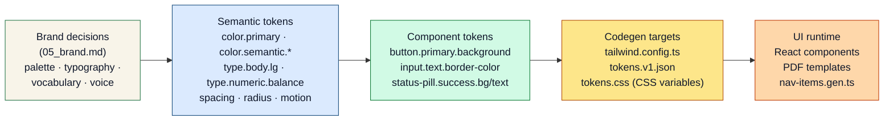

# 06 — Design System: Mi Banquito

**Project:** Mi Banquito (`fcostudios__mi-banquito`)
**Step:** 6 — Design System
**Date:** 2026-05-28
**Author:** Francisco Lomas (via Nous pipeline, `prompts/design_system.md`)
**Report language:** en-US (spec convention); product UI strings es-EC
**PRIOR_WORK:**
- `Nous/Specs/fcostudios/mi-banquito/PRODUCT_BRIEF.md`
- `Nous/Specs/fcostudios/mi-banquito/v1/01_research.md`
- `Nous/Specs/fcostudios/mi-banquito/v1/02_cx_personas.md`
- `Nous/Specs/fcostudios/mi-banquito/v1/03_cx_journeys.md`
- `Nous/Specs/fcostudios/mi-banquito/v1/03b_service_blueprint.md`
- `Nous/Specs/fcostudios/mi-banquito/v1/04_er_model.md`
- `Nous/Specs/fcostudios/mi-banquito/v1/05_brand.md`

---

---SECTION: SEC0---

## Design System Executive Summary

Mi Banquito's Design System realizes the brand decisions from `05_brand.md` (*El cuaderno digital del grupo* — warm cream canvas, deep trust-green primary, plain-Spanish vocabulary lock, Inter typography at 18 px default body) into a concrete, machine-readable token + component catalogue ready for codegen and frontend development. It serves **two surfaces** with deliberately different visual cultures: the **treasurer console** (the bulk of the product — `30-second test` discipline, large-touch, generous spacing, low-density) and the **`/admin` slice** (expert tool for the Platform Operator — denser tables, technical vocabulary, CLI-style affordances). Both surfaces share color tokens, typography, and the same component primitives; they diverge in **density**, **voice**, and **information architecture**.

The system is built atom-up (Buttons, Inputs, StatusPills, Icons) → molecules (FormField, CurrencyInput, MemberPicker, AlertCard) → organisms (Sidebar, MemberList, ReconciliationPanel, CashFlowProjectionChart, FirstRunWizard) → templates (AppShellTreasurer, AppShellAdmin, DialogTemplate, WizardStepper) → pages (mapped to the 22 ER entities and 20 backstage processes from `03b_service_blueprint.md`). Every component lists its data bindings to the ER model, so the same catalogue feeds Step 7 (Screens) without re-derivation.

**3–7 key outcomes this Design System enables:**

- **A single source of truth for vocabulary** — every UI string lives in `strings.es-EC.json` keyed by the locked vocabulary from `05_brand.md §SEC5`; no jargon can creep in.
- **A single source of truth for compliance encoding** — green/amber/red status pills are one design primitive, used identically in A/R aging, loan list, member compliance, and reconciliation discrepancy.
- **A single canonical PDF template** that the treasurer's statement, monthly close, and year-end share-out all derive from — guaranteeing the trust artifact is consistent.
- **A reusable confirmation pattern** that surfaces full-sentence Spanish destructive-action confirmations and reversal flows by default (never a yes/no modal).
- **Cross-surface consistency on color + type but visual divergence on density** — the treasurer never accidentally lands on an admin-style screen and vice versa.
- **HR-30 compliant sidebar** with id / route / icon / roles / `label_en` / `label_es` / `labelKey` per item; Lucide-from-allow-list icons; generation-ready for `nav-items.gen.ts`.
- **Codegen-ready tokens** — SEC9 JSON is consumable by Tailwind config, CSS variables, and React component theming.

---

---SECTION: SEC1---

## Context, Inputs and Scope

### SEC1.1 Inputs Overview

| Input | What it provided |
|---|---|
| `01_research.md` (RAW) | Tier `S` sizing, 9 processes, AS-IS pain points (paper + Excel + WhatsApp), TO-BE design principles (no jargon, append-only, reconciliation as workflow). |
| `02_cx_personas.md` (PERSONAS) | 4 personas including the platform operator (P04); accessibility constraints (≥16 px body, ≥48 px tap targets, high-contrast default); UX anti-patterns. |
| `03_cx_journeys.md` + `03b_service_blueprint.md` (CJ + SBP) | 6-stage treasurer journey + 5 cascades + 14-alert catalogue + cash-flow projection design rule. |
| `04_er_model.md` (ER) | 22 entities across 9 bounded contexts; append-only invariant; status enums (`activo / al_día / atrasado / en_mora / pendiente / parcial / pagado / cancelado`). |
| `05_brand.md` (BRAND) | Palette (with hex + WCAG AA verification), typography (Inter, 18 px default), iconography (Lucide outline), 21-word vocabulary lock, microcopy seed. |
| Tech constraints | PWA (Next.js + Tailwind) per `01_research.md §6.1`; low-end Android target; intermittent 3G; offline-tolerant read paths. |
| Locales | Primary `es-EC` (USD, `America/Guayaquil`, `dd/MM/yyyy`, `$1.250,00` per `OQ-BR-2`). Secondary `en-US` deferred to R3. |

### SEC1.2 Product Context

Mi Banquito is the treasurer's daily tool for managing an informal Ecuadorian community savings group. The primary user is **non-technical**, **phone-first**, **mid-life adult**, **Spanish-only**, **anxiety-sensitive about reputation**, and **abandons silently within 30 seconds** if the product reads as "a system." Members and the group president never log in in R1 — they consume PDF statements via WhatsApp. The Platform Operator (Francisco) is the only expert user; the `/admin` surface is built for them.

### SEC1.3 Scope of This Design System

**In scope (R1):**

- **Color**, **typography**, **spacing**, **radius**, **shadow**, **breakpoints**, **z-index**, **motion** tokens.
- **App shells** for treasurer console + admin slice; sidebar configuration per HR-30.
- **3 page templates**: `dashboard-home`, `list-detail`, `wizard-stepper` (plus dialog template).
- **~12 atoms + ~14 molecules + ~12 organisms** (full catalogue below).
- **Entity-to-UI mapping** for 22 ER entities.
- **PDF templates** for `StatementArchive.kind ∈ {monthly_close, monthly_member, year_end_share_out, year_end_member}`.
- **`strings.es-EC.json`** lock with the brand's 21-word vocabulary.
- **`app_shell` JSON** (SEC4.5) + **`component_vocabulary` JSON** (SEC4.6) per IMP-143.

**Out of scope (R1, deferred):**

- Detailed motion specifications (some baseline easings shipped; full motion-catalog choreography deferred — `05_brand.md` already locks "no animations > 200 ms" and "no parallax / no auto-rotating carousels").
- Member-side PWA (R2).
- Admin BI dashboards (R2).
- WhatsApp Business API copy direction (R2).
- Multi-language string variants beyond es-EC (R3).
- Full SwiftUI / Flutter port — R1 ships PWA only.

---

---SECTION: SEC2---

## Design Principles and UX Foundations

### SEC2.1 Core UX Principles

These derive from `02_cx_personas.md §SEC9` + `05_brand.md §SEC8`. **6 principles** carry through every component decision:

1. **30-second test.** Every screen must let a first-time non-technical user accomplish the primary action alone in 30 seconds. *Implication on UI:* 1 primary CTA per screen, generous spacing, visible labels, no advanced/expert toggles, no settings on primary nav.
2. **Like a notebook, not a system.** Warm cream canvas, thin borders, ink-dark text, no glass-morphism / no gradient hero / no chrome-heavy app UI. *Implication:* cards have thin `Línea` borders, not heavy shadows; tables use `Línea Suave` alternating rows.
3. **Plain Spanish vocabulary lock.** All UI strings flow through `strings.es-EC.json` with the locked 21-word vocabulary. *Implication:* no "Crear contribución" — always "Registrar aporte"; no English loanwords.
4. **Reversible, recorded, defensible.** No destructive deletes anywhere. Reversal entries only. *Implication:* the UI offers *"Hacer una reversión"*, not "Delete"; confirmations require a reason.
5. **Calm proactive, not alarmist.** Alerts surface clearly but never block. Discrepancies highlighted in amber/red text on amber/red BG only on the offending row — never as full-screen modals. *Implication:* no urgent-red blocking modals; only the in-flow pre-flight constraint violation (loan exceeds capital) blocks user action.
6. **Treasurer authority is final.** Soft warnings can be overridden with a reason; the system only blocks on hard constraint violations. *Implication:* every "block" UI offers an override path (where allowed) or a clear "edit your inputs" path.

### SEC2.2 Persona-driven UX Priorities

| Persona | Primary tasks | Critical UX needs | Implications for UI |
|---|---|---|---|
| **La Tesorera (P01)** | S1–S6 daily/monthly cycle | Phone-first; ≥ 48 px tap targets; ≥ 18 px body; no jargon; one-tap daily actions; offline-tolerant read | Treasurer console — large defaults, generous spacing, vocabulary-locked microcopy |
| **El Presidente (P02)** | Reads PDF monthly close | Bank-statement-credible artifact via WhatsApp preview | PDF template must render legibly on WhatsApp's PDF preview; group logo + integrity hash footer |
| **El Miembro/a (P03)** | Receives PDF statement | Same as P02 + memory must match the statement | Per-member PDF template; integrity hash footer |
| **La Operadora (P04)** | PA-S1..PA-S7 admin tasks | Dense info; CLI affordances; cross-tenant view; read-only impersonation | `/admin` slice — denser tables, raw IDs visible, terminal-style monospace where appropriate, no 30-second test discipline |

### SEC2.3 UX Heuristics & Constraints

- **Consistency:** the same status pill renders identically wherever it appears (A/R aging, loan list, member list, reconciliation). The same `Registrar aporte` button appears in the same shape and color on home, member-detail, and the in-flow step of S2.
- **Visibility of system status:** every async action has a specific loading label ("Calculando saldo…", "Generando estado…"); never a bare spinner.
- **Error prevention:** pre-flight constraint checks (`EvaluateLoanEligibility`) BEFORE write commits; reversal pattern (not delete) avoids the worst class of mistake.
- **Recognition over recall:** member picker shows recent members first; deposit amount remembers the cycle default.
- **Tech constraints:**
  - PWA target — must work installed on Android home screen with intermittent 3G.
  - No heavy animations (max 200 ms easings).
  - No third-party UI libraries that bloat the bundle (Tailwind + a tiny composable component library, written in-house; Headless UI for accessible primitives only).
  - Read paths must work offline (service worker caches GET endpoints); write paths queue + retry with `client_request_id` idempotency.

---

---SECTION: SEC3---

## Brand & Visual Language

### SEC3.1 Brand Essence & Tone

From `05_brand.md`: **"El cuaderno digital del grupo."** Tone: *cercana, clara, confiable, respetuosa, reposada*. Register: Spanish `tú` by default (`OQ-BR-1` validation pending). Microcopy uses specific data, not generic phrases — e.g., *"Aporte de María registrado — USD 50, 12 de mayo."*

The design system enforces the tone through:
- A **`strings.es-EC.json`** with templated keys (every string a function of `{member_name}`, `{currency}`, `{amount}`, `{date}` — never generic).
- Component props that **require** binding to entity data (no `<Button>Save</Button>` with hardcoded text — buttons are `<PrimaryButton labelKey="action.record_contribution">` and the strings file resolves them).

### SEC3.2 Color System (Conceptual)

Inherited from `05_brand.md §SEC7`. Semantic mapping for the design system:

| Token | Hex | Semantic role |
|---|---|---|
| `color.primary` | `#2D7A4F` (Verde Confianza) | Primary CTAs, primary brand accents |
| `color.background` | `#F8F4E9` (Crema Cuaderno) | App canvas |
| `color.surface` | `#FFFFFF` | Cards, modals, table backgrounds (sparingly — most surfaces are canvas) |
| `color.surface.muted` | `#E2E8F0` (Línea Suave) | Alternating table rows |
| `color.border` | `#CBD5E1` (Línea) | Dividers, card borders |
| `color.secondary` | `#1E5180` (Azul Cuenta) | Links, secondary CTAs, statement PDF accents |
| `color.accent` | `#C45F36` (Terracota Comunidad) | Human moments (welcome, year-end share-out) |
| `color.semantic.success` | `#15803D` | `al_día`, `pagado`, `activo` |
| `color.semantic.warning.text` | `#C2410C` | `atrasado` text |
| `color.semantic.warning.bg` | `#FED7AA` | `atrasado` background |
| `color.semantic.info.text` | `#B45309` | `pendiente`, `parcial` text |
| `color.semantic.info.bg` | `#FDE68A` | `pendiente`, `parcial` background |
| `color.semantic.error.text` | `#B91C1C` | `en_mora`, `error`, discrepancy |
| `color.semantic.error.bg` | `#FECACA` | error background |
| `color.text.primary` | `#0F172A` (Tinta Oscura) | Body text |
| `color.text.secondary` | `#475569` (Tinta Media) | Labels, secondary text |
| `color.text.onPrimary` | `#F8F4E9` | Text on primary buttons |

**Usage rules:**
- `color.primary` ONLY for the single primary CTA per screen + brand accents in PDF.
- `color.semantic.error` ONLY for genuine error states; not for delete confirmation buttons (which are `color.semantic.error` text only, not red BG).
- No use of `color.surface` (`#FFFFFF`) as full-screen background — `color.background` cream is the canvas.
- Status pills always pair text color + background color from the semantic.* family.

### SEC3.3 Typography

Inter (OFL). Variable font; SemiBold (600) for headings/numbers; Regular (400) for body.

| Token | Size | Line height | Weight | Use |
|---|---|---|---|---|
| `type.display.lg` | 32 px | 40 px | 600 | Large balance display, monthly-close summary |
| `type.display.md` | 24 px | 32 px | 600 | Screen titles |
| `type.heading.lg` | 20 px | 28 px | 600 | Section headings |
| `type.heading.md` | 18 px | 24 px | 600 | Card titles |
| `type.body.lg` | 18 px | 28 px | 400 | **Default body text** |
| `type.body.md` | 16 px | 24 px | 400 | Secondary text, table cells |
| `type.body.sm` | 14 px | 20 px | 400 | Footers, captions only |
| `type.numeric.balance` | 28 px | 36 px | 700, tabular-figures | Member balance, pool balance |
| `type.numeric.amount` | 20 px | 28 px | 600, tabular-figures | Transaction amounts in tables |
| `type.label.uppercase` | 12 px | 16 px | 600, letter-spacing 0.08em | Status pills only |
| `type.mono.sm` (admin only) | 13 px | 18 px | 400, IBM Plex Mono | Admin tables, hash displays, raw IDs |

### SEC3.4 Iconography & Illustration

- **Library:** Lucide (outline style, OFL).
- **Stroke weight:** 1.5 px at 24 px nominal.
- **Sizes:** `icon.sm = 16 px`, `icon.md = 20 px`, `icon.lg = 24 px`, `icon.xl = 32 px`.
- **Rule:** every icon paired with a Spanish label (no icon-only buttons except `IconButton` which carries an `aria-label`).

**Lucide allow-list (R1) — HR-30 compatible:**

`Home`, `Users`, `User`, `UserPlus`, `Wallet`, `Receipt`, `CreditCard`, `TrendingUp`, `TrendingDown`, `Calendar`, `Clock`, `CheckCircle2`, `AlertCircle`, `AlertTriangle`, `Bell`, `Settings`, `LogOut`, `ChevronRight`, `ChevronLeft`, `ChevronDown`, `ChevronUp`, `Plus`, `Search`, `Filter`, `MoreHorizontal`, `Eye`, `FileText`, `Download`, `Share2`, `Camera`, `Image`, `MessageCircle`, `RefreshCw`, `Undo2` (used for reversal — labeled "Hacer una reversión"), `Lock` (used for locked period close), `Unlock`, `Banknote`, `HandCoins`, `PiggyBank`, `History`, `BarChart3`, `LineChart`.

Illustrations (used sparingly): warm flat illustration with notebook/textile undertones; lives in `assets/illustrations/`. R1 illustration inventory: `welcome.svg`, `empty-contributions.svg`, `empty-members.svg`, `close-success.svg`, `year-end.svg`.

### SEC3.5 Imagery & Media

- Photography: sparingly; documentary LATAM community style only.
- Member avatars: **initials-based** by default (Spanish initials, e.g., `MG` for María González) on `color.semantic.info.bg`. No stock photo placeholders. Members can upload a photo (R2).
- Group logo: PNG/SVG uploaded by the treasurer at S1; appears at PDF header + app header (small).
- Slip photos: rendered as 56 × 56 px thumbnail on transaction rows; full-screen lightbox on tap; no transformation/cropping.

---

---SECTION: SEC4---

## Layout System & Responsive Grid

### SEC4.1 Viewport Breakpoints

Mi Banquito is **phone-first** for the treasurer console and **laptop-first** for the admin slice. Breakpoints:

| Token | Min width | Target |
|---|---|---|
| `bp.xs` | 320 px | Smallest Android phones (low-end target) |
| `bp.sm` | 480 px | Mid-range phones (most treasurer use) |
| `bp.md` | 768 px | Tablets + landscape phones |
| `bp.lg` | 1024 px | Laptop (admin primary, treasurer secondary) |
| `bp.xl` | 1280 px | Wide laptop / desktop (admin power-use) |

**Layout adaptation:**

- Treasurer console: single-column at `xs/sm`; two-column (sidebar + content) from `md`. Bottom nav bar at `xs/sm` instead of sidebar.
- Admin slice: two-column from `sm`; three-column (sidebar + content + drawer) at `lg+`.

### SEC4.2 Grid & Spacing

- **Grid:** 4 columns at `xs/sm`, 8 at `md`, 12 at `lg+`. Gutter = `spacing.md`.
- **Spacing scale (px):** `0, 2, 4, 8, 12, 16, 20, 24, 32, 40, 48, 64, 80`. Tokens: `space.0, space.0_5 (2), space.1 (4), space.1_5 (6 — UNUSED — kept off-scale), space.2 (8), space.3 (12), space.4 (16), space.5 (20), space.6 (24), space.8 (32), space.10 (40), space.12 (48), space.16 (64), space.20 (80)`. Default screen padding: `space.4` (16 px) on phone, `space.6` (24 px) on laptop.
- **Radius (px):** `radius.sm = 4`, `radius.md = 8`, `radius.lg = 12`, `radius.xl = 16`, `radius.full = 9999`. Default for buttons / inputs / cards: `radius.md` (notebook-corner feel; not super-rounded "pill" feel).
- **Shadow:** intentionally minimal. `shadow.none = 0 0 transparent` (default), `shadow.sm = "0 1px 2px rgba(15,23,42,0.06)"`, `shadow.md = "0 2px 8px rgba(15,23,42,0.08)"` (modals only). No `shadow.lg` — heavy shadows read as fintech.
- **z-index:** `z.base = 0`, `z.sticky = 10`, `z.drawer = 20`, `z.modal = 30`, `z.toast = 40`, `z.tooltip = 50`.
- **Motion:** `motion.fast = 120 ms`, `motion.base = 180 ms`, `motion.slow = 200 ms`. Easing: `motion.easing.standard = cubic-bezier(0.2, 0, 0, 1)` (Material standard, comfortable). **No motion > 200 ms** anywhere in the product.

### SEC4.3 Main Application Shell

**Treasurer console shell (`app-shell-treasurer`).**

- **Header (sticky, 56 px height).** Group logo (left, 32 × 32 px), group name (display.md, ellipsis), alert bell (right, with badge count), user avatar (right, opens menu drawer with `Mi grupo` link + `Cerrar sesión`).
- **Sidebar (collapsible, 240 px at `md+`, drawer on `xs/sm`).** Sections + items per SEC4.5 below.
- **Mobile bottom bar (xs/sm only, 64 px height, 5 items).** Items per SEC4.5 below.
- **Main content area.** Full width minus sidebar; `space.4` padding on phone, `space.6` on laptop. Title row (display.md heading, optional primary CTA on the right). Body region. No breadcrumbs in R1 (information architecture is 1–2 levels deep at most; breadcrumbs add noise).
- **Footer.** Minimal: small Mi Banquito + FcoStudios endorsement lockup (body.sm), `Versión X.Y.Z`, support link to FcoStudios. Footer is **off** on phone (saves vertical space) and **on** at `md+`.

**Admin slice shell (`app-shell-admin`).**

- **Header (sticky, 48 px height — denser).** "Mi Banquito · /admin" wordmark, env badge ("local" / "prod"), drift status badge (green/red), operator menu (impersonation state, sign-out).
- **Sidebar (always visible, 200 px).** Items per SEC4.5 (admin subsection).
- **Main content area.** Denser tables; raw IDs visible; tabular-figures; monospace where appropriate (hashes, IDs, timestamps).
- **No mobile bottom bar** — admin slice not optimized for phone.

### SEC4.4 Page Templates

**3 page templates** + a dialog template:

1. **`tpl.dashboard-home`** — for the treasurer's home + admin /admin home. Components: page title, optional alerts banner, 1–3 primary action tiles, list of "what's happening" (A/R aging on treasurer; per-org snapshot on admin). Used by: `SCR-treasurer-home`, `SCR-admin-home`.
2. **`tpl.list-detail`** — for any entity list + detail pair. Components: filter bar (optional), DataTable, RowDetailDrawer (slide-from-right at `md+`, full-screen at `xs/sm`). Used by: members, loans, contributions list, repayments list, statements archive list, admin org list.
3. **`tpl.wizard-stepper`** — for multi-step flows that legitimately need ordering (first-run group setup, year-end share-out approval). Components: stepper indicator (1/3, 2/3, 3/3), per-step body, prev/next bar. Used by: `SCR-first-run-wizard`, `SCR-year-end-share-out-wizard`. **Note:** daily actions are NOT wizards (per `03_cx_journeys.md` anti-pattern: "multi-step wizards for daily actions" — single-screen).
4. **`tpl.dialog`** — modal dialogs (confirmations, slip photo viewer). Constraint: dialogs require explicit dismiss; never auto-close.

### SEC4.5 Application Shell — `app_shell` JSON block (IMP-143 input contract)

```json
{
  "app_shell": {
    "header": {
      "wordmark": "Mi Banquito",
      "show_locale_toggle": false,
      "show_notifications_bell": true,
      "show_user_menu": true,
      "endorsement": "por FcoStudios"
    },
    "command_palette": {
      "enabled_at_release": "R2",
      "invocation_keys": ["Cmd+K", "Ctrl+K"]
    },
    "mobile_bottom_bar": {
      "items": [
        { "id": "nav-home", "label": "Inicio", "label_en": "Home", "icon": "Home", "route": "/", "screen": "SCR-treasurer-home", "roles": ["tesorera"], "position": "1" },
        { "id": "nav-members", "label": "Socias", "label_en": "Members", "icon": "Users", "route": "/socias", "screen": "SCR-members-list", "roles": ["tesorera"], "position": "2" },
        { "id": "nav-contributions", "label": "Aportes", "label_en": "Contributions", "icon": "Wallet", "route": "/aportes", "screen": "SCR-contributions-cycle", "roles": ["tesorera"], "position": "3" },
        { "id": "nav-loans", "label": "Préstamos", "label_en": "Loans", "icon": "HandCoins", "route": "/prestamos", "screen": "SCR-loans-list", "roles": ["tesorera"], "position": "4" },
        { "id": "nav-history", "label": "Historial", "label_en": "History", "icon": "History", "route": "/historial", "screen": "SCR-history", "roles": ["tesorera"], "position": "5" }
      ]
    },
    "sidebar": {
      "id_css_hook": "mi-banquito-sidebar",
      "section_dividers": [
        { "after_item_id": "nav-history", "label_es": "Cierre del mes", "label_en": "Monthly close" },
        { "after_item_id": "nav-close", "label_es": "Configuración", "label_en": "Settings" }
      ],
      "items": [
        { "id": "nav-home", "label": "Inicio", "label_en": "Home", "labelKey": "nav.home", "icon": "Home", "route": "/", "screen": "SCR-treasurer-home", "roles": ["tesorera"], "position": "top" },
        { "id": "nav-members", "label": "Socias", "label_en": "Members", "labelKey": "nav.members", "icon": "Users", "route": "/socias", "screen": "SCR-members-list", "roles": ["tesorera"], "position": "top" },
        { "id": "nav-contributions", "label": "Aportes", "label_en": "Contributions", "labelKey": "nav.contributions", "icon": "Wallet", "route": "/aportes", "screen": "SCR-contributions-cycle", "roles": ["tesorera"], "position": "top" },
        { "id": "nav-loans", "label": "Préstamos", "label_en": "Loans", "labelKey": "nav.loans", "icon": "HandCoins", "route": "/prestamos", "screen": "SCR-loans-list", "roles": ["tesorera"], "position": "top" },
        { "id": "nav-arrears", "label": "Atrasos", "label_en": "Overdue", "labelKey": "nav.arrears", "icon": "AlertCircle", "route": "/atrasos", "screen": "SCR-ar-aging", "roles": ["tesorera"], "position": "top", "badge": { "source": "alerts_count_severity_high" } },
        { "id": "nav-history", "label": "Historial", "label_en": "History", "labelKey": "nav.history", "icon": "History", "route": "/historial", "screen": "SCR-history", "roles": ["tesorera"], "position": "top" },
        { "id": "nav-close", "label": "Cierre del mes", "label_en": "Monthly close", "labelKey": "nav.monthly_close", "icon": "CheckCircle2", "route": "/cierre", "screen": "SCR-monthly-close", "roles": ["tesorera"], "position": "middle" },
        { "id": "nav-statements", "label": "Estados de cuenta", "label_en": "Statements", "labelKey": "nav.statements", "icon": "FileText", "route": "/estados", "screen": "SCR-statements-archive", "roles": ["tesorera"], "position": "middle" },
        { "id": "nav-liquidity", "label": "Liquidez proyectada", "label_en": "Projected liquidity", "labelKey": "nav.liquidity", "icon": "LineChart", "route": "/liquidez", "screen": "SCR-cash-flow-projection", "roles": ["tesorera"], "position": "middle" },
        { "id": "nav-share-out", "label": "Reparto fin de año", "label_en": "Year-end share-out", "labelKey": "nav.year_end", "icon": "PiggyBank", "route": "/reparto", "screen": "SCR-year-end-share-out", "roles": ["tesorera"], "position": "middle" },
        { "id": "nav-group", "label": "Mi grupo", "label_en": "My group", "labelKey": "nav.group_settings", "icon": "Settings", "route": "/grupo", "screen": "SCR-group-config", "roles": ["tesorera"], "position": "bottom" }
      ]
    }
  }
}
```

**Admin sidebar (separate `app-shell-admin` config, not duplicating the same JSON wrapper to avoid overriding the treasurer sidebar; emitted in SEC9 design system JSON below):**

| id | label_es | label_en | icon | route | roles | position |
|---|---|---|---|---|---|---|
| `admin-orgs` | Organizaciones | Organizations | `Users` | `/admin/orgs` | `platform_operator` | top |
| `admin-org-detail` | Detalle de org | Org detail | `Eye` | `/admin/orgs/[id]` | `platform_operator` | top |
| `admin-impersonation` | Ver como tesorera | View as treasurer | `Eye` | `/admin/impersonate` | `platform_operator` | middle |
| `admin-export` | Exportar datos | Export data | `Download` | `/admin/orgs/[id]/export` | `platform_operator` | middle |
| `admin-audit` | Bitácora | Audit log | `History` | `/admin/audit` | `platform_operator` | bottom |
| `admin-drift` | Estado del substrato | Substrate drift | `AlertTriangle` | `/admin/drift` | `platform_operator` | bottom |

### SEC4.6 Component vocabulary — `component_vocabulary` JSON block (IMP-143 input contract)

```json
{
  "component_vocabulary": [
    "metric-cards",
    "data-table",
    "cards-grid",
    "form",
    "filters",
    "tabs",
    "tabbed-panel",
    "modal",
    "drawer",
    "info-banner",
    "alert-card",
    "notification-list",
    "action-bar",
    "hero",
    "wizard-stepper",
    "timeline",
    "ar-aging-list",
    "cash-flow-line-chart",
    "currency-input",
    "member-picker",
    "slip-uploader",
    "status-pill",
    "transaction-row",
    "pdf-template-statement",
    "reconciliation-panel"
  ]
}
```

> Custom Mi-Banquito-specific component types (e.g., `ar-aging-list`, `cash-flow-line-chart`, `reconciliation-panel`, `pdf-template-statement`) are listed without a tenant prefix because they are R1 components, not tenant-special; if `mibanquito-*` prefixes are needed they can be added in Step 7.

---

---SECTION: SEC5---

## Components Library (Atoms, Molecules, Organisms)

### SEC5.1 Component Taxonomy

| Tier | Examples |
|---|---|
| **Atoms** | Buttons, Inputs, Icon, StatusPill, Avatar, Spinner, Switch, Checkbox, RadioGroup, Link, Divider, Tag |
| **Molecules** | FormField, CurrencyInput, AmountInput, DatePicker, MemberPicker, SlipUploader, EmptyState, AlertCard, ConfirmationModal, SuccessFeedback, MemberRow, LoanRow, TransactionRow, KpiTile |
| **Organisms** | AppHeader, Sidebar, BottomBar, MemberList, TransactionList, ARAgingList, LoanCard, ReconciliationPanel, CashFlowProjectionChart, AlertsBell+List, MonthlyClosePanel, YearEndShareOutEditor, FirstRunWizard, PDFStatementTemplate, AdminOrgTable |
| **Templates** | AppShellTreasurer, AppShellAdmin, DialogTemplate, WizardStepperTemplate |

### SEC5.2 Atoms

Below: each atom with id, description, states, key props, and data binding expectations.

#### `atom.button.primary`

- **Description.** Single primary CTA per screen. Filled, `color.primary` background, `color.text.onPrimary` foreground.
- **States.** `default, hover, active, focus, disabled, loading`.
- **Props.** `labelKey: string` (resolved via `strings.es-EC.json`), `size: 'md' | 'lg'`, `icon?: LucideIconName`, `loading?: boolean`, `disabled?: boolean`, `onPress: () => void`.
- **Tokens.** `background: color.primary`, `text: color.text.onPrimary`, `radius: radius.md`, `padding: space.3 space.4`, `min-height: 48 px` (tap-target invariant).
- **Data bindings.** None at the atom level; `labelKey` resolves a string template that may interpolate `{member_name}`, `{amount}`, `{currency}`.
- **Usage.** "Registrar aporte", "Cerrar mes", "Continuar".

#### `atom.button.secondary`

- Variant: `outline`, `color.secondary` border + text on cream background.

#### `atom.button.ghost`

- No border / no background. Used for tertiary actions (cancel, "Saltar tutorial").

#### `atom.button.destructive`

- **Special variant** for reversal flows. Foreground `color.semantic.error.text` text; outline + light `color.semantic.error.bg` background; ONLY appears in confirmation modals; label is *"Hacer una reversión"* (NOT "Eliminar" — vocabulary lock).

#### `atom.icon-button`

- Square (48 × 48 px tap target). Icon-only buttons require `aria-label`.

#### `atom.link`

- Inline `color.secondary` text with underline-on-hover. Used in body copy and microcopy ("¿Qué es esto?", "Ver historial de María").

#### `atom.input.text`

- **Description.** Single-line text input with visible label above.
- **States.** `default, focus, disabled, error`.
- **Props.** `labelKey`, `placeholderKey?`, `helperTextKey?`, `errorMessageKey?`, `required?: boolean`, `value`, `onChange`.
- **Tokens.** `border: color.border` (default), `border: color.primary` (focus), `border: color.semantic.error.text` (error). `font: type.body.lg`. `padding: space.3 space.4`. `min-height: 48 px`.
- **Data bindings.** `Member.display_name`, `Member.whatsapp_number`, `Loan.purpose`, `Expense.purpose`, etc.

#### `atom.input.number`

- Numeric input with proper `inputmode="decimal"`. Used inside `molecule.currency-input` and `molecule.amount-input`.

#### `atom.select`

- Native `<select>` styled to match design system (avoids the overhead of a custom dropdown for R1).
- **Data bindings.** Enum status fields, member dropdowns (via MemberPicker molecule when search is needed).

#### `atom.switch`

- Toggle. Used in group config screen for booleans (`pays_savings_interest`).

#### `atom.checkbox`, `atom.radio`

- Standard accessibility-compliant primitives via Headless UI.

#### `atom.status-pill`

- **Description.** The compliance encoding primitive. Renders entity status with the locked color + label.
- **States.** `default, focus` (for keyboard nav when interactive).
- **Props.** `status: 'al_dia' | 'pendiente' | 'parcial' | 'atrasado' | 'en_mora' | 'pagado' | 'activo' | 'en_pausa' | 'baja' | 'cancelado'`, `size: 'sm' | 'md'`, `interactive?: boolean`.
- **Tokens.**

| Status | Background | Text |
|---|---|---|
| `al_dia`, `pagado`, `activo` | `color.semantic.success` 12% opacity | `color.semantic.success` |
| `pendiente`, `parcial` | `color.semantic.info.bg` | `color.semantic.info.text` |
| `atrasado` | `color.semantic.warning.bg` | `color.semantic.warning.text` |
| `en_mora`, `cancelado` | `color.semantic.error.bg` | `color.semantic.error.text` |
| `en_pausa`, `baja` | `color.surface.muted` | `color.text.secondary` |

- **Data bindings.** Any status enum from `04_er_model.md`.
- **Critical invariant.** This is the ONLY component that renders status colors. Every other component that displays status uses this. **`linting-rule:`** any color literal matching `#15803D / #B45309 / #C2410C / #B91C1C` outside this component's CSS = build fail.

#### `atom.avatar`

- Initials-based by default; optional photo URL (R2). Sizes `sm = 24 px`, `md = 32 px`, `lg = 48 px`.

#### `atom.spinner`

- Used inside loading states. Always paired with a label (`molecule.loading-state`).

#### `atom.tag`

- Small pill-shaped label for non-status metadata (e.g., loan rate, period label "2026-05").

#### `atom.divider`

- 1 px `color.border` line. Used between sections.

### SEC5.3 Molecules

#### `molecule.form-field`

- **Description.** Label + input + helper text + error. Vertical stack.
- **Children.** `atom.input.*` + label + helper + error.
- **Props.** All props of the underlying input + `labelKey` (visible) + `helperTextKey?` + `errorMessageKey?`.
- **Data bindings.** Any single attribute of any entity.

#### `molecule.currency-input`

- **Description.** Currency-formatted input — auto-formats `$1.250,00` style; underlying value is `decimal(18,4)`.
- **Children.** `atom.input.number` with `inputmode="decimal"`, prefix `$`, locale-aware formatter.
- **Props.** `value`, `onChange`, `currency = 'USD'` (from `Organization.currency_code`), `locale = 'es-EC'`.
- **Data bindings.** `Contribution.amount`, `Withdrawal.amount`, `Loan.principal_amount`, `Repayment.amount`, `Expense.amount`.

#### `molecule.amount-input`

- Variant of currency-input that adds a "numeric keypad" mobile-optimized layout.

#### `molecule.date-picker`

- Native `<input type="date">` styled; locale `es-EC` (`dd/MM/yyyy`).
- **Data bindings.** `dated_on`, `joined_on`, `originated_on`, `incurred_on`.

#### `molecule.member-picker`

- **Description.** Autocomplete with partial-name search; shows avatar + name + current balance.
- **Children.** `atom.input.text` (search box) + dropdown of `molecule.member-row.compact`.
- **Props.** `org_id` (required for cross-tenant safety), `onSelect: (memberId) => void`, `excludeIds?: string[]`, `roleFilter?: 'aportante' | ...`.
- **Data bindings.** `Member` (filtered by `org_id`, `status = activo`).
- **Behavior.** Recent-first; partial match; max 5 results; ENTER selects top match.

#### `molecule.slip-uploader`

- **Description.** Capture or pick a slip photo and attach to a transaction.
- **Children.** `atom.button.secondary` ("Tomar foto del comprobante" / "Elegir de la galería") + thumbnail preview + `atom.icon-button` (`Trash` — but labeled "Quitar foto" — does NOT delete the SlipPhoto record, only un-attaches before submit).
- **Props.** `onAttach: (slipPhotoId) => void`, `currentSlipPhotoId?: string`.
- **Data bindings.** `SlipPhoto`.
- **Constraint.** Max 5 MB; image only; compresses to ≤ 1024 px on the long edge before upload.

#### `molecule.empty-state`

- **Description.** Empty list / empty cycle state.
- **Children.** Optional illustration (`illustration.empty-contributions.svg`), heading (body.lg), primary CTA (`atom.button.primary` typically).
- **Props.** `illustration?`, `headingKey`, `ctaLabelKey?`, `onCtaPress?`.
- **Data bindings.** None.

#### `molecule.alert-card`

- **Description.** One alert in the alerts list. Renders any of the 14 alert kinds.
- **Children.** `atom.icon` (icon varies per alert.severity) + heading + body + actions row (`Atender`, `Posponer 7 días`, `Marcar como visto`).
- **Props.** `alert: Alert` (entity), `onDismiss`, `onSnooze`, `onAct`.
- **Data bindings.** `Alert` (full row).
- **Tokens.** Border-left in severity color; rest of the card on `color.surface`.

#### `molecule.confirmation-modal`

- **Description.** Full-sentence destructive-action confirmation per `03_cx_journeys.md §SEC9 Rec 9`.
- **Children.** Title (display.md), body (body.lg, full Spanish sentence with concrete values), `molecule.form-field` for reason (required for reversal), `atom.button.destructive` + `atom.button.ghost` (Cancelar).
- **Props.** `titleKey`, `bodyKey`, `bodyValues: { member_name, amount, date, currency }`, `requireReason?: boolean`, `onConfirm: (reason) => void`, `onCancel`.
- **Data bindings.** Reads target entity for the body interpolation; writes a `reverses_id` + `reverse_reason` to the entity being reversed.

#### `molecule.success-feedback`

- Inline confirmation appearing below a primary action ("Aporte de María registrado — USD 50, 12 de mayo." + `atom.link` "Ver historial").

#### `molecule.member-row`

- Member name + role + current balance + status pill. Tap → member detail. Used in MemberList organism.

#### `molecule.loan-row`

- Loan principal + member name + outstanding + next due + status pill.

#### `molecule.transaction-row`

- Date + transaction kind (Aporte / Pago / Retiro) + amount + slip thumbnail + status (locked period marker if applicable).
- **Data bindings.** `Contribution`, `Withdrawal`, `Repayment` (rendered uniformly via discriminated union).

#### `molecule.kpi-tile`

- Single metric display: large number + label. Used on home screen ("Saldo del banco", "Aportes este mes").

### SEC5.4 Organisms

#### `organism.app-header`

- Sticky 56 px top bar. Logo, group name, alerts bell, user menu. Treasurer surface.

#### `organism.sidebar`

- Vertical 240 px nav per SEC4.5 config. Generated from `nav-items.gen.ts` (which is generated from `07c_navigation_map.json` per HR-30).

#### `organism.bottom-bar` (mobile only)

- 5-item bottom tab bar per SEC4.5. Visible at `xs/sm`.

#### `organism.member-list`

- Full members list with filter (status, role) + search (partial-name) + sort (name / joined-on / balance).
- **Tokens & layout.** Uses `tpl.list-detail`. Each row: `molecule.member-row`.
- **Data bindings.** `Member[]` filtered by `org_id`.

#### `organism.transaction-list`

- Unified transaction history (contributions + withdrawals + repayments + expenses + interest accruals). Filters by date range, kind, member. Search across.
- **Data bindings.** Polymorphic over the 5 ledger entities + `InterestAccrual`.
- **Constraint.** Read-only — to create a reversal, tap the transaction row → row detail drawer → "Hacer una reversión" CTA.

#### `organism.ar-aging-list`

- Live A/R aging derived view. Sorted by days-late desc. Each row: member + reason (contribution / loan) + amount + days late.
- **Data bindings.** Derived view `liquidez_proyectada` + `member_compliance_state` (per `03b §1`).
- **Inline actions.** "Avisar por WhatsApp" (opens WhatsApp share intent with pre-filled gentle message — per `03_cx_journeys.md §SEC4 S4 TO-BE #2`).

#### `organism.loan-card`

- Full loan detail card: terms + schedule + repayment history + accrual log. Used on loan-detail page.
- **Data bindings.** `Loan + LoanSchedule[] + Repayment[] + InterestAccrual[]`.

#### `organism.reconciliation-panel`

- The S5 reconciliation workflow. Single-screen flow: enter declared bank balance → immediately show discrepancy → resolve or annotate → close.
- **Data bindings.** Writes `ReconciliationCycle`; on close writes `PeriodClose` (via `LockPeriodClose` process P13).
- **Brand-defining moment per `05_brand.md §SEC8 Principle 3`.** Calm tone; primary CTA "Cerrar el mes" only enabled when discrepancy is within tolerance OR annotated.

#### `organism.cash-flow-projection-chart`

- The single Liquidez Proyectada screen per `03b §5`. Line chart of 12-month projection + narrative explanation + optional sandbox.
- **Data bindings.** Reads `liquidez_proyectada` derived view.
- **Constraint.** No drill-down in R1 per `03b §5`.

#### `organism.alerts-bell-list`

- Bell icon in app header → opens slide-out list of `Alert` entities.
- **Data bindings.** `Alert[]` filtered by `org_id`, undismissed + not snoozed.

#### `organism.monthly-close-panel`

- Generates monthly close PDF; shows preview; provides "Compartir cierre por WhatsApp" share intent.
- **Data bindings.** Reads cycle ledger; writes `StatementArchive (kind = monthly_close)`.

#### `organism.year-end-share-out-editor`

- Wizard for year-end share-out (the highest-stakes annual screen). Per-member draft + override + reason + approval.
- **Data bindings.** Writes `YearEndShareOut + YearEndShareOutLine[]`.

#### `organism.first-run-wizard`

- 3-screen group setup at S1.

#### `organism.pdf-statement-template`

- Server-side PDF generator producing 4 statement kinds (`monthly_close`, `monthly_member`, `year_end_member`, `year_end_share_out`).
- **Layout.** Cream BG, group logo top-left, Mi Banquito brand mark + "Documento del grupo" header, body table, hash footer.
- **Constraint per `03b §2 P14 note`.** Canonical-JSON hash, not byte-of-PDF hash — font-rendering-safe.

#### `organism.admin-org-table`

- Admin-only. Dense table of all orgs with last-activity, last-close, reconciliation accuracy, slip storage used.

### SEC5.5 Component Variants by Persona / Context

| Component | Treasurer variant | Admin variant |
|---|---|---|
| `organism.member-list` | Generous spacing, large rows, balance prominent | Dense rows, raw `id` visible, balance secondary |
| `organism.transaction-list` | Per-transaction date front, slip thumbnail | Per-org filter, raw `id`, hash visible |
| `organism.alerts-bell-list` | Friendly Spanish messages | Aggregated counts + raw `alert_kind` codes |
| `organism.cash-flow-projection-chart` | Narrative-first; chart secondary | Chart-first; narrative collapsible |
| Page padding | `space.4` (16 px) on phone | `space.3` (12 px) — denser |
| Table row height | `space.12` (48 px min) | `space.8` (32 px) |
| Font family | Inter only | Inter + IBM Plex Mono for IDs / hashes |

---

---SECTION: SEC6---

## Interaction Patterns & Behaviors

### SEC6.1 Navigation Patterns

- **Global nav (treasurer).** Sidebar at `md+`, bottom bar at `xs/sm`. 11 items total — split into 3 sections (Daily, Cierre del mes, Configuración). No breadcrumbs.
- **Global nav (admin).** Sidebar only (always visible). 6 items split into 3 sections.
- **In-page nav.** Tabs used sparingly (loan detail = "Resumen / Cronograma / Pagos / Historial"). Drawer pattern for row detail (slide-from-right at `md+`, full-screen on phone).

### SEC6.2 Data Entry & Forms

- **Single-screen rule for daily actions** per `03_cx_journeys.md` anti-pattern. Registrar aporte / Registrar pago = one screen + confirm.
- **Validation:** inline, on blur (not on every keystroke); show `errorMessageKey` from `strings.es-EC.json`; never generic "Invalid input."
- **Confirmation:** full Spanish sentence in `molecule.confirmation-modal` — see `05_brand.md §SEC9` for templates.
- **Reversal:** *"Hacer una reversión"* flow requires a reason; uses `atom.button.destructive` only inside the confirmation modal (never on the row itself).
- **Wizards:** allowed only for first-run group setup + year-end share-out approval. Max 3 steps. Stepper indicator visible.

### SEC6.3 Feedback & System Status

- **Toasts:** sparingly. Only for true async events that the user doesn't see directly (e.g., "Estado de cuenta enviado por WhatsApp"). Position: bottom-center, dismissible, `motion.base` (180 ms) fade.
- **Inline confirmations:** preferred (e.g., "Aporte registrado" appears below the form, no toast).
- **Loading states:** specific label always — *"Calculando saldo…"*, *"Generando estado…"*. Spinner with label, never alone. Skeletons used for first-page-load of list views; never for individual buttons.
- **Empty states:** `molecule.empty-state` everywhere — 1-line explanation + single CTA.

### SEC6.4 Errors & Incident Handling

- **Field-level errors:** specific, actionable, in Spanish, body.lg — *"Falta poner el monto del aporte."*
- **Form-level errors:** banner at top of form, summarizes field issues; auto-focuses the first invalid field.
- **System errors (5xx, network):** humane copy — *"Algo no funcionó. Intenta de nuevo o avísanos."* with a single Retry button. **Never** a stack trace or error code in user-facing copy. The error log goes to the audit log + alerts the platform operator.
- **Recoverable vs non-recoverable:**
  - Recoverable: retry button.
  - Non-recoverable (e.g., locked period): explanation + path forward — *"Este mes ya está cerrado. La corrección quedará en el período siguiente."*

### SEC6.5 Real-time or Near Real-time Interactions

- **A/R aging is live** — updates immediately after every contribution/repayment commit (per `03b §3 C1`).
- **Compliance derived view is live** — updates as soon as a contribution is recorded.
- **Cash-flow projection** recomputes on the post-commit hook + daily cron — UI polls every 60 s when the projection screen is open.
- **Alerts bell** polls every 30 s for new alerts (or pushes via SSE if available; deferred).
- **No multi-user concurrency in R1** — only the treasurer writes. Server returns 409 if a concurrent treasurer-session write conflict occurs (extremely rare; only happens if treasurer is logged in on two devices).

---

---SECTION: SEC7---

## Data-Driven UI Mapping (ER Model → UI & Controls)

### SEC7.1 Entity-to-UI Mapping Table

| Entity | Main views | Primary components | Key fields → controls |
|---|---|---|---|
| `Organization` | (admin) detail | `organism.admin-org-detail`; (treasurer) read in header | `display_name` → text; `currency_code` → readonly chip; `timezone` → readonly text; `branding_logo_uri` → image uploader |
| `GroupConfig` | (treasurer) "Mi grupo" settings page (read + edit) | Form with `molecule.form-field` per field | `contribution_amount` → currency-input; `contribution_cycle_kind` → select; `loan_rate_value` → numeric-input (% format); `year_end_share_out_formula` → select; `safety_margin_amount` → currency-input |
| `PlatformOperator` | (admin only) profile / sign-out | Simple form | `display_name`, `email` (readonly) |
| `Impersonation` | (admin) start / end | Banner-style component when active | `mode` (readonly `read_only`) + `reason` (text required) + end button |
| `Member` | List, Detail, Edit (admit, freeze, exit) | `organism.member-list`, `organism.member-detail`, `molecule.form-field`s | `display_name` → text-input; `whatsapp_number` → text-input (E.164 mask); `role` → select; `status` → status-pill (read-only display); `joined_on` → date-picker |
| `ContributionCycle` | List (admin); Active-cycle view (treasurer) | `organism.contribution-cycle` (treasurer home) | Read-only: `cycle_label`, `opens_on`, `closes_on`, `expected_amount_per_member` |
| `Contribution` | List, Inline create flow | `organism.transaction-list`, `molecule.transaction-row`; create: single-screen | `member_id` → member-picker; `amount` → currency-input; `dated_on` → date-picker; `slip_photo_id` → slip-uploader; `notes` → text-input |
| `Withdrawal` | List, Inline create flow | Same components as Contribution | Same controls; `kind` enum select |
| `Expense` | List, Inline create flow | Same components | `purpose` → text-input; `beneficiary_member_id` → member-picker (optional) OR `beneficiary_text` → text-input |
| `SlipPhoto` | Inline thumbnail; lightbox view | `molecule.slip-uploader`; `atom.image-lightbox` | Upload: file input + compression |
| `Loan` | List, Detail, Originate flow | `organism.loan-card`, `organism.loan-list` | `member_id` → member-picker; `principal_amount` → currency-input; `term_periods` → numeric-input; `rate_value` → numeric-input (% format, default from GroupConfig); `purpose` → text-input |
| `LoanSchedule` | Embedded in `organism.loan-card` | `organism.schedule-table` (read-only) | Display only |
| `Repayment` | List (per-loan + global), Inline create | `molecule.transaction-row`; create: single-screen | Same controls as Contribution + auto-split breakdown displayed |
| `InterestAccrual` | Embedded in `organism.loan-card` (history) | Read-only timeline | Display only |
| `ReconciliationCycle` | Inline in monthly close flow | `organism.reconciliation-panel` | `declared_bank_balance` → currency-input; resolution → 3-button choice |
| `PeriodClose` | Inline in close flow; list in `nav-history` | `organism.history-list` row | Read-only; "Ver cierre" link → PDF preview |
| `StatementArchive` | List; PDF preview | `organism.statement-archive-list` + `organism.pdf-viewer` | List shows kind + period + hash; preview opens PDF |
| `YearEndShareOut` | Wizard | `organism.year-end-share-out-editor` | `formula_at_run` snapshot displayed read-only; `status` controls progress |
| `YearEndShareOutLine` | Embedded in year-end wizard | Editable table | `override_share_amount` → currency-input; `override_reason` → text-input (required if override) |
| `Alert` | Bell + list | `organism.alerts-bell-list` + `molecule.alert-card` | Read-only; actions: Atender / Posponer / Marcar visto |
| `AuditLogEntry` | "Historial" view (treasurer); admin audit log | `organism.history-list` (treasurer-friendly); `organism.admin-audit-table` (admin dense) | Treasurer sees plain-Spanish narration; admin sees raw `action_kind`, `actor_kind`, `payload_snapshot` |
| `EntityVersion` | Hidden behind `nav-history` "Versiones" tab | Read-only timeline | Display only |

### SEC7.2 Relationships & Composite Views

- **Organization → Member → Contribution → Cycle** — primary navigation hierarchy. Group settings → Member list → Member detail → Member statement (which includes contribution history).
- **Loan → LoanSchedule + Repayment[] + InterestAccrual[]** — the loan-detail composite view is the most complex single screen. Uses tabs ("Resumen / Cronograma / Pagos / Historial").
- **ReconciliationCycle → PeriodClose → StatementArchive[]** — the monthly close artifact chain. Surfaced through `organism.monthly-close-panel`.
- **YearEndShareOut → YearEndShareOutLine[] → Withdrawal[]** — the year-end share-out wizard exposes all three in sequence.
- **Master-detail with drawer (R1 default).** On `md+` the entity list shows on the left and the detail drawer slides from the right. On `xs/sm` the detail takes over the full screen.

### SEC7.3 Audit, Versioning & History

- **"Historial" view (treasurer-facing).** Plain-Spanish narration of every write — e.g., *"12 de mayo, 14:23 — Registraste un aporte de María por USD 50."* Generated from `AuditLogEntry.payload_snapshot` + `action_kind` mapping.
- **EntityVersion timeline.** Hidden behind a "Versiones" sub-tab; surfaced only for `GroupConfig` ("Cambiaste la tasa de interés de 2% a 2.5% el 12 de mayo") and `Loan.status` transitions ("El préstamo de Sandra pasó de 'activo' a 'pagado' el 30 de mayo").
- **Admin audit log.** Dense `organism.admin-audit-table` with full `payload_snapshot` JSON viewable per row.

---

---SECTION: SEC8---

## Accessibility & Internationalization

### SEC8.1 Accessibility Guidelines

- **Color contrast.** All text + interactive components ≥ WCAG AA (4.5:1). Body text 12:1 (Tinta Oscura on Crema Cuaderno).
- **Tap targets.** ≥ 48 × 48 px enforced as a CSS minimum on all interactive atoms.
- **Keyboard navigation.** Full tab order; visible focus rings (`outline: 2px solid color.primary; outline-offset: 2px`); `Esc` closes modals + drawers; arrow-key navigation in MemberPicker dropdown.
- **Screen reader.** All icons labeled; landmark roles (`<main>`, `<nav>`, `<header>`); ARIA live regions for toasts (`aria-live="polite"`) and alert-bell badge (`aria-live="assertive"` for new high-severity alerts).
- **Form labels.** Every input has a `<label>` element associated via `htmlFor`; placeholder text is NEVER the label.
- **Error messages.** Linked to inputs via `aria-describedby`.
- **Focus management.** Modal open → focus the first interactive element; modal close → focus returns to the trigger.
- **Color-blindness.** Status encoding pairs color + text label (status pills always have the Spanish text); never color-only.

### SEC8.2 Internationalization & Localization

- **Primary locale R1: `es-EC`.** All strings live in `strings.es-EC.json`.
- **Text-length variance.** Spanish strings are ~ 20–30% longer than English; layouts must accommodate (no truncation on key labels; ellipsis on long member names only).
- **Date format.** `dd/MM/yyyy`. Long form: `12 de mayo de 2026`.
- **Time format.** `HH:mm` (24-hour). Long form: `14:23`.
- **Number format.** Spanish-Ecuador: `1.250,00` (period thousands, comma decimal). Currency: `$1.250,00` (dollar sign + space + number). `OQ-BR-2` flagged for design-partner confirmation — may be `$1,250.00` (period decimal) depending on her bank statement convention.
- **Currency code.** Always `Organization.currency_code` (USD in R1); never hardcoded `'USD'` outside the design tokens.
- **Locale switching.** No UI for it in R1 (single locale). Header `show_locale_toggle: false` per SEC4.5.
- **Deferred locales.** `en-US`, `es-MX`, `es-CO`, `es-PE` per `05_brand.md`. Strings file structure prepared (top-level locale key) but only `es-EC` populated.

---

---SECTION: SEC9---

## Design Tokens & Design System JSON

### SEC9.1 Narrative Overview

The JSON below packages everything in SEC3–SEC7 into a single structure consumable by codegen tooling (Tailwind config generator, React component scaffold, PDF template generator). Keys are stable; values are concrete (not generic placeholders).

### SEC9.2 Design System JSON

```json
{
  "meta": {
    "productName": "Mi Banquito",
    "version": "1.0.0",
    "generatedAt": "2026-05-28T00:00:00Z",
    "source": {
      "researchId": "Nous/Specs/fcostudios/mi-banquito/v1/01_research.md",
      "personasId": "Nous/Specs/fcostudios/mi-banquito/v1/02_cx_personas.md",
      "erModelId": "Nous/Specs/fcostudios/mi-banquito/v1/04_er_model.md",
      "brandId": "Nous/Specs/fcostudios/mi-banquito/v1/05_brand.md"
    }
  },
  "tokens": {
    "color": {
      "primary": { "id": "color.primary", "value": "#2D7A4F", "usage": "Primary CTAs, brand accents, PDF accent" },
      "secondary": { "id": "color.secondary", "value": "#1E5180", "usage": "Links, secondary actions, PDF headers" },
      "accent": { "id": "color.accent", "value": "#C45F36", "usage": "Human moments only — welcome, year-end share-out" },
      "background": { "id": "color.background", "value": "#F8F4E9" },
      "surface": { "id": "color.surface", "value": "#FFFFFF" },
      "surface.muted": { "id": "color.surface.muted", "value": "#E2E8F0" },
      "border": { "id": "color.border", "value": "#CBD5E1" },
      "text.primary": { "id": "color.text.primary", "value": "#0F172A" },
      "text.secondary": { "id": "color.text.secondary", "value": "#475569" },
      "text.onPrimary": { "id": "color.text.onPrimary", "value": "#F8F4E9" },
      "semantic": {
        "success": { "id": "color.semantic.success", "value": "#15803D" },
        "info": { "id": "color.semantic.info", "text": "#B45309", "bg": "#FDE68A" },
        "warning": { "id": "color.semantic.warning", "text": "#C2410C", "bg": "#FED7AA" },
        "error": { "id": "color.semantic.error", "text": "#B91C1C", "bg": "#FECACA" }
      }
    },
    "typography": {
      "fontFamilies": {
        "base": "Inter, system-ui, -apple-system, sans-serif",
        "mono": "'IBM Plex Mono', ui-monospace, SFMono-Regular, monospace"
      },
      "sizes": {
        "display.lg": { "px": 32, "lineHeight": 40, "weight": 600 },
        "display.md": { "px": 24, "lineHeight": 32, "weight": 600 },
        "heading.lg": { "px": 20, "lineHeight": 28, "weight": 600 },
        "heading.md": { "px": 18, "lineHeight": 24, "weight": 600 },
        "body.lg": { "px": 18, "lineHeight": 28, "weight": 400, "isDefaultBody": true },
        "body.md": { "px": 16, "lineHeight": 24, "weight": 400 },
        "body.sm": { "px": 14, "lineHeight": 20, "weight": 400, "useOnlyFor": ["footer", "caption"] },
        "numeric.balance": { "px": 28, "lineHeight": 36, "weight": 700, "tabularFigures": true },
        "numeric.amount": { "px": 20, "lineHeight": 28, "weight": 600, "tabularFigures": true },
        "label.uppercase": { "px": 12, "lineHeight": 16, "weight": 600, "letterSpacingEm": 0.08, "useOnlyFor": ["status_pill"] },
        "mono.sm": { "px": 13, "lineHeight": 18, "weight": 400, "useOnlyFor": ["admin_tables", "hash", "raw_id"] }
      }
    },
    "spacing": {
      "scale": [0, 2, 4, 8, 12, 16, 20, 24, 32, 40, 48, 64, 80]
    },
    "radius": {
      "sm": 4,
      "md": 8,
      "lg": 12,
      "xl": 16,
      "full": 9999
    },
    "shadow": {
      "none": "0 0 transparent",
      "sm": "0 1px 2px rgba(15,23,42,0.06)",
      "md": "0 2px 8px rgba(15,23,42,0.08)"
    },
    "breakpoints": {
      "xs": 320,
      "sm": 480,
      "md": 768,
      "lg": 1024,
      "xl": 1280
    },
    "motion": {
      "fast": 120,
      "base": 180,
      "slow": 200,
      "easing": { "standard": "cubic-bezier(0.2, 0, 0, 1)" },
      "rule": "no_motion_over_200ms_no_parallax_no_auto_carousels"
    },
    "z": {
      "base": 0,
      "sticky": 10,
      "drawer": 20,
      "modal": 30,
      "toast": 40,
      "tooltip": 50
    }
  },
  "layouts": [
    {
      "id": "app-shell-treasurer",
      "name": "Treasurer Console Shell",
      "type": "shell",
      "areas": {
        "header": { "components": ["organism.app-header"], "stickyHeightPx": 56 },
        "sidebar": { "components": ["organism.sidebar"], "widthPx": 240, "visibleFrom": "md" },
        "bottomBar": { "components": ["organism.bottom-bar"], "heightPx": 64, "visibleUpTo": "sm" },
        "content": { "components": [], "paddingTokenPhone": "space.4", "paddingTokenLaptop": "space.6" },
        "footer": { "components": ["organism.app-footer"], "visibleFrom": "md" }
      }
    },
    {
      "id": "app-shell-admin",
      "name": "Platform Admin Shell",
      "type": "shell",
      "areas": {
        "header": { "components": ["organism.admin-header"], "stickyHeightPx": 48 },
        "sidebar": { "components": ["organism.admin-sidebar"], "widthPx": 200, "alwaysVisible": true },
        "content": { "components": [], "paddingToken": "space.3" }
      }
    },
    { "id": "tpl.dashboard-home", "name": "Dashboard Home Template", "type": "page" },
    { "id": "tpl.list-detail", "name": "List + Detail Template", "type": "page" },
    { "id": "tpl.wizard-stepper", "name": "Wizard / Stepper Template", "type": "page" },
    { "id": "tpl.dialog", "name": "Modal Dialog Template", "type": "overlay" }
  ],
  "components": [
    { "id": "atom.button.primary", "category": "atom", "states": ["default","hover","active","focus","disabled","loading"], "props": { "labelKey": "string", "size": ["md","lg"], "icon": "lucide-name?", "loading": "boolean", "disabled": "boolean" }, "tokens": { "background": "color.primary", "text": "color.text.onPrimary", "radius": "radius.md", "minHeight": 48 } },
    { "id": "atom.button.secondary", "category": "atom" },
    { "id": "atom.button.ghost", "category": "atom" },
    { "id": "atom.button.destructive", "category": "atom", "notes": "labeled 'Hacer una reversión'; only inside confirmation modal" },
    { "id": "atom.icon-button", "category": "atom" },
    { "id": "atom.link", "category": "atom" },
    { "id": "atom.input.text", "category": "atom" },
    { "id": "atom.input.number", "category": "atom" },
    { "id": "atom.select", "category": "atom" },
    { "id": "atom.switch", "category": "atom" },
    { "id": "atom.checkbox", "category": "atom" },
    { "id": "atom.radio", "category": "atom" },
    { "id": "atom.status-pill", "category": "atom", "tokens": { "rule": "single_source_of_status_color_encoding" }, "dataBindings": ["any_status_enum"] },
    { "id": "atom.avatar", "category": "atom" },
    { "id": "atom.spinner", "category": "atom" },
    { "id": "atom.tag", "category": "atom" },
    { "id": "atom.divider", "category": "atom" },
    { "id": "molecule.form-field", "category": "molecule" },
    { "id": "molecule.currency-input", "category": "molecule", "dataBindings": ["Contribution.amount","Withdrawal.amount","Loan.principal_amount","Repayment.amount","Expense.amount"] },
    { "id": "molecule.amount-input", "category": "molecule" },
    { "id": "molecule.date-picker", "category": "molecule", "dataBindings": ["dated_on","joined_on","originated_on","incurred_on"] },
    { "id": "molecule.member-picker", "category": "molecule", "dataBindings": ["Member"] },
    { "id": "molecule.slip-uploader", "category": "molecule", "dataBindings": ["SlipPhoto"] },
    { "id": "molecule.empty-state", "category": "molecule" },
    { "id": "molecule.alert-card", "category": "molecule", "dataBindings": ["Alert"] },
    { "id": "molecule.confirmation-modal", "category": "molecule" },
    { "id": "molecule.success-feedback", "category": "molecule" },
    { "id": "molecule.member-row", "category": "molecule", "dataBindings": ["Member"] },
    { "id": "molecule.loan-row", "category": "molecule", "dataBindings": ["Loan"] },
    { "id": "molecule.transaction-row", "category": "molecule", "dataBindings": ["Contribution","Withdrawal","Repayment","Expense","InterestAccrual"] },
    { "id": "molecule.kpi-tile", "category": "molecule" },
    { "id": "organism.app-header", "category": "organism" },
    { "id": "organism.sidebar", "category": "organism" },
    { "id": "organism.bottom-bar", "category": "organism" },
    { "id": "organism.member-list", "category": "organism", "dataBindings": ["Member"] },
    { "id": "organism.transaction-list", "category": "organism" },
    { "id": "organism.ar-aging-list", "category": "organism", "dataBindings": ["member_compliance_state","Loan_in_arrears"] },
    { "id": "organism.loan-card", "category": "organism", "dataBindings": ["Loan","LoanSchedule","Repayment","InterestAccrual"] },
    { "id": "organism.reconciliation-panel", "category": "organism", "dataBindings": ["ReconciliationCycle","PeriodClose"] },
    { "id": "organism.cash-flow-projection-chart", "category": "organism", "dataBindings": ["liquidez_proyectada"] },
    { "id": "organism.alerts-bell-list", "category": "organism", "dataBindings": ["Alert"] },
    { "id": "organism.monthly-close-panel", "category": "organism", "dataBindings": ["PeriodClose","StatementArchive"] },
    { "id": "organism.year-end-share-out-editor", "category": "organism", "dataBindings": ["YearEndShareOut","YearEndShareOutLine"] },
    { "id": "organism.first-run-wizard", "category": "organism" },
    { "id": "organism.pdf-statement-template", "category": "organism", "dataBindings": ["StatementArchive"], "outputs": ["pdf_canonical_hash_via_sha256_over_canonical_json"] },
    { "id": "organism.admin-org-table", "category": "organism" }
  ],
  "patterns": [
    { "id": "pattern.reversal", "name": "Reversal pattern (no destructive delete)", "components": ["molecule.confirmation-modal","atom.button.destructive"], "rule": "writes_reverses_id_and_reverse_reason_never_deletes" },
    { "id": "pattern.confirmation-as-sentence", "name": "Full Spanish sentence confirmation", "components": ["molecule.confirmation-modal"] },
    { "id": "pattern.share-via-whatsapp", "name": "One-tap WhatsApp share intent", "components": ["atom.button.secondary"], "appliesToArtifacts": ["StatementArchive","monthly_close_pdf","ar_aging_chase_message"] },
    { "id": "pattern.empty-state-cta", "name": "Empty state = 1-line explanation + single CTA", "components": ["molecule.empty-state"] },
    { "id": "pattern.specific-loading-label", "name": "Loading state always names what is happening", "components": ["atom.spinner"] },
    { "id": "pattern.pre-flight-block-with-explanation", "name": "Constraint violations block with explanation + path forward", "components": ["molecule.confirmation-modal","atom.button.ghost"] }
  ],
  "entitiesToUI": [
    { "entity": "Organization", "mainViews": ["admin-detail"], "primaryComponents": ["organism.admin-org-detail"] },
    { "entity": "GroupConfig", "mainViews": ["edit"], "primaryComponents": ["molecule.form-field"] },
    { "entity": "PlatformOperator", "mainViews": ["profile"], "primaryComponents": ["molecule.form-field"] },
    { "entity": "Impersonation", "mainViews": ["active-banner"], "primaryComponents": ["organism.impersonation-banner"] },
    { "entity": "Member", "mainViews": ["list","detail","edit"], "primaryComponents": ["organism.member-list","molecule.member-row","molecule.form-field"] },
    { "entity": "ContributionCycle", "mainViews": ["active-view","list"], "primaryComponents": ["organism.contribution-cycle"] },
    { "entity": "Contribution", "mainViews": ["create","list","detail"], "primaryComponents": ["molecule.currency-input","molecule.member-picker","molecule.slip-uploader","molecule.transaction-row"] },
    { "entity": "Withdrawal", "mainViews": ["create","list","detail"], "primaryComponents": ["molecule.currency-input","molecule.member-picker","molecule.transaction-row"] },
    { "entity": "Expense", "mainViews": ["create","list","detail"], "primaryComponents": ["molecule.currency-input","molecule.form-field"] },
    { "entity": "SlipPhoto", "mainViews": ["thumbnail","lightbox"], "primaryComponents": ["molecule.slip-uploader"] },
    { "entity": "Loan", "mainViews": ["originate","list","detail"], "primaryComponents": ["organism.loan-card","molecule.currency-input","molecule.member-picker"] },
    { "entity": "LoanSchedule", "mainViews": ["embedded-table"], "primaryComponents": ["organism.schedule-table"] },
    { "entity": "Repayment", "mainViews": ["create","list"], "primaryComponents": ["molecule.currency-input","molecule.transaction-row"] },
    { "entity": "InterestAccrual", "mainViews": ["embedded-timeline"], "primaryComponents": ["organism.accrual-timeline"] },
    { "entity": "ReconciliationCycle", "mainViews": ["inline-close-flow"], "primaryComponents": ["organism.reconciliation-panel"] },
    { "entity": "PeriodClose", "mainViews": ["history-row"], "primaryComponents": ["organism.history-list"] },
    { "entity": "StatementArchive", "mainViews": ["list","pdf-preview"], "primaryComponents": ["organism.statement-archive-list","organism.pdf-statement-template"] },
    { "entity": "YearEndShareOut", "mainViews": ["wizard"], "primaryComponents": ["organism.year-end-share-out-editor"] },
    { "entity": "YearEndShareOutLine", "mainViews": ["editable-table-row"], "primaryComponents": ["molecule.currency-input"] },
    { "entity": "Alert", "mainViews": ["bell-list","card"], "primaryComponents": ["organism.alerts-bell-list","molecule.alert-card"] },
    { "entity": "AuditLogEntry", "mainViews": ["historial","admin-table"], "primaryComponents": ["organism.history-list","organism.admin-audit-table"] },
    { "entity": "EntityVersion", "mainViews": ["versions-sub-tab"], "primaryComponents": ["organism.version-timeline"] }
  ],
  "accessibility": {
    "colorContrastTarget": "WCAG AA",
    "keyboardNavigation": true,
    "ariaPatterns": [
      "use aria-live=polite for toast notifications",
      "use aria-live=assertive for alerts-bell new high-severity",
      "use aria-expanded on collapsible sections",
      "every input has associated label via htmlFor",
      "every icon-only button has aria-label",
      "every modal traps focus on open and restores on close",
      "status pills always include text label not color-only"
    ],
    "tapTargetMinPx": 48,
    "bodyTextMinPx": 16,
    "bodyTextDefaultPx": 18,
    "highContrastModeIsDefault": true,
    "noDarkModeToggleR1": true
  }
}
```

---

---SECTION: SEC10---

## Optional JSON Schema for Design System JSON

> Per the prompt, only output if explicitly requested. Skipped in R1; will be authored when the design system JSON enters codegen pipeline.

---

---SECTION: SEC11---

## Open Issues, Risks & Assumptions

### SEC11.1 Assumptions

- **`[ASSUMPTION] A-DS-1`** Inter font family ships R1. Alternatives noted in `05_brand.md`.
- **`[ASSUMPTION] A-DS-2`** Lucide icon library ships R1 with the allow-list above.
- **`[ASSUMPTION] A-DS-3`** PDF generation via canonical-JSON hash (not byte hash) per `03b §2 P14 note`.
- **`[ASSUMPTION] A-DS-4`** PWA target (Next.js + Tailwind) per `01_research.md §6.1`.
- **`[ASSUMPTION] A-DS-5`** Voice register `tú` (alternative `usted` strings authored as fallback per `OQ-BR-1`).
- **`[ASSUMPTION] A-DS-6`** Number formatting `$1.250,00` per `OQ-BR-2` — pending confirmation.
- **`[ASSUMPTION] A-DS-7`** Sidebar items render via `nav-items.gen.ts` from `07c_navigation_map.json` per HR-30 — Step 7 produces the nav map.
- **`[ASSUMPTION] A-DS-8`** Admin slice uses the same React component library but with denser variants; no separate codebase.
- **`[ASSUMPTION] A-DS-9`** Tabular figures lock works in Inter (verified at `inter.io`).

### SEC11.2 Risks

| Risk | Severity | Mitigation |
|---|---|---|
| Design partner finds Crema Cuaderno background "outdated" | Medium | A/B in first observation; alt `#F9FAFB` ready |
| 18 px default body breaks layouts designed assuming 14 / 16 px | Medium | Tested across all R1 screens at Step 7; cap any breakages |
| Compliance status colors fail color-blindness test on a specific user | Low | Always paired with Spanish text label per SEC8 |
| WhatsApp PDF preview rendering inconsistent across iOS/Android | Medium | Test on real devices in pilot; standard cream-on-white is high contrast across renderers |
| Tap-target 48 px enforced as minimum breaks dense admin tables | Low | Admin slice intentionally relaxes to 32 px (denser, expert-user) |
| Vocabulary lock too rigid as new features arrive | Low | Step 6 strings file is a JSON; new keys require a vocabulary-review PR comment |
| Icon library bloats bundle | Low | Tree-shake; only ship the allow-list |
| Reversal pattern confuses treasurer ("Why can't I just edit it?") | Medium | Onboarding tutorial explains the "historial" concept in plain Spanish (S1 wizard step 3) |
| Cash-flow projection chart on a small phone with intermittent 3G is sluggish | Medium | Pre-render server-side as static SVG; client-side hydration only for sandbox feature |

### SEC11.3 Recommendations

- **Stakeholder validation** — at the first design-partner observation session, walk through: home screen mock, deposit-recording flow mock, alert bell mock, reconciliation discrepancy mock, monthly close PDF mock. Capture reactions to: cream canvas, status colors, microcopy register, icon meaning.
- **Token finalization** — lock the JSON in §SEC9 as `tokens.v1.json`; gate future changes via PR review.
- **Usability tests** — at month-2 of build, run 2 sessions with the design partner: (a) record 3 consecutive contributions, (b) close the month with a forced discrepancy.
- **Step 7 (Screens) hand-off** — the entity-to-UI mapping in SEC7 + this design system is the input contract; Step 7 produces concrete screens with TOON JSON files.
- **Step 9 (Architecture)** — confirm React + Tailwind + Headless UI stack; finalize PDF generation library; finalize cron strategy for daily interest accrual (per `03b §2 P5`).
- **Step 6 deliverables to produce next (post-this-spec)**:
  - `strings.es-EC.json` (vocabulary-locked)
  - `tokens.v1.json` (the SEC9 JSON above)
  - Lucide allow-list as a TypeScript constant
  - Logo vector + favicon (concept from `05_brand.md §SEC7`)
  - 4 PDF templates (monthly_close / monthly_member / year_end_member / year_end_share_out)

---

## Component Hierarchy (Diagram D1 — flowchart TB)

```mermaid
flowchart TB
    subgraph atoms["Atoms"]
      direction LR
      A_BTN["Button (primary, secondary, ghost, destructive)"]:::atom
      A_INPUT["Input (text, number)"]:::atom
      A_PILL["StatusPill"]:::atom
      A_ICON["Icon (Lucide)"]:::atom
      A_AVATAR["Avatar"]:::atom
      A_SPIN["Spinner"]:::atom
      A_SELECT["Select / Switch / Checkbox"]:::atom
    end

    subgraph molecules["Molecules"]
      direction LR
      M_FORM["FormField"]:::mol
      M_CURR["CurrencyInput"]:::mol
      M_DATE["DatePicker"]:::mol
      M_MEMBER["MemberPicker"]:::mol
      M_SLIP["SlipUploader"]:::mol
      M_EMPTY["EmptyState"]:::mol
      M_ALERT["AlertCard"]:::mol
      M_CONFIRM["ConfirmationModal"]:::mol
      M_TXROW["TransactionRow"]:::mol
      M_MEMROW["MemberRow"]:::mol
      M_KPI["KpiTile"]:::mol
    end

    subgraph organisms["Organisms"]
      direction LR
      O_HEADER["AppHeader"]:::org
      O_SIDEBAR["Sidebar"]:::org
      O_BOTTOM["BottomBar (mobile)"]:::org
      O_MEMLIST["MemberList"]:::org
      O_TXLIST["TransactionList"]:::org
      O_AR["ARAgingList"]:::org
      O_LOAN["LoanCard"]:::org
      O_RECO["ReconciliationPanel"]:::org
      O_CFP["CashFlowProjectionChart"]:::org
      O_BELL["AlertsBellList"]:::org
      O_CLOSE["MonthlyClosePanel"]:::org
      O_YEAREND["YearEndShareOutEditor"]:::org
      O_WIZ["FirstRunWizard"]:::org
      O_PDF["PDFStatementTemplate"]:::org
      O_ADMIN["AdminOrgTable"]:::org
    end

    subgraph templates["Templates"]
      direction LR
      T_SHELL_T["AppShellTreasurer"]:::tpl
      T_SHELL_A["AppShellAdmin"]:::tpl
      T_HOME["tpl.dashboard-home"]:::tpl
      T_LIST["tpl.list-detail"]:::tpl
      T_WIZ["tpl.wizard-stepper"]:::tpl
      T_DLG["tpl.dialog"]:::tpl
    end

    A_BTN --> M_FORM
    A_INPUT --> M_FORM
    A_INPUT --> M_CURR
    A_INPUT --> M_DATE
    A_INPUT --> M_MEMBER
    A_ICON --> M_SLIP
    A_PILL --> M_TXROW
    A_PILL --> M_MEMROW
    A_AVATAR --> M_MEMROW
    A_AVATAR --> M_MEMBER

    M_FORM --> O_LOAN
    M_FORM --> O_RECO
    M_FORM --> O_WIZ
    M_CURR --> O_LOAN
    M_CURR --> O_RECO
    M_CURR --> O_YEAREND
    M_MEMBER --> O_MEMLIST
    M_SLIP --> O_TXLIST
    M_TXROW --> O_TXLIST
    M_MEMROW --> O_MEMLIST
    M_KPI --> O_HEADER
    M_KPI --> O_RECO
    M_ALERT --> O_BELL
    M_CONFIRM --> O_TXLIST
    M_CONFIRM --> O_RECO
    M_EMPTY --> O_MEMLIST
    M_EMPTY --> O_TXLIST

    O_HEADER --> T_SHELL_T
    O_SIDEBAR --> T_SHELL_T
    O_BOTTOM --> T_SHELL_T
    O_HEADER --> T_SHELL_A
    O_SIDEBAR --> T_SHELL_A
    O_MEMLIST --> T_LIST
    O_TXLIST --> T_LIST
    O_LOAN --> T_LIST
    O_AR --> T_HOME
    O_RECO --> T_HOME
    O_CFP --> T_HOME
    O_BELL --> T_SHELL_T
    O_CLOSE --> T_HOME
    O_WIZ --> T_WIZ
    O_YEAREND --> T_WIZ
    O_PDF --> T_DLG
    O_ADMIN --> T_LIST

    classDef atom fill:#FDE68A,stroke:#B45309,color:#0F172A
    classDef mol fill:#D1FAE5,stroke:#15803D,color:#0F172A
    classDef org fill:#DBEAFE,stroke:#1E5180,color:#0F172A
    classDef tpl fill:#FECACA,stroke:#B91C1C,color:#0F172A
```



## Design Token Flow (Diagram D2 — flowchart LR)



## Layout System (Diagram D3 — flowchart TB)

```mermaid
flowchart TB
    APP["Application"]:::root

    subgraph SHELLS["Shells (1 per surface)"]
      direction LR
      ST["AppShellTreasurer<br/>(header + sidebar + bottombar + content + footer)"]:::shell
      SA["AppShellAdmin<br/>(header + sidebar + content)"]:::shell
    end

    subgraph TPLS["Page Templates"]
      direction LR
      TPL_HOME["tpl.dashboard-home"]:::tpl
      TPL_LIST["tpl.list-detail"]:::tpl
      TPL_WIZ["tpl.wizard-stepper"]:::tpl
      TPL_DLG["tpl.dialog"]:::tpl
    end

    subgraph SCREENS_TREASURER["Treasurer screens (R1)"]
      direction LR
      SCR_HOME["SCR-treasurer-home"]:::scr
      SCR_MEM["SCR-members-list / SCR-member-detail"]:::scr
      SCR_CONTRIB["SCR-contributions-cycle / SCR-record-contribution"]:::scr
      SCR_LOAN["SCR-loans-list / SCR-loan-detail / SCR-originate-loan"]:::scr
      SCR_AR["SCR-ar-aging"]:::scr
      SCR_CLOSE["SCR-monthly-close"]:::scr
      SCR_CFP["SCR-cash-flow-projection"]:::scr
      SCR_STMT["SCR-statements-archive"]:::scr
      SCR_YEAREND["SCR-year-end-share-out"]:::scr
      SCR_HIST["SCR-history"]:::scr
      SCR_GROUP["SCR-group-config"]:::scr
      SCR_WIZARD["SCR-first-run-wizard"]:::scr
    end

    subgraph SCREENS_ADMIN["Admin screens (R1)"]
      direction LR
      SCR_ADMIN_HOME["SCR-admin-home"]:::scr_a
      SCR_ADMIN_ORG["SCR-admin-org-detail"]:::scr_a
      SCR_ADMIN_IMP["SCR-admin-impersonation"]:::scr_a
      SCR_ADMIN_EXP["SCR-admin-export"]:::scr_a
      SCR_ADMIN_AUDIT["SCR-admin-audit"]:::scr_a
      SCR_ADMIN_DRIFT["SCR-admin-drift"]:::scr_a
    end

    APP --> ST
    APP --> SA

    ST --> TPL_HOME
    ST --> TPL_LIST
    ST --> TPL_WIZ
    ST --> TPL_DLG
    SA --> TPL_HOME
    SA --> TPL_LIST
    SA --> TPL_DLG

    TPL_HOME --> SCR_HOME
    TPL_LIST --> SCR_MEM
    TPL_HOME --> SCR_CONTRIB
    TPL_LIST --> SCR_LOAN
    TPL_LIST --> SCR_AR
    TPL_HOME --> SCR_CLOSE
    TPL_HOME --> SCR_CFP
    TPL_LIST --> SCR_STMT
    TPL_WIZ --> SCR_YEAREND
    TPL_LIST --> SCR_HIST
    TPL_HOME --> SCR_GROUP
    TPL_WIZ --> SCR_WIZARD

    TPL_HOME --> SCR_ADMIN_HOME
    TPL_LIST --> SCR_ADMIN_ORG
    TPL_DLG --> SCR_ADMIN_IMP
    TPL_LIST --> SCR_ADMIN_EXP
    TPL_LIST --> SCR_ADMIN_AUDIT
    TPL_HOME --> SCR_ADMIN_DRIFT

    classDef root fill:#F8F4E9,stroke:#2D7A4F,color:#0F172A
    classDef shell fill:#DBEAFE,stroke:#1E5180,color:#0F172A
    classDef tpl fill:#FECACA,stroke:#B91C1C,color:#0F172A
    classDef scr fill:#D1FAE5,stroke:#15803D,color:#0F172A
    classDef scr_a fill:#FDE68A,stroke:#B45309,color:#0F172A
```



## Shape Language (IMP-209 shape-token contract)

> Authored 2026-05-29 (IMP-209 Sprint 2 / story I16). This section makes the
> **shape-level** design decisions explicit so the substrate can be judged against a
> spec, not against implied intent (closes the IMP-208 gap where shape fidelity was
> claimed against a spec that prescribed only tokens). These map 1:1 to
> `project_configs.branding` shape-driver keys consumed by the mock generator.

### SEC9.1 Card style — `card_style: "notebook"`

Mi Banquito's essence is *"el cuaderno digital del grupo."* Cards are **flat**, not
floating dashboard tiles:

- Softer radius (`--radius-md`, ~8px), **no box-shadow**, border in `--color-border`.
- **No gradients** anywhere (utility classes *and* inline `style` gradients are
  neutralized). The home hero is a flat surface with a calm Verde-Confianza
  **left-rule** (ledger feel), not a gradient banner.
- Notebook **primitive**: a faint ruled-paper line every 32px on the cream canvas
  (`--color-background`), behind the cards — the page reads like a savings notebook.

**Anti-recommendations:** no `shadow-md`/`shadow-lg`, no `rounded-2xl`/`rounded-3xl`,
no `bg-gradient-*`, no glassmorphism. Enforced by the `[Card Style Coherence]` guard
when `card_style=notebook`.

### SEC9.2 Density — `density` (compact | comfortable)

`comfortable` bumps **content** type one step (table cells, labels, small text → ≥16px;
balances in `numeric.balance` 28px tabular) while leaving chrome compact. Body baseline
is **18px** (`body_size_px: 18`) regardless. Rationale: Rosa (52, treasurer) needs
legible figures, not dense SaaS micro-type. WCAG AA contrast must hold on every bumped
class.

### SEC9.3 Status-pill atom (`atom.status-pill`)

The **single** primitive for semantic status chips. Every chip routes through
`ComponentTemplates.status_pill(value, variant="auto")`.

- Variant auto-detected from the locked vocabulary: `al_dia`/`pagado`/`publicado` →
  **success**; `pendiente` → **info**; `atrasado` → **warning**; `en_mora`/`fallido` →
  **error**.
- Colors come from **semantic CSS vars** (`--color-success`/`--color-warning`/
  `--color-error`/`--color-info`) via a `color-mix` tint — so a pill tracks the brand
  token, never a hardcoded Tailwind palette. (`atrasado` therefore renders Mi Banquito's
  own warning `#C2410C`, not generic orange.)
- **Contract:** semantic hexes / `bg-rose-100`-style palettes MUST NOT appear outside the
  atom (lint: ready-check `122_status_pill_atom`).

### SEC9.4 Wizard pattern — `wizard_pattern` (circles | deliberate-ledger)

Multi-step flows that commit money (cierre del mes, reparto fin de año) must *"feel like
signing a bank document"* — calm and deliberate. The `deliberate-ledger` variant replaces
the generic green numbered circle + ring with **ledger rules** and a small "current" pill.
Default stays `circles` for non-Mi-Banquito brands.

### SEC9.5 Sidebar shell

Sidebar surface is the cream canvas (`--color-surface`), wordmark in
`--color-text-primary`, dividers in `--color-border`, hover/active tinted with
`--color-primary-50/200`. The logo wordmark links to the role's **home** (never a generic
screen id), and the notifications bell is a non-navigating control unless a notifications
screen exists — so the chrome ships **no dead anchors**.
