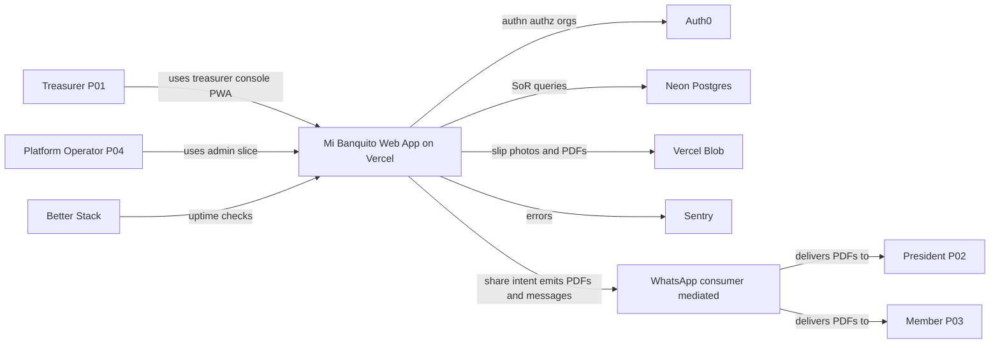
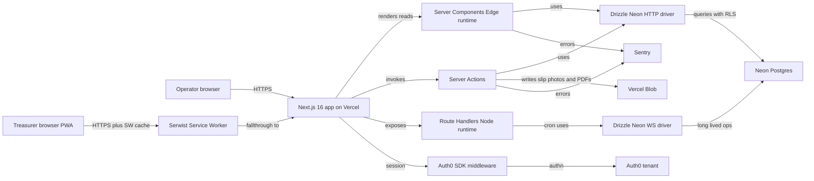
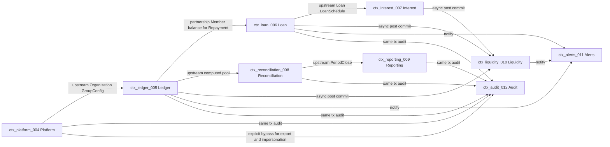
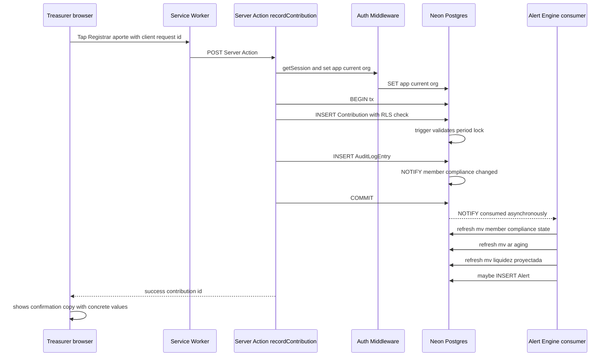
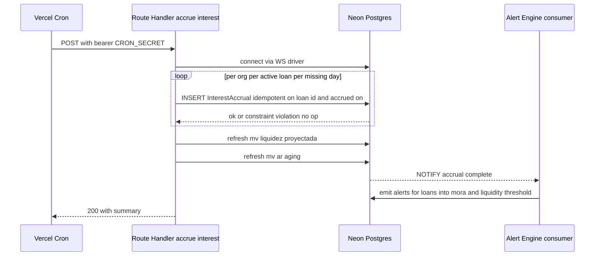
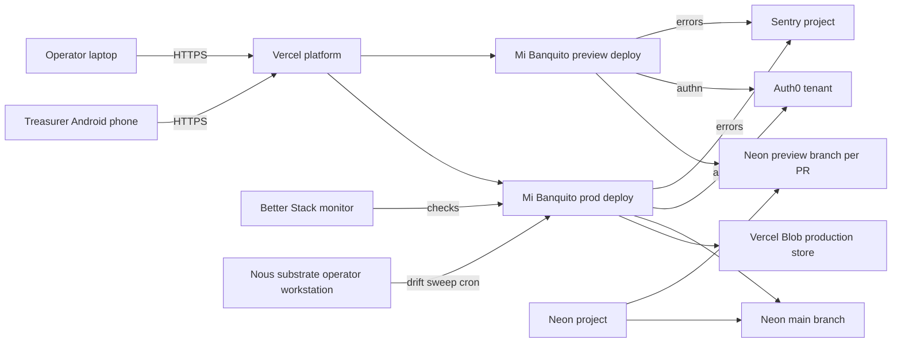

# 09 — Architecture: Mi Banquito

**Project:** Mi Banquito (`fcostudios__mi-banquito`)
**Step:** 9 — Architecture
**Date:** 2026-05-28
**Author:** Francisco Lomas (via Nous pipeline, `prompts/architecture_agent.md`)
**Report language:** en-US
**Authoritative inputs:** `PRODUCT_BRIEF.md`, `01_research.md`, `02_cx_personas.md`, `03_cx_journeys.md`, `03b_service_blueprint.md`, `04_er_model.md`, `05_brand.md`, `06_design_system.md`.

**Tech stack preferences (provided by sponsor 2026-05-28):**
- **Deployment:** Vercel.
- **Database:** Neon (serverless Postgres).
- **Identity provider:** Auth0.
- **Backend language/runtime:** Next.js (TypeScript) — same stack as the frontend, so domain logic and entities are shared across UI + API in a single monorepo.
- **PWA target:** responsive web application installable on Android and iOS without distributing native apps.

**Library version baseline (verified via Context7 on 2026-05-28):**
- `next` v16.2.2 (App Router; Route Segment Config; Server Actions; Route Handlers; PWA via `app/manifest.ts`).
- `@auth0/nextjs-auth0` latest (App Router native; passwordless flows; magic link; `getSession()` from `lib/auth0`).
- `@neondatabase/serverless` latest (HTTP driver for edge runtime + WebSocket driver for Node runtime cron).
- `drizzle-orm` + `drizzle-kit` (with `drizzle-orm/neon-http` and `drizzle-orm/neon-serverless` adapters); `drizzle-zod` for shared Zod schema inference.
- React 19 (Server Components, Server Actions, `use()`).
- Tailwind CSS 4.x.
- Turborepo + pnpm workspaces (monorepo build orchestration + dependency hoisting).

---

---SECTION: SEC0---

## Executive Summary

Mi Banquito's architecture is a **single-codebase TypeScript full-stack application** built on Next.js 16 App Router, deployed on Vercel, backed by Neon serverless Postgres, with Auth0 as the identity provider and `Organizations` feature providing multi-tenant scoping. The application ships as a **Progressive Web App** that installs on Android and iOS home screens without app-store distribution. A single Turborepo monorepo holds the web app + the backend (collocated in `apps/web` as Next.js Server Actions and Route Handlers) + four shared packages (`db`, `contracts`, `domain`, `ui`) that guarantee a **single source of truth** for entities, validation schemas, and business logic across the entire stack. The design realizes the 22 entities of the ER model under 9 bounded contexts whose behavior is governed by the 7 invariants of the service blueprint — append-only ledger, period-lock immutability, cross-tenant safety via PostgreSQL Row-Level Security, audit-before-action transactional coupling, idempotent retries, pre-flight constraint validation, and treasurer-authority-finality.

### Architecture Overview for Commercial Proposal

Mi Banquito is a multi-tenant SaaS treasury system for informal community savings and lending groups ("banquitos") in Ecuador and, eventually, broader LATAM. The product solves a concrete and recurring problem in Andean community finance: a non-technical treasurer — typically a mid-life adult who keeps the group's books on a phone using paper, Excel, and WhatsApp — needs a digital ledger that is trustworthy enough to be the group's system of record yet familiar enough that she will not abandon it within 30 seconds of opening it. The architecture is designed around this exact constraint: every architectural decision is filtered through the dual requirement of *radical simplicity for the treasurer* and *substrate-grade rigor for the money*.

The system is delivered as a **single Next.js 16 application** that serves two distinct surfaces from the same codebase. The first surface is the **treasurer console** — a Progressive Web App that installs on a low-end Android phone over intermittent 3G, renders with large default typography (18 px body) and large tap targets (≥ 48 px), and offers daily actions (record a contribution, record a repayment, see who owes) one tap away from the home screen. The second surface is a **thin administrative slice** for the FcoStudios operator (a single super-user role in R1) that exposes per-organization health snapshots, read-only impersonation of a treasurer's view, one-button data export per tenant, and a substrate drift status. Both surfaces share the same design tokens and color palette while diverging in density and voice: tenant simplicity discipline does not leak into the admin surface, and admin density does not leak back into the tenant surface. The two-surface model is implemented via route groups in the App Router (`app/(treasurer)/*` and `app/(admin)/*`) with a shared `app/layout.tsx` providing identity context and a shared component library imported from `packages/ui`. *(See Figure D6 in the appendix for the deployment topology.)*

The backend collocates with the frontend in the same Next.js application, with no separate API service. Reads happen in **React Server Components** that query Neon directly through Drizzle ORM; writes happen in **Server Actions** that wrap a Postgres transaction containing both the domain mutation and the audit log entry (per the audit-before-action invariant from the service blueprint). Long-running and scheduled work — daily interest accrual, nightly snapshot, alert sweep — runs as **Vercel Cron Jobs** invoking Route Handlers under `/api/cron/*` authenticated with a shared bearer secret. The architecture deliberately avoids a separate microservice tier in R1: the product's sizing tier is `S` (small, solo-team, ~22 entities), and an in-process modular monolith preserves the speed advantage of a single deployment unit while DDD bounded contexts keep the code organized for future extraction. *(See Figure D1 for the C4 system context and Figure D2 for the C4 container view.)*

Identity and access management are handled by **Auth0** using the `Organizations` feature to provide native multi-tenant scoping. Each banquito group is one Auth0 Organization; the treasurer is a member of exactly one organization at a time and authenticates via passwordless magic link sent to her email (and, in R2, via WhatsApp). The `org_id` claim on the access token is the bridge into the database: a Next.js middleware extracts it from the session, sets a Postgres session variable (`SET app.current_org = ...`), and Postgres **Row-Level Security policies** on every tenant table enforce that no query can see data belonging to a different organization, regardless of where the query was written or who wrote it. The cross-tenant safety invariant from the service blueprint is therefore enforced at the database boundary rather than by app-layer convention — a single missing `org_id` predicate cannot leak data, because RLS rejects it. The administrator's `/admin` surface uses a separate Auth0 Organization (FcoStudios) and a distinct role (`platform_operator`) that bypasses RLS through a separate database role with `SET app.bypass_org_rls = true` enabled only for explicitly-authorized cross-tenant operations such as data export and impersonation.

The data layer is **Neon Postgres**, accessed through Drizzle ORM with the HTTP driver (`drizzle-orm/neon-http`) for Edge-runtime compatibility on most reads, and the WebSocket driver (`drizzle-orm/neon-serverless`) for Node-runtime cron jobs that need long-running connections. Drizzle table definitions in `packages/db/schema.ts` are the single source of truth for the 22 entities of the ER model; `drizzle-zod` derives Zod schemas (`createInsertSchema`, `createSelectSchema`) that are exported from `packages/contracts` and consumed by both React Hook Form in the UI and the Server Actions on the backend, ensuring the entity shape, validation rules, and TypeScript types cannot drift between front and back. The append-only ledger invariant from the service blueprint is enforced by **PostgreSQL row triggers** that raise `append_only_violation` on any UPDATE or DELETE against the five money-touching tables (`Contribution`, `Withdrawal`, `Repayment`, `Expense`, `InterestAccrual`); reversal entries are new rows with a self-referential `reverses_id` foreign key and a required `reverse_reason`. The period-lock invariant is similarly enforced by a row trigger that compares `dated_on` against the most recent `PeriodClose.closed_at` for the same `cycle_id` and rejects late-arriving entries. Neon's branching feature provides ephemeral database branches per Vercel preview deployment, so every pull request lands in an isolated database state without risk of contaminating the production tenant. *(See Figure D3 for the bounded context map and Figure D2 for how the contexts translate into Next.js code modules.)*

The 11 backstage system actors enumerated in the service blueprint translate directly into concrete architectural components. `SYS_Ledger` is the writes-only path inside Server Actions wrapping `packages/domain/ledger`. `SYS_LoanEngine` is the schedule generator and repayment splitter in `packages/domain/loans`. `SYS_InterestEngine` is the daily Vercel Cron at 00:00 America/Guayaquil that runs `accrueInterest()` per org; idempotency is guaranteed by a Postgres unique constraint on `(loan_id, accrued_on)`. `SYS_ReconciliationEngine` is a Server Action that writes a `ReconciliationCycle` row and on close acceptance writes the `PeriodClose` row in the same transaction. `SYS_CashFlowProjector` runs as a Postgres materialized view (`mv_liquidez_proyectada`) refreshed on the post-commit hook of any ledger-affecting Server Action plus a daily cron; the materialized view, not a live computation, is what the treasurer sees on the *Liquidez Proyectada* screen, so the projection load is amortized away from the UI request path. `SYS_AlertEngine` consumes a Postgres LISTEN/NOTIFY channel populated by row triggers and writes to the `Alert` table; the front-end polls the alert bell every 30 seconds via SWR. `SYS_PdfGenerator` runs server-side via `@react-pdf/renderer` inside a Server Action and produces deterministic PDFs whose canonical-JSON SHA-256 hash is stored alongside the PDF in `StatementArchive` per the service blueprint requirement (font-rendering-safe hashing). `SYS_ShareOutEngine`, `SYS_AuditLog`, `SYS_ComplianceDerivedView`, and `SYS_PlatformOps` round out the catalogue.

The non-functional requirements that anchor the architecture are documented explicitly in SEC3 and traced through every other section: a **30-minute monthly close** (UI flow target, requires the reconciliation panel and PDF generator to be sub-second); a **zero ledger-vs-bank discrepancy at month-end for 3 consecutive months by month 3 post-launch** (product KPI, enforced by the reconciliation engine + period-lock invariant); a **sub-1-day tenant onboarding** (substrate KPI, supported by the admin org-lifecycle flow); a **< $30/month hosting cost** for R1 (achievable on Vercel Hobby + Neon Free tier + Auth0 Free tier); a **WCAG AA accessibility baseline** (enforced via the design system); a **functional PWA experience on a low-end Android phone over intermittent 3G** (delivered by Serwist service-worker caching of read paths plus offline-tolerant writes with background-sync). The architecture's resilience posture is calibrated for a solo operator: Sentry captures errors with PII redaction; Vercel Analytics tracks web vitals; Vercel Log Drains forward logs to a low-cost destination; Neon's automatic backups and point-in-time recovery satisfy a 24-hour RPO and 1-hour RTO with no operator effort beyond verification.

Delivery follows the Nous pipeline conventions and the BMAD method. The codebase is a single Turborepo monorepo (`apps/web` + `packages/{db,contracts,domain,ui}`); CI runs on Vercel's native pipeline with preview deployments per pull request, automatic Neon database branches for isolated preview state, and a single production deployment per merged change to `main`. The substrate gates from the Nous pipeline (`nous_package.py drift --strict`, story `ready-check` registry, HR-25 timestamp-slug migrations) are honored as release-time guardrails. The architecture's risks are surfaced explicitly in SEC15 and SEC18 — chief among them the **bus factor of 1** (solo team) and the substrate-coupled delivery (Nous gaps surface as IMP filings, precedent: IMP-206 and IMP-207 filed during this very project setup). Mitigations are surfaced under each risk, and the rollout follows the brief's milestone schedule of a 4–6 month pilot landing in late 2026 with the founder's mother's banquito as the design partner.

---

---SECTION: SEC1---

## Context, Scope, and Stakeholders

### In-scope (R1)

- **Treasurer console** — full feature set per `02_cx_personas.md §SEC2 P01` + `03_cx_journeys.md §SEC4 S1..S6` (group setup → contribution cycle → loan lifecycle → collections → reconciliation + monthly close → statement distribution + year-end share-out).
- **Thin platform admin slice** — single super-user role per `02_cx_personas.md §SEC2 P04`; org lifecycle (create / freeze / archive / export), read-only impersonation, per-org health snapshot, drift status badge.
- **Multi-tenant data model** with `org_id` on every entity (per `04_er_model.md §SEC6`).
- **22 persistent entities + 2 derived views** across 9 bounded contexts (per `03b_service_blueprint.md §8`).
- **20 system processes** (per `03b §2`) — bookkeeping cascade, loan schedule generation, daily interest accrual, repayment application, cash-flow projection, year-end share-out engine, PDF generation with integrity hash, audit log, alert engine.
- **PWA installation** on Android + iOS without app-store distribution.
- **Spanish (`es-EC`) UI strings** with the locked vocabulary from `05_brand.md §SEC5` (`aporte / retiro / préstamo / cuota / saldo / cierre / conciliación / historial / aportante / al día / atrasado / en mora`).
- **PDF artifacts** for `monthly_close / monthly_member / year_end_member / year_end_share_out` with canonical-JSON SHA-256 hash (per `03b §2 P14 note`).

### Out-of-scope (R1, deferred)

- Member-side PWA (R2).
- WhatsApp Business API integration (R2).
- Deposit-slip OCR (R2).
- Multi-currency per org (designed-for, not enabled in R1).
- Bank API / open-banking import (R3).
- Multi-operator platform roles + permissions (R2).
- SRE-grade observability tooling (R3).
- Anti-fraud rule engine (R3).
- Member-side PII encryption-at-rest (R3).
- Compliance flows / KYC / AML (out — closed-group framing).

### Stakeholders → personas mapping

| Stakeholder | Persona | Architectural concern |
|---|---|---|
| Treasurer | P01 La Tesorera | Performance, simplicity, offline-tolerant reads, idempotent retries, PWA install |
| Group President | P02 El Presidente | Quality + readability of PDF artifacts via WhatsApp preview |
| Group Member | P03 El Miembro/a | Quality + cryptographic integrity of per-member statement PDF |
| FcoStudios Platform Operator | P04 La Operadora | Multi-tenant safety, audit log, data export, drift visibility, IMP filing |
| Design partner (founder's mother) | (instance of P01) | First validator of every NFR; the canonical test case |

### Business capabilities impacted

| Capability | Impact |
|---|---|
| Member registry | Owned by `ctx_ledger_005` (see SEC6) |
| Contribution cycle management | Owned by `ctx_ledger_005` |
| Loan origination + repayment + accrual | Owned by `ctx_loan_006` + `ctx_interest_007` |
| Reconciliation + monthly close | Owned by `ctx_reconciliation_008` |
| Reporting (statements, monthly close, share-out) | Owned by `ctx_reporting_009` |
| Liquidity projection + alerts | Owned by `ctx_liquidity_010` + `ctx_alerts_011` |
| Audit + dispute resolution | Owned by `ctx_audit_012` |
| Platform operator tasks | Owned by `ctx_platform_004` |

---

---SECTION: SEC2---

## Architecture Objectives, Drivers, and Constraints

### Business drivers

- **B1** — A non-technical treasurer must close the month in **< 30 minutes** (vs. several hours of paper-and-Excel today) per `PRODUCT_BRIEF.md §Success Criteria`.
- **B2** — The product must reach **zero ledger-vs-bank discrepancy** at month-end for 3 consecutive months by month 3 post-launch.
- **B3** — Onboarding a second tenant org must be a **config change**, completing in **< 1 day**, not a migration or refactor.
- **B4** — Total R1 hosting cost must remain **< $30/month** (bootstrapped FcoStudios; no revenue in R1).
- **B5** — The product is the first non-substrate greenfield project on the Nous pipeline — validation of the pipeline itself is a secondary objective.

### Technical drivers

- **T1** — Single TypeScript codebase across UI + API enables shared entities, validation, and types (`shared entities library best practice` per sponsor's research ask).
- **T2** — Stack alignment with the operator's existing experience reduces operator cognitive load (Francisco is fluent in TypeScript + React; less so in Python/JVM).
- **T3** — Vercel + Neon + Auth0 each offer generous free tiers covering R1 scale.
- **T4** — Auth0 `Organizations` feature provides native multi-tenant scoping at the IdP layer (matches the architectural multi-tenant invariant from `04_er_model.md §SEC6`).
- **T5** — Drizzle ORM + `drizzle-zod` collapses schema definition, runtime validation, and TypeScript types into a single source of truth — enforces ER fidelity at the type system level.

### Constraints

- **C1** — The treasurer's device is a **low-end Android smartphone with intermittent 3G**; the app must remain functional under these conditions (offline-tolerant reads; write retry with idempotency).
- **C2** — The treasurer is **non-technical**; the front-end UX must hit the 30-second test on every screen (architecture enforces by keeping read paths sub-200 ms p95 and write paths sub-500 ms p95).
- **C3** — **Bus factor = 1** — solo developer; architecture must minimize operational surface area (no Kubernetes, no custom CI runners, no separately-deployed microservices).
- **C4** — **Append-only ledger** (per `03b §7 invariant 1` + `04_er_model.md §SEC6`) — destructive UPDATE/DELETE on ledger entities is forbidden.
- **C5** — **Period-lock immutability** (per `04_er_model.md §SEC6`) — once a `PeriodClose` is written, prior ledger entries cannot be modified.
- **C6** — **Cross-tenant safety** (per `03b §7 invariant 3`) — every database query must be `org_id`-scoped; a single missing predicate is a Sev-1 substrate bug.
- **C7** — **Audit-write-failure rollback** (per `03b §7 invariant 2`) — audit log write must succeed in the same transaction as the originating action; on audit failure, the original action MUST roll back.
- **C8** — **Closed-group regulatory posture** — the product is positioned as internal recordkeeping; no consumer-lending or deposit-taking framing.
- **C9** — **WCAG AA accessibility baseline** per `06_design_system.md §SEC8`.

### Assumptions

- **`[ASSUMPTION] A-ARCH-1`** — Vercel Hobby tier covers R1 traffic (< 100k requests/month forecast for a single design-partner tenant).
- **`[ASSUMPTION] A-ARCH-2`** — Neon Free tier covers R1 storage + compute (< 0.5 GB storage forecast).
- **`[ASSUMPTION] A-ARCH-3`** — Auth0 Free tier (7,500 MAU) covers R1 (1 treasurer + 1 operator + future R2 member access).
- **`[ASSUMPTION] A-ARCH-4`** — Auth0 Organizations feature is on the Free tier (verify in implementation; if not, fall back to a single tenant + `org_id` JWT custom claim).
- **`[ASSUMPTION] A-ARCH-5`** — Neon HTTP driver works correctly with Drizzle ORM in Vercel Edge runtime for R1 traffic volume.
- **`[ASSUMPTION] A-ARCH-6`** — Vercel Cron Jobs (Hobby tier provides limited cron — verify; may need to upgrade to Pro at R2).
- **`[ASSUMPTION] A-ARCH-7`** — Slip photo storage in Vercel Blob (vs. Cloudflare R2) is cost-acceptable at R1 (~ few MB / month per group).

### Open questions (prioritized)

- **`OQ-ARCH-1`** — Vercel Hobby tier cron job limits (1 cron / day vs. multiple)? May need Pro for daily interest accrual + nightly snapshot + alert sweep.
- **`OQ-ARCH-2`** — Auth0 Organizations on Free tier — verify; if not, single-tenant fallback with `org_id` JWT custom claim.
- **`OQ-ARCH-3`** — Vercel Blob vs. Cloudflare R2 for slip photos — Vercel Blob simpler but pricier; R2 cheaper but requires extra config.
- **`OQ-ARCH-4`** — Server-side PDF generation via `@react-pdf/renderer` vs. Puppeteer — `@react-pdf/renderer` simpler + smaller bundle but limited typography; Puppeteer flexible but heavier.
- **`OQ-ARCH-5`** — Materialized view refresh strategy for `mv_liquidez_proyectada` — post-commit hook vs. cron-only; trade-off between freshness and DB load.
- **`OQ-ARCH-6`** — Service worker library choice — Serwist (modern Workbox successor with App Router support) vs. `next-pwa` (older, App Router compatibility evolving).

---

---SECTION: SEC3---

## Quality Attributes and Non-Functional Requirements

### NFR table

| NFR | Attribute | Target | Enforcement mechanism | Trace |
|---|---|---|---|---|
| **NFR-PERF-01** | Performance | Treasurer "Registrar aporte" Server Action P95 < 500 ms | RSC + Neon HTTP driver in Edge runtime; Drizzle prepared statements; row-level write only | `01_research §8.1`, `slo_001` |
| **NFR-PERF-02** | Performance | Treasurer home screen TTFB < 800 ms over 3G | Static prerender for shell; ISR on home; cache-first SW for repeat visits | `02_cx_personas §SEC2 P01 accessibility`, `slo_002` |
| **NFR-PERF-03** | Performance | Monthly close PDF generation P95 < 2 s | `@react-pdf/renderer` server-side; canonical JSON hashing parallel to PDF write | `03b §2 P14`, `slo_003` |
| **NFR-AVAIL-01** | Availability | 99.5% monthly availability for treasurer console | Vercel managed platform SLA + Neon multi-AZ + Auth0 tenant SLA | Brief §Risks "substrate gap blocks delivery", `slo_004` |
| **NFR-DURAB-01** | Durability | RPO ≤ 24 h, RTO ≤ 1 h | Neon point-in-time recovery + automated daily backups; Vercel Blob versioning | `03b §7 invariant 1`, `slo_005` |
| **NFR-SEC-01** | Security | No cross-tenant data leak under any code path | Postgres Row-Level Security policies + Auth0 session middleware injecting `app.current_org` | `03b §7 invariant 3`, IMP-206 forensic |
| **NFR-SEC-02** | Security | Append-only ledger; no destructive UPDATE/DELETE | Postgres row triggers raising `append_only_violation`; Drizzle write paths use INSERT only | `03b §7 invariant 1`, `04_er_model §SEC6` |
| **NFR-SEC-03** | Security | Period-lock immutability after `PeriodClose` | Postgres row trigger comparing `dated_on` to last `PeriodClose.closed_at` for cycle | `04_er_model §SEC6` |
| **NFR-SEC-04** | Security | Audit write succeeds in same transaction as originating action | App-layer pattern: `BEGIN … INSERT INTO target … INSERT INTO audit_log_entry … COMMIT` wrapped in `db.transaction()` | `03b §7 invariant 2` |
| **NFR-SEC-05** | Security | PII (member WhatsApp number) stored at rest with no admin-leak | Drizzle column-level encryption (R3) — R1: stored plain; admin export redacts; RLS prevents cross-tenant read | `04_er_model §SEC3 Member`, OQ-ARCH-PII (R3) |
| **NFR-A11Y-01** | Accessibility | WCAG AA on every interactive component | Design tokens with verified contrast; Headless UI primitives for ARIA; CI test (axe) | `06_design_system §SEC8` |
| **NFR-INT-01** | Internationalization | All user-facing strings localized via `strings.es-EC.json`; no hardcoded copy | Lint rule against string literals in JSX; codegen check | `05_brand §SEC5`, `06_design_system §SEC3.1` |
| **NFR-INT-02** | Internationalization | Currency/locale never hardcoded | `Intl.NumberFormat` + `Organization.currency_code` + `Organization.default_language` everywhere | `05_brand §SEC5`, `IMP-145 / HR-36` |
| **NFR-RELIAB-01** | Reliability | Cron jobs idempotent on retry | `(loan_id, accrued_on)` unique constraint on `InterestAccrual`; `(client_request_id)` UNIQUE on UI-driven writes | `03b §2 P5`, `03b §7 invariant 4` |
| **NFR-OPS-01** | Operability | Platform Operator can run org create + impersonation + export from `/admin` | `app/(admin)/admin/*` routes gated by Auth0 `platform_operator` role | `03b §2 PA-S1..PA-S7` |
| **NFR-OBS-01** | Observability | All errors captured with PII redaction within 1 minute | Sentry + redaction config (mask `whatsapp_number`, names) | Per Solo-Operator Risk |
| **NFR-OBS-02** | Observability | Drift status visible at `/admin/drift` | Vercel Cron at 02:00 runs drift check + posts result to `nous.db`; `/admin/drift` reads it | `03b §2 P19`, `IMP-207` |
| **NFR-MAINT-01** | Maintainability | Single-language stack; shared entities across UI + API | TypeScript + Drizzle + drizzle-zod monorepo (Turborepo + pnpm) | T1, T5 |
| **NFR-COST-01** | Cost | Total R1 hosting < $30/month | Vercel Hobby + Neon Free + Auth0 Free + Vercel Blob (~few MB) | B4 |
| **NFR-PWA-01** | PWA | Installable on Android + iOS without app store | `app/manifest.ts` + Serwist service worker + iOS-specific `apple-touch-icon` + manifest | C1, PRODUCT_BRIEF §Scope |
| **NFR-PWA-02** | PWA | Read paths work offline (after first load) | Serwist cache-first for static assets + stale-while-revalidate for tenant data | C1 |

### SLOs

- **`slo_001`** — **Treasurer Server Action latency**: P95 < 500 ms on `RecordContribution`, `ApplyRepayment`, `OriginateLoan`. Window: trailing 30 days. (Explicit.)
- **`slo_002`** — **Home screen TTFB**: P95 < 800 ms over 3G simulated. Window: trailing 7 days. (Explicit.)
- **`slo_003`** — **PDF generation latency**: P95 < 2 s on `monthly_close`, `monthly_member`, `year_end_share_out`. Window: per close event. (Explicit.)
- **`slo_004`** — **Monthly availability**: ≥ 99.5% measured against `/api/health`. Window: calendar month. (Explicit.)
- **`slo_005`** — **Backup freshness**: Neon PITR window covers last 24 h. Window: every 24 h. (Explicit.)
- **`slo_006`** — **Reconciliation discrepancy rate** (product KPI per brief): 100% of months with zero discrepancy by month 3. Window: trailing 90 days. (Inferred — product KPI mapped as architectural SLO.)
- **`slo_007`** — **Tenant onboarding time** (substrate KPI): < 1 day end-to-end. Window: per onboarding event. (Inferred.)

### SLIs (implementation)

- **`sli_001`** — Server Action P95 latency via Vercel Analytics + Sentry transactions.
- **`sli_002`** — Treasurer home TTFB via Vercel Speed Insights (Web Vitals).
- **`sli_003`** — PDF generation duration via Server Action timing.
- **`sli_004`** — `/api/health` availability via Vercel Cron sweep + external uptime monitor (e.g., Better Stack free tier).
- **`sli_005`** — Neon backup health via `nous_trace.py` drift sweep.

---

---SECTION: SEC4---

## Architecture Principles and Decision Criteria

### Principles

1. **`PRIN-01` — Single-codebase TypeScript full-stack.** UI and API in the same Next.js app; domain logic and entities in shared monorepo packages. No language or stack split between front and back.
2. **`PRIN-02` — Database is the source of truth and the safety boundary.** Multi-tenant safety, append-only invariant, period-lock invariant — all enforced at the Postgres layer through RLS + triggers, not by app-layer convention.
3. **`PRIN-03` — Schema → Validation → Types in one direction.** `packages/db/schema.ts` (Drizzle) is the source; `drizzle-zod` derives Zod schemas; Zod infers TS types. The UI never defines its own validation; the API never defines its own types. One drift point eliminated.
4. **`PRIN-04` — Pre-flight constraint validation before write.** Loan eligibility, period-lock, balance sufficiency — checked before the write begins, never after. Failure mode is "we did not record it," never "we recorded it and need to undo."
5. **`PRIN-05` — Server Actions for writes, RSC for reads.** Aligns with Next.js 16 App Router idioms; co-locates business logic with the UI it serves; no separate API client to maintain.
6. **`PRIN-06` — Idempotency by `client_request_id`.** Every UI-driven write accepts an optional `client_request_id`; database UNIQUE constraint deduplicates retries; cron jobs use natural-key uniqueness for replay safety.
7. **`PRIN-07` — Materialized views for derived state.** A/R aging, member compliance, liquidity projection — Postgres materialized views with post-commit refresh hooks; the UI request never recomputes from raw ledger.
8. **`PRIN-08` — Offline-tolerant reads, never offline writes (R1).** Service worker caches read paths; writes require online connectivity in R1 (with retry on reconnect). True offline writes are R3.
9. **`PRIN-09` — Two surfaces, one codebase, two UX cultures.** Treasurer console (simple) and admin slice (dense) ship from the same Turborepo app but obey different design rules; neither leaks into the other.
10. **`PRIN-10` — Audit-before-action.** Every write transaction inserts the `AuditLogEntry` before COMMIT; an audit failure rolls back the originating action.

### Decision criteria rubric

| Criterion | Weight | Description |
|---|---|---|
| Stack alignment with sponsor's preference | High | TypeScript everywhere, Next.js full-stack |
| Cost discipline (R1 < $30/mo) | High | Free-tier-fit drives many choices |
| Substrate safety (cross-tenant + append-only) | Critical | DB-level enforcement wherever possible |
| Time-to-pilot (target 4–6 months) | High | Monolithic Next.js app, no microservice tier in R1 |
| Operator simplicity (bus factor = 1) | High | Vercel managed pipeline; no Kubernetes |
| Future R2/R3 extensibility | Medium | Bounded contexts already align for future service extraction |
| WCAG AA accessibility | Required | Design tokens locked; CI test |
| Performance for low-end Android over 3G | Required | RSC + service worker + Edge runtime where possible |

### ADR index

| ADR ID | Title | Status |
|---|---|---|
| `adr_0001` | Single-codebase TypeScript full-stack on Next.js 16 App Router | Accepted |
| `adr_0002` | Neon serverless Postgres with Drizzle ORM (HTTP + WebSocket drivers) | Accepted |
| `adr_0003` | Auth0 with `Organizations` feature for multi-tenant identity | Accepted |
| `adr_0004` | Multi-tenant safety enforced by Postgres Row-Level Security + Auth0 session var | Accepted |
| `adr_0005` | Append-only ledger enforced by Postgres row triggers, not app convention | Accepted |
| `adr_0006` | Turborepo + pnpm workspaces for monorepo (`apps/web` + `packages/{db,contracts,domain,ui}`) | Accepted |
| `adr_0007` | `drizzle-zod` as the single source of truth for schemas, validation, and types | Accepted |
| `adr_0008` | Server Actions for writes; React Server Components for reads | Accepted |
| `adr_0009` | Vercel Cron Jobs for scheduled work (daily interest accrual, nightly drift sweep) | Accepted |
| `adr_0010` | `@react-pdf/renderer` for server-side PDF generation; canonical JSON SHA-256 hash for integrity | Proposed (verify alternative: Puppeteer) |
| `adr_0011` | Vercel Blob for slip-photo object storage in R1 (revisit R2 vs. Cloudflare R2) | Proposed |
| `adr_0012` | Serwist (Workbox successor) for service worker + Next.js App Router PWA support | Accepted |
| `adr_0013` | Sentry for error monitoring with PII redaction | Accepted |
| `adr_0014` | Postgres materialized views for derived state (A/R aging, compliance, liquidity projection) | Accepted |
| `adr_0015` | Neon database branching per Vercel preview deployment | Accepted |
| `adr_0016` | Treasurer console + admin slice as Next.js App Router route groups in the same app | Accepted |
| `adr_0017` | Passwordless magic link auth for treasurer (email in R1; WhatsApp in R2) | Accepted |

---

---SECTION: SEC5---

## Reference Architecture Overview

The reference architecture is a **modular monolith** delivered as a single Next.js 16 application on Vercel. The modular boundaries are the 9 bounded contexts from `03b §8`; they live as folders inside `packages/domain` and `packages/db/schema`. There is no separate API tier — the React Server Components query the database directly through Drizzle, and the Server Actions perform writes within Drizzle transactions. The only out-of-process compute is:

1. **Neon Postgres** — the system of record.
2. **Vercel Cron** — daily and nightly scheduled jobs.
3. **Auth0** — identity provider.
4. **Vercel Blob** — slip photos and PDF artifact storage.
5. **Sentry** — error reporting.
6. **(R2)** WhatsApp Business API.

### Key patterns chosen + justification

- **Modular monolith.** Sizing tier `S`; solo team; tight time-to-pilot; bounded contexts that are likely to remain in one process for years even at R3. The modular monolith preserves cross-context type safety (one TS project), eliminates inter-service network hops (everything is a function call), and remains refactor-friendly if a future scale event demands a service extraction.
- **React Server Components for reads + Server Actions for writes.** Eliminates the front-end ↔ back-end API contract maintenance cost; every read is a server-side database call rendered to HTML. Every write is a Server Action with type-safe arguments validated by Zod (from `drizzle-zod`) at the boundary.
- **Database-level invariant enforcement.** RLS for cross-tenant safety; row triggers for append-only and period-lock. The design assumes that app-layer code will eventually drift (the IMP-206 forensic precedent demonstrates this); the database is the boundary that cannot drift.
- **Materialized views for derived state.** Cash-flow projection, A/R aging, member compliance — derived from raw ledger via materialized views; refreshed by post-commit hook or daily cron. The UI never computes; it reads.
- **Idempotent writes via `client_request_id` and natural-key unique constraints.** Critical for the intermittent-3G constraint — the treasurer may tap "Registrar aporte" twice when the first request appears to fail; both requests carry the same `client_request_id` and only one row is written.
- **PWA via Serwist + App Router.** Cache-first for static assets; stale-while-revalidate for tenant data; offline shell that displays "sin conexión" without crashing.
- **Auth0 `Organizations` for multi-tenant identity.** Eliminates the home-grown multi-tenant auth code path; Auth0 enforces `org_id` membership at token issuance.
- **Vercel preview deploys with Neon DB branching.** Every PR gets its own Neon branch + Vercel preview URL; substrate migration safety verified before merge.

---

---SECTION: SEC6---

## Domain-Driven Design Proposal

### Ubiquitous language (short glossary)

| Term (es-EC) | Definition |
|---|---|
| **`aporte`** | A member's contribution within a cycle. Entity: `Contribution`. |
| **`retiro`** | A non-loan outflow to a member. Entity: `Withdrawal`. |
| **`préstamo`** | A loan from the group's pool to a member. Entity: `Loan`. |
| **`cuota`** | A scheduled payment within a loan schedule. Entity: `LoanSchedule` row. |
| **`saldo`** | A computed balance — member's, loan's, or pool's. Derived view, not stored. |
| **`cierre`** | The monthly close event. Entity: `PeriodClose`. |
| **`conciliación`** | The reconciliation event with declared bank balance. Entity: `ReconciliationCycle`. |
| **`historial`** | Plain-Spanish-rendered audit log. Entity: `AuditLogEntry`. |
| **`aportante`** | A member in the group. Entity: `Member`. |
| **`pool`** | The group's bank account balance, computed from the ledger. Derived. |
| **`reparto`** | Year-end share-out event. Entity: `YearEndShareOut`. |
| **`reversión`** | A corrective entry that reverses a prior ledger entry. Pattern: `reverses_id` self-FK. |

### Bounded contexts

(From `03b §8`; renumbered with stable IDs.)

| Context ID | Name | Responsibilities | System of Record |
|---|---|---|---|
| `ctx_platform_004` | Platform Context | Org lifecycle, GroupConfig seeding, impersonation, data export | `Organization`, `GroupConfig` (seed), `PlatformOperator`, `Impersonation` |
| `ctx_ledger_005` | Ledger Context | Append-only entries; balance derivation; member registry; compliance derivation | `Member`, `ContributionCycle`, `Contribution`, `Withdrawal`, `Expense`, `SlipPhoto` |
| `ctx_loan_006` | Loan Context | Loan origination; schedule generation; eligibility checks; repayment split | `Loan`, `LoanSchedule`, `Repayment` |
| `ctx_interest_007` | Interest Context | Daily/periodic interest accrual per loan | `InterestAccrual` |
| `ctx_reconciliation_008` | Reconciliation Context | Bank-balance reconciliation; period lock | `ReconciliationCycle`, `PeriodClose` |
| `ctx_reporting_009` | Reporting Context | PDF statement generation; year-end share-out | `StatementArchive`, `YearEndShareOut`, `YearEndShareOutLine` |
| `ctx_liquidity_010` | Liquidity Context | Cash-flow projection; year-end commitment evaluation | (Derived views: `mv_liquidez_proyectada`, `mv_year_end_commitment`) |
| `ctx_alerts_011` | Alerts Context | Alert emission, de-dup, dismissal/snooze | `Alert` |
| `ctx_audit_012` | Audit Context | Append-only platform-wide audit log; entity versioning sink | `AuditLogEntry`, `EntityVersion` |

### Context map (relationships)

- `ctx_platform_004` → `ctx_ledger_005` — **upstream / downstream**, with `ctx_ledger_005` reading `Organization` and `GroupConfig`. Published language: the `Organization` and `GroupConfig` schemas in `packages/contracts`.
- `ctx_ledger_005` ↔ `ctx_loan_006` — **partnership**. `ctx_loan_006` reads `Member` and writes `Repayment` whose ledger leg is handled by `ctx_ledger_005`.
- `ctx_loan_006` → `ctx_interest_007` — **upstream**. Interest engine reads `Loan` + `LoanSchedule` + `Repayment`.
- `ctx_ledger_005` → `ctx_reconciliation_008` — **upstream**. Reconciliation reads ledger to compute pool balance.
- `ctx_reconciliation_008` → `ctx_reporting_009` — **upstream**. PDF generation reads close.
- All ledger-writing contexts → `ctx_liquidity_010` — **upstream** (asynchronous via post-commit refresh hook into materialized views).
- All write-emitting contexts → `ctx_alerts_011` — **upstream** (via DB LISTEN/NOTIFY consumed by alert engine).
- All write-emitting contexts → `ctx_audit_012` — **downstream within the same transaction** (the audit-before-action invariant). Audit context is technically a sink for every other context.
- `ctx_platform_004` reads all contexts for **data export** and **read-only impersonation**, but only via explicit `bypass_org_rls` mode with audit logging.

### Mapping from ER entities to bounded contexts

(Direct from `04_er_model.md §SEC2` + `03b §8`; reproduced for completeness.)

| Entity | Bounded Context |
|---|---|
| `Organization` | `ctx_platform_004` |
| `GroupConfig` | `ctx_platform_004` (seed) + `ctx_ledger_005` (treasurer edits) |
| `PlatformOperator` | `ctx_platform_004` |
| `Impersonation` | `ctx_platform_004` |
| `Member` | `ctx_ledger_005` |
| `ContributionCycle` | `ctx_ledger_005` |
| `Contribution` | `ctx_ledger_005` |
| `Withdrawal` | `ctx_ledger_005` |
| `Expense` | `ctx_ledger_005` |
| `SlipPhoto` | `ctx_ledger_005` |
| `Loan` | `ctx_loan_006` |
| `LoanSchedule` | `ctx_loan_006` |
| `Repayment` | `ctx_loan_006` (+ ledger leg via post-commit) |
| `InterestAccrual` | `ctx_interest_007` |
| `ReconciliationCycle` | `ctx_reconciliation_008` |
| `PeriodClose` | `ctx_reconciliation_008` |
| `StatementArchive` | `ctx_reporting_009` |
| `YearEndShareOut` | `ctx_reporting_009` |
| `YearEndShareOutLine` | `ctx_reporting_009` |
| `Alert` | `ctx_alerts_011` |
| `AuditLogEntry` | `ctx_audit_012` |
| `EntityVersion` | `ctx_audit_012` |

### Scope Feature Coverage

> *No formal `08_scope.md` artifact exists yet (Step 8 not run). Feature coverage is mapped against the **20-process catalogue from `03b §2`** which is the de-facto feature inventory for R1.*

| Feature ID | Feature Name | Covered By (Modules / Components / APIs) | Notes |
|---|---|---|---|
| FEAT-P1 | RecordContribution | `comp_ledger_service_001`, Server Action `recordContribution`, `apps/web/app/(treasurer)/aportes/registrar/action.ts` | Ledger context |
| FEAT-P2 | RecordWithdrawal | `comp_ledger_service_001`, Server Action `recordWithdrawal` | Ledger context |
| FEAT-P3 | OriginateLoan | `comp_loan_engine_002`, Server Action `originateLoan` | Loan context; pre-flight `EvaluateLoanEligibility` |
| FEAT-P4 | GenerateLoanSchedule | `comp_loan_engine_002`, post-commit on P3 | Pure-TS in `packages/domain/loans/schedule.ts` |
| FEAT-P5 | AccrueInterestDaily | `comp_interest_engine_003`, Vercel Cron at `app/api/cron/accrue-interest/route.ts` | Idempotent on `(loan_id, accrued_on)` UNIQUE |
| FEAT-P6 | ApplyRepayment | `comp_loan_engine_002`, Server Action `applyRepayment` | Splits per `GroupConfig.repayment_split_rule` |
| FEAT-P7 | RecomputeMemberCompliance | `comp_compliance_derived_view_004`, materialized view + post-commit refresh | `mv_member_compliance_state` |
| FEAT-P8 | RecomputeARAging | `comp_compliance_derived_view_004`, materialized view | `mv_ar_aging` |
| FEAT-P9 | ProjectCashFlow | `comp_cashflow_projector_005`, materialized view | `mv_liquidez_proyectada` |
| FEAT-P10 | EvaluateLoanEligibility | `comp_loan_engine_002`, pre-flight pure-TS check | Reads `mv_liquidez_proyectada` |
| FEAT-P11 | EvaluateYearEndCommitment | `comp_cashflow_projector_005` | Triggers alert A5 |
| FEAT-P12 | ExecuteReconciliation | `comp_reconciliation_engine_006`, Server Action `executeReconciliation` | Writes `ReconciliationCycle` |
| FEAT-P13 | LockPeriodClose | `comp_reconciliation_engine_006`, post-commit on P12 success | Writes `PeriodClose`; triggers DB row-trigger period lock |
| FEAT-P14 | GenerateMonthlyCloseReport | `comp_pdf_generator_007` via `@react-pdf/renderer` | Canonical-JSON SHA-256 hash |
| FEAT-P15 | GenerateMemberStatement | `comp_pdf_generator_007` | Per-member PDF; same hash strategy |
| FEAT-P16 | ComputeYearEndShareOut | `comp_share_out_engine_008` | Treasurer review + override + approval workflow |
| FEAT-P17 | EmitAlert | `comp_alert_engine_009`, DB LISTEN/NOTIFY consumer | De-dup by `(org_id, alert_kind, subject_id, window)` |
| FEAT-P18 | PlatformAuditWrite | `comp_audit_log_010`, DB trigger on every tenant write | Same-transaction; failure rolls back originating |
| FEAT-P19 | ExportTenantData | `comp_platform_ops_011`, Server Action `/admin/orgs/[id]/export` | ZIP via streaming; canonical CSVs + PDFs + manifest |
| FEAT-P20 | RecomputeCashFlowProjection | `comp_cashflow_projector_005` (= P9 alias) | — |

**Coverage verification.** Every process in `03b §2` is mapped to at least one architectural component. No gaps.

---

---SECTION: SEC7---

## Architecture Views: Logical View

### Core components / services

| Component ID | Name | Responsibilities | Owning Context |
|---|---|---|---|
| `comp_web_app_000` | Mi Banquito Web Application | Next.js 16 app serving treasurer console + admin slice + cron route handlers | (cross-cutting; hosts all contexts) |
| `comp_ledger_service_001` | Ledger Service | Append-only ledger writes; reversal pattern; member registry CRUD; transaction validation pre-write | `ctx_ledger_005` |
| `comp_loan_engine_002` | Loan Engine | Loan origination; schedule generation; eligibility evaluation; repayment split | `ctx_loan_006` |
| `comp_interest_engine_003` | Interest Engine | Daily/periodic interest accrual cron worker | `ctx_interest_007` |
| `comp_compliance_derived_view_004` | Compliance Derived View | Materialized views: `mv_member_compliance_state`, `mv_ar_aging` | `ctx_ledger_005` |
| `comp_cashflow_projector_005` | Cash-Flow Projector | Materialized view: `mv_liquidez_proyectada`; year-end commitment eval | `ctx_liquidity_010` |
| `comp_reconciliation_engine_006` | Reconciliation Engine | Reconciliation cycle write; period close lock | `ctx_reconciliation_008` |
| `comp_pdf_generator_007` | PDF Generator | Statement / monthly close / year-end PDFs with canonical-JSON SHA-256 hash | `ctx_reporting_009` |
| `comp_share_out_engine_008` | Share-Out Engine | Year-end share-out formula application; treasurer-override workflow | `ctx_reporting_009` |
| `comp_alert_engine_009` | Alert Engine | DB-notify-driven alert emission; de-dup; surface to UI bell | `ctx_alerts_011` |
| `comp_audit_log_010` | Audit Log | DB trigger writing per-action audit row; entity versioning sink | `ctx_audit_012` |
| `comp_platform_ops_011` | Platform Operations Service | Org lifecycle; impersonation session; data export ZIP assembly | `ctx_platform_004` |
| `comp_design_system_012` | Design System Component Library | Atoms / molecules / organisms in `packages/ui` per `06_design_system.md` | (cross-cutting UI) |
| `comp_contracts_013` | Contracts Package | Drizzle-derived Zod schemas + TS types in `packages/contracts` | (cross-cutting types) |
| `comp_db_schema_014` | Database Schema | Drizzle table definitions; migrations; triggers; RLS policies | (cross-cutting DB) |
| `comp_auth_middleware_015` | Auth Middleware | Auth0 session extraction; sets `app.current_org` Postgres session var; gates admin routes by role | (cross-cutting) |
| `comp_pwa_service_worker_016` | PWA Service Worker | Serwist-managed cache strategies; offline shell | (cross-cutting client) |

### Major domain aggregates / entities

(Aligned to `04_er_model.md`.)

- **`Organization`** aggregate (root: `Organization`, members: `GroupConfig`).
- **`Member`** aggregate (root: `Member`, has invariants on `auth_subject` uniqueness within `org`).
- **`Loan`** aggregate (root: `Loan`, members: `LoanSchedule[]`, `Repayment[]`, `InterestAccrual[]`).
- **`PeriodClose`** aggregate (root: `PeriodClose`, member: `ReconciliationCycle`, references one `ContributionCycle`).
- **`YearEndShareOut`** aggregate (root: `YearEndShareOut`, members: `YearEndShareOutLine[]`).
- **`StatementArchive`** is a standalone immutable artifact (no aggregate).

### Key dependencies

- **Next.js 16** ↔ **React 19** ↔ **Tailwind CSS 4**.
- **Drizzle ORM** ↔ **`@neondatabase/serverless`** ↔ Neon Postgres.
- **`drizzle-zod`** ↔ **Zod** for shared schemas.
- **Auth0 Next.js SDK** ↔ Auth0 tenant.
- **`@react-pdf/renderer`** for server-side PDF.
- **Serwist** for service worker.
- **Sentry SDK** for error monitoring.
- **Vercel Cron** for scheduled execution.

---

---SECTION: SEC8---

## Architecture Views: Process (Runtime) View

### Key runtime flows

**Flow A — Treasurer records a contribution (cascade C1 from `03b §3`).**

1. Treasurer taps "Registrar aporte" → React Server Component renders form → submits Server Action `recordContribution`.
2. Server Action: validate via Zod from `packages/contracts`; open `db.transaction()`.
3. Inside transaction:
   - Pre-flight: check member belongs to org (RLS-enforced; safety net at app layer).
   - INSERT `Contribution` row (DB trigger validates period-lock).
   - INSERT `AuditLogEntry` (per audit-before-action invariant).
   - DB trigger NOTIFY on `member_compliance_changed` channel → refresh `mv_member_compliance_state` + `mv_ar_aging` + `mv_liquidez_proyectada` post-commit.
4. COMMIT.
5. Server Action returns `{ success: true, contribution_id }`; UI shows inline success feedback with the specific data (per `05_brand.md §SEC9` microcopy).
6. Asynchronous follow-up: alert engine consumer picks up the NOTIFY events; if any condition triggers an alert (A3 transition to en_mora, A4 liquidity threshold, A5 year-end shortfall), `EmitAlert` writes an `Alert` row.

**Flow B — Daily interest accrual (cascade C3 from `03b §3`).**

1. Vercel Cron triggers `POST /api/cron/accrue-interest` at 05:00 UTC (00:00 America/Guayaquil) with shared bearer secret.
2. Route Handler uses `drizzle-orm/neon-serverless` (WebSocket driver for Node runtime, allowing long-running connection).
3. For each org: enumerate `Loan` rows with `status = activo`; for each loan, compute today's accrual; INSERT into `InterestAccrual` (UNIQUE constraint on `(loan_id, accrued_on)` provides idempotency — replay-safe).
4. After all accruals: trigger `mv_liquidez_proyectada` refresh; re-evaluate loan-eligibility states; emit alerts for any loans transitioning to `en_mora`.
5. End-of-run summary written to audit log; on per-loan error, log to Sentry + continue.

**Flow C — Monthly close (cascade C4 from `03b §3`).**

1. Treasurer opens "Cerrar mes" screen → enters declared bank balance → submits Server Action `executeReconciliation`.
2. Server Action:
   - Open transaction.
   - Compute current pool balance from ledger (a derived query, sub-second on R1 scale).
   - INSERT `ReconciliationCycle` with declared vs. computed + discrepancy + resolution kind.
   - If discrepancy within tolerance OR annotated, INSERT `PeriodClose`; DB trigger sets period-lock for all entries `dated_on ≤ closed_at::date`.
   - INSERT `AuditLogEntry`.
   - Trigger asynchronous PDF generation: enqueue `GenerateMonthlyCloseReport` + `GenerateMemberStatement` × N via a follow-up Server Action.
3. COMMIT.
4. PDF generation runs server-side via `@react-pdf/renderer`; canonical JSON SHA-256 hash computed; PDF uploaded to Vercel Blob; `StatementArchive` row inserted.

**Flow D — Year-end share-out (cascade C5 from `03b §3`).**

1. Treasurer opens "Reparto fin de año" wizard → Server Action `computeYearEndShareOut` reads accumulated savings + `GroupConfig.year_end_share_out_formula`; INSERTs `YearEndShareOut` + N `YearEndShareOutLine` rows in draft status.
2. Treasurer reviews each line, optionally overrides amount + reason; UPDATEs `YearEndShareOutLine.override_share_amount` + `override_reason` (allowed before approval).
3. Treasurer taps "Aprobar reparto" → Server Action transitions `YearEndShareOut.status` to `approved`; INSERTs N `Withdrawal` rows (payouts) with `kind = year_end_share_out`; triggers per-member PDF generation; INSERTs `AuditLogEntry`.
4. COMMIT.
5. Asynchronous PDFs generated and shared via WhatsApp share intent from the UI.

**Flow E — Platform Operator impersonation (cascade PA-S5 from `03b`).**

1. Operator taps "Ver como tesorera" on org detail → Server Action `startImpersonation` requires `reason` input.
2. INSERTs `Impersonation` row with `mode = read_only`, `reason`; INSERTs `AuditLogEntry` of kind `impersonation.started`.
3. Sets short-lived session cookie carrying `impersonation_id` + target `org_id`.
4. `comp_auth_middleware_015` switches the DB session: instead of operator's bypass role, sets `app.current_org = target.org_id` + a flag preventing any write.
5. Operator browses treasurer surface as the treasurer would see it; every read goes through normal RLS.
6. Any attempt to write returns 403 with copy "Impersonation is read-only."
7. Operator taps "Salir de impersonación" → Server Action ends `Impersonation`, writes `AuditLogEntry` `impersonation.ended`.

### Concurrency, buffering, retry, reconciliation

- **Concurrency.** Single treasurer per tenant in R1; no concurrent write contention expected. If treasurer is logged in on two devices, second write returns 409; UI shows "Otra sesión hizo este cambio antes" + recovery hint.
- **Buffering / retry.** Service worker queues offline writes (R2 — R1 requires online). On the server, Server Actions are idempotent via `client_request_id`.
- **Reconciliation.** The product's reconciliation flow IS the reconciliation strategy at the architectural layer too — the database state is the truth, the UI re-fetches on focus.

### Top failure modes

1. **Audit write fails inside ledger transaction.** Mitigation: same-transaction pattern guarantees rollback; alert operator via Sentry.
2. **Cross-tenant query escape.** Mitigation: RLS catches it; emits Postgres error; UI shows generic "no data" + Sentry alert (the substrate-bug class of IMP-206).
3. **Daily cron misses a day (Vercel cron drop).** Mitigation: idempotent on `(loan_id, accrued_on)` UNIQUE; re-run safely; operator runbook to manually trigger if observed.
4. **PDF generation OOM under large group.** Mitigation: Vercel Function memory limits + chunked rendering for groups > 50 members (R3 concern; R1 group ~ 20 members).
5. **Auth0 outage.** Mitigation: Auth0 caches session for token TTL; treasurer can finish in-flight tasks; new logins blocked until recovery. RTO depends on Auth0; document in runbook.

---

---SECTION: SEC9---

## Architecture Views: Development View

### Monorepo structure

```
mi-banquito/                     # Turborepo + pnpm workspaces root
├── apps/
│   └── web/                     # Next.js 16 application (treasurer + admin)
│       ├── app/
│       │   ├── (treasurer)/     # Route group: tenant surface
│       │   │   ├── layout.tsx
│       │   │   ├── page.tsx                       # SCR-treasurer-home
│       │   │   ├── socias/                        # SCR-members-list / detail
│       │   │   ├── aportes/                       # SCR-contributions-cycle + record
│       │   │   ├── prestamos/                     # SCR-loans-list + detail + originate
│       │   │   ├── atrasos/                       # SCR-ar-aging
│       │   │   ├── cierre/                        # SCR-monthly-close
│       │   │   ├── liquidez/                      # SCR-cash-flow-projection
│       │   │   ├── estados/                       # SCR-statements-archive
│       │   │   ├── reparto/                       # SCR-year-end-share-out
│       │   │   ├── historial/                     # SCR-history
│       │   │   └── grupo/                         # SCR-group-config
│       │   ├── (admin)/         # Route group: platform surface
│       │   │   ├── admin/
│       │   │   │   ├── orgs/
│       │   │   │   ├── impersonate/
│       │   │   │   ├── audit/
│       │   │   │   └── drift/
│       │   ├── (auth)/auth/[auth0]/route.ts        # Auth0 catch-all
│       │   ├── api/
│       │   │   ├── cron/
│       │   │   │   ├── accrue-interest/route.ts
│       │   │   │   ├── nightly-snapshot/route.ts
│       │   │   │   └── drift-check/route.ts
│       │   │   └── health/route.ts
│       │   ├── manifest.ts                         # PWA Web Manifest
│       │   ├── sw.ts                               # Serwist service worker
│       │   └── layout.tsx                          # Root layout
│       ├── lib/auth0.ts                            # Auth0 client init
│       ├── lib/db.ts                               # Drizzle + Neon adapter
│       ├── middleware.ts                            # Auth + RLS session var
│       ├── next.config.ts
│       └── package.json
│
├── packages/
│   ├── db/                      # Drizzle schema + migrations
│   │   ├── src/schema/
│   │   │   ├── platform.ts      # Organization, GroupConfig, PlatformOperator, Impersonation
│   │   │   ├── ledger.ts        # Member, Cycle, Contribution, Withdrawal, Expense, SlipPhoto
│   │   │   ├── loans.ts         # Loan, LoanSchedule, Repayment
│   │   │   ├── interest.ts      # InterestAccrual
│   │   │   ├── reconciliation.ts # ReconciliationCycle, PeriodClose
│   │   │   ├── reporting.ts     # StatementArchive, YearEndShareOut, YearEndShareOutLine
│   │   │   ├── alerts.ts
│   │   │   ├── audit.ts
│   │   │   ├── views.ts         # mv_member_compliance_state, mv_ar_aging, mv_liquidez_proyectada
│   │   │   └── index.ts
│   │   ├── migrations/
│   │   │   ├── V20260601000000__init.sql
│   │   │   ├── V20260601000100__rls_policies.sql
│   │   │   ├── V20260601000200__append_only_triggers.sql
│   │   │   ├── V20260601000300__period_lock_trigger.sql
│   │   │   ├── V20260601000400__audit_triggers.sql
│   │   │   └── V20260601000500__materialized_views.sql
│   │   ├── drizzle.config.ts
│   │   └── package.json
│   │
│   ├── contracts/               # Zod schemas + TS types
│   │   ├── src/
│   │   │   ├── ledger.ts        # createInsertSchema(contributions) etc.
│   │   │   ├── loans.ts
│   │   │   ├── interest.ts
│   │   │   ├── reconciliation.ts
│   │   │   ├── reporting.ts
│   │   │   ├── alerts.ts
│   │   │   ├── platform.ts
│   │   │   └── index.ts          # Re-exports + type aliases
│   │   └── package.json
│   │
│   ├── domain/                  # Pure-TS business logic (deterministic, side-effect-free)
│   │   ├── src/
│   │   │   ├── ledger/balances.ts
│   │   │   ├── loans/schedule.ts            # Flat-per-period schedule generator
│   │   │   ├── loans/eligibility.ts         # Pre-flight constraint check
│   │   │   ├── loans/repayment-split.ts
│   │   │   ├── interest/accrual.ts           # Per-period interest computation
│   │   │   ├── reconciliation/discrepancy.ts
│   │   │   ├── reporting/canonical-json.ts   # Canonical JSON serializer for hashing
│   │   │   ├── share-out/formula.ts
│   │   │   └── alerts/catalogue.ts
│   │   └── package.json
│   │
│   ├── ui/                      # Component library per 06_design_system.md
│   │   ├── src/
│   │   │   ├── atoms/
│   │   │   ├── molecules/
│   │   │   ├── organisms/
│   │   │   ├── templates/
│   │   │   ├── tokens/tokens.v1.json
│   │   │   ├── strings/strings.es-EC.json
│   │   │   └── index.ts
│   │   └── package.json
│   │
│   └── config/                  # Shared ESLint, TS, Tailwind config
│       ├── eslint-config-mibanquito/
│       ├── tsconfig/
│       └── tailwind-preset/
│
├── turbo.json                   # Turborepo task pipeline
├── pnpm-workspace.yaml
└── package.json
```

### Deployment units

- **Single Vercel project** deploying `apps/web` (one production deploy + one preview per PR).
- **Neon project** with one production branch + automatic preview branches per Vercel preview.
- **Auth0 tenant** with two Auth0 Organizations in R1: `fcostudios` (platform operator) and the first banquito group.
- **Vercel Blob store** for slip photos + PDF artifacts.

### Configuration & feature flags

- **Environment variables (per Vercel project):** `DATABASE_URL` (Neon connection string), `AUTH0_*` (issuer, client id, client secret, audience, scope), `CRON_SECRET` (shared bearer for cron route handlers), `SENTRY_DSN`, `BLOB_READ_WRITE_TOKEN`.
- **Feature flags:** R1 ships without a feature-flag service; toggleable behaviors live in `GroupConfig` (e.g., `interest_resolution = daily | per_period`). R2 may adopt a lightweight flag service if needed.

---

---SECTION: SEC10---

## Architecture Views: Physical/Deployment View

### Cloud topology

- **Vercel** hosts the Next.js application (Edge runtime for most reads; Node runtime for cron + PDF generation).
- **Neon** hosts the Postgres database (region: AWS us-east-2 or us-west-2 — pick the one closest to Vercel's primary region; ideally co-located).
- **Auth0** hosts identity (tenant region: US East).
- **Vercel Blob** for object storage (slip photos, PDF artifacts).
- **Sentry** for error monitoring (US region).
- **Better Stack** (or equivalent) for external uptime monitoring (free tier).

### Edge / on-prem topology

- No on-prem components in R1.
- No edge adapters in R1 — the PWA service worker handles offline reads but the source of truth remains in Neon.

### Environment strategy

| Environment | Purpose | Hosting | Database |
|---|---|---|---|
| `local` | Developer machine | `next dev` | Local Postgres (Docker) OR Neon branch |
| `preview` | Per-PR Vercel preview | Vercel auto-generated URL | Neon branch (auto-created per Vercel preview deployment) |
| `prod` | Production | Vercel production deploy | Neon main branch |
| `nous-substrate` | Nous pipeline source-of-truth DB | Local Docker Postgres (`infra/local-db`) | Pre-existing `nous.db` (operator workstation) |

### Disaster recovery

- **Backups:** Neon automated backups + point-in-time recovery (7-day window on Free tier; 30+ days on paid).
- **RPO target:** 24 h (R1 acceptable; can tighten to < 1 h by paying for Neon's higher PITR window).
- **RTO target:** 1 h (Vercel + Neon both managed; rollback via Vercel deployment promotion).
- **Backup verification:** monthly drift sweep includes a backup-restore check (cron at `/api/cron/drift-check`).

---

---SECTION: SEC11---

## Scenarios (Architecturally Significant)

### `asr_001` — Treasurer records a contribution under intermittent 3G

- **Trigger.** Treasurer taps "Registrar aporte" on a flaky 3G connection; the request times out after 12 s.
- **Main success path.** Service worker queues the request with the `client_request_id`; retries on next connectivity event; the Server Action sees the same `client_request_id`, recognizes it as a duplicate via UNIQUE constraint, returns the existing row's confirmation.
- **Acceptance.** No duplicate contribution recorded; treasurer sees confirmation after retry; audit log shows ONE entry, not two.
- **Dependencies.** Service worker (`comp_pwa_service_worker_016`); `client_request_id` UNIQUE constraint.
- **Risks.** If `client_request_id` UNIQUE is missing in migration: duplicate contributions recorded. Mitigation: schema validation in CI.

### `asr_002` — Platform Operator onboards a second tenant org in under 1 day

- **Trigger.** A new banquito group asks FcoStudios to host them.
- **Main success path.** Operator opens `/admin/orgs/new` → fills group name + locale + initial config → Server Action creates `Organization` row, creates Auth0 Organization, seeds `GroupConfig`, generates invite link for new treasurer.
- **Acceptance.** Onboarding wall-clock < 1 day (the substrate KPI from the brief).
- **Dependencies.** Auth0 Management API for org create + member invite; org create form in `/admin`.
- **Risks.** Auth0 Organizations feature not on Free tier (`OQ-ARCH-2`). Mitigation: fall back to single-tenant + `org_id` JWT custom claim if needed.

### `asr_003` — Monthly close completes in under 30 minutes for a 20-member group

- **Trigger.** Treasurer opens "Cerrar mes" at month-end.
- **Main success path.** Treasurer enters declared bank balance → discrepancy displayed (target zero) → resolves or annotates → taps "Cerrar mes" → period-lock applied → monthly close PDF + 20 per-member PDFs generated asynchronously and ready within < 1 minute.
- **Acceptance.** End-to-end < 30 min; reconciliation = zero discrepancy 3 consecutive months by month 3 post-launch.
- **Dependencies.** `comp_reconciliation_engine_006`, `comp_pdf_generator_007`, materialized views fresh.
- **Risks.** PDF generation for 20 members hits Vercel Function timeout. Mitigation: chunked rendering; fallback to a single batch Route Handler with longer timeout (Pro plan).

### `asr_004` — Substrate gap surfaces during build; operator files IMP without breaking pipeline

- **Trigger.** A drift check fails or a new substrate gap is discovered (precedent: IMP-206 / IMP-207 filed during this very project setup).
- **Main success path.** Operator surfaces the gap as a new IMP via `nous_trace.py imp create`; CI does not break; the project's pipeline state in `nous.db` continues to track Mi Banquito's progress.
- **Acceptance.** Pipeline drift checks remain operationally green for project state even while substrate IMPs are open.
- **Dependencies.** Nous substrate; IMP catalogue; `/admin/drift` surface.
- **Risks.** Substrate gap blocks Mi Banquito delivery. Mitigation: manual recovery workaround + IMP filing pattern (already established).

### `asr_005` — Daily interest accrual runs after a 48-hour Vercel outage

- **Trigger.** Vercel cron didn't fire for 2 days; operator reconnects, manually triggers `/api/cron/accrue-interest` for the missed dates.
- **Main success path.** Route handler accepts a `from_date / to_date` query param; iterates loans × missed dates; `(loan_id, accrued_on)` UNIQUE makes the run idempotent; on completion, cash-flow projector refreshes.
- **Acceptance.** Interest accruals correctly populated for all missed dates; no duplicates; cash-flow projector reflects accurate state.
- **Dependencies.** `comp_interest_engine_003`; Postgres UNIQUE constraint.

### `asr_006` — Member challenges a recorded balance 6 months later

- **Trigger.** A member receives a year-end statement and disputes a contribution from May.
- **Main success path.** Treasurer opens "Historial" → searches by member → finds the contribution + slip photo + audit entry + period close that locked May → shows the immutable trail to the member; if a true error is found, creates a reversal entry in the current open period (cannot modify May).
- **Acceptance.** No retroactive ledger mutation possible; dispute resolved via documented history.
- **Dependencies.** Period-lock trigger; `AuditLogEntry`; `SlipPhoto`; reversal pattern.

---

---SECTION: SEC12---

## Integration Architecture (APIs, Events, External Systems)

### External systems inventory

| System | Direction | Purpose | Auth |
|---|---|---|---|
| Auth0 | Outbound (browser → Auth0; server → Management API) | Identity, sessions, magic-link emails | OAuth2 + JWT |
| Neon Postgres | Outbound (server → Neon) | System of record | Connection string (`DATABASE_URL`) |
| Vercel Blob | Outbound (server → Vercel Blob) | Slip photos + PDF artifacts | Bearer token |
| Sentry | Outbound (server → Sentry; browser → Sentry) | Error monitoring | DSN |
| Better Stack (R1+) | Inbound (Better Stack → `/api/health`) | Uptime checks | Public endpoint with optional bearer |
| WhatsApp Business API (R2) | Outbound (server → WhatsApp) | Auto-receipts + reminders | API key per region |

### Interface catalog (selected)

| API ID | Direction | Endpoint | Auth | Payload highlights |
|---|---|---|---|---|
| `api_health_001` | Inbound | `GET /api/health` | Public | `{ status, db, auth0, blob }` |
| `api_cron_accrue_002` | Inbound (Vercel Cron) | `POST /api/cron/accrue-interest` | Bearer `CRON_SECRET` | `{ from_date?, to_date? }`; returns per-org summary |
| `api_cron_drift_003` | Inbound (Vercel Cron) | `POST /api/cron/drift-check` | Bearer `CRON_SECRET` | Posts result to `nous.db` |
| `api_cron_snapshot_004` | Inbound (Vercel Cron) | `POST /api/cron/nightly-snapshot` | Bearer `CRON_SECRET` | Triggers materialized-view refresh |
| `sa_record_contribution_005` | Server Action | `recordContribution(input)` | Auth0 session + RLS | Zod-validated; idempotent on `client_request_id` |
| `sa_originate_loan_006` | Server Action | `originateLoan(input)` | Auth0 session + RLS | Pre-flight `EvaluateLoanEligibility` |
| `sa_apply_repayment_007` | Server Action | `applyRepayment(input)` | Auth0 session + RLS | Splits per `GroupConfig.repayment_split_rule` |
| `sa_execute_reconciliation_008` | Server Action | `executeReconciliation(input)` | Auth0 session + RLS | Triggers `LockPeriodClose` on success |
| `sa_compute_year_end_share_out_009` | Server Action | `computeYearEndShareOut()` | Auth0 session + RLS | Per-member draft; treasurer-overridable |
| `sa_admin_org_create_010` | Server Action | `createOrg(input)` | Auth0 `platform_operator` role | Creates `Organization` + Auth0 Org + seed `GroupConfig` |
| `sa_admin_impersonate_011` | Server Action | `startImpersonation(targetOrgId, reason)` | Auth0 `platform_operator` role | INSERTs `Impersonation`; sets short-lived cookie |
| `sa_admin_export_012` | Server Action | `exportOrgData(orgId)` | Auth0 `platform_operator` role | Streams ZIP of CSVs + PDFs + manifest |

### Event catalog

| Event ID | Producer | Consumers | Purpose |
|---|---|---|---|
| `evt_001` | Ledger trigger (`contribution_inserted`) | `comp_compliance_derived_view_004`, `comp_cashflow_projector_005`, `comp_alert_engine_009` | Notify materialized-view refresh + alert sweep |
| `evt_002` | Ledger trigger (`repayment_inserted`) | Same as evt_001 + `comp_loan_engine_002` (re-eval eligibility) | Repayment-cascade refresh |
| `evt_003` | Ledger trigger (`period_locked`) | `comp_pdf_generator_007` | Trigger close-PDF generation |
| `evt_004` | Trigger on `mv_liquidez_proyectada` refresh | `comp_alert_engine_009` | Detect A4 + A5 alerts |
| `evt_005` | Daily cron (`interest_accrual_complete`) | `comp_cashflow_projector_005`, `comp_alert_engine_009` | Refresh + alert sweep |
| `evt_006` | `Impersonation` insert / update | `comp_audit_log_010` | Audit impersonation start/end |
| `evt_007` | Export complete | `comp_audit_log_010` | Audit export action |

### Idempotency / ordering / replay

- **Idempotency.** UI-driven writes use `client_request_id` UNIQUE. Cron writes use natural-key UNIQUE (e.g., `(loan_id, accrued_on)`).
- **Ordering.** Within a single Server Action: transactional ordering (writes commit atomically). Across actions: not ordered (no event bus); the materialized views are eventually consistent within a few hundred ms of the commit.
- **Replay.** Cron handlers accept `from_date / to_date` for selective replay; idempotent by design.

---

---SECTION: SEC13---

## Data Architecture (Operational and Analytical)

### Operational data stores + ownership (SoR vs cache)

| Data Store ID | Name | Owner | Type | Purpose |
|---|---|---|---|---|
| `ds_neon_postgres_001` | Mi Banquito production database | `ctx_*` (all contexts) | Postgres (Neon serverless) | System of record for every tenant entity + audit log + materialized views |
| `ds_vercel_blob_002` | Object store | `ctx_ledger_005`, `ctx_reporting_009` | Vercel Blob | Slip photos + PDF artifacts |
| `ds_nous_db_003` | Nous substrate DB | (substrate) | Postgres (local Docker) | Pipeline project state + IMP catalogue; NOT Mi Banquito's database |
| `ds_auth0_004` | Auth0 user / org store | Auth0 | Managed | Identity; the SDK never persists locally |
| `ds_sentry_005` | Error event store | Sentry | Managed | Errors + traces (PII-redacted) |

**System of Record rules:**

- Every Mi Banquito tenant entity lives in `ds_neon_postgres_001`. No other store mirrors it (no caches that could go stale; no analytical replica in R1).
- Slip photos and PDFs live in `ds_vercel_blob_002` with URI references in `ds_neon_postgres_001`.
- `ds_auth0_004` is the SoR for identity; the Mi Banquito DB stores `auth_subject` references but never the password.
- `ds_nous_db_003` is the SoR for pipeline state of Mi Banquito (the project itself) — but is separate from the Mi Banquito product database.

### Analytical pipeline + freshness

R1 has **no separate analytics store** — analytical queries (per-org KPIs for the admin slice) run directly against `ds_neon_postgres_001` via dedicated read-only views. R2 may introduce a low-cost analytics export to a BI tool (DuckDB or Metabase) if the operator needs cross-tenant trend analysis.

### Data retention, audit, lineage

- **Retention.** All tenant data retained indefinitely (R1 has no deletion model; soft-delete via status field). Operator may force-archive an `Organization` per tenant request; archival shifts the org to `status = archived` but does not delete data.
- **Audit.** `AuditLogEntry` retains every write indefinitely. `EntityVersion` retains every config / status transition.
- **Lineage.** Per-PDF integrity hash chains a PDF artifact to the data it was generated from; per-statement-archive verification is a cryptographic check, not a database lookup.

### CDC / ETL

- R1: not applicable.
- R2: if multi-tenant analytics are needed, an event-time export of `AuditLogEntry` to a low-cost analytics store may suffice; CDC is out-of-scope.

---

---SECTION: SEC14---

## Security, Privacy, and Compliance

### AuthN / AuthZ

- **Identity provider:** Auth0 with `Organizations` feature.
- **Treasurer authentication:** passwordless email magic link (R1); WhatsApp link (R2). Session via Auth0 SDK cookie; rolling renewal.
- **Platform operator authentication:** same Auth0 tenant; distinct Auth0 Organization (`fcostudios`); custom role claim `platform_operator`.
- **Authorization model:**
  - Treasurer: implicit role from Organization membership; can read + write entities in her own `org_id`.
  - Platform operator: role `platform_operator`; can read across orgs only in explicit impersonation or export flows; cannot write to tenant data except admin-lifecycle actions.
- **DB-level enforcement:** Auth0 session middleware sets PG session variable `app.current_org`; RLS policies on every tenant table: `USING (org_id = current_setting('app.current_org', true))`. The platform-operator role uses a distinct DB role with `BYPASSRLS`; bypassed reads are audited via DB trigger.

### Secrets management

- All secrets stored as Vercel environment variables (encrypted at rest by Vercel).
- `DATABASE_URL`, `AUTH0_*`, `CRON_SECRET`, `SENTRY_DSN`, `BLOB_READ_WRITE_TOKEN` — never committed to source.
- Local development uses `.env.local` (gitignored).

### Encryption

- **In transit:** HTTPS everywhere (Vercel + Neon + Auth0 + Sentry all enforce TLS).
- **At rest:** Neon encrypts at rest by default; Vercel Blob encrypts at rest by default; Auth0 manages its own encryption.
- **PII column-level encryption:** Member `whatsapp_number` — R1 stored plain (closed-group context); R3 column-level encryption (`pgcrypto`) candidate if compliance frame changes.

### Key management

- Auth0 manages signing keys.
- Vercel manages env-var encryption keys.
- Neon manages PITR encryption keys.
- No custom KMS in R1.

### PII handling, logging redaction

- **PII inventory:** Member `display_name`, `whatsapp_number`, role; treasurer + platform-operator email.
- **Logging:** Sentry SDK config redacts `whatsapp_number`, full email addresses (mask domain), member names from event payloads. Server-side logs include only `member_id` (UUID), never `display_name`.
- **Export:** when a tenant requests data export, the ZIP contains plain PII; the export action is audited.

### Threat model (top threats + controls)

| Threat | Control |
|---|---|
| Cross-tenant data leak via missing query predicate | Postgres RLS on every tenant table |
| Destructive UPDATE/DELETE on ledger | Append-only row triggers raise `append_only_violation` |
| Post-close ledger mutation | Period-lock row trigger rejects `dated_on ≤ closed_at::date` after `PeriodClose` |
| Audit log loss (creating "untraceable" actions) | Audit write in same transaction as originating; failure rolls back |
| Replay attack on Server Actions | `client_request_id` UNIQUE deduplicates retries |
| Auth0 session theft | HTTPS only; session cookies `HttpOnly + Secure + SameSite=Lax`; short rolling renewal |
| Platform operator impersonation abuse | Read-only impersonation; every impersonation start/end audited; periodic operator-review prompt at R2 |
| Slip photo containing PII or copy-pasted bank credentials | R1: photo accepted as-is, member responsibility. R3: image-content scanner candidate. |
| Cron endpoint abuse | `CRON_SECRET` bearer token; Vercel Cron is the only authorized caller |
| Vercel Blob URL guessing | Vercel Blob URLs are unguessable; signed URLs at R2 |
| SQL injection via Drizzle | Drizzle uses prepared statements; no raw SQL except in well-reviewed migrations |
| Brute-force on magic link | Auth0 rate-limits magic-link requests by IP + email |

### Compliance

> Not specified in inputs. The product's R1 regulatory posture is **closed-group internal record-keeping** (per `PRODUCT_BRIEF.md §Constraints` + `01_research.md §1.1`); no formal compliance regime applies. R3 expansion across LATAM may surface per-country requirements; revisit then.

---

---SECTION: SEC15---

## Resilience, Observability, and Operations

### SLI / SLO model

(Defined in SEC3.)

### Dashboards

- **Vercel Analytics dashboard** — Web Vitals: LCP, FID, CLS for treasurer console.
- **Vercel Speed Insights** — real-user TTFB + Server Action latency.
- **Sentry dashboard** — error rate per release; affected users; user feedback.
- **Neon dashboard** — connection counts; query latency; storage usage.
- **`/admin/drift` page** — drift status badge + last-check timestamp + raw drift report.

### Alerts

- **Sentry:** > 0 unresolved high-severity errors → operator email.
- **Vercel:** function error rate > 5% → operator email.
- **Better Stack uptime:** `/api/health` down > 3 minutes → operator email + SMS.
- **Substrate alert (`A12`):** drift fail → operator-only via Mi Banquito admin surface.

### Runbooks

- **Runbook R-1: Cron job missed (interest accrual).** Identify missed dates → manually invoke `POST /api/cron/accrue-interest?from_date=X&to_date=Y` with `CRON_SECRET` → verify by querying `InterestAccrual` counts per org.
- **Runbook R-2: Auth0 outage.** Communicate to design partner (WhatsApp); no in-flight tasks lost; resume when Auth0 returns; verify session refresh.
- **Runbook R-3: Cross-tenant query escape suspicion.** Suspect: a recent migration; immediate: revert; identify the missing RLS predicate; file IMP if substrate-level; backfill audit log entry for the incident.
- **Runbook R-4: Period-lock false-block (a legitimate write rejected).** Verify `PeriodClose.closed_at`; if the user error: explain in plain Spanish + record in adjustment period; if the system error: file IMP and consider rolling back the period close.
- **Runbook R-5: Vercel Blob storage near quota.** Operator triggers per-org slip-photo audit; archives oldest photos to lower-cost cold storage (R3 concern); R1 unlikely to hit limit.

### DR strategy

- **RPO target:** 24 h (Neon PITR window).
- **RTO target:** 1 h.
- **Tested by:** monthly drift sweep includes a Neon backup-restore check (run in a Neon branch).
- **Failure scenarios covered:** code rollback (Vercel deployment promotion); DB recovery (Neon PITR); auth recovery (Auth0 — depends on Auth0 SLA); blob recovery (Vercel Blob — versioned).

---

---SECTION: SEC16---

## DevSecOps and Delivery Architecture

### CI/CD

- **CI:** Vercel's native pipeline. On PR open: install (pnpm), type-check (Turborepo `tsc --noEmit`), lint (ESLint), test (Vitest), build (Next.js). On merge to `main`: same plus production deploy.
- **Preview:** every PR gets a unique Vercel preview URL + a unique Neon database branch (auto-cleaned 7 days after PR close).
- **Production deploy:** automatic on merge to `main`; rollback via Vercel "Promote previous deployment" button.
- **Substrate gates:** before merge, the Nous pipeline drift check (`nous_package.py drift --strict`) runs locally on the operator's workstation; failures block merge by convention (not yet automated in Vercel CI — `OQ-CI-1`).

### Infrastructure as Code

- **R1:** Vercel + Neon + Auth0 configured via their dashboards (low IaC need for solo team).
- **R2:** Terraform for Auth0 tenant config + Neon project config would be reasonable if a second operator joins or if a second product is launched on the same Auth0 tenant.

### Security scanning + SBOM

- **GitHub Dependabot** (or equivalent) for dependency security alerts.
- **Sentry** captures runtime errors + a partial SBOM via stack traces.
- **`npm audit` / `pnpm audit`** in CI.
- **Auth0 tenant security configuration** — log review monthly.

### Progressive delivery

- R1: single production deploy + preview deploys. No canary or blue-green needed at R1 scale.
- R2: if a second tenant is high-stakes, adopt Vercel's protection-bypass + canary deploys to one tenant before all.

---

---SECTION: SEC17---

## Performance, Capacity, and FinOps

### Capacity assumptions

| Dimension | R1 forecast | R2 forecast | R3 forecast |
|---|---|---|---|
| Tenant orgs | 1 | 2–5 | 10–50 |
| Members per org | ~ 20 | ~ 20–50 | ~ 20–100 |
| Active users (treasurer + operator) | 2 | 4–10 | 20–100 |
| Requests/month | < 50k | < 250k | < 2M |
| DB rows total | < 10k | < 100k | < 1M |
| DB size | < 0.5 GB | < 2 GB | < 10 GB |
| Slip-photo blob size | < 100 MB | < 500 MB | < 5 GB |
| PDF artifact blob size | < 50 MB | < 250 MB | < 2 GB |

### Performance tactics

- **Caching:** Next.js fetch cache for read-only data; service worker stale-while-revalidate for repeat visits; Postgres materialized views for derived state.
- **Partitioning:** none in R1; consider per-org partitioning at R3 (10+ orgs).
- **Autoscaling:** Vercel Functions auto-scale; Neon auto-suspends and resumes (free tier).
- **Edge runtime:** Server Components and read-only Server Actions where the Drizzle Neon HTTP driver allows; falls back to Node runtime for cron + PDF generation.

### Cost guardrails

| Component | R1 cost target | Tier |
|---|---|---|
| Vercel | $0 | Hobby |
| Neon | $0 | Free (0.5 GB storage; 1 active branch) |
| Auth0 | $0 | Free (7,500 MAU) |
| Sentry | $0 | Free (5k events/month) |
| Vercel Blob | < $5 | Pay-as-you-go (~ few MB) |
| Better Stack | $0 | Free uptime monitor |
| Domain | ~ $12 / year | (one-time) |
| **R1 total** | **< $30 / month** | (well under target B4) |

**R2 cost projections:**

- Vercel Pro ($20/mo) if cron-limit or function-timeout becomes binding.
- Neon Scale ($19/mo) for longer PITR + more branches.
- Auth0 Essentials ($35/mo) for more MAUs + Organizations support if Free tier insufficient.

### Cost measurement plan

- Operator reviews Vercel + Neon + Auth0 + Vercel Blob spend monthly.
- Alert on > $40/month total in R1.

---

---SECTION: SEC18---

## Migration and Transition Plan

### Phased rollout

| Phase | Duration | Deliverable |
|---|---|---|
| **Phase 0 — Discovery (done)** | 2 weeks | Pipeline Steps 0–4 + 5–6 + 9 (this artifact) |
| **Phase 1 — Foundations** | 6–8 weeks | Pipeline Steps 7–8 + 10–11; design-partner walkthrough gate (M3 in brief) |
| **Phase 2 — Build R1 Sprint 1–N** | 6–8 weeks | Implement domain packages + Server Actions + UI; substrate gates per release |
| **Phase 3 — Pilot** | 4 weeks | Mother's group as design partner; observation cadence; first monthly close on system |
| **Phase 4 — Scale / R2 planning** | open | Second tenant onboarding; WhatsApp Business API; OCR; member-side PWA |

### Coexistence / fallback strategy

- **AS-IS (paper + Excel + WhatsApp) continues in parallel** during Phase 3 pilot — the design partner shadows on the system; her existing paper notebook remains canonical until she trusts the digital ledger.
- **Fallback:** if the pilot fails the success criteria (monthly close < 30 min; zero reconciliation discrepancy 3 months), the design partner falls back to paper without loss — the system has no destructive side effects on her existing process.

### Cutover considerations

- "Cutover" for a new project is the moment the treasurer **stops re-validating each contribution on paper**. This is a behavior change, not a deployment event. Operator monitors for it via design-partner check-ins.

### Operational readiness checklist

- [ ] Vercel project provisioned + custom domain configured.
- [ ] Neon project provisioned + branch strategy verified with a test PR.
- [ ] Auth0 tenant configured + `Organizations` feature verified on selected plan.
- [ ] Vercel Blob store provisioned.
- [ ] Sentry project provisioned + PII redaction config verified.
- [ ] Better Stack monitor created for `/api/health`.
- [ ] All Vercel env vars set (production + preview).
- [ ] Drizzle initial migration applied + RLS policies + triggers + materialized views verified by integration test.
- [ ] Cron jobs configured in `vercel.json` (or via Vercel dashboard).
- [ ] Sentry monitoring active.
- [ ] First org (`fcostudios`) + first member (Francisco as platform operator) created.
- [ ] Mother's banquito org created + treasurer invite sent.
- [ ] Runbooks R-1..R-5 reviewed.
- [ ] Drift sweep cron verified on `/admin/drift`.
- [ ] DR backup-restore test executed once.
- [ ] PWA manifest verified on Android + iOS install.
- [ ] Service worker verified offline read.
- [ ] WCAG AA accessibility verified via axe + screen-reader test.
- [ ] First end-to-end monthly close completed by Francisco on a test org.
- [ ] First end-to-end monthly close completed by mother on her real org.

---

---SECTION: SEC19---

## Appendices (Diagrams and Catalogs)

### D1 — C4 Context



### D2 — C4 Container



### D3 — DDD Context Map



### D4 — Sequence: Treasurer records a contribution



### D5 — Sequence: Daily interest accrual cron



### D6 — Deployment



### Catalog tables

#### Component catalog

| ID | Name | Context |
|---|---|---|
| `comp_web_app_000` | Mi Banquito Web App | (cross) |
| `comp_ledger_service_001` | Ledger Service | `ctx_ledger_005` |
| `comp_loan_engine_002` | Loan Engine | `ctx_loan_006` |
| `comp_interest_engine_003` | Interest Engine | `ctx_interest_007` |
| `comp_compliance_derived_view_004` | Compliance Derived View | `ctx_ledger_005` |
| `comp_cashflow_projector_005` | Cash-Flow Projector | `ctx_liquidity_010` |
| `comp_reconciliation_engine_006` | Reconciliation Engine | `ctx_reconciliation_008` |
| `comp_pdf_generator_007` | PDF Generator | `ctx_reporting_009` |
| `comp_share_out_engine_008` | Share-Out Engine | `ctx_reporting_009` |
| `comp_alert_engine_009` | Alert Engine | `ctx_alerts_011` |
| `comp_audit_log_010` | Audit Log | `ctx_audit_012` |
| `comp_platform_ops_011` | Platform Ops | `ctx_platform_004` |
| `comp_design_system_012` | Design System | (cross UI) |
| `comp_contracts_013` | Contracts | (cross types) |
| `comp_db_schema_014` | DB Schema | (cross DB) |
| `comp_auth_middleware_015` | Auth Middleware | (cross) |
| `comp_pwa_service_worker_016` | Service Worker | (cross client) |

#### Interface catalog

(See SEC12.)

#### Event catalog

(See SEC12.)

#### Data ownership catalog

(See SEC13.)

#### Risk register

| Risk | Description | Severity |
|---|---|---|
| `risk_001` | Substrate gap blocks Mi Banquito delivery | High |
| `risk_002` | Bus factor of 1 (solo developer) | High |
| `risk_003` | Auth0 Organizations not on free tier | Medium |
| `risk_004` | Vercel cron limits insufficient | Medium |
| `risk_005` | Materialized view refresh latency under load | Low |
| `risk_006` | PDF generation OOM for large groups | Low (R1) / Medium (R3) |
| `risk_007` | Design partner rejects vocabulary or tone | Medium |
| `risk_008` | Cross-tenant query escape | High (if RLS misconfigured) |
| `risk_009` | Append-only trigger bypass via direct DB access | Medium |
| `risk_010` | Period-lock false-positive blocking legitimate write | Low |
| `risk_011` | Service worker stale-cache showing wrong balance | Medium |
| `risk_012` | Vercel Blob URL leak through error logs | Low |

#### ADR list

(See SEC4.)

#### Scenario list

(See SEC11.)

---

---SECTION: SEC20---

```json
{
  "ARCHITECTURE_ENVELOPE_JSON": {
    "meta": {
      "conversation_id": "fcostudios__mi-banquito__step_9",
      "run_id": "2026-05-28T00:00:00Z",
      "generated_at_iso": "2026-05-28T00:00:00Z",
      "agent_version": "nous-pipeline-step9-v1",
      "doc_id": "architecture.v1",
      "title": "Mi Banquito Architecture",
      "source_refs": {
        "problem_research": "Nous/Specs/fcostudios/mi-banquito/v1/01_research.md",
        "scope": "Nous/Specs/fcostudios/mi-banquito/PRODUCT_BRIEF.md",
        "cx_personas": "Nous/Specs/fcostudios/mi-banquito/v1/02_cx_personas.md",
        "cx_journeys": "Nous/Specs/fcostudios/mi-banquito/v1/03_cx_journeys.md",
        "er_model": "Nous/Specs/fcostudios/mi-banquito/v1/04_er_model.md",
        "screens": "step_7_pending",
        "navigation_map": "step_7_pending",
        "brand": "Nous/Specs/fcostudios/mi-banquito/v1/05_brand.md",
        "design_system": "Nous/Specs/fcostudios/mi-banquito/v1/06_design_system.md",
        "tech_stack_preferences": "Vercel + Neon + Auth0 + Next.js 16 + Drizzle + drizzle-zod + Turborepo + Serwist + Vercel Blob + Sentry; PWA Android plus iOS"
      }
    },
    "section_presence": {
      "SEC0": true, "SEC1": true, "SEC2": true, "SEC3": true, "SEC4": true,
      "SEC5": true, "SEC6": true, "SEC7": true, "SEC8": true, "SEC9": true,
      "SEC10": true, "SEC11": true, "SEC12": true, "SEC13": true, "SEC14": true,
      "SEC15": true, "SEC16": true, "SEC17": true, "SEC18": true, "SEC19": true, "SEC20": true
    },
    "catalogs": {
      "bounded_contexts": [
        {"id": "ctx_platform_004", "name": "Platform"},
        {"id": "ctx_ledger_005", "name": "Ledger"},
        {"id": "ctx_loan_006", "name": "Loan"},
        {"id": "ctx_interest_007", "name": "Interest"},
        {"id": "ctx_reconciliation_008", "name": "Reconciliation"},
        {"id": "ctx_reporting_009", "name": "Reporting"},
        {"id": "ctx_liquidity_010", "name": "Liquidity"},
        {"id": "ctx_alerts_011", "name": "Alerts"},
        {"id": "ctx_audit_012", "name": "Audit"}
      ],
      "components": [
        {"id": "comp_web_app_000", "name": "Mi Banquito Web App"},
        {"id": "comp_ledger_service_001", "name": "Ledger Service", "context": "ctx_ledger_005"},
        {"id": "comp_loan_engine_002", "name": "Loan Engine", "context": "ctx_loan_006"},
        {"id": "comp_interest_engine_003", "name": "Interest Engine", "context": "ctx_interest_007"},
        {"id": "comp_compliance_derived_view_004", "name": "Compliance Derived View", "context": "ctx_ledger_005"},
        {"id": "comp_cashflow_projector_005", "name": "Cash-Flow Projector", "context": "ctx_liquidity_010"},
        {"id": "comp_reconciliation_engine_006", "name": "Reconciliation Engine", "context": "ctx_reconciliation_008"},
        {"id": "comp_pdf_generator_007", "name": "PDF Generator", "context": "ctx_reporting_009"},
        {"id": "comp_share_out_engine_008", "name": "Share-Out Engine", "context": "ctx_reporting_009"},
        {"id": "comp_alert_engine_009", "name": "Alert Engine", "context": "ctx_alerts_011"},
        {"id": "comp_audit_log_010", "name": "Audit Log", "context": "ctx_audit_012"},
        {"id": "comp_platform_ops_011", "name": "Platform Ops", "context": "ctx_platform_004"},
        {"id": "comp_design_system_012", "name": "Design System"},
        {"id": "comp_contracts_013", "name": "Contracts Package"},
        {"id": "comp_db_schema_014", "name": "DB Schema"},
        {"id": "comp_auth_middleware_015", "name": "Auth Middleware"},
        {"id": "comp_pwa_service_worker_016", "name": "PWA Service Worker"}
      ],
      "interfaces": [
        {"id": "api_health_001", "endpoint": "GET /api/health"},
        {"id": "api_cron_accrue_002", "endpoint": "POST /api/cron/accrue-interest"},
        {"id": "api_cron_drift_003", "endpoint": "POST /api/cron/drift-check"},
        {"id": "api_cron_snapshot_004", "endpoint": "POST /api/cron/nightly-snapshot"},
        {"id": "sa_record_contribution_005", "endpoint": "Server Action recordContribution"},
        {"id": "sa_originate_loan_006", "endpoint": "Server Action originateLoan"},
        {"id": "sa_apply_repayment_007", "endpoint": "Server Action applyRepayment"},
        {"id": "sa_execute_reconciliation_008", "endpoint": "Server Action executeReconciliation"},
        {"id": "sa_compute_year_end_share_out_009", "endpoint": "Server Action computeYearEndShareOut"},
        {"id": "sa_admin_org_create_010", "endpoint": "Server Action createOrg"},
        {"id": "sa_admin_impersonate_011", "endpoint": "Server Action startImpersonation"},
        {"id": "sa_admin_export_012", "endpoint": "Server Action exportOrgData"}
      ],
      "events": [
        {"id": "evt_001", "name": "contribution_inserted"},
        {"id": "evt_002", "name": "repayment_inserted"},
        {"id": "evt_003", "name": "period_locked"},
        {"id": "evt_004", "name": "liquidez_proyectada_refreshed"},
        {"id": "evt_005", "name": "interest_accrual_complete"},
        {"id": "evt_006", "name": "impersonation_lifecycle"},
        {"id": "evt_007", "name": "tenant_data_exported"}
      ],
      "data_stores": [
        {"id": "ds_neon_postgres_001", "name": "Mi Banquito production database", "type": "Postgres serverless"},
        {"id": "ds_vercel_blob_002", "name": "Slip photos and PDF artifacts", "type": "Object store"},
        {"id": "ds_nous_db_003", "name": "Nous substrate database", "type": "Postgres local Docker"},
        {"id": "ds_auth0_004", "name": "Identity store", "type": "Auth0 managed"},
        {"id": "ds_sentry_005", "name": "Error events", "type": "Sentry managed"}
      ],
      "scenarios": [
        {"id": "asr_001", "title": "Treasurer records contribution under intermittent 3G"},
        {"id": "asr_002", "title": "Platform Operator onboards second tenant under 1 day"},
        {"id": "asr_003", "title": "Monthly close completes under 30 minutes for 20 member group"},
        {"id": "asr_004", "title": "Substrate gap surfaces; operator files IMP without breaking pipeline"},
        {"id": "asr_005", "title": "Daily interest accrual runs after 48 hour Vercel outage"},
        {"id": "asr_006", "title": "Member challenges recorded balance six months later"}
      ],
      "adrs": [
        {"id": "adr_0001", "title": "Single codebase TypeScript full stack on Next.js 16 App Router", "status": "Accepted"},
        {"id": "adr_0002", "title": "Neon serverless Postgres with Drizzle ORM", "status": "Accepted"},
        {"id": "adr_0003", "title": "Auth0 with Organizations feature for multi tenant identity", "status": "Accepted"},
        {"id": "adr_0004", "title": "Multi tenant safety via Postgres Row Level Security and Auth0 session var", "status": "Accepted"},
        {"id": "adr_0005", "title": "Append only ledger enforced by Postgres row triggers", "status": "Accepted"},
        {"id": "adr_0006", "title": "Turborepo with pnpm workspaces monorepo", "status": "Accepted"},
        {"id": "adr_0007", "title": "drizzle zod single source of truth for schemas validation and types", "status": "Accepted"},
        {"id": "adr_0008", "title": "Server Actions for writes RSC for reads", "status": "Accepted"},
        {"id": "adr_0009", "title": "Vercel Cron Jobs for scheduled work", "status": "Accepted"},
        {"id": "adr_0010", "title": "react pdf renderer for server side PDF with canonical JSON hash", "status": "Proposed"},
        {"id": "adr_0011", "title": "Vercel Blob for slip photos in R1", "status": "Proposed"},
        {"id": "adr_0012", "title": "Serwist for service worker and PWA support", "status": "Accepted"},
        {"id": "adr_0013", "title": "Sentry for error monitoring with PII redaction", "status": "Accepted"},
        {"id": "adr_0014", "title": "Postgres materialized views for derived state", "status": "Accepted"},
        {"id": "adr_0015", "title": "Neon database branching per Vercel preview deployment", "status": "Accepted"},
        {"id": "adr_0016", "title": "Two route groups in the same Next.js app for treasurer console and admin slice", "status": "Accepted"},
        {"id": "adr_0017", "title": "Passwordless magic link auth for treasurer email R1 WhatsApp R2", "status": "Accepted"}
      ],
      "risks": [
        {"id": "risk_001", "severity": "high", "title": "Substrate gap blocks delivery"},
        {"id": "risk_002", "severity": "high", "title": "Bus factor of 1"},
        {"id": "risk_003", "severity": "medium", "title": "Auth0 Organizations not on free tier"},
        {"id": "risk_004", "severity": "medium", "title": "Vercel cron limits insufficient"},
        {"id": "risk_005", "severity": "low", "title": "Materialized view refresh latency"},
        {"id": "risk_006", "severity": "low_r1_medium_r3", "title": "PDF generation OOM for large groups"},
        {"id": "risk_007", "severity": "medium", "title": "Design partner rejects vocabulary or tone"},
        {"id": "risk_008", "severity": "high", "title": "Cross tenant query escape if RLS misconfigured"},
        {"id": "risk_009", "severity": "medium", "title": "Append only trigger bypass via direct DB access"},
        {"id": "risk_010", "severity": "low", "title": "Period lock false positive"},
        {"id": "risk_011", "severity": "medium", "title": "Service worker stale cache shows wrong balance"},
        {"id": "risk_012", "severity": "low", "title": "Vercel Blob URL leak via error logs"}
      ],
      "slos": [
        {"id": "slo_001", "title": "Treasurer Server Action P95 under 500 ms"},
        {"id": "slo_002", "title": "Home TTFB P95 under 800 ms over 3G"},
        {"id": "slo_003", "title": "PDF generation P95 under 2 seconds"},
        {"id": "slo_004", "title": "Monthly availability at least 99.5 percent"},
        {"id": "slo_005", "title": "Backup freshness 24 h PITR window"},
        {"id": "slo_006", "title": "Reconciliation discrepancy zero by month 3"},
        {"id": "slo_007", "title": "Tenant onboarding under 1 day"}
      ]
    },
    "traceability": {
      "persona_to_scenarios": [
        {"persona": "persona_01", "scenarios": ["asr_001", "asr_003", "asr_006"]},
        {"persona": "persona_02", "scenarios": ["asr_003", "asr_006"]},
        {"persona": "persona_03", "scenarios": ["asr_006"]},
        {"persona": "persona_04", "scenarios": ["asr_002", "asr_004", "asr_005"]}
      ],
      "scenarios_to_components": [
        {"scenario": "asr_001", "components": ["comp_pwa_service_worker_016", "comp_ledger_service_001", "comp_audit_log_010"]},
        {"scenario": "asr_002", "components": ["comp_platform_ops_011", "comp_auth_middleware_015"]},
        {"scenario": "asr_003", "components": ["comp_reconciliation_engine_006", "comp_pdf_generator_007", "comp_compliance_derived_view_004"]},
        {"scenario": "asr_004", "components": ["comp_web_app_000"]},
        {"scenario": "asr_005", "components": ["comp_interest_engine_003", "comp_cashflow_projector_005"]},
        {"scenario": "asr_006", "components": ["comp_audit_log_010", "comp_ledger_service_001"]}
      ],
      "screens_to_components": [
        {"screen": "SCR-treasurer-home", "components": ["comp_compliance_derived_view_004", "comp_alert_engine_009"]},
        {"screen": "SCR-monthly-close", "components": ["comp_reconciliation_engine_006", "comp_pdf_generator_007"]},
        {"screen": "SCR-cash-flow-projection", "components": ["comp_cashflow_projector_005"]},
        {"screen": "SCR-year-end-share-out", "components": ["comp_share_out_engine_008", "comp_pdf_generator_007"]},
        {"screen": "SCR-history", "components": ["comp_audit_log_010"]},
        {"screen": "SCR-admin-home", "components": ["comp_platform_ops_011"]}
      ],
      "scope_feature_coverage": [
        {"feature_id": "FEAT-P1", "feature_name": "RecordContribution", "covered_by": ["comp_ledger_service_001", "sa_record_contribution_005"], "notes": "Ledger context"},
        {"feature_id": "FEAT-P2", "feature_name": "RecordWithdrawal", "covered_by": ["comp_ledger_service_001"], "notes": "Ledger context"},
        {"feature_id": "FEAT-P3", "feature_name": "OriginateLoan", "covered_by": ["comp_loan_engine_002", "sa_originate_loan_006"], "notes": "Pre-flight eligibility"},
        {"feature_id": "FEAT-P4", "feature_name": "GenerateLoanSchedule", "covered_by": ["comp_loan_engine_002"], "notes": "Pure TS"},
        {"feature_id": "FEAT-P5", "feature_name": "AccrueInterestDaily", "covered_by": ["comp_interest_engine_003", "api_cron_accrue_002"], "notes": "Idempotent UNIQUE"},
        {"feature_id": "FEAT-P6", "feature_name": "ApplyRepayment", "covered_by": ["comp_loan_engine_002", "sa_apply_repayment_007"], "notes": "FIFO split"},
        {"feature_id": "FEAT-P7", "feature_name": "RecomputeMemberCompliance", "covered_by": ["comp_compliance_derived_view_004"], "notes": "Materialized view"},
        {"feature_id": "FEAT-P8", "feature_name": "RecomputeARAging", "covered_by": ["comp_compliance_derived_view_004"], "notes": "Materialized view"},
        {"feature_id": "FEAT-P9", "feature_name": "ProjectCashFlow", "covered_by": ["comp_cashflow_projector_005"], "notes": "mv_liquidez_proyectada"},
        {"feature_id": "FEAT-P10", "feature_name": "EvaluateLoanEligibility", "covered_by": ["comp_loan_engine_002"], "notes": "Pre-flight"},
        {"feature_id": "FEAT-P11", "feature_name": "EvaluateYearEndCommitment", "covered_by": ["comp_cashflow_projector_005"], "notes": "Alert A5"},
        {"feature_id": "FEAT-P12", "feature_name": "ExecuteReconciliation", "covered_by": ["comp_reconciliation_engine_006", "sa_execute_reconciliation_008"], "notes": "Writes ReconciliationCycle"},
        {"feature_id": "FEAT-P13", "feature_name": "LockPeriodClose", "covered_by": ["comp_reconciliation_engine_006"], "notes": "Triggers period lock"},
        {"feature_id": "FEAT-P14", "feature_name": "GenerateMonthlyCloseReport", "covered_by": ["comp_pdf_generator_007"], "notes": "Canonical JSON hash"},
        {"feature_id": "FEAT-P15", "feature_name": "GenerateMemberStatement", "covered_by": ["comp_pdf_generator_007"], "notes": "Per-member PDF"},
        {"feature_id": "FEAT-P16", "feature_name": "ComputeYearEndShareOut", "covered_by": ["comp_share_out_engine_008", "sa_compute_year_end_share_out_009"], "notes": "Treasurer override flow"},
        {"feature_id": "FEAT-P17", "feature_name": "EmitAlert", "covered_by": ["comp_alert_engine_009"], "notes": "DB LISTEN NOTIFY consumer"},
        {"feature_id": "FEAT-P18", "feature_name": "PlatformAuditWrite", "covered_by": ["comp_audit_log_010"], "notes": "DB trigger; same tx"},
        {"feature_id": "FEAT-P19", "feature_name": "ExportTenantData", "covered_by": ["comp_platform_ops_011", "sa_admin_export_012"], "notes": "ZIP streaming"},
        {"feature_id": "FEAT-P20", "feature_name": "RecomputeCashFlowProjection", "covered_by": ["comp_cashflow_projector_005"], "notes": "Alias of FEAT-P9"}
      ]
    },
    "diagrams": {
      "D1_C4_Context": "flowchart LR\n    P_Treasurer[Treasurer P01]\n    P_President[President P02]\n    P_Member[Member P03]\n    P_Operator[Platform Operator P04]\n    SYS_MiBanquito[Mi Banquito Web App on Vercel]\n    EXT_Auth0[Auth0]\n    EXT_Neon[Neon Postgres]\n    EXT_VercelBlob[Vercel Blob]\n    EXT_Sentry[Sentry]\n    EXT_BetterStack[Better Stack]\n    EXT_WhatsApp[WhatsApp consumer mediated]\n    P_Treasurer -- uses treasurer console PWA --> SYS_MiBanquito\n    P_Operator -- uses admin slice --> SYS_MiBanquito\n    SYS_MiBanquito -- authn authz orgs --> EXT_Auth0\n    SYS_MiBanquito -- SoR queries --> EXT_Neon\n    SYS_MiBanquito -- slip photos and PDFs --> EXT_VercelBlob\n    SYS_MiBanquito -- errors --> EXT_Sentry\n    EXT_BetterStack -- uptime checks --> SYS_MiBanquito\n    SYS_MiBanquito -- share intent --> EXT_WhatsApp\n    EXT_WhatsApp -- delivers PDFs to --> P_President\n    EXT_WhatsApp -- delivers PDFs to --> P_Member",
      "D2_C4_Container": "flowchart LR\n    Treasurer[Treasurer browser PWA]\n    Operator[Operator browser]\n    NextApp[Next.js 16 app on Vercel]\n    EdgeRSC[Server Components Edge runtime]\n    NodeRoutes[Route Handlers Node runtime]\n    ServerActions[Server Actions]\n    ServiceWorker[Serwist Service Worker]\n    Auth0SDK[Auth0 SDK middleware]\n    DrizzleHttp[Drizzle Neon HTTP driver]\n    DrizzleWs[Drizzle Neon WS driver]\n    Neon[Neon Postgres]\n    Blob[Vercel Blob]\n    Auth0[Auth0 tenant]\n    Sentry[Sentry]\n    Treasurer -- HTTPS plus SW cache --> ServiceWorker\n    ServiceWorker -- fallthrough --> NextApp\n    Operator -- HTTPS --> NextApp\n    NextApp -- renders --> EdgeRSC\n    NextApp -- invokes --> ServerActions\n    NextApp -- exposes --> NodeRoutes\n    EdgeRSC -- uses --> DrizzleHttp\n    ServerActions -- uses --> DrizzleHttp\n    NodeRoutes -- cron uses --> DrizzleWs\n    DrizzleHttp -- queries with RLS --> Neon\n    DrizzleWs -- long lived ops --> Neon\n    NextApp -- session --> Auth0SDK\n    Auth0SDK -- authn --> Auth0\n    ServerActions -- writes --> Blob\n    EdgeRSC -- errors --> Sentry\n    ServerActions -- errors --> Sentry",
      "D3_DDD_ContextMap": "flowchart LR\n    Platform[ctx_platform_004 Platform]\n    Ledger[ctx_ledger_005 Ledger]\n    Loan[ctx_loan_006 Loan]\n    Interest[ctx_interest_007 Interest]\n    Reconciliation[ctx_reconciliation_008 Reconciliation]\n    Reporting[ctx_reporting_009 Reporting]\n    Liquidity[ctx_liquidity_010 Liquidity]\n    Alerts[ctx_alerts_011 Alerts]\n    Audit[ctx_audit_012 Audit]\n    Platform -- upstream --> Ledger\n    Ledger -- partnership --> Loan\n    Loan -- upstream --> Interest\n    Ledger -- upstream --> Reconciliation\n    Reconciliation -- upstream --> Reporting\n    Ledger -- async --> Liquidity\n    Loan -- async --> Liquidity\n    Interest -- async --> Liquidity\n    Ledger -- notify --> Alerts\n    Loan -- notify --> Alerts\n    Liquidity -- notify --> Alerts\n    Ledger -- same tx --> Audit\n    Loan -- same tx --> Audit\n    Reconciliation -- same tx --> Audit\n    Reporting -- same tx --> Audit\n    Platform -- same tx --> Audit",
      "D4_Seq_Provisioning": "sequenceDiagram\n    participant T as Treasurer\n    participant SW as ServiceWorker\n    participant SA as ServerAction\n    participant MW as AuthMiddleware\n    participant DB as Postgres\n    participant Alerts as AlertEngine\n    T->>SW: Tap Registrar aporte\n    SW->>SA: POST Server Action\n    SA->>MW: getSession set app current org\n    MW->>DB: SET app current org\n    SA->>DB: BEGIN tx INSERT Contribution INSERT AuditLogEntry COMMIT\n    DB-->>Alerts: NOTIFY async\n    Alerts->>DB: refresh materialized views maybe INSERT Alert\n    SA-->>T: success contribution id",
      "D5_Seq_GateOffline": "sequenceDiagram\n    participant Cron as VercelCron\n    participant RH as RouteHandler\n    participant DB as Postgres\n    participant Alerts as AlertEngine\n    Cron->>RH: POST bearer CRON_SECRET\n    RH->>DB: connect WS\n    RH->>DB: INSERT InterestAccrual idempotent unique constraint\n    RH->>DB: refresh mv liquidez proyectada and mv ar aging\n    DB-->>Alerts: NOTIFY accrual complete\n    Alerts->>DB: emit alerts where applicable\n    RH-->>Cron: 200 summary",
      "D6_Deployment": "flowchart LR\n    UserDevice[Treasurer phone]\n    OperatorDevice[Operator laptop]\n    Vercel[Vercel]\n    NextProd[Mi Banquito prod deploy]\n    NextPreview[Mi Banquito preview deploy]\n    BlobStore[Vercel Blob]\n    Neon[Neon project]\n    NeonProd[Neon main branch]\n    NeonPreview[Neon preview branch]\n    Auth0[Auth0 tenant]\n    Sentry[Sentry]\n    BetterStack[Better Stack]\n    UserDevice -- HTTPS --> Vercel\n    OperatorDevice -- HTTPS --> Vercel\n    Vercel --> NextProd\n    Vercel --> NextPreview\n    NextProd --> BlobStore\n    NextProd --> NeonProd\n    NextPreview --> NeonPreview\n    Neon --> NeonProd\n    Neon --> NeonPreview\n    NextProd -- authn --> Auth0\n    NextProd -- errors --> Sentry\n    BetterStack -- checks --> NextProd"
    }
  }
}
```

---SECTION: SEC20---

## EOY + Multi-group Architecture Delta (CHG-002..008)

> Consolidated architecture impact of the end-of-year + multi-group change set. Detail lives in `09b_business_rules.md` (BR-17..25), `04_er_model.md` (entities), `08_scope.md` (US-100..125), `BR_CONFIG_ARCH_REVIEW_2026-05-31.md` (D-ARCH-1/2/3, ratified), and `CHG_PLAN_eoy_2026-05-31.md`. Executed spec-rebaseline (IMP-230). Composes with IMP-228 (sidebar overflow) + IMP-229 (header active-context chip).

### Business-rule configuration & execution (CHG-002/004; D-ARCH ratified)
- **Config substrate.** Per-group rule values that are hot/queried stay typed `GroupConfig` columns; the **rule-param long-tail** (`config.mora`, `config.distribution`) lives in a **typed, zod-validated `config jsonb` lane** (add a knob → no migration). Year-end / Assembly-governed params live on **`SurplusGovernanceDecision`** (Tier C); the opaque `GroupConfig.year_end_share_out_formula` is **deprecated**.
- **Execution.** Rules are pure functions in `packages/domain/rules/*` invoked via a **registry keyed by BR-id**; each receives a frozen `RuleContext` from **`loadConfig(orgId, asOf)`** (resolves version → zod-validates → merges platform defaults; **defaults-at-read**, never backfill a versioned row). **Three temporal modes:** *stamped* (loans), *period-locked / governance-snapshot* (year-end), *per-accrual-day* (mora). All money math `decimal(18,4)`. The **BR-config substrate story (US-100) precedes** the rule stories. (Full contract: 09b §1.)

### New domain processes (extends the Process View)
`ComputeSurplus` (BR-19) · `RunTwoPoolShareOut` (BR-21 — supersedes single-pool P16/P25) · `SnapshotYearEnd` (BR-18) · mora accrual in the daily cron (BR-17) · `RecordShareOutDisposition` (BR-23) · `Convert... n/a` · **active-group middleware** `ResolveActiveGroup` (BR-25). **Year-end runtime sequence:** `PeriodClose(is_year_end)` → `SnapshotYearEnd` → `ComputeSurplus` → **Assembly governance (set-before-reparto)** → `RunTwoPoolShareOut` → per-member disposition → year-end PDFs + BALANCE BANQUITO.

### Materialized views / data (extends Data Architecture)
NEW `mv_loan_activity_points` (Σ(A+B) = principal repaid on own loans **A** + guaranteed non-member loans **B** via `LoanGuarantor`) and `mv_distributable_surplus`; extend `mv_interest_gains_per_fiscal_year`; `mv_available_capital` reflects `reserva→capital` at **next-year open** (O3). Immutable `YearEndBalanceSnapshot` is the point-in-time source for balances + `cxc_anterior`.

### Bounded contexts / entities (extends the DDD map)
New entities → contexts: `LoanFee` (loan) · `YearEndBalanceSnapshot(+Line)` + `SurplusGovernanceDecision` (reporting) · `Country` / `Institution` + `UserAccount` / `UserOrgMembership` (platform). **`ctx_liquidation` decision:** the year-end write-side aggregate (governance + two-pool + immutable snapshot + exact-sum invariant) was evaluated as a candidate new bounded context; **kept within `ctx_reporting_009` for R1** (a liquidation sub-aggregate) — a separate context is over-weight for a single-tenant group; revisit if multi-tenant liquidation complexity grows.

### Security — AuthN/AuthZ: multi-group (CHG-008; supersedes "one org at a time")
The R1 statement *"the treasurer is a member of exactly one organization at a time"* is **superseded**. One `UserAccount` ↔ many `UserOrgMembership` (app-DB, per O11 — **not** separate Auth0 orgs); `Member.auth_subject` global UNIQUE is **lifted** (identity on `UserAccount`). The **active group is a session value, re-validated server-side against the user's active memberships before every `SET app.current_org`** — this re-validation is the **integrity gate** (cross-group data leakage is the cardinal risk). RLS (`org_id = current_setting('app.current_org')`) is unchanged — only its input moves from the sole claim to the validated selection. Group switches are audited. The shell renders the active-context chip via the IMP-229 archetype capability.

### Admin solution
Country/Institution reference data is **admin-owned**; the **maintenance UI is deferred to R3+** (data model + Ecuador seed land in R1, US-116). New banquito groups are **operator-provisioned** (O13); identity/membership grants (`UserOrgMembership`) are HR-1 versioned + audited. (No treasurer-facing reference-data editing.)

### Reporting
`BALANCE BANQUITO al 31/dic` (BR-24 — `ACTIVOS === PASIVOS`, derived from the immutable snapshot + surplus, read-only) + per-member `Saldo Económico` + monthly `RESUMEN MENSUAL` (R2); new `StatementArchive` kinds (`balance_banquito`, `year_end_economic_summary`, `monthly_summary`); each PDF gets a public-verify hash (US-085).

### Scope deltas
**In-scope (R1) added:** mora/late fee (was R2-LOAN-05) · two-pool reparto + governance + reconciliation · year cut + snapshot + point-in-time query · disposition · accounts product-type/institution + Ecuador reference seed · BALANCE BANQUITO + economic summary · multi-group switcher/picker. **Deferred:** Country/Institution admin UI (R3+) · monthly summary + cross-group portfolio rollup (R2) · self-serve group creation.

### Open questions — resolved
O1–O13 + D-ARCH-1/2/3 resolved (see `GAP_ANALYSIS_eoy_2026-05-31.md` §6 + `BR_CONFIG_ARCH_REVIEW_2026-05-31.md`); `ctx_liquidation` = not split for R1.
